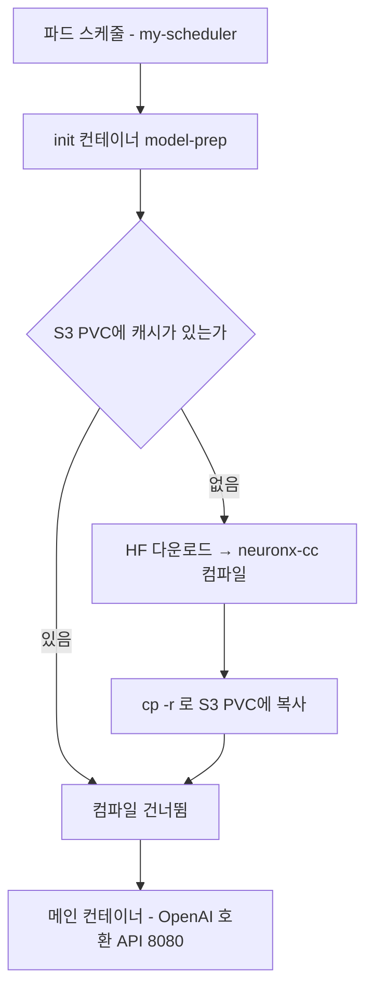

<nav id="manual-toc" class="manual-toc" aria-label="목차">

### 목차

**[1부. CUDA 자리에 있는 다른 스택](#section-1)**

- [1.1 컨테이너 런타임에 흔적이 남는 쪽과 남지 않는 쪽](#s1-1)
- [1.2 trn1.2xlarge - Trainium 칩 1개, NeuronCore-v2 2개](#s1-2)
- [1.3 코어 2개가 TENSOR_PARALLEL_SIZE 2가 되는 경로](#s1-3)

**[2부. 컴파일이 배포 시간으로 들어온다](#section-2)**

- [2.1 init 컨테이너가 하는 일](#s2-1)
- [2.2 S3에 남는 것과 8분 대 20초](#s2-2)
- [2.3 S3를 PV로 쓴다는 것 - Mountpoint FUSE의 성질](#s2-3)

**[3부. 관측과 스케일아웃](#section-3)**

- [3.1 Neuron인데 지표 이름은 gpu_cache_usage_perc](#s3-1)
- [3.2 llmperf 50요청 - TTFT p50 0.212초, 출력 335.77 tok/s](#s3-2)
- [3.3 CPU 70%를 보는 HPA와 vCPU 쿼터 8](#s3-3)

**[전체 흐름 정리](#section-4)**

**[막혔던 곳](#section-5)**

**[출처](#section-6)**

</nav>

---

## 1부. CUDA 자리에 있는 다른 스택

<a id="s1-1"></a>

### 1.1 컨테이너 런타임에 흔적이 남는 쪽과 남지 않는 쪽

AWS Neuron은 Inferentia와 Trainium을 위한 SDK이자 소프트웨어 스택입니다. 컴파일러(`neuronx-cc`), 런타임, `neuronx-distributed-inference` 같은 프레임워크 통합이 들어 있고, CUDA가 NVIDIA GPU에서 차지하는 자리를 AWS 실리콘에서 차지합니다. 칩 안의 연산 단위 NeuronCore는 GPU의 SM에 해당합니다.

NVIDIA GPU 파드가 뜰 때는 컨테이너 런타임이 개입합니다. `nvidia-container-runtime`이 디바이스 노드를 만들고 호스트의 드라이버 라이브러리(`libcuda.so.*` 등)를 컨테이너 안으로 bind-mount한 뒤 `ldconfig`를 다시 돌립니다. 그래서 containerd 설정에 `BinaryName = "/usr/bin/nvidia-container-runtime"` 항목이 남습니다. 이 경로는 `베어메탈 GPU가 파드에 닿기까지 네 번의 번역`에서 따로 다룹니다.

Trainium 노드에서 같은 자리를 열면 비어 있습니다.

```
cat /etc/containerd/config.toml
...
default_runtime_name = "runc"
BinaryName = "/usr/sbin/runc"
```

설정이 빠진 게 아니라 필요가 없습니다. `neuron-device-plugin`은 `Allocate()` 응답에 호스트 디바이스 노드 경로 목록만 담아 넘기고, 그 목록은 CRI 표준 device-mount 메커니즘으로 처리되어 표준 `runc`가 씁니다.

| 항목 | NVIDIA | AWS Neuron |
|---|---|---|
| 유저스페이스 라이브러리 | 호스트 드라이버와 강결합. 런타임이 주입 | pip 패키지로 이미지 안에 이미 포함 |
| 디바이스 제어 | 드라이버 하나가 GPU 전체를 통제 | `/dev/neuronN`(칩)·`/dev/ngXnY`(코어)로 커널 레벨 분리 |
| 런타임 개입 | 필요 | 불필요. 표준 `runc` + device cgroup rule |
| 코어 단위 격리 | MIG 또는 time-slicing | `NEURON_RT_VISIBLE_CORES` + 노드별 선택 마운트 |

커널이 내보내는 노드에 그 분리가 보입니다. 칩 노드 `/dev/neuron0`은 메이저 243에 `crw-rw-rw-`이고, 코어 노드 `/dev/ng0n1`·`/dev/ng1n1`은 메이저 246에 `crw-------`로 잠겨 있습니다. device plugin이 넘긴 노드만 그 파드가 여는 구조입니다.

**왜 중요한가** - 통합이 가벼운 대신 스케줄링 정보가 빕니다. 표준 device plugin API는 "몇 개 남았는가"까지만 말하고 "그 코어들이 같은 칩에 붙어 있는가"는 말하지 않습니다. 그래서 Neuron 전용 스케줄러 확장 `k8s-neuron-scheduler`와 두 번째 스케줄러 `my-scheduler`를 따로 깔고, Deployment는 `schedulerName: my-scheduler`로 이쪽을 씁니다.

<a id="s1-2"></a>

### 1.2 trn1.2xlarge - Trainium 칩 1개, NeuronCore-v2 2개

```
neuron-ls
instance-type: trn1.2xlarge
NEURON DEVICE | NEURON CORES | CORE IDS | NEURON MEMORY | PCI BDF      | CPU AFFINITY
0             | 2            | 0-1      | 32 GB         | 0000:00:1e.0 | 0-7
```

Trn1 계열은 최대 16개의 Trainium 칩을 담을 수 있고 `trn1.2xlarge`는 칩 1개짜리입니다. 쿠버네티스가 본 같은 노드의 Capacity는 `aws.amazon.com/neuron: 1`, `aws.amazon.com/neuroncore: 2`, `cpu: 8`로, 가속기가 칩 단위와 코어 단위 두 이름으로 따로 잡힙니다.

칩 하나가 내는 값은 **NeuronCore-v2 2개의 합산**입니다.

| 항목 | Trainium 칩 1개 (NeuronCore-v2 × 2) |
|---|---|
| INT8 | 380 TOPS |
| FP16 / BF16 / cFP8 / TF32 | 190 TFLOPS |
| FP32 | 47.5 TFLOPS |
| HBM | 32 GiB @ 820 GiB/s |
| DMA 대역폭 | 1 TB/s |

NeuronCore-v2 하나는 텐서·벡터·스칼라·GPSIMD 4개 엔진과 온칩 SRAM을 가진 독립 연산 유닛입니다. SRAM은 하드웨어가 채우는 캐시가 아니라 컴파일러가 관리하는 스크래치패드라, 데이터 지역성과 prefetch가 컴파일 시점에 정해집니다.

<a id="s1-3"></a>

### 1.3 코어 2개가 TENSOR_PARALLEL_SIZE 2가 되는 경로

텐서 병렬이 필요한 이유는 용량입니다. Llama 3.1 8B는 FP32 가중치만 32GB를 넘겨 단일 가속기 용량을 초과합니다. 이번 실습 모델 TinyLlama-1.1B-Chat-v1.0은 그럴 일이 없는데도 워크숍 구성은 TP를 2로 잡습니다. 코어 2개를 전부 쓰는 값인데, 문서는 이 선택의 이유를 적지 않습니다.

```
Trainium 칩 1개 → NeuronCore-v2 2개 (CORE IDS 0-1)
  → ConfigMap  TENSOR_PARALLEL_SIZE = 2,  NEURON_RT_VISIBLE_CORES = 0-1
  → api_server --tensor-parallel-size=2
  → neuron_config.json  tp_degree 2, world_size 2, local_ranks_size 2
```

ConfigMap `vllm-shared-config`는 키 14개를 담고, 서빙 동작을 정하는 값은 `TENSOR_PARALLEL_SIZE=2`, `NEURON_RT_VISIBLE_CORES=0-1`, `MAX_NUM_SEQS=4`, `MAX_MODEL_LEN=1024`, `VLLM_NEURON_FRAMEWORK=neuronx-distributed-inference`, `PORT=8080`입니다. 컴파일이 끝난 `neuron_config.json`에 그 값들이 그대로 박힙니다.

```
"tp_degree": 2, "world_size": 2, "local_ranks_size": 2,
"batch_size": 4, "seq_len": 1024, "buckets": [1024], "enable_bucketing": false,
"is_continuous_batching": true, "torch_dtype": "bfloat16", "pa_num_blocks": 4
```

`enable_bucketing: false`와 `buckets: [1024]`는 짝입니다. Neuron은 정적 형상으로 컴파일하므로 보통 시퀀스 길이 버킷을 여러 개 만들어두고 요청 길이에 맞는 것을 고르는데, 이번 배포는 버킷팅을 끄고 1024 하나만 컴파일했습니다. 컴파일 시간과 아티팩트 수가 줄어드는 대신 짧은 요청도 1024 형상으로 돕니다.

파드가 요청하는 확장 리소스는 `aws.amazon.com/neuron: 1`, 즉 **칩 단위**입니다. 칩을 통째로 잡고 코어 2개를 어떻게 쓸지는 `NEURON_RT_VISIBLE_CORES`와 `TENSOR_PARALLEL_SIZE`가 정합니다. CPU는 request 4000m, limit 8000m인데 노드 전체가 8 vCPU라 이 파드 하나가 노드 CPU를 다 가져갈 수 있습니다.

## 2부. 컴파일이 배포 시간으로 들어온다

<a id="s2-1"></a>

### 2.1 init 컨테이너가 하는 일

GPU 서빙에서는 컨테이너가 뜨고 가중치를 로드하면 끝이고, 커널은 런타임에 올라갑니다. Neuron은 모델을 **먼저 컴파일해 NEFF 아티팩트로 만들어둬야** 실행됩니다. 이 작업을 어디에 두느냐가 배포 패턴을 가르고, 워크숍의 선택은 init 컨테이너입니다.



컴파일을 트리거하는 것은 별도 CLI가 아니라 `LLM(...)` 생성자 한 줄입니다.

```
LLM(model=..., max_num_seqs=4, max_model_len=1024, tensor_parallel_size=2,
    device='neuron', override_neuron_config={'enable_bucketing': False})
```

`device='neuron'`으로 엔진을 만들면 그 과정에서 컴파일이 일어나고 결과가 `NEURON_COMPILE_CACHE_URL` 경로에 떨어집니다. 그래서 컴파일 조건과 서빙 조건이 정확히 같아야 하고, 위 네 값을 init 컨테이너와 메인 컨테이너에 같은 ConfigMap으로 주입합니다. 한쪽만 바꾸면 캐시가 맞지 않습니다. init 컨테이너도 `aws.amazon.com/neuron: 1`을 요청합니다. 엔진을 실제로 띄우는 호출이라 디바이스가 필요하고, 그 사이 칩은 다른 파드가 쓸 수 없습니다.

메인 컨테이너 명령에서 CUDA 배포와 다른 인자는 `--device=neuron`과 `--override-neuron-config` 둘뿐입니다. 나머지는 vLLM 표준이고 API도 OpenAI 호환 그대로라, 요청을 보내는 쪽에서는 백엔드가 Trainium인지 GPU인지 드러나지 않습니다. 노출은 `vllm-service`(LoadBalancer, 8080) 앞에 NGINX Ingress가 80으로 한 겹 더 서는 최소 구성입니다.

<a id="s2-2"></a>

### 2.2 S3에 남는 것과 8분 대 20초

컴파일이 끝나고 버킷을 열면 이렇게 들어 있습니다.

```
  4.6 MiB  cache/model.pt
  6.1 KiB  cache/neuron_config.json
  1.5 MiB  cache/neuronxcc-2.20.9961.0+0acef03a/MODULE_56f0d31.../model.neff
  0 Bytes  cache/neuronxcc-2.20.9961.0+0acef03a/MODULE_56f0d31.../model.done
741.0 KiB  cache/neuronxcc-2.20.9961.0+0acef03a/MODULE_ae92d68.../model.neff
...
```

- **컴파일러 버전이 경로에 박혀 있습니다** (`neuronxcc-2.20.9961.0+0acef03a`)
  - 컴파일러가 올라가면 캐시 경로가 통째로 달라집니다. SDK 버전이 캐시 키의 일부입니다.
- **`MODULE_<해시>` 디렉터리가 2개입니다**
  - `model.neff` 크기가 1.5 MiB와 741.0 KiB로 다릅니다. 프롬프트를 한 번에 처리하는 단계와 토큰을 하나씩 뽑는 단계는 형상이 달라 그래프도 따로 컴파일된다는 사실과 맞지만, 어느 쪽이 어느 단계인지는 이 출력으로 확정되지 않습니다.
- **`model.done`은 0바이트 마커입니다**
  - 그 디렉터리의 컴파일이 끝났다는 표시로, 다음 기동의 재컴파일 여부를 가릅니다.

전체를 다 더해도 12MB를 넘지 않습니다. 생성 비용은 비싸고 재사용 비용은 거의 0입니다.

| 단계 | 첫 배포 | 이후 배포 |
|---|---|---|
| 이미지 pull + 스케줄 | 약 4분 | 캐시됨 |
| 모델 컴파일 | 약 4분 | 건너뜀 |
| vLLM API 서버 기동 | 약 20초 | 약 20초 |
| **합계** | **약 8분** | **약 20초** |

24배 차이입니다. 이미지 쪽 4분은 크기를 재보면 설명이 됩니다. `pytorch-inference-vllm-neuronx:0.9.1-neuronx-py310-sdk2.25.0-ubuntu22.04`가 7.9 GiB입니다. 1.1절에서 본 "Neuron SDK는 pip 패키지로 이미지 안에 들어 있다"의 대가가 이 숫자입니다. 컴파일 쪽 4분은 TinyLlama 1.1B, TP 2, 버킷 1개 기준이라 모델이 커지고 버킷이 늘면 같이 늘어납니다.

**왜 중요한가** - GPU 서빙에서 파드 기동 시간은 대체로 이미지 pull과 가중치 로드의 합인데, Neuron에서는 컴파일이 한 항목 더 붙고 캐시 적중 여부에 따라 4분이거나 0초입니다. 새 파드가 트래픽을 받기까지 20초인 경우와 8분인 경우는 다른 설계를 요구하므로, S3 캐시를 미리 데워두는 것이 오토스케일링의 전제가 됩니다.

<a id="s2-3"></a>

### 2.3 S3를 PV로 쓴다는 것 - Mountpoint FUSE의 성질

캐시를 담는 볼륨은 EBS가 아니라 S3입니다. PV는 `driver: s3.csi.aws.com`, `capacity: 100Gi`, `ReadWriteMany`, `Retain`으로 선언합니다. 아티팩트는 한 번 쓰고 여러 파드가 읽는 물건이라 RWX가 맞고, EBS는 이 모드를 주지 못합니다.

노드에서 `mount`를 찍으면 블록 디바이스가 아니라 `mountpoint-s3 ... type fuse`로 잡힙니다. read·write 시스템콜이 커널을 거쳐 유저스페이스 데몬 `mount-s3`로 가고, 그 데몬이 `GetObject`·`PutObject` 호출로 바꿉니다. 여기서 네 가지가 따라옵니다.

- **`capacity: 100Gi`는 논리값입니다**
  - Mountpoint는 쿼터를 강제하지 않습니다. PV와 PVC를 바인딩하기 위한 표기일 뿐이라, 아티팩트가 12MB인데 100Gi를 선언해도 아무 일이 없습니다.
- **완전한 POSIX 파일시스템이 아닙니다**
  - append와 부분 쓰기, hard link, 일부 rename이 제한됩니다. init 컨테이너가 `/tmp/cache`에서 컴파일하고 끝난 뒤 `cp -r`로 통짜 복사하는 구조가 이 제약을 피해 가는 방식입니다.
- **읽기-후-쓰기 일관성은 강합니다**
  - S3가 strong consistency를 제공하므로 init 컨테이너가 복사를 마치자마자 메인 컨테이너가 읽는 순서가 성립합니다.
- **동시 접근은 프로세스 격리로 풀립니다**
  - 한 번 stage하고 bind mount로 재사용하는 블록 스토리지 CSI와 달리, 마운트 지점마다 별도의 `mount-s3` 프로세스가 뜹니다.

메인 컨테이너는 같은 볼륨을 `readOnly: true`로 마운트합니다. 쓰는 쪽이 init 컨테이너뿐이라는 것을 마운트 옵션으로 못 박은 셈입니다.

## 3부. 관측과 스케일아웃

<a id="s3-1"></a>

### 3.1 Neuron인데 지표 이름은 gpu_cache_usage_perc

Prometheus는 `vllm-service`의 8080/`/metrics`를 직접 스크레이프합니다. 전역 `scrape_interval`은 15s인데 vLLM job만 10s입니다. Grafana 대시보드가 거는 쿼리는 여덟 개입니다.

| 패널 | 쿼리 |
|---|---|
| Total Successful Requests | `vllm:request_success_total` |
| Running / Waiting Requests | `vllm:num_requests_running`, `vllm:num_requests_waiting` |
| KV Cache Usage | `vllm:gpu_cache_usage_perc` |
| Prompt / Generated Tokens | `vllm:prompt_tokens_total`, `vllm:generation_tokens_total` |

KV 캐시 점유율 지표 이름이 `vllm:gpu_cache_usage_perc`인데 이 클러스터에 GPU는 한 장도 없습니다. vLLM이 CUDA 기준으로 만든 이름을 Neuron 백엔드에서도 그대로 내보내기 때문이고, 뒤집어 보면 GPU용 대시보드를 손대지 않고 Trainium 배포에 붙일 수 있다는 뜻입니다.

다만 여덟 개 중 가속기 하드웨어 자체를 보는 지표는 없습니다. 코어 사용률, 디바이스 메모리, 온도는 `neuron-top`이나 `neuron-monitor-prometheus.py`로 따로 뽑아야 합니다.

<a id="s3-2"></a>

### 3.2 llmperf 50요청 - TTFT p50 0.212초, 출력 335.77 tok/s

부하는 llmperf의 `token_benchmark_ray.py`로 겁니다. 입력 길이는 평균 256·표준편차 50, 출력은 평균 100·표준편차 20인 정규분포에서 매 요청 샘플링하고, in-flight 5개를 유지하며 완료 요청 50건까지 돌립니다. 아래는 같은 구성을 서로 다른 두 배포에서 한 번씩 돌린 결과라, 두 열은 반복 측정이 아니라 재현 여부입니다.

| 지표 | 실행 1 | 실행 2 |
|---|---:|---:|
| TTFT p50 (s) | 0.2117 | 0.2186 |
| TTFT p99 (s) | 0.5686 | 0.6843 |
| 토큰 간 지연 p50 (s) | 0.01137 | 0.01167 |
| E2E 지연 p50 (s) | 1.2069 | 1.1790 |
| 요청당 출력 처리량 mean (tok/s) | 84.32 | 84.95 |
| 전체 출력 처리량 (tok/s) | 335.77 | 340.67 |
| 분당 완료 요청 | 205.66 | 204.98 |
| 에러 요청 | 0 | 0 |

- **토큰 간 지연이 좁습니다.** 실행 1 기준 min 0.00996s, max 0.01532s로 전 구간이 1.54배 안에 들어옵니다. 토큰 하나에 약 11~12ms, 요청당 약 85 tok/s입니다.
- **TTFT는 훨씬 넓습니다.** 실행 2 기준 p25 0.124s에서 max 0.747s까지 6배 벌어집니다. 입력 길이가 131~418 토큰으로 요청마다 다른 것이 한 요인이고, `MAX_NUM_SEQS=4`에 동시 요청이 5개라 한 요청이 배치에 못 들어가고 기다리는 것이 다른 요인으로 보입니다. 요청별 대기 여부를 기록하지 않아 후자는 확인되지 않았습니다.
- **요청당 85 tok/s인데 전체는 336 tok/s입니다.** 4배 조금 안 되고 `MAX_NUM_SEQS=4`와 같은 배수인데, 동시성 5로 한 번씩 돌린 데이터라 이 배수가 우연인지 `MAX_NUM_SEQS`가 만든 것인지는 가리지 못합니다.
- **두 실행의 차이는 꼬리에 몰려 있습니다.** p50은 3% 차이인데 p99는 20% 차이입니다. 50요청 표본의 p99는 사실상 가장 느린 한두 건이라, 두 배포가 같은 값을 낸다는 것까지가 이 표가 지지하는 범위입니다.

<a id="s3-3"></a>

### 3.3 CPU 70%를 보는 HPA와 vCPU 쿼터 8

워크숍이 제시하는 HPA는 `minReplicas: 1`, `maxReplicas: 3`에 판단 기준은 CPU 사용률 70% 하나입니다. 테스트도 실제 추론 부하가 아니라 파드 안에서 busy loop 8개를 300초 돌려 CPU를 직접 태우는 방식이라, CPU 사용률 지표는 올라가지만 그 값은 추론 부하와 무관합니다.

LLM 서빙에서 가속기와 CPU의 부하는 비례하지 않습니다. 토큰 생성은 가속기에서 일어나고 CPU는 요청 파싱·스케줄링·토크나이즈 정도만 합니다. 가속기가 포화되고 큐에 요청이 쌓여 있어도 노드 CPU는 10%대에 머무를 수 있고, 반대로 CPU만 태우면 가속기가 노는데 파드가 늘어납니다. 두 방향 모두 틀립니다.

가속기 쪽 신호를 보려면 `vllm:num_requests_waiting`이나 `vllm:gpu_cache_usage_perc`를 Prometheus로 받아 KEDA나 custom metrics API에 연결하는 길이 현실적입니다. 3.1절의 대시보드가 이미 이 값들을 긁고 있어 배관은 절반 깔려 있지만 스크레이프 주기(10s)만큼 지연이 붙습니다. 하드웨어 지표를 데몬셋에서 직접 읽는 NVIDIA 쪽 구현은 NVML C 바인딩에 묶여 있어, Neuron에는 `neuron-monitor` 출력을 Prometheus로 받는 경로가 대응물입니다.

그리고 이 환경에서는 HPA 랩을 끝까지 진행하지 못했습니다. 계정의 Trn vCPU 쿼터가 8이라 두 번째 노드그룹 생성이 실패했습니다. `trn1.2xlarge` 한 대가 vCPU 8개를 쓰므로 쿼터 8은 이 타입 한 대가 상한이라는 뜻입니다.

| 제약 | 값 | 결과 |
|---|---|---|
| 노드의 `aws.amazon.com/neuron` | 1 | 칩을 1개씩 요청하는 파드는 노드당 1개만 |
| 노드의 CPU | 8 | request 4000m, limit 8000m이라 사실상 1개 |

가속기 리소스만 봐도 두 번째 파드는 Pending에서 멈추므로 `maxReplicas: 3`은 도달할 수 없는 값입니다. 스케일아웃을 보려면 TP를 1로 내리고 파드가 칩이 아니라 코어 1개(`aws.amazon.com/neuroncore: 1`)를 요청하게 해야 합니다. 노드 1대에서 파드 2개가 뜨는 대신 각 파드는 코어 하나만 쓰므로, 노드를 늘리지 못하는 환경에서는 파드당 성능과 파드 개수 중 하나를 골라야 합니다.

## 전체 흐름 정리

```
trn1.2xlarge → Trainium 칩 1개 (HBM 32GiB @ 820GiB/s) → NeuronCore-v2 2개
  커널     /dev/neuron0 (칩) + /dev/ng0n1·ng1n1 (코어, 잠김)
  런타임   containerd는 runc 하나. Neuron 전용 런타임 없음
  스케줄   device plugin이 neuron 1 / neuroncore 2 광고 → my-scheduler 배치
      │
      ▼
파드가 neuron 1개(칩 단위) 요청 → init 컨테이너 model-prep
  ├── S3 PVC에 캐시 있음 → 건너뜀 ──────────────┐
  └── 없음 → HF 다운로드 → 컴파일 → S3 (약 4분)  │
      │                                        ▼
      ▼         메인 컨테이너 (readOnly 마운트)
  api_server --device=neuron --tensor-parallel-size=2 --max-num-seqs=4 --port=8080
      │
      ▼
첫 배포 약 8분 (이미지 7.9GiB pull 4분 + 컴파일 4분 + 기동 20초) / 이후 약 20초
Service 8080 ← Ingress 80 | Prometheus 10s → vllm:gpu_cache_usage_perc
llmperf 50요청 동시성 5 → TTFT p50 0.212s, 출력 335.77 tok/s, 에러 0
HPA는 CPU 70% 기준이라 가속기 부하와 비례 안 함
vCPU 쿼터 8 → 노드 1대 → neuron 1개 → 두 번째 파드 Pending
```

| 숫자 | 뜻 |
|---|---|
| 1 / 2 | trn1.2xlarge의 Trainium 칩 개수 / NeuronCore-v2 개수 |
| 380 / 190 / 47.5 | NeuronCore-v2 2개 합산 INT8 TOPS / BF16 TFLOPS / FP32 TFLOPS |
| 32 GiB @ 820 GiB/s | 칩당 HBM 용량과 대역폭 |
| 2 | `TENSOR_PARALLEL_SIZE`, `tp_degree`, `world_size` |
| 7.9 GiB | vLLM Neuron 컨테이너 이미지 크기 |
| 8분 / 20초 | 캐시가 빈 첫 배포 / S3 캐시를 쓰는 이후 배포 |
| 4 / 1024 | `MAX_NUM_SEQS` / `MAX_MODEL_LEN` |
| 0.212s / 335.77 tok/s | llmperf TTFT p50 / 전체 출력 처리량 (실행 1) |
| 70% / 1~3 | HPA CPU 목표 사용률 / replica 범위 |
| 8 | Trn vCPU 쿼터. `trn1.2xlarge` 한 대가 상한 |

## 막혔던 곳

**containerd 설정에 Neuron 런타임이 없는데 설정 누락인가?** 누락이 아닙니다. NVIDIA는 호스트 드라이버와 버전이 강결합된 유저스페이스 라이브러리를 주입해야 해서 전용 런타임이 필요하지만, Neuron SDK는 pip 패키지로 이미지 안에 이미 들어 있고 커널 드라이버와는 ioctl ABI로 통신합니다. device plugin이 디바이스 노드 경로만 넘기면 표준 `runc`가 device cgroup rule과 bind-mount로 처리합니다. 이미지가 7.9 GiB인 것이 그 대가입니다.

**Neuron device plugin이 이미 떠 있는데 왜 지우고 Helm으로 다시 까는가?** 노드그룹을 Neuron 최적화 EKS AMI로 만들면 부트스트랩에서 `neuron-device-plugin`이 자동 배포됩니다. 그 상태에서 `helm upgrade --install neuron-helm-chart`를 돌리면 같은 이름의 daemonset·clusterrole·serviceaccount·clusterrolebinding을 새로 만들려다 AlreadyExists로 충돌합니다. 자동 설치된 리소스에는 Helm 소유권 annotation이 없어 Helm이 그것을 인수할지 판단하지 못하기 때문입니다. 네 개를 전부 지우고 Helm이 처음부터 소유하게 해야 이후 `scheduler.enabled=true` 업그레이드까지 충돌 없이 갑니다.

**Prometheus values를 워크숍 문서대로 붙였는데 왜 깨지는가?** 문서의 `prometheus-values.yaml`에 `job_name: 'kubernetes-pods'` 블록이 중복으로 들어 있습니다. 같은 job 이름이 두 번 나오면 설정이 유효하지 않아 서버가 뜨지 않으니, 중복 블록을 지우고 `vllm-metrics` job만 남겨야 합니다.

**GPU가 한 장도 없는데 왜 지표 이름이 `vllm:gpu_cache_usage_perc`인가?** vLLM이 CUDA 기준으로 정한 이름을 Neuron 백엔드에서도 그대로 내보냅니다. KV 캐시 점유율을 `neuron_`으로 시작하는 이름에서 찾으면 안 나옵니다.

**HPA 랩을 왜 끝까지 못 돌렸는가?** 계정의 Trn vCPU 쿼터가 8이었습니다. `trn1.2xlarge` 한 대가 vCPU 8개를 쓰니 두 번째 노드그룹 생성이 실패합니다. 노드가 1대면 `aws.amazon.com/neuron` 할당 가능 수량도 1이라 칩 1개를 요청하는 파드는 노드당 하나만 뜹니다. 3.3절의 HPA 매니페스트와 부하 스크립트는 워크숍 문서에 적힌 구성이고, 실제 스케일아웃 동작은 관측하지 못했습니다.

## 출처

- AWS Workshop `Scaling LLM Inference with vLLM and AWS Trainium` - https://catalog.us-east-1.prod.workshops.aws/workshops/177cf2c8-d451-405b-a463-eb77d38b8617/en-US
- AWS Neuron Documentation - https://awsdocs-neuron.readthedocs-hosted.com/en/latest/index.html
- NeuronCore-v2 아키텍처 - https://awsdocs-neuron.readthedocs-hosted.com/en/latest/about-neuron/arch/neuron-hardware/neuron-core-v2.html
- NxD Inference - https://awsdocs-neuron.readthedocs-hosted.com/en/latest/libraries/nxd-inference/index.html
- vLLM - https://github.com/vllm-project/vllm
- llmperf - https://github.com/ray-project/llmperf
- Mountpoint for Amazon S3 CSI Driver - https://github.com/awslabs/mountpoint-s3-csi-driver
- 측정값은 워크숍이 제공한 `trn1.2xlarge` 단일 노드 EKS 환경 두 벌의 `neuron-ls`·`kubectl`·`llmperf` 출력입니다. 계정 ID와 엔드포인트 호스트명은 자리표시자로 바꾸거나 뺐습니다.
