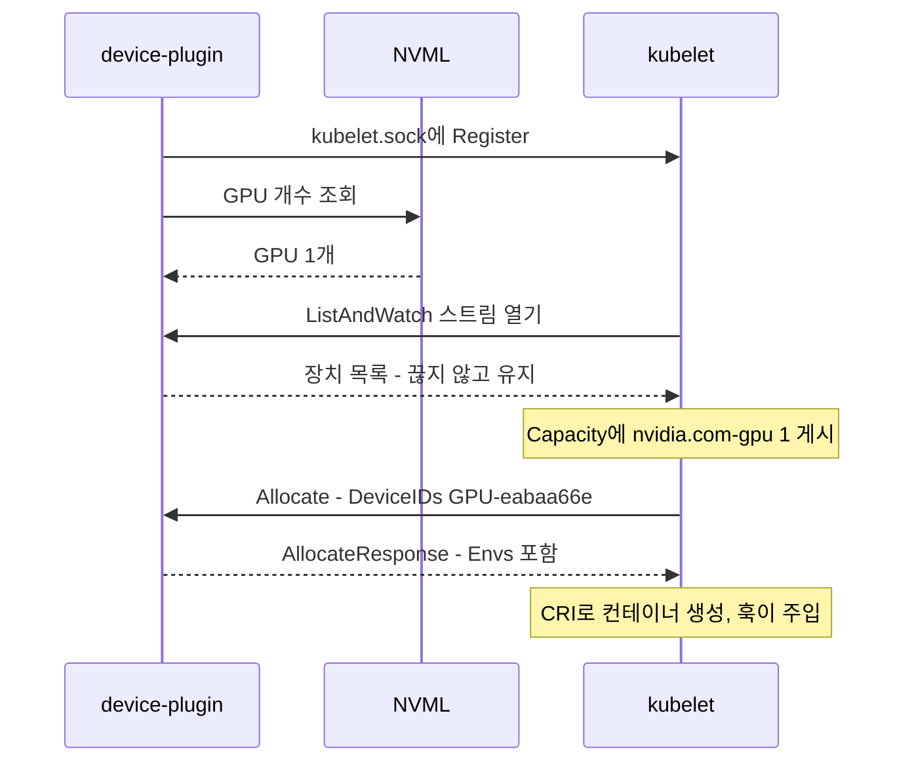

<nav id="manual-toc" class="manual-toc" aria-label="목차">

### 목차

**[1부. 호스트 - 커널 모듈과 디바이스 노드](#section-1)**

- [1.1 Secure Boot를 끄는 이유 - 서명 없는 커널 모듈](#s1-1)
- [1.2 /dev/nvidia0 195, 0 - 모든 CUDA 호출이 지나는 문](#s1-2)

**[2부. 컨테이너 - OCI 훅이 뚫는 네 개의 구멍](#section-2)**

- [2.1 순정 ubuntu 이미지에서 nvidia-smi가 도는 이유](#s2-1)
- [2.2 CDI 스펙 - fileMode 438과 major 195가 적힌 파일](#s2-2)

**[3부. 쿠버네티스 - device plugin이 kubelet에게 하는 통역](#section-3)**

- [3.1 nvidia.com/gpu 1이라는 확장 리소스](#s3-1)
- [3.2 ListAndWatch와 Allocate - gRPC 두 개가 주고받는 것](#s3-2)
- [3.3 계층이 빠지면 무엇이 실패하는가](#s3-3)

**[4부. 관측과 한계 - DCGM 메트릭과 정수 리소스](#section-4)**

- [4.1 DCGM_FI_DEV_GPU_UTIL - nvidia-smi와 갈라지는 지점](#s4-1)
- [4.2 sharing-strategy none - 카드 한 장이 파드 한 개](#s4-2)

**[전체 흐름 정리](#section-5)**

**[막혔던 곳](#section-6)**

**[출처](#section-7)**

</nav>

---

## 1부. 호스트 - 커널 모듈과 디바이스 노드

<a id="s1-1"></a>

### 1.1 Secure Boot를 끄는 이유 - 서명 없는 커널 모듈

시작 지점은 PCI 버스에 카드가 꽂혀 있다는 사실뿐입니다.

```bash
lspci | grep -i nvidia
01:00.0 VGA compatible controller: NVIDIA Corporation AD103 [GeForce RTX 4070 Ti SUPER] (rev a1)

mokutil --sb-state
SecureBoot enabled
```

커널이 아는 것은 "벤더 `10de`의 장치가 하나 있다"까지입니다. 게다가 Secure Boot는 서명되지 않은 커널 모듈의 로드를 막는데, NVIDIA 드라이버가 그 대상입니다. BIOS에서 끄고 `nvidia-driver-595-open`을 설치한 뒤 커널 로그를 보면 서명이 없다는 사실이 남아 있습니다.

```bash
dmesg | grep -i nvidia
[    6.185709] nvidia: module verification failed: signature and/or required key missing - tainting kernel
[    6.282642] NVRM: loading NVIDIA UNIX Open Kernel Module for x86_64  595.84  Release Build
```

서명이 없는데도 로드된 것은 Secure Boot를 껐기 때문이고, 대가로 커널에 taint 플래그가 붙습니다. 켜둔 채였다면 이 줄 대신 로드 거부가 남고 그 뒤의 모든 계층이 존재하지 않습니다.

<aside class="callout">
<p class="eyebrow">(용어) DKMS</p>

Dynamic Kernel Module Support. 커널 밖에서 관리되는(out-of-tree) 모듈을 커널이 올라갈 때마다 다시 빌드해 설치합니다. 커널 모듈은 빌드된 커널 버전에만 로드되므로, 없으면 `apt upgrade` 한 번에 커널이 올라가고 재부팅하면 GPU가 사라집니다.

</aside>

드라이버 소스는 `595.84` 하나인데 `dkms status`에는 설치된 커널 버전 수만큼(`6.8.0-134`, `-137`, `-138`) 줄이 나옵니다. 산출물 `.ko.zst` 다섯 개 중 `nvidia.ko`가 `/dev/nvidia0`과 `/dev/nvidiactl`을 만드는 핵심입니다. `lsmod`의 마지막 줄 `video 77824 2 amdgpu,nvidia_modeset`도 읽어둘 값인데, 이 메인보드에 AMD 내장 GPU가 따로 있어서 2.2절의 CDI 스펙이 `card0`이 아니라 `card1`을 NVIDIA 것으로 지목합니다.

<a id="s1-2"></a>

### 1.2 /dev/nvidia0 195, 0 - 모든 CUDA 호출이 지나는 문

모듈이 올라가면 캐릭터 디바이스 노드가 생기고, 여기서부터 사용자 공간이 GPU에 말을 걸 수 있습니다.

```bash
ls -l /dev/nvidia*
crw-rw-rw- 1 root root 195,   0 /dev/nvidia0
crw-rw-rw- 1 root root 195, 255 /dev/nvidiactl
crw-rw-rw- 1 root root 507,   0 /dev/nvidia-uvm   # 그 외 modeset, uvm-tools
```

`/dev/nvidia0`이 GPU 0번 자체라 모든 연산이 이 노드를 지나고, `/dev/nvidiactl`은 NVIDIA 프로세스가 초기화할 때 가장 먼저 여는 컨트롤 노드입니다. major 195는 NVIDIA에 고정 할당된 번호, 507은 부팅 시 동적으로 잡힌 번호고, 이 숫자들은 2.2절 CDI 스펙과 cgroup 규칙에 그대로 다시 등장합니다. 컨테이너에 GPU를 넣는다는 것은 결국 "major 195 minor 0을 허용한다"를 쓰는 일입니다.

애플리케이션이 직접 ioctl을 쓰지는 않습니다. 그 사이의 라이브러리 두 개가 서로 다른 질문을 받습니다.

- **`libcuda.so.595.71.05` (91,501,576바이트)** - CUDA Driver API. PyTorch가 커널을 띄울 때 최종적으로 부르는 곳입니다.
- **`libnvidia-ml.so.595.71.05` (2,621,336바이트)** - NVML. "GPU가 몇 장이고 몇 도인가"를 묻는 쪽이고, `nvidia-smi`도 3부의 device plugin도 4부의 DCGM Exporter도 이것을 부릅니다.

두 경로가 분리돼 있어서 GPU 연산을 전혀 하지 않는 프로세스도 GPU 개수를 셀 수 있습니다. device plugin이 그 예입니다.

4096 × 4096 행렬곱으로 확인했을 때 토치는 `200.125MB`를, 같은 시각 `nvidia-smi`는 프로세스 점유 `498MiB`를 찍었습니다. 앞은 텐서 세 개의 양이고 뒤는 CUDA 컨텍스트까지 포함한 전체 점유라 두 숫자는 원래 다른 것을 셉니다. 기록된 출력은 드라이버 버전이 `595.84`(dkms, dmesg)와 `595.71.05`(라이브러리 파일명, 4.2절 GFD 라벨)로 섞여 있어 원본 그대로 인용합니다.

---

## 2부. 컨테이너 - OCI 훅이 뚫는 네 개의 구멍

<a id="s2-1"></a>

### 2.1 순정 ubuntu 이미지에서 nvidia-smi가 도는 이유

`nvidia-ctk runtime configure --runtime=docker`를 돌리면 `/etc/docker/daemon.json`에 `"nvidia"` 런타임이 `nvidia-container-runtime` 경로로 등록되고, Docker는 순정 `runc` 대신 이것을 부릅니다. `runc`를 감싼 얇은 래퍼라서 OCI 스펙에 훅을 하나 끼워 넣고 나머지는 `runc`에 넘깁니다. 그래서 `docker run --gpus all ubuntu nvidia-smi`가 `NVIDIA-SMI 595.71.05 / CUDA Version: 13.2` 표를 그립니다. `ubuntu` 이미지에는 `nvidia-smi`도 `libcuda.so`도 없는데 말입니다. 답은 컨테이너의 파일시스템에 있습니다.

```bash
df -hT | grep nvidia
/dev/mapper/ubuntu--vg-ubuntu--lv ext4  ... /usr/bin/nvidia-smi
tmpfs                             tmpfs ... /run/nvidia-ctk-hook85a589cc-2e81-...

env | grep -i nvidia
NVIDIA_VISIBLE_DEVICES=void
NVIDIA_CTK_LIBCUDA_DIR=/usr/lib/x86_64-linux-gnu
```

`/usr/bin/nvidia-smi`가 파일이 아니라 **마운트 포인트**로 잡혀 있습니다. 호스트의 바이너리가 그 경로에 bind mount된 것입니다. 컨테이너 안에서 `ls -l /dev/nvidia*`를 돌려도 1.2절과 같은 major/minor가 나옵니다. 같은 커널을 쓰므로 노드만 노출하면 같은 드라이버에 닿습니다. `NVIDIA_VISIBLE_DEVICES`가 `all`이 아니라 `void`인 것은 훅이 다시 돌아 이중 주입하는 것을 막는 표시고, 같은 변수를 파드 안에서 읽은 값은 3.2절에 있습니다.

<aside class="callout">
<p class="eyebrow">(용어) OCI 훅</p>

OCI 런타임 명세는 컨테이너 생성 과정의 몇 지점에서 외부 프로그램을 부르게 돼 있습니다(`prestart`, `createContainer`). 불리는 시점은 runc가 격리를 끝냈지만 프로세스를 아직 `START`하지 않은 순간입니다. 격리 전이면 수정할 대상이 없고, 시작된 뒤면 이미 늦습니다.

</aside>

훅이 하는 일은 네 가지입니다.

1. **디바이스 노드 bind mount** - `/dev/nvidia0`, `/dev/nvidiactl`, `/dev/nvidia-uvm`
2. **드라이버 라이브러리 주입** - `libcuda.so`, `libnvidia-ml.so`, `nvidia-smi` 바이너리
3. **환경변수 주입** - `--gpus all`은 결국 `NVIDIA_VISIBLE_DEVICES` 설정이 됩니다
4. **device cgroup 수정** - 장치 컨트롤러에 "major 195, minor 0 허용"

1번과 4번이 나뉘어 있다는 점이 중요합니다. 파일이 보이는 것과 열 수 있는 것은 다른 문제고, 두 조건이 모두 성립해야 CUDA 초기화가 통과합니다.

<a id="s2-2"></a>

### 2.2 CDI 스펙 - fileMode 438과 major 195가 적힌 파일

<aside class="callout">
<p class="eyebrow">(용어) CDI</p>

Container Device Interface. "이 장치를 컨테이너에 넣으려면 무엇을 마운트하고 무슨 훅을 돌려야 하는가"를 벤더가 YAML로 적어두고 런타임이 그대로 실행하는 표준입니다. 네트워크는 CNI, 스토리지는 CSI, 컨테이너 생성은 CRI가 맡고 CDI는 그 옆의 장치 담당입니다. 런타임은 NVIDIA를 알 필요 없이 스펙 파일만 읽으면 됩니다.

</aside>

툴킷의 기본 모드는 자동 감지고, CDI 모드가 읽는 경로는 `spec-dirs = ["/etc/cdi", "/var/run/cdi"]`입니다. 그 파일을 열면 앞에서 본 숫자가 그대로 나옵니다.

```yaml
# /var/run/cdi/nvidia.yaml
cdiVersion: 0.7.0
kind: nvidia.com/gpu
devices:
    - name: "0"
      containerEdits:
        deviceNodes:
            - path: /dev/nvidia0
              major: 195
              fileMode: 438
            - path: /dev/dri/card1
              major: 226
              fileMode: 432
              gid: 44
        hooks:
            - hookName: createContainer
              args: [create-symlinks, --link,
                     libcuda.so.595.71.05::/usr/lib/.../libcuda.so.1]
        additionalGids: [44, 993]
    - name: GPU-eabaa66e-...   # 같은 장치의 UUID 별칭
      ...
```

- **`fileMode: 438`과 `432`** - 10진수이고 8진수로는 0666과 0660입니다. `/dev/nvidia0`은 누구나 열 수 있고, DRM 노드는 그룹까지만 열려 있어 `additionalGids`로 44(video)와 993을 붙여줍니다.
- **`/dev/dri/card1`** - `card0`이 아닙니다. 1.1절의 `amdgpu`가 먼저 가져갔고, 카드 순서가 바뀌면 숫자도 바뀌므로 스펙 파일은 하드웨어를 스캔해 생성됩니다.
- **`hookName: createContainer`** - `create-symlinks` 훅이 `libcuda.so → libcuda.so.1 → libcuda.so.595.71.05` 체인을 컨테이너 루트 안에 만듭니다. 2.1절에서 본 심볼릭 링크가 이 결과입니다.

---

## 3부. 쿠버네티스 - device plugin이 kubelet에게 하는 통역

<a id="s3-1"></a>

### 3.1 nvidia.com/gpu 1이라는 확장 리소스

Docker를 지우고 K3s(`v1.36.2+k3s1`, `containerd://2.3.2-k3s2`)를 설치했습니다. 쿠버네티스는 CPU와 메모리를 cgroup으로 태생적으로 이해하지만 GPU에 대해서는 아는 것이 없습니다. `lspci`를 돌려보지도 NVML을 부르지도 않습니다.

K3s가 해주는 것이 하나 있습니다. 호스트에 이미 설치된 컨테이너 런타임을 자동으로 찾아 RuntimeClass로 등록합니다(설정 파일은 `/etc/containerd/config.toml`이 아니라 `/var/lib/rancher/k3s/agent/etc/containerd/config.toml`).

RuntimeClass가 등록된 시점에도 노드에는 GPU가 없습니다. 이때 `nvidia.com/gpu: 1`을 요청하는 파드를 만들면 노드 리소스에 그 이름이 아예 없어 `Pending`에 머뭅니다. 그 이름을 만들어 주는 것이 device plugin 데몬셋이고, 적용하면 Capacity가 이렇게 바뀝니다.

```
Capacity:
  cpu:                16
  memory:             64916464Ki
  nvidia.com/gpu:     1
```

`cpu`나 `memory` 옆에 `nvidia.com/gpu: 1`이 나란히 섭니다. 스케줄러에게는 이 셋이 같은 종류의 값입니다. 이름이 있고 정수 개수가 있는 리소스일 뿐이고, 그게 카드인지 코어인지는 스케줄러의 관심사가 아닙니다.

<a id="s3-2"></a>

### 3.2 ListAndWatch와 Allocate - gRPC 두 개가 주고받는 것

device plugin이 하는 일은 gRPC 서버 하나를 유닉스 소켓에 여는 것입니다. `/var/lib/kubelet/device-plugins`에 `kubelet.sock`(등록 창구), `nvidia-gpu.sock`(플러그인이 연 소켓), `kubelet_internal_checkpoint`(어느 파드에 어느 장치를 줬는지)가 있고, 데몬셋이 요구하는 hostPath는 이 디렉터리뿐입니다.



두 RPC의 성격이 다릅니다. **`ListAndWatch`는 스트림**이라 연결을 유지합니다. GPU가 고장 나거나 빠지면 그 자리에서 kubelet에게 알려 스케줄링 대상에서 빼야 하기 때문입니다. **`Allocate`는 단발 호출**로, 파드가 이 노드에 배정된 뒤에만 불리고 `AllocateResponse{Devices, Envs}`를 돌려줍니다. 그 `Envs`는 파드 안에서 확인됩니다.

```bash
kubectl exec -it gpu-test -- env | grep NVIDIA
NVIDIA_VISIBLE_DEVICES=GPU-eabaa66e-d67a-40c2-6213-b0d522fac60a
```

2.1절 Docker 컨테이너의 같은 변수는 `void`였는데, 여기에는 CDI 스펙의 두 번째 `devices` 항목과 같은 UUID가 들어 있습니다. 플러그인이 고른 장치가 환경변수로 실려 훅에 전달되고 훅이 그 UUID의 CDI 항목을 찾아 마운트하는 경로가 이 한 줄에 드러납니다. 결정은 플러그인이, 마운트와 라이브러리 주입은 런타임 훅이 합니다.

플러그인 파드 자신도 흥미로운 위치에 놓입니다. NVML을 부르려면 `libnvidia-ml.so`와 `/dev/nvidiactl`이 그 안에 있어야 하는데, 매니페스트에는 `privileged: true`도 `hostPath: /dev`도 없고 `capabilities.drop: ["ALL"]`으로 일반 root보다 권한이 좁습니다. 답은 `runtimeClassName: "nvidia"`고, 이 값 때문에 이 파드를 띄울 때도 2부의 훅이 발동합니다. 쿠버네티스에 GPU 개수를 알려주는 컴포넌트가, 그 자신은 아래 계층에 의존해 GPU에 닿습니다.

<a id="s3-3"></a>

### 3.3 계층이 빠지면 무엇이 실패하는가

같은 "GPU를 못 쓴다"도 어느 계층이 빠졌느냐에 따라 증상이 다릅니다.

| 증상 | 빠진 계층 | 확인 |
|---|---|---|
| 호스트에서 `nvidia-smi` 실패, `/dev/nvidia0` 없음 | 커널 모듈. Secure Boot가 켜졌거나 DKMS 빌드 미완 | `mokutil --sb-state` |
| 호스트는 되는데 `docker run --gpus all` 실패 | 런타임 훅. 툴킷이 없거나 `daemon.json` 미등록 | `/etc/docker/daemon.json` |
| 컨테이너는 되는데 파드가 `Pending` | device plugin. 노드에 `nvidia.com/gpu` 자체가 없음 | `describe node`의 Capacity |
| 파드는 `Running`인데 안에 `nvidia-smi`가 없음 | `runtimeClassName: nvidia` 누락. 리소스는 잡혔는데 훅이 안 돎 | 파드 안 `ls /dev/nvidia*` |

윗줄 두 개는 직접 겪은 상태를 뒤집은 것입니다. Secure Boot는 기본이 `enabled`였고 툴킷 설치 전까지 `--gpus all`은 쓸 수 없었습니다. 아랫줄 두 개는 계층을 붙였을 때 무엇이 새로 생겼는지를 뒤집어 적은 것으로, 빼고 재현해 본 것은 아닙니다.


---

## 4부. 관측과 한계 - DCGM 메트릭과 정수 리소스

<a id="s4-1"></a>

### 4.1 DCGM_FI_DEV_GPU_UTIL - nvidia-smi와 갈라지는 지점

kube-prometheus-stack 위에 DCGM Exporter를 `--set runtimeClassName=nvidia`로 올렸습니다. RuntimeClass가 여기서도 필요한 이유는 3.2절과 같습니다. DCGM 역시 NVML로 GPU를 조회합니다.

```bash
curl -s http://localhost:9400/metrics | grep DCGM_FI_DEV_GPU_UTIL
DCGM_FI_DEV_GPU_UTIL{gpu="0",UUID="GPU-eabaa66e-...",pci_bus_id="00000000:01:00.0",
  device="nvidia0",modelName="NVIDIA GeForce RTX 4070 Ti SUPER",Hostname="gpupc"} 0
```

한 줄에 라벨이 여섯 개 붙습니다. 1.1절 `lspci`의 `01:00.0`, 1.2절의 `/dev/nvidia0`, 3.2절 `NVIDIA_VISIBLE_DEVICES`의 UUID가 전부 여기 다시 모입니다. 같은 접두어로 `_FB_USED`·`_FB_FREE`(VRAM 사용량과 잔량), `_GPU_TEMP`, `_POWER_USAGE`, `_SM_CLOCK`, `_XID_ERRORS`가 나옵니다.

둘 다 NVML을 부르는데 쓰임이 갈리는 곳은 시계열과 라벨입니다. `nvidia-smi`는 실행한 순간을 표로 그리고 `watch`를 붙여도 과거가 남지 않으며, GPU를 식별하는 것은 표 안의 위치뿐입니다. DCGM 쪽은 Prometheus가 스크랩해 쌓고 `Hostname`·`UUID`가 라벨로 붙어 노드가 여러 대여도 같은 쿼리로 묶고 나눌 수 있으며, `DCGM_FI_DEV_GPU_TEMP > 85`(5분) 같은 임계값을 PrometheusRule로 겁니다. 다만 `nvidia-smi`가 `524MiB / 16376MiB`로 보여주던 VRAM 비율은 `FB_USED`와 `FB_FREE` 두 게이지로 나뉘어 직접 계산해야 하고, Processes 표의 PID는 DCGM 기본 메트릭에 없습니다.

부하는 CUDA 샘플의 n-body 시뮬레이션을 파드로 띄워 걸었습니다(`-numbodies=5000000`).

```
MapSMtoArchName for SM 8.9 is undefined.  Default to use Ampere
GPU Device 0: "Ampere" with compute capability 8.9
5000192 bodies, total time for 10 iterations: 211781.656 ms   # 5,000,000 → 256의 배수로 올림
```

로그가 아키텍처를 `"Ampere"`라고 부르는데 RTX 4070 Ti SUPER는 Ada Lovelace입니다. 샘플 바이너리의 SM 매핑 테이블에 `8.9` 항목이 없어 이름을 기본값으로 떨어뜨린 것이고, compute capability 값과 모델명은 정확히 찍혔습니다.

| 메트릭 | 유휴 | nbody 실행 중 |
|---|---:|---:|
| `DCGM_FI_DEV_GPU_TEMP` | 43도 | 76도 |
| `DCGM_FI_DEV_POWER_USAGE` | 17W | 285W |
| `DCGM_FI_DEV_GPU_UTIL` | 0% | 100% |
| `DCGM_FI_DEV_SM_CLOCK` | 210MHz | 2.48GHz |
| `DCGM_FI_DEV_FB_USED` | 17MB | 7.11GB |

285W는 `Pwr:Usage/Cap` 상한과 같은 값이고, SM 클럭이 열두 배 가까이 오른 것은 유휴 시 P8이던 카드가 P2로 올라간 결과입니다. 그라파나 대시보드 `12239`를 import해 썼는데, 이 카드에서는 `DCGM_FI_PROF_` 계열이 나오지 않습니다. 프로파일링 계열은 드라이버 레벨에서 제품군을 가르는 대상이라 GeForce에서는 켤 방법이 없고, 해당 패널은 빈 채로 남습니다.

<a id="s4-2"></a>

### 4.2 sharing-strategy none - 카드 한 장이 파드 한 개

NFD를 올리고 device plugin에 `gfd.enabled=true`를 주면 GPU 스펙이 노드 라벨로 붙습니다.

```json
{
  "nvidia.com/cuda.driver-version.full": "595.71.05",
  "nvidia.com/cuda.runtime-version.full": "13.2",
  "nvidia.com/gpu.family": "ada-lovelace",
  "nvidia.com/gpu.memory": "16376",
  "nvidia.com/gpu.count": "1",
  "nvidia.com/gpu.replicas": "1",
  "nvidia.com/gpu.sharing-strategy": "none",
  "nvidia.com/mig.capable": "false"
}
```

`gpu.family: ada-lovelace`가 정확히 적혀 있습니다. 4.1절 nbody가 `"Ampere"`라고 부른 것과 대조되는데, GFD는 NVML에서 값을 받아오고 nbody는 바이너리 안의 낡은 테이블을 봤습니다.

마지막 논점은 아래 세 줄입니다. 노출되는 개수 1(`gpu.replicas`), 나눠 쓰지 않음(`sharing-strategy: none`), 하드웨어 분할 불가(`mig.capable: false`). `nvidia.com/gpu`는 정수 확장 리소스라 `0.5` 같은 값을 쓸 수 없습니다. `limits.nvidia.com/gpu: 1`을 쓴 파드 하나가 카드를 통째로 점유하고, VRAM 16,376MiB 중 1GiB만 쓰더라도 두 번째 파드는 배치되지 못합니다. 스케줄러가 보는 것은 `1 - 1 = 0`뿐입니다.

이 스택 위에 `vllm/vllm-openai:v0.28.0`으로 모델을 서빙해도 GPU 관련 스펙은 3.2절 테스트 파드와 같은 두 줄뿐이고, 달라지는 것은 배포 제약입니다. 새 파드를 먼저 띄우는 기본 RollingUpdate가 자리 없이 멈추므로 `strategy.type: Recreate`가 필요합니다.

손으로 깐 것은 드라이버, 컨테이너 툴킷, device plugin, NFD와 GFD, DCGM Exporter입니다. 노드가 늘면 NVIDIA GPU Operator가 이 묶음을 대신 관리하는데, 바뀌는 것은 설치 주체이지 계층이 아닙니다. 커널 모듈은 여전히 커널 모듈이고, 훅은 `createContainer`에서 돌며, kubelet은 `ListAndWatch`로 개수를 받습니다. 여기까지가 실제로 돌려본 범위고, **HAMi**(카드 한 장을 여러 파드가 나눠 쓰는 가상화)와 **쿠버네티스 DRA**(정수 카운터 대신 장치 속성을 구조화해 표현)는 손대지 않았습니다. 둘 다 3.1절의 전제를 흔드는 쪽이고, 이번 글의 스택은 그 전제 위에서만 성립합니다.

---

## 전체 흐름 정리

```
PCI 01:00.0  NVIDIA AD103 [GeForce RTX 4070 Ti SUPER]
      │  ① Secure Boot disabled + DKMS 빌드
      ▼
nvidia.ko (+ uvm / modeset / drm / peermem)
      │  ② 모듈이 디바이스 노드를 생성
      ▼
/dev/nvidia0 (195, 0)   /dev/nvidiactl (195, 255)   /dev/nvidia-uvm (507, 0)
      │  ③ OCI 훅이 CDI 스펙대로 디바이스 마운트 + libcuda.so
      │     주입 + 환경변수 + cgroup 허용
      ▼
컨테이너 안에서 nvidia-smi 동작 (순정 ubuntu 이미지)
      │  ④ device plugin이 NVML로 세고 gRPC로 보고
      │     ListAndWatch → Capacity nvidia.com/gpu: 1
      │     Allocate → NVIDIA_VISIBLE_DEVICES=GPU-eabaa66e-...
      ▼
파드가 limits.nvidia.com/gpu: 1 로 요청 → 스케줄 → 훅 발동 → GPU 사용
      │
      ├─ 관측: DCGM_FI_DEV_* → Prometheus → Grafana
      │        유휴 43도 / 17W / 0% → nbody 76도 / 285W / 100%
      └─ 한계: 카드 1장 = 파드 1개 → HAMi / DRA는 다음 과제
```

| 숫자 | 뜻 |
|---|---|
| 195, 0 | `/dev/nvidia0`의 major, minor. cgroup 허용 규칙에 들어가는 값 |
| 91,501,576바이트 | `libcuda.so`. 컨테이너에 통째로 밀려 들어오는 CUDA Driver API |
| 1 | `describe node`의 `nvidia.com/gpu`. 쪼개지지 않는 정수 |
| 16,376MiB | 카드의 VRAM. 파드 하나가 1GiB만 써도 나머지는 스케줄 대상이 아님 |
| 43도 → 76도 | nbody 부하 전후 `DCGM_FI_DEV_GPU_TEMP` |

---

## 막혔던 곳

**순정 `ubuntu` 이미지에는 `nvidia-smi`가 없는데 `docker run --gpus all ubuntu nvidia-smi`는 왜 되나?** 이미지가 아니라 호스트의 바이너리가 실행됩니다. 컨테이너 안에서 `df -hT`를 돌리면 `/usr/bin/nvidia-smi`가 파일이 아니라 마운트 포인트로 잡혀 있습니다.

**device plugin 파드가 `privileged`도 아니고 `/dev`도 마운트하지 않는데 어떻게 NVML로 GPU를 세나?** `runtimeClassName: nvidia` 때문입니다. 이 값이 있으면 이 파드를 띄울 때도 `nvidia-container-runtime`이 불려, 일반 GPU 워크로드처럼 훅이 `/dev/nvidia*`와 드라이버 라이브러리를 주입합니다.

**K3s에서 containerd 설정 파일을 `/etc/containerd/config.toml`에서 못 찾는다.** K3s는 `/var/lib/rancher/k3s/agent/etc/containerd/config.toml`에 씁니다. 여기서 `nvidia` 런타임 등록을 확인합니다.

**nbody 로그가 왜 `"Ampere"`라고 찍히나? RTX 4070 Ti SUPER는 Ada Lovelace인데.** 바로 앞 줄의 `MapSMtoArchName for SM 8.9 is undefined`가 이유입니다. 샘플 바이너리의 SM 매핑 테이블에 `8.9`가 없어 기본값으로 떨어졌고, GFD 라벨은 같은 카드를 `ada-lovelace`로 제대로 적습니다.

**GeForce에서 `DCGM_FI_PROF_` 계열 메트릭이 안 나오는데 어떤 옵션을 켜야 하나?** 켤 방법이 없습니다. 프로파일링 계열은 드라이버 레벨에서 제품군을 가르는 대상이라 GeForce에서는 노출되지 않고, 대시보드 `12239`의 그 패널은 빕니다.


---

## 출처

- GPU-Enabled Platforms on Kubernetes - https://www.vcluster.com/gpu-enabled-platforms-on-kubernetes
- NVIDIA Container Toolkit 아키텍처 - https://docs.nvidia.com/datacenter/cloud-native/container-toolkit/latest/arch-overview.html
- NVIDIA device plugin, DCGM Exporter - https://github.com/NVIDIA/k8s-device-plugin , https://github.com/NVIDIA/dcgm-exporter
- 쿠버네티스 DRA - https://kubernetes.io/ko/docs/tasks/configure-pod-container/assign-resources/allocate-devices-dra/
- 출력값은 RTX 4070 Ti SUPER 한 장을 꽂은 Ubuntu 24.04 Server PC(`gpupc`)에서 직접 실행한 결과입니다. 사설 IP와 자격증명은 `192.168.x.x`, `<HF_TOKEN>` 자리표시자로 바꿨습니다.
