LLM 서빙 최적화는 질문 하나로 압축됩니다. **GPU에 더 많은 일을 시키면서, 불필요한 계산과 메모리 이동은 어떻게 줄일 것인가.**

답은 병목에 따라 갈립니다. GPU가 놀고 있으면 요청을 묶는 방식을 바꾸고, KV 캐시가 메모리를 다 잡아먹으면 캐시할 헤드 수를 줄이고, 느린 메모리를 너무 자주 오가면 커널을 합칩니다. 병목을 특정하지 않은 채 기법을 하나씩 켜보는 건 순서가 거꾸로입니다.

정적 배칭과 연속 배칭의 정의는 서빙 2편 4.1절에서, KV Cache와 Flash Attention의 원리는 트랜스포머 4편 1부와 3부에서 다뤘습니다. 그 사이에 남아 있던 것들을 정리했습니다. 요청을 묶을 때 걸리는 세 개의 상한, Prefill과 Decode를 한 배치에 공존시키는 방법, 어텐션 헤드 구조로 KV 캐시를 줄이는 네 가지 방식, 그리고 KV 캐시를 GPU 메모리에 앉히는 방식 자체를 바꾸는 기법입니다.

<figure>
  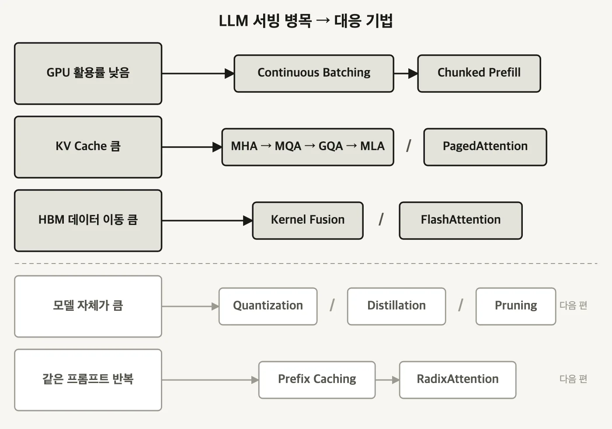
  <figcaption>병목마다 대응 기법이 정해져 있습니다. 진한 위 세 행이 이 글의 범위고, 옅은 아래 두 행(모델 압축과 프리픽스 캐싱)은 다음 편입니다. 같은 병목에 기법이 둘 이상이면 그건 대안이 아니라 층위가 다른 대응입니다. `KV Cache 큼` 행의 어텐션 변형은 캐시할 양을 줄이고, PagedAttention은 그 캐시를 메모리에 앉히는 방식을 바꿉니다. (자작 도식)</figcaption>
</figure>

---

<nav id="manual-toc" class="manual-toc" aria-label="목차">

### 목차

**[1부. 배칭과 스케줄링 - GPU를 놀리지 않기](#section-1)**

- [1.1 배칭이 실제로 올리는 것 - 산술 강도](#s1-1)
- [1.2 Prefill과 Decode - 배칭 효과가 갈리는 지점](#s1-2)
- [1.3 동적 배칭 - 두 개의 상한](#s1-3)
- [1.4 동적 배칭이 못 푸는 것 - 가장 긴 요청이 정하는 완료 시각](#s1-4)
- [1.5 세 개의 상한 - 요청 개수, 요청 길이, 토큰 합계](#s1-5)
- [1.6 Prefill이 Decode를 멈춰 세운다](#s1-6)
- [1.7 청크 프리필 - ITL 개선과 TTFT 악화의 맞바꿈](#s1-7)

**[2부. 어텐션 - 캐시할 헤드를 줄이기](#section-2)**

- [2.1 KV 캐시가 작아지면 따라오는 세 가지](#s2-1)
- [2.2 MHA 100% - GQA 50% - MQA 25%](#s2-2)
- [2.3 MLA - 헤드를 줄이는 대신 latent를 캐시한다](#s2-3)
- [2.4 config.json의 num_key_value_heads 한 줄](#s2-4)

**[3부. GPU 커널 - 메모리를 덜 오가기](#section-3)**

- [3.1 커널 - GPU에서 도는 작은 프로그램](#s3-1)
- [3.2 커널 퓨전 - 왕복 세 번을 한 번으로](#s3-2)
- [3.3 FlashAttention - 17ms에서 2.4ms로](#s3-3)
- [3.4 PagedAttention - 20.4~38.2%를 거의 100%로](#s3-4)

**[전체 흐름 정리](#section-4)** · **[막혔던 곳](#section-5)** · **[출처](#section-6)**

</nav>

---

## 1부. 배칭과 스케줄링 - GPU를 놀리지 않기

<a id="s1-1"></a>

### 1.1 배칭이 실제로 올리는 것 - 산술 강도

요청을 묶는 목적은 두 가지 중 하나로 갈립니다.

- **오프라인 서빙(offline serving)**
  - 요청이 이미 다 확보돼 있습니다. 전부 하나로 묶어 큰 텐서로 만들어 한꺼번에 넣으면 됩니다.
- **실시간 온라인 서빙(real-time online serving)**
  - 사용자가 보내는 대로 요청이 하나씩 들어옵니다. 묶으려면 기다려야 하고, 기다리면 응답이 늦어집니다.

온라인 서빙에서 굳이 기다려서 묶는 이유는 처리량입니다. 여러 요청을 배치로 묶으면 모델에 들어가는 행렬의 배치 차원이 커지고, 그러면 **산술 강도**가 올라갑니다.

<aside class="callout">
<p class="eyebrow">(용어) 산술 강도</p>

**산술 강도(arithmetic intensity)** - 메모리에서 값을 옮긴 양에 비해 그 값으로 수행하는 연산이 얼마나 많은지를 나타내는 비율입니다. `연산량 ÷ 이동한 바이트`로 잡습니다.

- **낮으면** - 값을 옮기는 데 시간을 다 쓰고 연산 유닛은 놉니다. memory-bound라고 부릅니다.
- **높으면** - 옮겨 온 값으로 계산할 게 많아 연산 유닛이 바쁩니다. compute-bound라고 부릅니다.

</aside>

배칭의 핵심은 요청을 여러 개 처리한다는 사실 자체가 아닙니다. **모델 가중치를 한 번 읽을 때 그 한 번의 읽기로 최대한 많은 토큰을 뽑아내는 것**입니다. 요청 하나만 처리하면 수십억 개 파라미터를 전부 훑어 놓고 토큰 한 개를 만들고 끝납니다. 세 개를 묶으면 같은 한 번의 읽기로 토큰 세 개가 나옵니다. 읽기 비용은 그대로고 산출물만 세 배가 됩니다.

<a id="s1-2"></a>

### 1.2 Prefill과 Decode - 배칭 효과가 갈리는 지점

배칭 이득은 두 단계에서 크기가 다릅니다.

- **Prefill** - 입력 프롬프트를 읽어 KV 캐시를 채우는 단계입니다. 프롬프트 토큰들을 한 번에 병렬로 처리하므로 산술 강도가 이미 높고, compute-bound입니다.
- **Decode** - 토큰을 하나씩 만드는 단계입니다. 자기회귀 구조라 토큰 한 개를 뽑으려고 파라미터 전체를 훑어야 합니다. 산술 강도가 낮고 memory bandwidth-bound입니다.

<figure>
  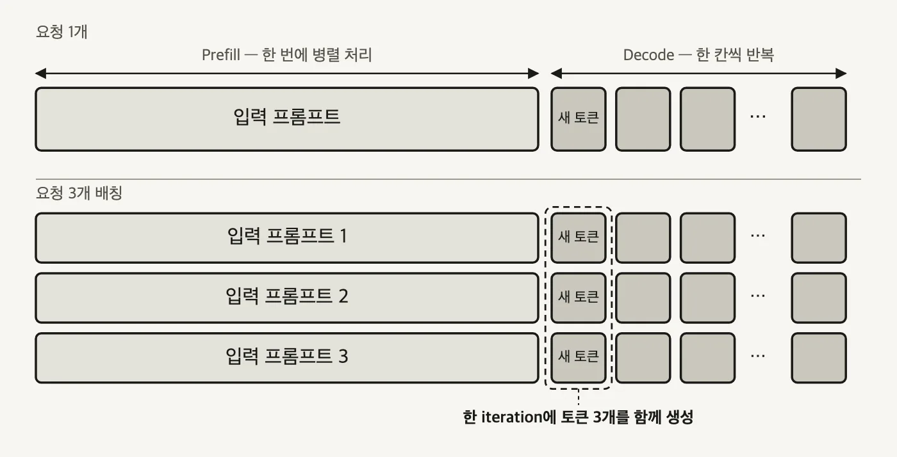
  <figcaption>배칭 이득이 어디서 나오는지가 두 패널의 대비로 드러납니다. 위 패널에서 <strong>입력 프롬프트는 이미 하나의 긴 덩어리</strong>라 병렬성을 더 짜낼 여지가 적고, <strong>새 토큰 칸은 낱개</strong>라 GPU가 헐렁하게 돕니다. 아래 패널에서 늘어난 건 프롬프트 줄 수가 아니라 <strong>점선 상자에 묶인 세로 칸 세 개</strong>입니다. 배칭이 실제로 채우는 자리가 저기입니다. (자작 도식)</figcaption>
</figure>

<aside class="callout">
<p class="eyebrow">(용어) iteration</p>

**iteration** - 스케줄러가 이번에 처리할 토큰들을 정하고, 그 배치에 대해 모델 전체를 한 번 통과시키는 실행 사이클입니다. 여기서 스케줄러는 vLLM 같은 서빙 엔진 안의 소프트웨어 스케줄러를 말합니다.

</aside>

배치 크기 3으로 프롬프트 세 개를 묶으면, Decode는 여전히 iteration당 토큰 하나씩 만들지만 **한 iteration에서 요청별로 하나씩 세 개**가 나옵니다. 모델 가중치는 그 iteration에서 딱 한 번 읽힙니다.

- **Decode에서 효과가 큽니다** - 한 번에 토큰 하나만 만드는 구조라 GPU 연산 유닛이 남습니다. 요청을 묶는 만큼 그 여유가 채워집니다.
- **Prefill에서 효과가 작습니다** - 입력 프롬프트가 대략 1,024 토큰 미만으로 짧지 않으면 prefill 하나만으로도 GPU 연산 능력이 이미 포화입니다. 여기에 요청을 더 얹어도 추가로 얻는 병렬성이 얼마 없습니다.

<a id="s1-3"></a>

### 1.3 동적 배칭 - 두 개의 상한

온라인 서빙에서는 요청이 언제 들어올지 알 수 없습니다. 최대 배치 크기를 10으로 잡아 놓고 10개가 찰 때까지 기다리면 이런 일이 생깁니다.

```
요청 1 ~ 9    바로 도착
요청 10       5분 뒤 도착

→ 먼저 온 9개가 5분을 대기한다
```

배치를 채우는 일에만 매달리면 응답 시간이 무너집니다. **동적 배칭(dynamic batching)** 은 상한을 하나 더 둬서 이 문제를 끊습니다.

- **Max Batch Size** - 함께 묶을 수 있는 요청 개수의 상한입니다. 최대 배치 크기, 선호 배치 크기, 최대 시퀀스 수 등으로도 불립니다.
- **Max Delay Time** - 배치가 차기를 기다려 줄 수 있는 최대 시간입니다.

둘 중 **먼저 도달한 쪽**에서 배치를 발사합니다.

```
대기 큐
   │
   ▼
대기 요청 수가 Max Batch Size 에 닿았나 ? ── 예 ──▶ 즉시 GPU 추론
   │
   아니오
   ▼
Max Delay Time 이 지났나 ?               ── 예 ──▶ 즉시 GPU 추론 (배치가 덜 찼어도)
   │
   아니오
   ▼
조금 더 기다린다 → 다시 위로
```

튜닝 목표는 하나입니다. **지연시간 SLA를 지키는 선에서 배치 크기를 최대한 높게 유지하는 것.** 양쪽 다 과하면 대가가 있습니다.

- **배치 크기를 너무 높이면** - 처리 지연시간이 늘고 GPU·CPU 메모리 사용량도 함께 늘어 OOM 위험이 생깁니다.
- **Max Delay Time을 너무 길게 잡으면** - 높은 배치 크기와 겹쳐 이미 도착한 요청들이 오래 대기합니다.
- **Max Delay Time을 너무 짧게 잡으면** - 배치를 못 채워 한 배치에 실제로 담기는 요청 수가 줄고, 배칭 효과가 반감됩니다.

<a id="s1-4"></a>

### 1.4 동적 배칭이 못 푸는 것 - 가장 긴 요청이 정하는 완료 시각

동적 배칭은 전통적인 ML 서빙에서는 잘 돕니다. LLM에서 어긋나는 지점은 **출력 길이**입니다. 같은 배치에 담긴 요청들이 서로 다른 시점에 끝납니다.

<figure>
  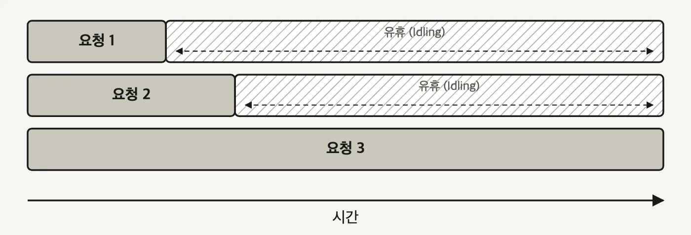
  <figcaption>배치가 통째로 끝나야 결과를 반환하는 구조에서는 <strong>완료 시각이 가장 긴 요청 하나로 결정됩니다.</strong> 요청 1과 2가 먼저 끝나도 그 자리는 해칭 구간만큼 놉니다. 요청마다 출력 길이가 제각각인 LLM에서 이 해칭 면적이 그대로 낭비된 GPU 시간입니다. (자작 도식)</figcaption>
</figure>

**연속 배칭(continuous batching)** 은 정해진 배치 크기나 시간 창을 기다리지 않습니다. 요청을 도착하는 대로 모델에 넣고, 배치 구성을 그때그때 다시 짭니다. 인플라이트 배칭(inflight batching), 반복 배칭(iterative batching)이라고도 불립니다.

<figure>
  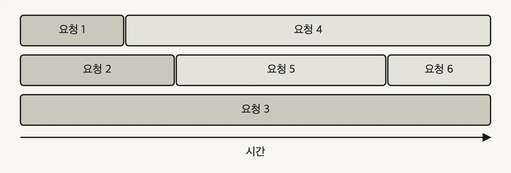
  <figcaption>앞 그림과 축과 행 높이가 같으니 겹쳐 놓고 보면 됩니다. <strong>해칭이 한 곳도 없습니다.</strong> 요청 1이 끝난 자리를 요청 4가, 요청 2가 끝난 자리를 요청 5가 이어받습니다. 동적 배칭이라면 요청 4·5·6 모두 요청 3이 끝날 때까지 대기열에 앉아 있어야 했습니다. (자작 도식)</figcaption>
</figure>

배치 안에서 실행 중인 요청 하나가 끝나면 그 즉시 대기열의 다음 요청이 그 자리에 들어갑니다. 이 판정을 어느 주기로 하는지는 서빙 2편 4.2절에서 본 그대로입니다. 배치 전체의 완료가 아니라 **토큰 한 스텝마다** 큐를 다시 봅니다.

튜닝할 것도 줄어듭니다.

- **Max Delay Time은 더 이상 인위적으로 잡을 필요가 없습니다.** 기다리는 동작 자체가 없어졌습니다.
- **Max Batch Size는 남습니다.** 다만 역할이 바뀝니다. "이만큼 채워야 발사한다"는 목표치가 아니라, 연속 배칭이 자리를 채워 나가다가 넘지 못하게 막는 **절대 상한선**입니다.

<a id="s1-5"></a>

### 1.5 세 개의 상한 - 요청 개수, 요청 길이, 토큰 합계

요청 개수만 제한하면 잡히지 않는 게 있습니다.

```
20 토큰짜리 요청 10개        총 200 토큰
100,000 토큰짜리 요청 2개    총 200,000 토큰
```

둘 다 요청 개수 상한 10 안쪽입니다. 그런데 GPU가 감당할 작업량은 1,000배 차이가 납니다. 요청 레벨 제어에 **토큰 레벨 제어**를 더해야 하는 이유가 이겁니다.

<figure>
  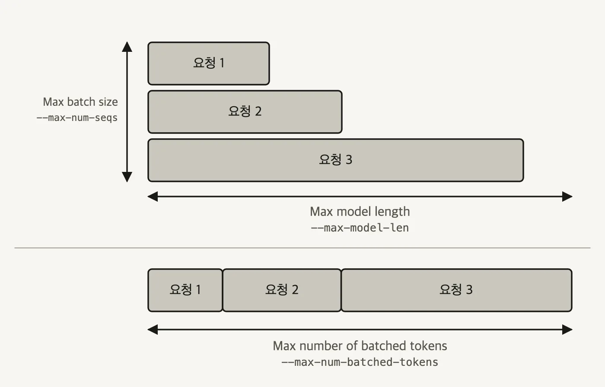
  <figcaption>세 화살표가 각각 다른 방향을 재고 있습니다. <strong>세로 화살표는 개수</strong>, <strong>위 패널의 가로 화살표는 요청 하나의 길이</strong>, <strong>아래 패널의 가로 화살표는 요청들을 이어붙인 합계</strong>입니다. 위아래 패널에 같은 요청 세 개가 들어 있는데도 재는 값이 다르다는 게 이 그림의 논점입니다. (자작 도식)</figcaption>
</figure>

| 상한 | 재는 대상 | vLLM 플래그 |
|------|-----------|-------------|
| Max Batch Size | 한 iteration에 함께 처리하는 요청 개수 | `--max-num-seqs` |
| Max Model Length | 요청 하나가 넘을 수 없는 토큰 길이. 모델 자체의 컨텍스트 상한 | `--max-model-len` |
| Max Number of Batched Tokens | 스케줄러가 배치 전체에 허용하는 총 토큰 수 | `--max-num-batched-tokens` |

셋 중 무엇이 실제 병목이 되는지는 단계마다 다릅니다.

- **Prefill** - 입력이 훨씬 길기 때문에 총 토큰 수가 먼저 한도에 닿습니다. 긴 요청 몇 개가 `--max-num-batched-tokens`를 다 먹으면 스케줄러는 새 요청을 그 배치에 더 넣지 않습니다.
- **Decode** - 요청마다 토큰 한 개씩만 처리하므로 총 토큰 수는 여유롭고, 병렬성은 `--max-num-seqs`에 걸립니다.

```bash
vllm serve Qwen/Qwen2.5-7B-Instruct \
  --max-num-batched-tokens 4096 \
  --max-num-seqs 128 \
  --max-model-len 1024
```

`--max-model-len 1024`에 `--max-num-batched-tokens 4096`이면, 컨텍스트를 꽉 채운 요청 네 개가 한 iteration에 들어갈 수 있는 셈입니다. `--max-num-seqs 128`은 그보다 훨씬 넉넉하니 이 조합에서 prefill을 실제로 묶는 상한은 토큰 수 쪽입니다.

<a id="s1-6"></a>

### 1.6 Prefill이 Decode를 멈춰 세운다

연속 배칭은 요청 길이가 제각각인 문제를 풀었습니다. 하지만 Prefill과 Decode가 성격이 다른 워크로드라는 사실은 그대로 남습니다. 요청들의 입력 길이·출력 길이가 같고 시작 시점까지 같다면 iteration 1에서 세 요청의 prefill이 함께 묶이고 iteration 2에서 세 요청의 decode가 함께 묶여 깔끔하게 흘러갑니다. 실제로는 요청이 무작위 시점에 도착합니다.

그러면 질문이 하나 생깁니다. **요청 1이 이미 Decode 중인데 요청 2가 도착해 Prefill을 시작하려면, 무엇을 먼저 할 것인가.**

<figure>
  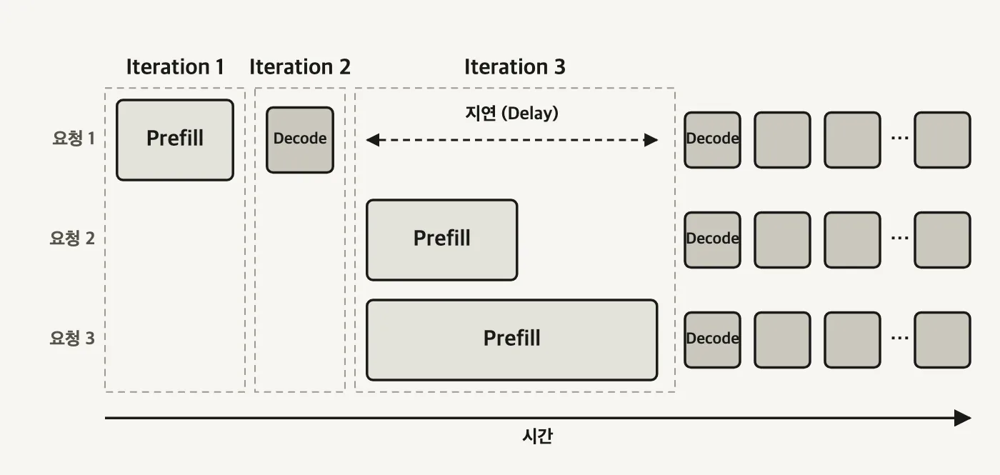
  <figcaption>Prefill을 우선한 결과입니다. Iteration 3 내내 <strong>요청 1 행이 통째로 비어 있습니다.</strong> Prefill이 TTFT를 결정하니 우선순위를 주는 게 합리적인데, 그 대가로 이미 글자를 뽑고 있던 요청이 멈춰 섭니다. 요청 2·3의 프롬프트가 길수록 저 지연 화살표가 길어집니다. (자작 도식)</figcaption>
</figure>

<aside class="callout">
<p class="eyebrow">(용어) TTFT와 ITL</p>

- **TTFT (Time To First Token)** - 요청을 보낸 뒤 첫 토큰이 도착할 때까지의 시간입니다. Prefill이 이 값을 결정합니다.
- **ITL (Inter-Token Latency)** - 토큰과 토큰 사이의 시간입니다. 글자가 흘러나오는 속도로 체감됩니다. TPOT(Time Per Output Token)라고도 부릅니다.

</aside>

Prefill과 Decode를 섞은 하이브리드 배치는 더 복잡한 GPU 커널을 요구하므로, 우선 섞지 않는 쪽이 기본이 됩니다. 그리고 보통 Prefill을 먼저 처리합니다. 챗봇처럼 대화형 서비스에서는 첫 글자가 언제 뜨는지가 곧 체감 품질이라, TTFT를 결정하는 Prefill을 뒤로 미루기 어렵습니다.

그렇다면 두 워크로드를 같은 iteration에 함께 넣는 쪽은 어떤지 보겠습니다.

<figure>
  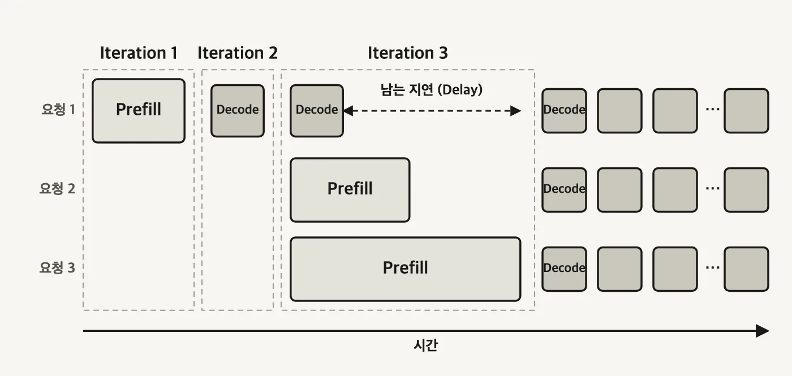
  <figcaption>요청 1의 Decode 한 칸을 iteration 3에 끼워 넣었습니다. 그런데 <strong>지연 화살표가 거의 그대로 남습니다.</strong> 토큰 하나를 디코딩하는 시간은 긴 Prefill을 끝내는 시간에 비해 훨씬 짧아서, 한 칸을 넣어도 iteration 3이 끝날 때까지 요청 1은 또 기다립니다. 프롬프트가 길면 이 차이가 더 벌어집니다. (자작 도식)</figcaption>
</figure>

<a id="s1-7"></a>

### 1.7 청크 프리필 - ITL 개선과 TTFT 악화의 맞바꿈

두 그림이 같은 원인을 가리킵니다. **Prefill 막대와 Decode 칸의 크기가 너무 다릅니다.** 그러면 크기를 맞춰 주면 됩니다.

**청크 프리필(chunked prefill)** 은 긴 입력 프롬프트를 작은 청크로 나눕니다. 하나의 긴 Prefill 막대가 Decode 칸과 비슷한 크기의 조각 여러 개로 쪼개지고, 그 조각들을 Decode 칸 사이에 끼워 넣을 수 있게 됩니다.

<figure>
  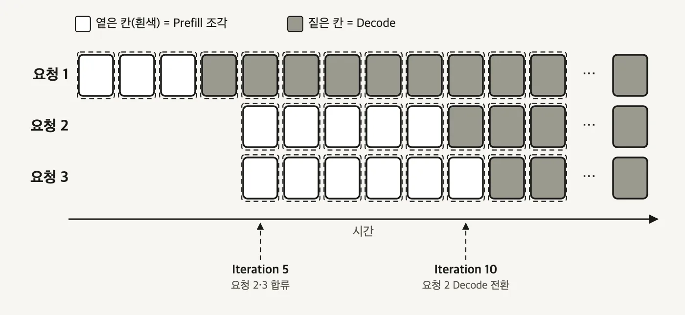
  <figcaption>앞의 두 그림과 비교해 보면 <strong>긴 막대가 사라졌습니다.</strong> 모든 칸이 같은 크기고, 흰 칸(Prefill 조각)과 짙은 칸(Decode)이 같은 열에 나란히 앉습니다. Iteration 5에서 요청 2·3이 합류해도 요청 1의 Decode는 멈추지 않습니다. 요청 2는 프리필 조각이 요청 3보다 하나 적어서 Iteration 10에 먼저 Decode로 넘어갑니다. (자작 도식)</figcaption>
</figure>

얻는 것과 잃는 것이 명확히 갈립니다.

| 지표 | 변화 | 이유 |
|------|------|------|
| ITL (토큰 간 지연시간) | 개선 | Decode 칸이 긴 Prefill에 막혀 대기하지 않습니다 |
| TTFT (첫 토큰까지 시간) | 악화 | Prefill을 여러 스텝에 걸쳐 처리하면서 오버헤드가 붙습니다 |
| 종단 지연시간 | 개선 없음 | 작은 Prefill 스텝을 여러 번 계산하는 비용 때문에 오히려 약간 나빠지는 경우가 많습니다 |
| 처리량 | 개선 | 유휴 시간의 빈틈을 채워 배치 효율이 올라가고 GPU를 더 잘 씁니다 |

트랜스포머 4편 2.3절에서도 prefill을 쪼갰습니다. **쪼개는 동작은 같고 노리는 이득이 다릅니다.**

- **트랜스포머 4편의 `prefill_chunk`** - 요청 하나 안에서 어텐션 점수 행렬의 `O(L²)` 봉우리를 깎습니다. 요청이 하나뿐이어도 의미가 있습니다.
- **여기의 청크 프리필** - 여러 요청이 한 배치에서 겹칠 때, Prefill 조각을 Decode 칸 사이에 끼워 스케줄러가 둘을 나란히 놓을 수 있게 합니다. 요청이 하나뿐이면 얻을 게 없습니다.

vLLM에서 켜고 조이는 방법은 이렇습니다.

- **`--enable-chunked-prefill`** - 기능 스위치입니다. 기본값이 `True`입니다.
- **`--max-num-batched-tokens`** - 별도의 "청크 크기" 파라미터는 없습니다. Prefill 요청은 남은 `max_num_batched_tokens`를 기준으로 더 작은 청크로 쪼개지므로, 1.5절에서 본 이 값이 그대로 청크 크기 역할을 합니다.

| 청크 크기 설정 | 결과 |
|---|---|
| 극단적으로 크게 (예: `--max-model-len`까지) | 사실상 쪼개지 않는 것과 같습니다 |
| 극단적으로 작게 | 한 iteration에 충분한 토큰을 못 묶어 GPU 연산력을 포화시키지 못하고, 스텝 오버헤드만 늘어납니다 |
| 이상적 | 오버헤드가 크지 않고 빈틈 채우기도 훼손하지 않는 중간값 |

```bash
vllm serve Qwen/Qwen2.5-7B-Instruct \
  --enable-chunked-prefill \
  --max-num-batched-tokens 2048 \
  --max-num-seqs 3 \
  --max-model-len 1024
```

연속 배칭은 몇 년째 프로덕션 LLM 서빙의 업계 표준이고, 청크 프리필과 그 변형은 긴 컨텍스트 워크로드에서 널리 쓰입니다. 여기서 한 단계 더 나가는 방향은 **Prefill-Decode 분리(disaggregation)** 입니다. 두 워크로드를 한 배치에서 공존시키는 대신, 아예 다른 GPU 또는 다른 노드로 갈라놓는 방식입니다.

---

## 2부. 어텐션 - 캐시할 헤드를 줄이기

<a id="s2-1"></a>

### 2.1 KV 캐시가 작아지면 따라오는 세 가지

Decode 단계에서는 매 iteration마다 KV 캐시가 HBM에서 온칩 레지스터·공유 메모리로 실려 옵니다. 토큰 하나를 뽑을 때마다 이 이동이 반복되니, 캐시 크기가 곧 대역폭 청구서입니다. 컨텍스트가 길어지면 KV 캐시가 모델 가중치보다 커지는 일도 생깁니다. 14GB 모델에 KV 캐시가 32GB 붙는 식입니다.

캐시가 작아지면 세 가지가 따라옵니다.

- **GPU 메모리 대역폭 부담이 줄어듭니다** - iteration마다 옮기는 바이트가 줄어듭니다.
- **GPU 메모리 공간이 남습니다** - 남은 공간으로 배치 크기를 올릴 수 있고, 그러면 처리량이 올라갑니다.
- **같은 메모리로 더 긴 컨텍스트를 서빙할 수 있습니다** - 요청 하나가 잡는 캐시가 작아지니 길이 상한이 올라갑니다.

<a id="s2-2"></a>

### 2.2 MHA 100% - GQA 50% - MQA 25%

GPT-3를 굴린 원래의 MHA는 더 이상 기본값이 아닙니다. MQA, GQA, MLA가 차례로 나왔고 목표는 하나로 같습니다. **모델 품질을 유지하면서 KV 캐시 크기를 줄이는 것.**

<figure>
  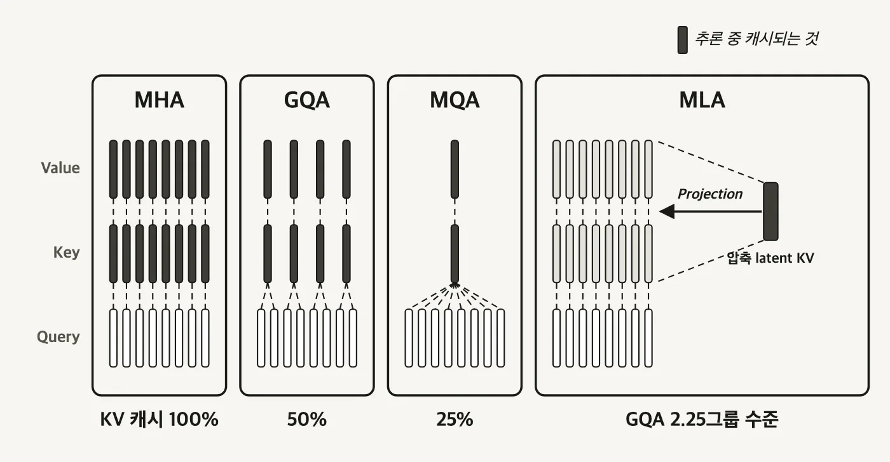
  <figcaption>짙은 막대가 추론 중 캐시되는 것입니다. 네 패널의 차이는 <strong>짙은 막대의 개수</strong> 하나뿐입니다. Query 막대는 어디서도 짙어지지 않습니다. 트랜스포머 4편 1.4절에서 본 그 비대칭이 여기서도 그대로 성립하기 때문입니다. MLA만 셈법이 다릅니다. Key·Value 자리는 옅게 비워 두고 오른쪽 짙은 막대 하나만 캐시한 뒤 Projection으로 되돌립니다. (자작 도식)</figcaption>
</figure>

- **MHA (Multi-Head Attention)**
  - 쿼리 헤드 하나당 고유한 Key·Value 헤드가 하나씩 붙습니다.
  - 네 방식 중 KV 캐시가 가장 큽니다.
- **MQA (Multi-Query Attention)**
  - 모든 쿼리 헤드가 **단 하나의 Key·Value 헤드를 공유**합니다.
  - 7B 모델은 보통 어텐션 헤드가 32개, 70B 모델은 64개입니다. MHA라면 KV 헤드도 각각 32개, 64개 필요한데 MQA는 1개면 됩니다.
  - 대신 설계가 너무 공격적이라 **모델 정확도가 크게 떨어지는** 것으로 밝혀졌습니다.
- **GQA (Grouped-Query Attention)**
  - 쿼리 헤드를 그룹으로 묶고 **그룹마다 Key·Value 하나를 공유**합니다.
  - 연산 효율이 낮은 MHA와 정확도 손실이 큰 MQA 사이의 절충으로 입증돼, 현재 많은 모델 아키텍처가 채택했습니다.

같은 조건에서 KV 캐시 메모리를 비교하면 **MHA 100% 대 GQA 50% 대 MQA 25%** 로 나옵니다.

<a id="s2-3"></a>

### 2.3 MLA - 헤드를 줄이는 대신 latent를 캐시한다

MQA와 GQA는 캐시할 헤드 개수를 줄였습니다. DeepSeek이 도입한 **MLA (Multi-head Latent Attention)** 는 개수를 건드리지 않고 **압축**합니다. Key·Value를 그대로 저장하지 않고 훨씬 작은 latent 벡터로 압축해 두고, 쓸 때 projection으로 되돌립니다. 헤드를 줄이는 대신 latent를 캐시하는 셈입니다.

DeepSeek 논문의 주장은 **KV 캐시 크기는 그룹 2.25개짜리 GQA와 동등하고 성능은 MHA보다 강하다**는 것입니다. GQA의 절충 곡선 자체를 벗어난다는 뜻입니다.

이 흐름은 계속 이어집니다. 기본 어텐션이 너무 비싸서 긴 컨텍스트를 감당하지 못한다는 문제에, 세 갈래로 대응이 붙었습니다.

- **범위나 상태를 줄이기** - Linear Attention과 Recurrent State(Mamba 계열)는 제곱에 비례하는 연산량을 줄이려고 중간 상태를 메모리 형태로 압축합니다. Sliding-Window Attention 계열은 보는 범위를 잘라냅니다.
- **압축으로 흐려진 정보를 중간에 고치기** - DeltaNet은 누적만 하는 Recurrent State에서 기존 성분을 제거하고 다시 더합니다. Gated DeltaNet은 문맥 경계를 처리하려고 전역 감쇠 단계를 붙입니다. Kimi Delta Attention은 이 감쇠 게이트를 채널별로 둡니다.
- **손실된 정보를 전역 어텐션으로 보완하기** - 평소에는 Linear로 돌다가 중간중간 전역 어텐션을 섞습니다. Kimi K3는 KDA와 Gated MLA를 3:1로 섞었습니다. Gated MLA는 MLA로 KV 캐시를 압축한 결과를 Qwen3 Next의 Gated Attention처럼 Sigmoid 게이트에 통과시켜, 어텐션 싱크를 피하면서 선택적으로 흘려보냅니다.

<a id="s2-4"></a>

### 2.4 config.json의 num_key_value_heads 한 줄

어떤 방식을 쓰는 모델인지는 `config.json` 두 줄만 보면 판정됩니다.

```json
// Llama 2 - MHA. 어텐션 헤드 수와 KV 헤드 수가 같다
"num_attention_heads": 32,
"num_hidden_layers": 32,
"num_key_value_heads": 32,

// Llama 3 - GQA. KV 헤드 수가 줄었다
"num_attention_heads": 32,
"num_hidden_layers": 32,
"num_key_value_heads": 8,
```

Llama 3은 `32 ÷ 8 = 4`, 즉 어텐션 헤드 4개가 KV 헤드 하나를 공유합니다. 두 값이 같으면 MHA, `num_key_value_heads`가 1이면 MQA, 그 사이면 GQA입니다. 어텐션 방식을 고르는 일은 결국 어떤 모델 계열을 쓸지 정하는 결정의 일부입니다. 서빙 시점에 플래그로 바꿀 수 있는 게 아닙니다.

---

## 3부. GPU 커널 - 메모리를 덜 오가기

<a id="s3-1"></a>

### 3.1 커널 - GPU에서 도는 작은 프로그램

**커널(kernel)** 은 GPU에서 실행되는 작고 특화된 프로그램입니다. 행렬 곱셈, Softmax처럼 딥러닝 모델에 꼭 필요한 연산 하나를 담당합니다. 모델 구조·하드웨어·워크로드에 맞게 특화된 커널을 쓰면 GPU 활용률과 추론 속도, 처리량이 함께 올라갑니다.

커널이 실행되는 경로는 CPU와 GPU를 오갑니다.

```
호스트 (CPU)                              디바이스 (GPU)
  커널 정의
     │ 첫 호출 때
  컴파일
     │ 컴파일된 커널
  커널 실행 요청  ── 블록 격자 ──▶  SM    SM    SM    SM   ...
                                    SM 안 = ALU 여러 개 + 공유 메모리(L1)
```

GPU가 그 일을 나누는 단위는 이렇게 겹칩니다.

```
스레드           GPU에서 도는 실행 단위 하나
   ↓ 여러 개가 한 묶음
워프(warp)       같은 명령을 동시에 실행하는 스레드 묶음
   ↓ 여러 개가 한 묶음
블록             공유 메모리를 함께 쓰는 워프 묶음 → SM 하나에 배치된다
   ↓ 여러 개가 한 묶음
격자(grid)       커널 한 번 실행에 뿌려지는 블록 전체
```

**공유 메모리는 블록 단위로 붙습니다.** 같은 블록 안의 스레드들끼리는 빠른 메모리를 나눠 쓸 수 있고, 블록 밖으로 값을 넘기려면 느린 글로벌 메모리를 거쳐야 합니다. 커널 퓨전과 FlashAttention이 공략하는 지점이 이 경계입니다.

<a id="s3-2"></a>

### 3.2 커널 퓨전 - 왕복 세 번을 한 번으로

**커널 퓨전(kernel fusion)** 은 여러 개별 연산을 하나의 커널로 합칩니다. 합치면 중간 결과를 글로벌 메모리에 내려놓을 필요가 없어집니다. 레지스터와 공유 메모리에 이미 올라와 있는 값을 그대로 다음 단계에 씁니다.

<figure>
  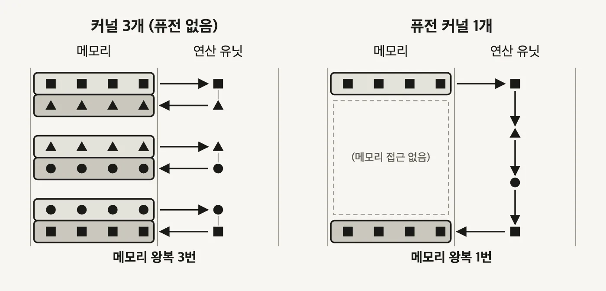
  <figcaption>화살표 개수를 세면 됩니다. 왼쪽은 좌우 화살표가 <strong>여섯 개</strong>, 오른쪽은 <strong>두 개</strong>입니다. 도형이 사각형에서 삼각형, 원, 사각형으로 바뀌는 단계 수는 양쪽이 같습니다. 계산량은 그대로고 메모리를 오간 횟수만 줄었습니다. 오른쪽 패널 가운데 비어 있는 점선 영역이 퓨전으로 없어진 왕복입니다. (자작 도식)</figcaption>
</figure>

<a id="s3-3"></a>

### 3.3 FlashAttention - 17ms에서 2.4ms로

어텐션이 메모리 대역폭에 막히는 이유는 트랜스포머 4편 3.2절에서 원리로 봤습니다. 실제로 HBM을 오가는 것은 어텐션 점수 행렬 `S`와 Softmax 결과 `P`, 둘 다 `N×N` 크기입니다.

<figure>
  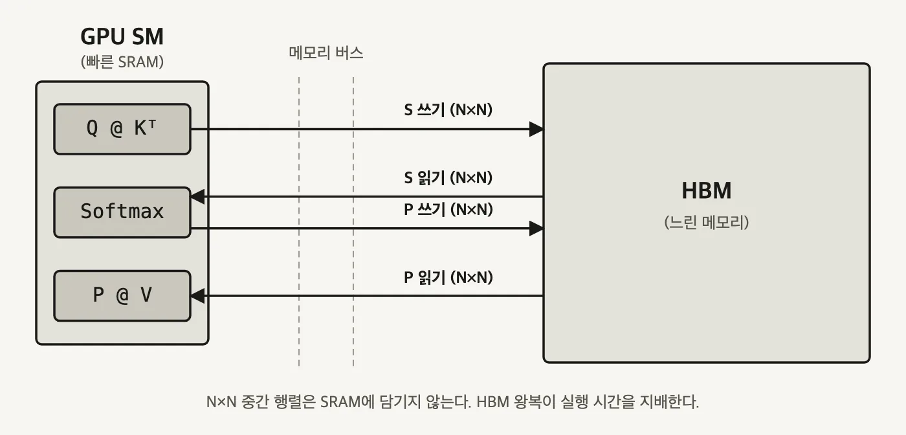
  <figcaption>상자 크기 차이가 문제의 전부입니다. 어텐션 점수 행렬 <code>S</code>와 Softmax 결과 <code>P</code>는 둘 다 <code>N×N</code>이라 왼쪽 작은 SRAM 상자에 담기지 않습니다. 그래서 계산 단계마다 오른쪽 HBM에 내려놓고 다시 가져옵니다. <strong>화살표 네 개가 좁은 버스를 통과하는 시간이 실행 시간을 지배합니다.</strong> (자작 도식)</figcaption>
</figure>

FlashAttention의 방침은 **큰 행렬을 느린 HBM에 통째로 구체화하지 않는 것**입니다. 대신 큰 행렬을 작은 조각으로 나누는 **타일링(tiling)** 을 씁니다. QKV 행렬 곱셈과 변환을 타일 단위로 반복하면서 모든 연산을 SRAM 안에서 처리하고, **최종 출력만 HBM에 씁니다.** 여기에 어텐션 연산 전체를 하나로 퓨전하고 online softmax를 얹어, 현재 기준 최고 성능의 어텐션 커널이 됐습니다.

<figure>
  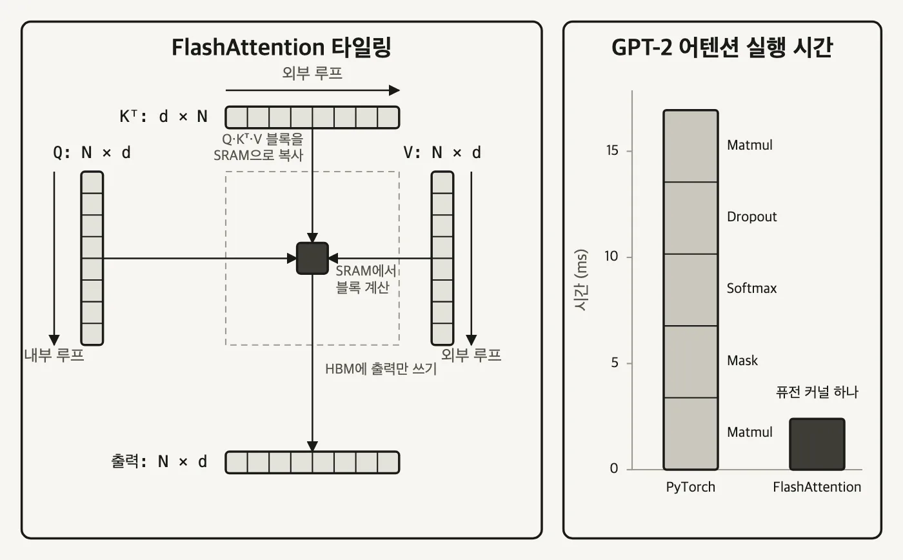
  <figcaption>왼쪽에서 SRAM으로 올라가는 건 <strong>가운데 작은 타일 하나</strong>뿐이고, HBM으로 내려가는 화살표도 <strong>출력 하나</strong>뿐입니다. 앞 그림의 왕복 네 번이 여기서 사라졌습니다. 오른쪽 막대가 그 결과입니다. PyTorch 막대는 Matmul, Mask, Softmax, Dropout, Matmul 다섯 커널로 쪼개져 약 17ms인데, 퓨전 커널 하나로 합친 FlashAttention은 약 2.4ms입니다. (자작 도식)</figcaption>
</figure>

FlashAttention 2와 3은 핵심 아이디어를 유지한 채 기법을 더했습니다. GEMM(General Matrix Multiply) 계산과 Softmax 계산을 오버랩시키는 식입니다. H100 같은 세대에서 GPU 활용률이 더 개선됩니다.

커널 최적화 자체는 GPU 아키텍처, CUDA, 성능 프로파일링, 컴파일러가 얽힌 별도 영역입니다. 서빙하는 쪽에서 챙길 것은 **효율적인 커널을 골라 쓰는 일**입니다. FlashAttention 외에 FlashInfer, xFormers, Triton이 있습니다. 여기서 Triton은 커널 작성 언어이고 Triton Inference Server와는 다른 것입니다.

```bash
# vLLM에서 FlashInfer 커널 사용하기
pip install vllm==0.8.5.post1
pip install flashinfer-python==0.2.2
export VLLM_ATTENTION_BACKEND=FLASHINFER
export VLLM_USE_FLASHINFER_SAMPLER=1
export VLLM_FLASHINFER_FORCE_TENSOR_CORES=1

# 어텐션 백엔드를 명시 지정하려면
vllm serve Qwen/Qwen2.5-7B-Instruct \
  --attention-backend FLASH_ATTN \
  --max-model-len 4096 \
  --max-num-batched-tokens 8192 \
  --max-num-seqs 128 \
  --enable-chunked-prefill

# SGLang은 플래그 하나로 고른다
--attention-backend {flashinfer|fa3|triton|torch_native|FlashMLA}
```

어떤 커널이 맞는지는 커널·하드웨어·입출력 분포가 얽혀 있어서 실험으로 찾는 게 보통입니다. 다행히 vLLM과 SGLang은 기본값을 자동으로 고르는 로직을 갖고 있습니다. 자료 집필 시점 기준으로 SGLang은 Hopper가 아닌 GPU(A100, A40 등)에 FlashInfer를, Hopper 아키텍처(H100, H200, H20)에 FlashAttention 3을 기본값으로 씁니다. 권장 기본값으로 시작해 다른 최적화를 먼저 시도한 뒤, 더 짜낼 게 필요할 때 커널을 바꿔 보는 순서가 안전합니다.

<a id="s3-4"></a>

### 3.4 PagedAttention - 20.4~38.2%를 거의 100%로

KV 캐시 메모리 관리가 까다로운 이유는 스케줄러가 미래를 모른다는 데 있습니다.

- **입력 길이는 요청마다 다릅니다.**
- **출력 길이는 사전에 알 수 없습니다.** 언제 끝날지 모르는 요청에 얼마를 잡아 줘야 하는지 판단할 근거가 없습니다.
- **최신 모델이 컨텍스트를 늘리면서 캐시 자체가 계속 커집니다.**

전통적인 방식은 요청마다 넉넉하게 미리 할당하는 것입니다. 그러면 대부분 다 쓰이지 않고 남고, 남은 자리는 다른 요청이 쓰기에는 조각나 있습니다. 심각한 메모리 파편화가 생기고 실사용률이 바닥으로 떨어집니다.

**PagedAttention** 은 운영체제의 페이징에서 방식을 가져왔습니다. 메모리를 고정 크기 블록으로 나누고, 룩업 테이블로 논리 위치와 물리 위치를 잇습니다.

<figure>
  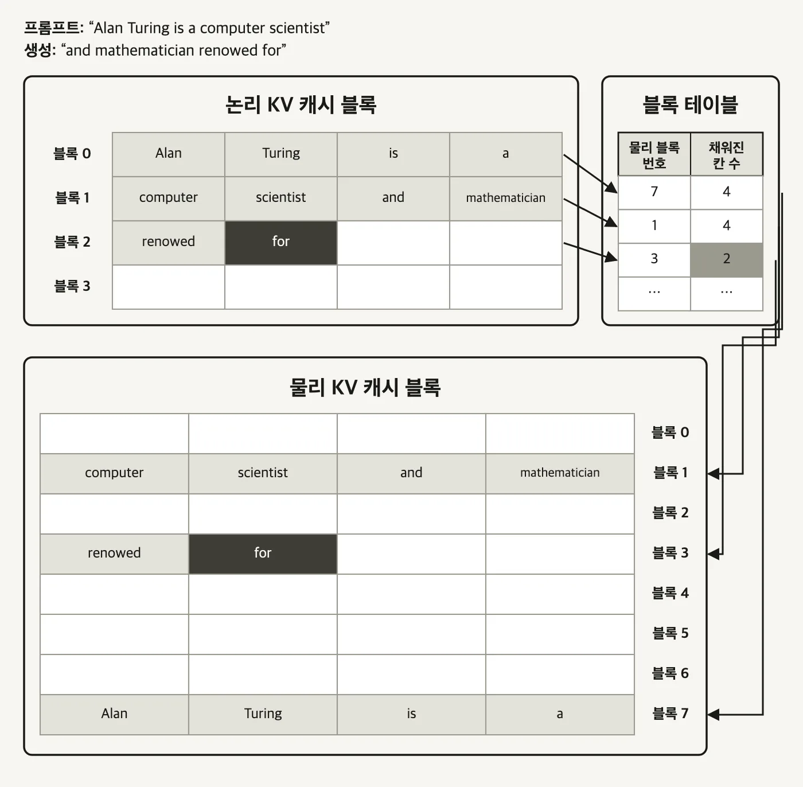
  <figcaption>논리 블록 0·1·2는 붙어 있는데 물리 블록은 <strong>7 → 1 → 3</strong> 으로 흩어져 있습니다. 프롬프트와 생성 결과가 물리 메모리상 연속된 공간을 차지하지 않아도 되는 겁니다. 블록 하나에 토큰 4개가 들어가고, 마지막 블록 3은 아직 생성 중이라 2개만 찼습니다. 이 대응을 아는 유일한 근거가 가운데 블록 테이블입니다. (자작 도식)</figcaption>
</figure>

동작은 세 가지입니다.

- KV 캐시를 고정 크기 블록들로 쪼갭니다.
- 블록 테이블(block table)로 어느 논리 위치가 어느 물리 블록에 있는지 찾습니다.
- 블록은 필요할 때 개별로 접근하므로 **연속된 메모리가 필요 없습니다.**

효과는 원 논문 수치가 그대로 말해 줍니다. PagedAttention 없이는 **KV 캐시 메모리의 20.4%~38.2%만 실제 토큰 상태를 저장하는 데 쓰이고**, PagedAttention을 적용하면 **KV 캐시 메모리 낭비가 거의 0에 가까워집니다.**

파편화를 이만큼 없앤 덕에 PagedAttention과 그 변형은 연속 배칭과 마찬가지로 거의 모든 LLM 서빙에서 기본으로 켜져 있는 표준이 됐습니다. vLLM에서는 켜고 끄는 스위치가 아예 없습니다. KV 캐시를 GPU 메모리에 저장하고 관리하는 근본 메커니즘 자체라서 그렇습니다.

---

## 전체 흐름 정리

```
요청 도착
   │
   ├─ 언제 묶나
   │     정적 배칭      배치가 찰 때까지 기다린다
   │     동적 배칭      Max Batch Size 와 Max Delay Time 중 먼저 닿은 쪽에서 발사
   │     연속 배칭      기다리지 않는다. 끝난 자리에 즉시 다음 요청
   │
   ├─ 얼마나 묶나
   │     --max-num-seqs             요청 개수 상한
   │     --max-model-len            요청 하나의 길이 상한
   │     --max-num-batched-tokens   한 iteration 토큰 합계 상한
   │
   ├─ Prefill 과 Decode 를 어떻게 섞나
   │     Prefill 우선     TTFT 는 지키고 Decode 를 멈춘다
   │     섞어서 배칭      Decode 한 칸이 너무 짧아 지연이 남는다
   │     청크 프리필      Prefill 을 Decode 칸 크기로 쪼갠다 (ITL 개선, TTFT 악화)
   │
   ├─ KV 캐시를 얼마나 옮기나
   │     MHA → MQA → GQA → MLA     캐시할 Key·Value 를 줄이거나 압축한다
   │
   └─ 메모리를 몇 번 오가나
         Kernel Fusion      중간 결과를 글로벌 메모리에 내려놓지 않는다
         FlashAttention     타일링으로 SRAM 안에서 계산하고 출력만 HBM 에 쓴다
         PagedAttention     KV 캐시를 고정 크기 블록과 블록 테이블로 관리한다
```

**기억할 숫자**

| 숫자 | 무엇 |
|------|------|
| 1,024 토큰 | 입력 프롬프트가 이 정도를 넘으면 prefill 하나로도 GPU 연산이 포화된다 |
| 4096 / 128 / 1024 | 예시 설정의 `--max-num-batched-tokens` / `--max-num-seqs` / `--max-model-len` |
| 32개 · 64개 | 7B · 70B 모델의 어텐션 헤드 수. MHA면 KV 헤드도 같은 개수가 필요하다 |
| 32 ÷ 8 = 4 | Llama 3에서 KV 헤드 하나를 공유하는 어텐션 헤드 수 |
| 100% / 50% / 25% | MHA / GQA / MQA 의 KV 캐시 메모리 비교 |
| 2.25 | MLA의 KV 캐시가 맞먹는다는 GQA 그룹 수 (DeepSeek 논문 주장) |
| 17ms → 2.4ms | GPT-2 어텐션. PyTorch 커널 5개 대 FlashAttention 퓨전 커널 1개 |
| 20.4% ~ 38.2% | PagedAttention 없을 때 KV 캐시 메모리 중 실제 토큰 상태가 차지하는 비율 |
| 4 토큰 | PagedAttention 블록 하나에 담기는 토큰 수 (예시 그림 기준) |

---

## 출처

- 이 글의 도식 13장은 전부 직접 그렸습니다. 아래 자료들이 설명하는 구조를 재구성한 것이고, 원본 화면을 옮긴 것은 없습니다.
- CloudNet@ LLM 서빙 스터디 6장 학습 자료 - `Essential LLM Optimization Techniques`. 배칭·스케줄링, 어텐션 변형, 커널, PagedAttention 절의 구성과 예시 파라미터가 이 자료를 따릅니다.
- [실시간 서빙에서 배칭이 왜 필요한가 01:42](https://www.youtube.com/watch?v=9gmHwe5-j0E&t=102s) - Prefill과 Decode의 배칭 효과 차이
- [정적 배칭의 문제 03:07](https://www.youtube.com/watch?v=9gmHwe5-j0E&t=187s) - 동적 배칭의 두 파라미터
- [연속 배칭 06:34](https://www.youtube.com/watch?v=9gmHwe5-j0E&t=394s) - 끝난 자리를 이어받는 스케줄링
- [청크 프리필 10:11](https://www.youtube.com/watch?v=9gmHwe5-j0E&t=611s) - Prefill과 Decode를 한 iteration에 공존시키기
- [LLM - Why attention is expensive and how GQA, MLA, KV cache economize the cost](https://medium.com/@dk02315/llm-why-attention-is-expensive-and-how-gqa-mla-kv-cache-economize-the-cost-81459f8d6623) - MHA·MQA·GQA·MLA 비교
- [LLM이 메모리를 75% 적게 쓰는 이유 - GQA와 MQA](https://www.youtube.com/watch?v=yzONjmXM8As) - KV 캐시 메모리 100% / 50% / 25% 비교
- [Kimi K3 리포트 해설](https://www.youtube.com/watch?v=njM0LT4s6_0) - KDA와 Gated MLA, 하이브리드 어텐션의 방향
- [FlashAttention - Fast and Memory-Efficient Exact Attention with IO-Awareness](https://arxiv.org/abs/2205.14135) - 타일링과 GPT-2 어텐션 실행 시간 비교
- [Efficient Memory Management for Large Language Model Serving with PagedAttention](https://arxiv.org/abs/2309.06180) - 블록 테이블 구조와 20.4%~38.2% 수치
