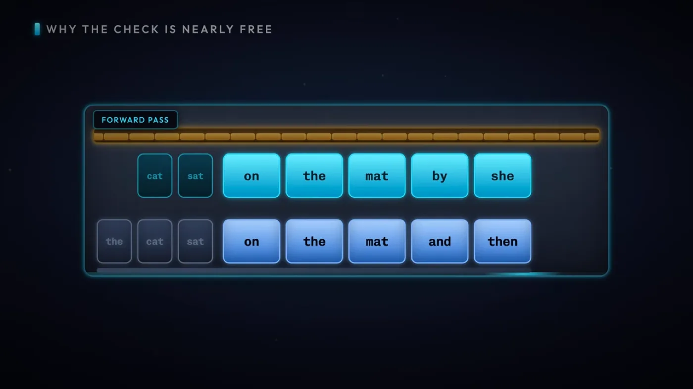
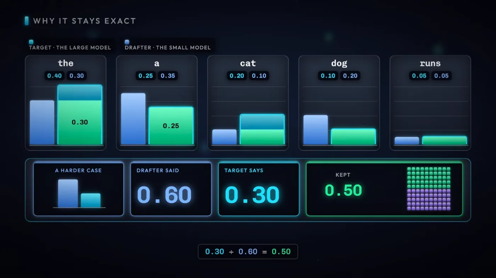
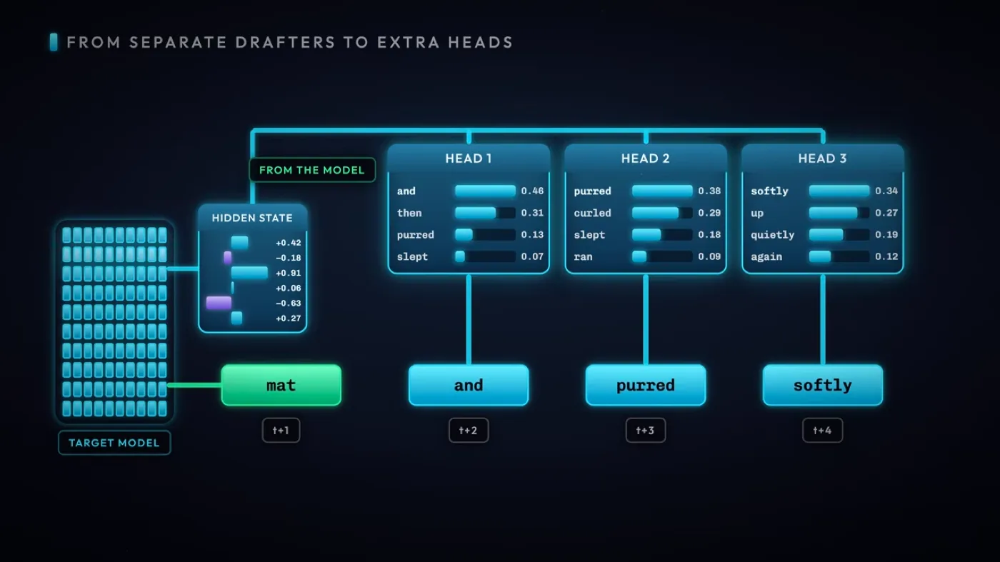
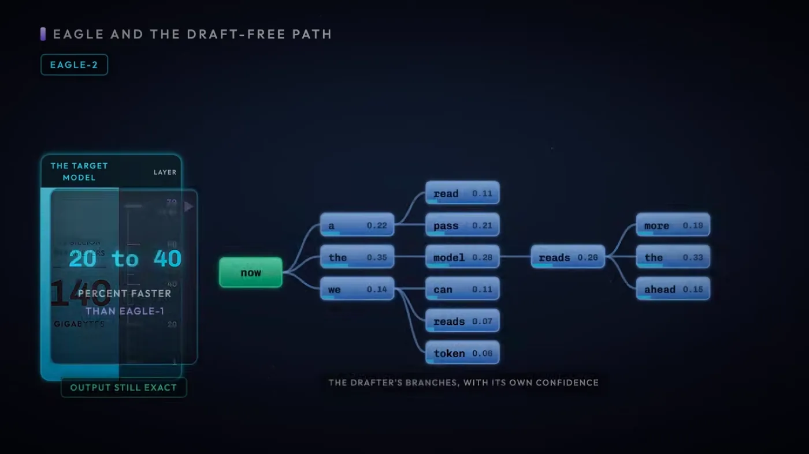
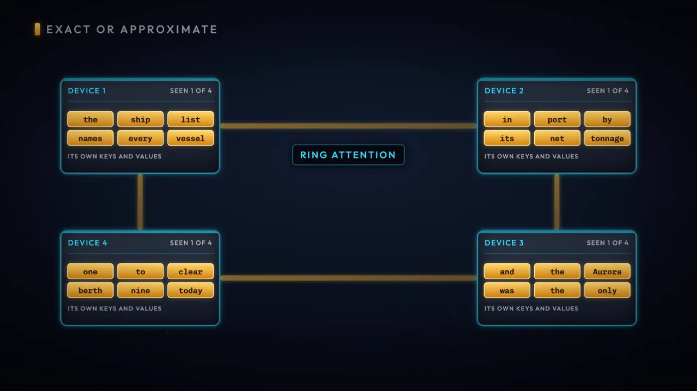

최적화 1편의 배칭은 여러 요청을 한 번의 가중치 읽기에 묶는 방법이었습니다. 요청이 하나뿐이면 이 방법이 안 통합니다. 그런데도 토큰 하나를 뽑을 때마다 가중치 전체를 다시 읽어야 하는 부담은 그대로 남습니다.

세 가지 기법이 그 부담을 각기 다른 각도에서 덜어냅니다. 추측 디코딩은 작은 모델의 추측을 큰 모델이 한 번의 읽기로 한꺼번에 검증해 요청 하나에서도 토큰 여러 개를 건지고, MEDUSA와 EAGLE은 그 추측을 만드는 쪽을 더 싸게 바꿉니다. Ring Attention은 방향이 다릅니다. 컨텍스트가 길어져 KV Cache가 GPU 한 장에 안 들어갈 때, 그것을 여러 장에 나눠 담아 긴 입력을 감당합니다.

---

<nav id="manual-toc" class="manual-toc" aria-label="목차">

### 목차

**[1부. 추측 디코딩 - 가중치 한 번 읽고 여러 토큰 뽑기](#section-1)**

- [1.1 디코딩의 병목 - 토큰 하나에 가중치 전체 읽기](#s1-1)
- [1.2 Draft Model과 Target Model](#s1-2)
- [1.3 검증 - 일치는 유지, 불일치는 폐기](#s1-3)
- [1.4 품질 보장 - 수용 샘플링이 정확도를 지키는 방식](#s1-4)
- [1.5 메모리로 보는 이득 - 420GB 대 147GB](#s1-5)
- [1.6 속도를 정하는 것 - 채택률과 어휘 공유](#s1-6)

**[2부. Draft 모델을 없애거나 정렬하기 - MEDUSA와 EAGLE](#section-2)**

- [2.1 별도 draft 모델이라는 비용](#s2-1)
- [2.2 MEDUSA - decoding head로 draft 모델 대체](#s2-2)
- [2.3 EAGLE - 예측 대상 바꾸기](#s2-3)
- [2.4 EAGLE 1 - 트리 구조로 후보 늘리기](#s2-4)
- [2.5 EAGLE 2 - 트리를 동적으로 조절](#s2-5)
- [2.6 EAGLE 3 - 다시 토큰 예측, 여러 레이어 혼합](#s2-6)

**[3부. Ring Attention - KV Cache를 여러 장치에 나눠 담기](#section-3)**

- [3.1 KV Cache가 한 장치에 안 들어가는 경우](#s3-1)
- [3.2 모든 쿼리가 모든 K·V를 봐야 하는 제약](#s3-2)
- [3.3 링 패싱 - KV 블록을 이웃 장치에 돌리기](#s3-3)
- [3.4 통신을 계산 뒤에 숨기기 - 인터커넥트 속도라는 조건](#s3-4)

**[전체 흐름 정리](#section-4)** · **[막혔던 곳](#section-5)** · **[출처](#section-6)**

</nav>

---

## 1부. 추측 디코딩 - 가중치 한 번 읽고 여러 토큰 뽑기

<a id="s1-1"></a>

### 1.1 디코딩의 병목 - 토큰 하나에 가중치 전체 읽기

최적화 1편 1.1절에서 산술 강도를 봤습니다. **모델 가중치를 한 번 읽을 때 그 한 번의 읽기로 최대한 많은 토큰을 뽑아내는 것**이 배칭의 목적이었고, 1.2절에서는 그 필요가 decode 단계에서 특히 크다고 봤습니다. 자기회귀 구조라 토큰 한 개를 뽑으려고 파라미터 전체를 훑어야 하니까요.

배칭은 이 문제를 **여러 요청을 묶어서** 풉니다. 한 iteration에 요청 세 개를 넣으면 가중치는 한 번 읽고 토큰은 세 개 나옵니다. 그런데 요청이 하나뿐이면 묶을 대상이 없습니다. 사용자 한 명이 혼자 챗봇과 대화하는 중이면 옆에 같이 배치로 묶일 다른 요청이 없다는 뜻입니다.

**추측 디코딩(speculative decoding)은 같은 문제를 요청 하나 안에서 풉니다.** 작고 빠른 모델이 다음에 올 토큰 여러 개를 먼저 추측해두고, 원래 크기의 모델이 그 추측 전체를 **가중치를 한 번 읽는 것만으로** 한꺼번에 검증합니다.

```
일반 디코딩 (자기회귀)
가중치 140GB 통째로 읽기 → 토큰 1개
가중치 140GB 통째로 읽기 → 토큰 1개
가중치 140GB 통째로 읽기 → 토큰 1개
        (토큰마다 매번 가중치 전체를 다시 읽는다)

추측 디코딩
작은 모델이 토큰 5개를 미리 추측 (가중치가 작아 5번 읽어도 저렴)
        ↓
큰 모델이 가중치를 딱 1번 읽고, 그 자리에서 5개를 한꺼번에 검증
```

**왜 빨라지는가** - 가중치를 읽어 오는 시간은 토큰을 몇 개 뽑든 크게 달라지지 않습니다. 어차피 파라미터 전체를 훑어야 하는 건 매한가지라서, 그 한 번의 훑기에서 토큰을 하나 건지느냐 여러 개 건지느냐가 속도를 가릅니다. 배칭이 여러 사용자를 한 훑기에 태우는 방식이라면, 추측 디코딩은 한 사용자의 여러 토큰을 한 훑기에 태우는 방식입니다.

<a id="s1-2"></a>

### 1.2 Draft Model과 Target Model

이 구조에는 역할이 다른 모델 두 개가 필요합니다.

<aside class="callout">
<p class="eyebrow">(용어) Draft Model과 Target Model</p>

- **Draft Model** - 다음 토큰을 빠르게 추측하는 작고 가벼운 모델입니다. Target Model보다 가중치가 **1/100 이하**일 때 가장 효율적입니다.
- **Target Model** - 실제로 서비스하려는 원래 크기의 모델입니다. Draft Model이 추측한 토큰들을 가져와 자신의 가중치로 한꺼번에 검증하고, 최종 출력을 확정합니다.

Draft가 초안을 쓰고 Target이 그 초안을 검수하는 관계입니다.

</aside>

Draft Model이 작을수록 추측 한 번에 드는 비용이 줄어드니 유리합니다. 다만 작다고 무조건 좋은 것도 아닙니다. 얼마나 작아도 되는지는 검증을 몇 개나 통과시키느냐에 달려 있고, 그건 1.6절에서 다시 봅니다.

<a id="s1-3"></a>

### 1.3 검증 - 일치는 유지, 불일치는 폐기

<figure>
  
  <figcaption>Target이 <strong>한 번의 가중치 읽기</strong> 안에서 Draft의 추측 토큰 전체를 자기 예측과 나란히 놓고 검증합니다. 이어 붙인 토큰마다 일치 여부를 따져 유지할지 폐기할지를 정합니다. (출처: PY, <a href="https://www.youtube.com/watch?v=jLDyJqAOrmQ&t=151s">The Engineering Behind LLM Inference 02:31</a>)</figcaption>
</figure>

Target Model은 Draft Model이 내놓은 토큰들을 지금까지의 결과 뒤에 그대로 이어 붙입니다. 그리고 자기 가중치로 **한 번에** 그 자리들 각각에 대해 자신이라면 뭘 예측했을지를 계산해, Draft가 추측한 값과 나란히 비교합니다.

```
draft가 추측한 토큰   t1   t2   t3   t4   t5
target이 검증한 결과   ✓    ✓    ✓    ✗    -
                     └──── 유지 ────┘  └폐기┘ └(비교 자체를 안 함)┘

t1~t3: target의 예측과 일치 → 그대로 채택
t4:    target의 예측과 불일치 → 폐기하고 target 자신의 예측으로 대체
t5:    t4가 이미 틀렸으니 그 뒤는 의미가 없어 통째로 버림

이번 라운드 출력 토큰 3개, 가중치는 1번만 읽음
```

**첫 번째 불일치 이후는 전부 폐기**합니다. t4가 틀렸다는 건 그 시점부터 문맥이 달라진다는 뜻이라, t5가 우연히 맞았다 해도 이미 근거가 없는 추측이기 때문입니다.

반대로 Draft의 추측이 전부 들어맞으면 얘기가 하나 더 붙습니다.

```
draft 추측     t1   t2   t3   t4   t5
target 검증    ✓    ✓    ✓    ✓    ✓   (전부 일치)
                                    +1  ← target이 이 검증 과정에서 다음 자리의 예측도 이미 만들어 둔 상태
결과: 이번 라운드 출력 토큰 6개, 가중치는 여전히 1번
```

Target은 t5까지 검증하는 김에 **t5 다음 자리의 예측**도 같은 가중치 읽기 안에서 계산해둡니다. 다섯 개가 모두 맞았으니 그 다음 토큰 하나를 공짜로 더 얻습니다. 그래서 한 번의 가중치 읽기로 얻는 토큰 수는 **1개에서 최대 6개**까지 오갑니다. 검증 뒤에 살아남은 토큰의 대부분은 Draft가 만든 것이고, Target이 직접 만든 토큰은 다섯 개가 모두 일치했을 때 얻는 그 1개뿐입니다.

<a id="s1-4"></a>

### 1.4 품질 보장 - 수용 샘플링이 정확도를 지키는 방식

<figure>
  
  <figcaption>같은 토큰에 <strong>Target의 확률과 Draft의 확률</strong>이 따로 매겨져 있습니다. 두 확률의 대소에 따라 그대로 수용할지, 비율만큼만 수용할지가 갈립니다. 이 규칙이 Draft 품질과 무관하게 최종 분포를 Target 것과 같게 지킵니다. (출처: PY, <a href="https://www.youtube.com/watch?v=jLDyJqAOrmQ&t=264s">The Engineering Behind LLM Inference 04:24</a>)</figcaption>
</figure>


그런데 **검증한다는 게 Draft가 뱉은 토큰이 Target 것과 글자 그대로 같은지만 보는 거라면, Draft가 이상한 토큰을 자신 있게 내놓았을 때는 어떻게 될까요?**

```
현재 상태   Draft는 Target보다 훨씬 작은 모델이라 예측 품질이 떨어질 수 있다
                              ↓
목표 상태   그럼에도 최종 출력의 품질은 Target 혼자 디코딩했을 때와 다르지 않아야 한다
```

Target은 Draft가 내놓은 각 토큰에 대해 **자신이 매기는 확률**을 갖고 있습니다. Draft도 그 토큰에 **자기 확률**을 매겨뒀습니다. 두 확률을 비교해 수용 여부를 정합니다.

- Target 확률이 Draft 확률보다 **높거나 같으면** - 그대로 수용합니다.
- Target 확률이 Draft 확률보다 **낮으면** - `(Target 확률 ÷ Draft 확률)` 값을 확률로 삼아 그만큼만 수용합니다.
  - 거부된 자리는 비워두지 않고, Target 자신의 예측으로 대체합니다.

이 규칙은 Draft가 무슨 값을 내놓든, 여러 번 반복했을 때 살아남는 토큰들의 확률 분포가 Target 혼자 디코딩했을 때의 분포와 같아지도록 설계돼 있습니다. Target이 확신하는 토큰은 Draft가 뭐라 하든 거의 그대로 통과하고, Target이 반신반의하는 토큰은 Draft의 확신 정도에 비례해서만 통과합니다.

**그래서 Draft Model의 품질은 정확성에 영향을 주지 않습니다.** 

Draft가 형편없는 모델이어도 최종 출력에 이상한 토큰이 섞여 나오지 않습니다. 대신 바뀌는 건 패스마다 살아남는 추측 토큰의 개수뿐이고, 이건 정확성이 아니라 **속도**의 문제입니다.

<a id="s1-5"></a>

### 1.5 메모리로 보는 이득 - 420GB 대 147GB

가중치 크기로 직접 계산해보면 이득이 숫자로 드러납니다. Target 가중치가 **140GB**라고 하겠습니다.

```
가중치 크기       Target 140GB          Draft ≤ 1.4GB (1/100 이하일 때 가장 효율적)

일반 방식 - 토큰마다 Target 가중치 전체를 다시 읽는다
토큰 3개  =  140GB × 3  =  420GB

추측 디코딩 - Target 1번 + Draft 5번, 5개 중 3개만 채택
Target  1회 × 140GB   =  140GB
Draft   5회 ×  1.4GB  =    7GB
                       ─────────
합계                     147GB   ← 토큰 3개를 얻는 데 든 가중치 읽기 총량

420GB → 147GB, 거의 3배 가까이 적은 양
```

토큰 3개를 만드는 데 필요한 가중치 읽기가 420GB에서 147GB로 줄었습니다. Draft가 다섯 번 읽혀도 크기가 Target의 1/100 이하라 그 다섯 번을 다 더해도 7GB, Target 한 번(140GB)에 얹어도 부담이 크지 않습니다. **비용의 대부분은 여전히 Target을 한 번 읽는 값이고, 거기에 토큰이 몇 개 딸려 나오느냐가 이득을 결정합니다.**

<a id="s1-6"></a>

### 1.6 속도를 정하는 것 - 채택률과 어휘 공유

토큰 출력 속도는 **Draft가 추측한 토큰을 Target이 얼마나 채택하느냐**에 그대로 비례합니다. 위 예시처럼 5개 중 3개가 살아남으면 그만큼 이득이고, 5개 중 1개만 살아남으면 이득이 줄어듭니다. 극단적으로 매번 첫 토큰부터 불일치가 나면 Draft를 다섯 번 읽은 비용(7GB)만 더 얹은 채 Target 혼자 디코딩한 것과 다를 게 없어집니다.

이 구조가 성립하려면 전제가 하나 필요합니다. **두 모델은 어휘 사전을 공유해야 합니다.** 같은 토큰 ID가 같은 단어를 가리켜야 Target이 Draft의 추측을 자신의 예측과 같은 자리에서 비교할 수 있기 때문입니다.

어휘가 같다고 채택률까지 보장되는 건 아닙니다. **Draft와 Target이 얼마나 비슷하게 예측하느냐**, 즉 두 모델의 일치도가 각 패스에서 몇 개의 추측 토큰이 살아남는지를 결정합니다. Draft를 고를 때 크기만 작을 게 아니라 Target과 같은 계열, 비슷한 학습 데이터로 만들어진 모델을 고르는 이유가 여기 있습니다.

---

## 2부. Draft 모델을 없애거나 정렬하기 - MEDUSA와 EAGLE

<a id="s2-1"></a>

### 2.1 별도 draft 모델이라는 비용

1부에서 본 speculative decoding은 draft model과 target model, 두 모델을 같이 띄워야 성립합니다. 그런데 이 구도에는 숨은 비용이 붙습니다.

- **두 모델이 어휘 사전을 공유해야 합니다.**
  - draft model을 아무 소형 모델로나 갈아 끼울 수 없다는 뜻입니다.
- **draft model도 결국 하나의 모델입니다.** 
  - GPU 메모리를 잡아먹고, 별도로 서빙 파이프라인에 태워야 하고, target model과 나란히 유지보수해야 합니다.
- **적중률은 두 모델이 얼마나 비슷하게 예측하느냐에 달렸습니다.** 
  - draft model의 품질은 정확성에는 영향이 없지만, 속도는 target model과의 정렬(alignment) 수준에 그대로 좌우됩니다.

MEDUSA와 EAGLE은 이 비용을 각자 다른 방식으로 줄입니다. **MEDUSA는 별도 모델 자체를 없애고**, **EAGLE은 모델은 남기되 무엇을 예측하게 할지를 바꿔** target model과의 정렬을 강제합니다. 둘 다 "작은 모델이 미리 몇 수 앞을 내다본다"는 speculative decoding의 뼈대는 그대로 씁니다.

<a id="s2-2"></a>

### 2.2 MEDUSA - decoding head로 draft 모델 대체

2024년에 나온 MEDUSA는 별도의 draft model을 아예 치워버립니다. 대신 **이미 실행 중인 target model에 decoding head를 추가로 붙입니다.**

원래 자기회귀 생성은 한 스텝에 토큰 하나씩, 앞 결과에 의존해서 순서대로 나옵니다.

```
순서대로라면
  토큰 t 까지 확정         →  모델 통과  →  t+1 예측
  토큰 t+1 까지 확정        →  모델 통과  →  t+2 예측
  토큰 t+2 까지 확정        →  모델 통과  →  t+3 예측
```

MEDUSA의 추가 헤드는 이 사슬을 끊습니다. **각 헤드는 모델이 방금 생성한 토큰 t를 읽고, t+2·t+3·t+4번째 토큰을 병렬로 동시에 예측합니다.**

```
토큰 t 하나만 확정된 시점
      ┌─ 헤드1 → t+2 예측 ─┐
  t → ┼─ 헤드2 → t+3 예측 ─┼  (세 헤드가 동시에, 서로의 결과를 모른 채 예측)
      └─ 헤드3 → t+4 예측 ─┘
```

문제는 헤드2가 t+3을 예측할 때 헤드1이 t+2에 뭘 내놓았는지 모른다는 점입니다. **앞 인덱스의 예측 결과 없이 그냥 찍는 셈이라 정확도가 크게 떨어집니다.** t+3은 원래 t+2가 무엇이냐에 따라 달라지는 값인데, 그 정보 없이 예측하니까요.

MEDUSA의 해법은 단순합니다. **각 위치마다 후보를 1개가 아니라 여러 개 예측해둡니다.** 헤드1이 t+2 자리에 후보 몇 개를 남기고, 헤드2도 t+3 자리에 후보 몇 개를 남기면, target model이 검증할 때 그 조합 중 하나가 맞아떨어질 확률이 올라갑니다. 개별 헤드 하나의 정확도는 낮아도, 후보 개수를 늘려 적중 확률을 보충하는 방식입니다.

이렇게 병렬로 뽑은 후보들을 target model 한 번의 가중치 읽기로 검증하는 절차는 1부에서 본 그대로입니다. 다른 점은 후보를 만드는 주체가 **별도 모델이 아니라 target model에 붙은 헤드**라는 것뿐입니다. 이 방식으로 MEDUSA는 **최대 3.6배**의 속도 향상을 보고합니다.

<figure>
  
  <figcaption>Target 모델 뒤에 나란히 붙은 <strong>decoding head들</strong>이 각각 +2·+3·+4번째 토큰을 동시에 내놓습니다. 별도 draft 모델이 빠진 자리를 이 헤드들이 메웁니다. (출처: PY, <a href="https://www.youtube.com/watch?v=jLDyJqAOrmQ&t=495s">The Engineering Behind LLM Inference 08:15</a>)</figcaption>
</figure>

<a id="s2-3"></a>

### 2.3 EAGLE - 예측 대상 바꾸기

EAGLE은 다른 길을 택합니다. draft model을 없애는 대신, **draft model이 예측하는 대상 자체를 바꿉니다.**

MEDUSA의 헤드도, 1부의 draft model도 결국 다음에 올 **토큰**을 직접 찍습니다. EAGLE은 여기서 한 단계 내려갑니다. **다음 토큰을 직접 예측하는 대신, target model의 끝에서 2번째 레이어가 만드는 내부 벡터를 예측합니다.** 그리고 이 예측 벡터를 target model의 출력층에 통과시켜 토큰으로 변환합니다.

```
MEDUSA / 1부의 draft model
  이전 토큰들  →  [예측]  →  다음 토큰 (직접)

EAGLE
  이전 토큰들  →  [예측]  →  target 모델 끝에서 2번째 레이어의 내부 벡터
                              ↓ target 모델의 출력층 통과
                             다음 토큰
```

무엇을 맞히느냐가 이렇게 갈리면 결과도 갈립니다. **토큰을 직접 찍으면 target model이 실제로 뭘 내놓을지와 무관하게 헤드 혼자만의 추측이 나옵니다.** 반면 **target model의 내부 벡터를 예측하고 그 벡터를 target model 자신의 출력층으로 변환하면, 나오는 토큰의 값이 target model이 낼 수 있는 값의 범위를 벗어나지 않습니다.** 예측이 빗나가더라도 "target model이라면 절대 안 낼 값"이 나올 여지가 애초에 줄어드는 구조입니다.

<aside class="callout">
<p class="eyebrow">(용어) 끝에서 2번째 레이어의 내부 벡터</p>

트랜스포머는 레이어를 여러 겹 쌓은 구조입니다. 마지막 레이어를 통과한 벡터가 출력층(다음 토큰 확률로 변환하는 부분)에 들어가기 직전 상태고, 끝에서 2번째 레이어의 벡터는 그 한 단계 전 상태입니다. EAGLE은 토큰이 아니라 이 중간 단계의 벡터 자체를 예측 대상으로 삼습니다.

</aside>

<a id="s2-4"></a>

### 2.4 EAGLE 1 - 트리 구조로 후보 늘리기

EAGLE 1은 예측 대상만 바꾸고, 후보를 늘리는 방식은 MEDUSA와 같은 길을 갑니다. **+2, +3, +4번째 토큰 후보를 트리 구조로 예측합니다.**

MEDUSA의 헤드들이 각 위치의 후보를 독립적으로 병렬 생성했다면, EAGLE 1의 트리는 앞 노드의 예측을 뒤 노드가 입력으로 받는 구조입니다. 한 노드에서 여러 갈래로 가지를 치고, 각 가지가 다음 위치의 후보가 됩니다.

```
              t+2 후보 A ─── t+3 후보 A1 ─── t+4 후보 A1a
   t ─┬─────  t+2 후보 B ─┬─ t+3 후보 B1 ─── t+4 후보 B1a
      └─────              └─ t+3 후보 B2 ─── t+4 후보 B2a
```

트리의 가지 하나하나가 "이 경로대로면 다음 토큰이 뭘까"라는 하나의 시나리오입니다. target model은 1부에서 본 검증 절차를 이 트리 전체에 대해 한 번에 수행합니다. 가지가 많을수록 그중 하나가 실제 target model의 출력과 일치할 확률이 올라갑니다.

<a id="s2-5"></a>

### 2.5 EAGLE 2 - 트리를 동적으로 조절

EAGLE 1의 트리는 구조가 고정돼 있습니다. EAGLE 2는 이 트리를 **동적으로** 바꿉니다.

- **draft model이 확신을 가지면** - 그 가지를 더 깊게 확장합니다.
- **draft model이 확신을 못하면** - 그 가지를 쳐냅니다(가지치기).

```
EAGLE 1  모든 가지를 정해진 깊이까지 균일하게 뻗음

EAGLE 2  확신 높은 가지 ──────────▶ 더 깊게 확장
         확신 낮은 가지 ──X (가지치기)
```

**왜 중요한가** - EAGLE 1처럼 모든 가지를 같은 깊이로 뻗으면, 가망 없는 가지에도 계산을 똑같이 씁니다. 확신을 기준으로 가지를 솎아내면 같은 계산량으로 더 승산 있는 경로에 후보를 몰아줄 수 있습니다. 트리 폭을 늘리는 방향이 아니라, 있는 폭을 어디에 쓸지 조절하는 방향의 개선입니다.

<figure>
  
  <figcaption>EAGLE 1의 균일한 트리와 달리, 여기서는 <strong>확신도 높은 가지</strong>만 더 깊게 뻗고 낮은 가지는 일찍 끊깁니다. 같은 예산을 승산 있는 경로에 몰아 쓴 결과입니다. (출처: PY, <a href="https://www.youtube.com/watch?v=jLDyJqAOrmQ&t=648s">The Engineering Behind LLM Inference 10:48</a>)</figcaption>
</figure>

<a id="s2-6"></a>

### 2.6 EAGLE 3 - 다시 토큰 예측, 여러 레이어 혼합

EAGLE 3는 2.3절에서 EAGLE의 정체성이었던 그 결정, **"내부 벡터를 예측한다"를 되돌립니다.** 다시 다음 출력 토큰을 직접 예측하는 방식으로 돌아갑니다.

대신 입력을 바꿉니다. **단일 레이어의 벡터가 아니라, 여러 혼합 레이어에서 뽑은 벡터를 입력으로 씁니다.**

세 버전이 무엇을 바꿔왔는지 정리하면 이렇습니다.

| 버전 | 예측 대상 | 예측 후보 구조 |
|---|---|---|
| EAGLE 1 | target 모델 끝에서 2번째 레이어의 내부 벡터 | 고정 트리 |
| EAGLE 2 | 위와 동일 | 동적 트리 (확신도에 따라 확장/가지치기) |
| EAGLE 3 | 다음 출력 토큰 (직접, 다시) | 여러 혼합 레이어의 벡터를 입력으로 사용 |

내부 벡터 하나만 보고 예측하는 것보다, 여러 레이어를 섞은 벡터를 보고 토큰을 직접 예측하는 쪽이 더 많은 정보를 예측기에 쥐여주는 셈입니다. 이 변경으로 EAGLE 3는 **EAGLE 1 대비 최대 6.5배**의 속도 향상을 보고합니다.

MEDUSA와 EAGLE을 한 번에 놓고 보면, "draft model을 어떻게 처리할 것인가"라는 같은 질문에 두 갈래의 답이 나온 셈입니다.

```
1부       별도 draft model                     → target model이 매번 검증
MEDUSA    draft model 제거, target에 헤드 추가   → 헤드가 토큰을 직접 예측
EAGLE 1/2 draft model 유지, 예측 대상을 내부 벡터로 → 벡터를 target 출력층으로 변환
EAGLE 3   예측 대상을 다시 토큰으로, 입력만 강화   → 여러 레이어 벡터를 함께 사용
```

---

## 3부. Ring Attention - KV Cache를 여러 장치에 나눠 담기

<a id="s3-1"></a>

### 3.1 KV Cache가 한 장치에 안 들어가는 경우

트랜스포머 4편 1.5절에서 KV Cache 크기가 `레이어 수 × 토큰 수 × 임베딩 차원 × 2`에 비례한다고 봤습니다. 여기서 **토큰 수** 항이 문제입니다. 컨텍스트 길이에 정비례하는 항이라, 컨텍스트를 늘리면 이 크기도 그만큼 늘어납니다.

가상의 예로 확인해보겠습니다. 레이어 80개, 임베딩 차원 8,192인 모델을 컨텍스트 128,000토큰으로 서빙한다고 하죠.

```
80 × 128,000 × 8,192 × 2 = 약 1,677억 개 값
fp16(값 하나당 2바이트)이면 약 336GB
```

시퀀스 **하나**를 처리하는 데만 336GB가 필요합니다. 요즘 GPU 한 장의 HBM이 80GB 안팎이니, KV Cache만으로 GPU 한 장을 다섯 배 가까이 넘칩니다. 모델 가중치는 아직 세지도 않았습니다.

**답은 하나뿐입니다. 여러 GPU에 나눠 담는 것입니다.** 시퀀스를 토막 내서 GPU마다 자기 몫의 K·V만 들고 있게 합니다. GPU 4장이면 128,000토큰을 32,000토큰씩 4등분해서 각자 담습니다.

<a id="s3-2"></a>

### 3.2 모든 쿼리가 모든 K·V를 봐야 하는 제약

나눠 담았다고 문제가 끝나지 않습니다. **어텐션은 각 쿼리가 시퀀스 전체의 K·V를 봐야 성립하는 계산**입니다. 마스킹으로 앞쪽만 본다고 해도, 자기보다 앞선 토큰 전부가 대상입니다.

그런데 지금 GPU 하나는 자기 몫의 K·V 블록만 갖고 있습니다.

```
GPU0 이 담당하는 쿼리 Q0 (토큰 0~31,999)
GPU0 이 들고 있는 K·V   KV0 (토큰 0~31,999) 뿐

Q0 이 실제로 봐야 하는 건   KV0, KV1, KV2, KV3 전부
```

GPU0이 자기 몫의 KV0만 가지고 어텐션을 계산하면, 그 결과는 **자기 앞 32,000토큰만 본 어텐션**이지 전체 컨텍스트를 본 어텐션이 아닙니다. 나머지 GPU가 들고 있는 KV1~KV3를 어떻게든 가져와야 정답이 나옵니다.

<a id="s3-3"></a>

### 3.3 링 패싱 - KV 블록을 이웃 장치에 돌리기

해결책은 **GPU들을 원형으로 연결하고, KV 블록을 한 방향으로 계속 돌리는 것**입니다. 이게 Ring Attention이라는 이름의 유래입니다.

<figure>
  
  <figcaption>장치들이 원 모양으로 이어지고, 각 장치가 들고 있던 <strong>KV 블록</strong>이 화살표를 따라 옆 장치로 넘어갑니다. 한 바퀴 돌면 모든 쿼리가 모든 KV 블록을 거칩니다. (출처: PY, <a href="https://www.youtube.com/watch?v=jLDyJqAOrmQ&t=847s">The Engineering Behind LLM Inference 14:07</a>)</figcaption>
</figure>

각 GPU는 자기 쿼리(Q)는 고정해두고, KV 블록만 라운드마다 이웃에게 넘기고 이웃에게서 받습니다.

```
GPU 4대, 각자 KV 블록 하나씩 보유 (KV0~KV3), 원형으로 연결

라운드     GPU0 계산    GPU1 계산    GPU2 계산    GPU3 계산
  1          KV0          KV1          KV2          KV3      ← 자기 블록
  2          KV3          KV0          KV1          KV2      ← 왼쪽 이웃에게서 받은 블록
  3          KV2          KV3          KV0          KV1
  4          KV1          KV2          KV3          KV0      ← 한 바퀴 완주

4라운드 후: 모든 GPU가 KV0~KV3 전부에 대해 자기 쿼리의 어텐션을 계산 완료
```

라운드마다 하는 일은 두 가지입니다.

- **계산** - 지금 손에 든 KV 블록으로 자기 쿼리의 부분 어텐션을 계산하고, 지금까지 쌓아온 값에 누적한다
- **전달** - 그 KV 블록을 다음 이웃에게 넘기고, 반대쪽 이웃에게서 새 블록을 받는다

GPU 개수만큼 라운드를 돌면 모든 GPU의 쿼리가 KV0부터 KV3까지 전부를 한 번씩 거칩니다. 자기가 갖고 있지 않던 블록도 이웃을 통해 결국 다 만나는 셈입니다.

부분 블록 단위로 계산한 값을 나중에 이어 붙여도 전체를 한 번에 계산한 것과 같은 값이 나오는 이유는, Flash Attention의 online softmax(트랜스포머 4편 3.4절)에서 본 것과 같은 성질입니다. 최댓값과 exp 합을 라운드마다 갱신해나가면 되니, 전체 K·V가 한자리에 모이기를 기다릴 필요가 없습니다.

<aside class="callout">
<p class="eyebrow">(용어) 인터커넥트</p>

GPU와 GPU 사이에서 데이터를 주고받는 통로입니다. 같은 서버 안의 GPU끼리는 NVLink 같은 전용 통로를 쓰고(초당 수백 GB급), 서버를 넘어가면 이더넷이나 인피니밴드를 씁니다(초당 수십 GB급 이하). Ring Attention에서 KV 블록을 돌리는 통로가 바로 이것입니다.

</aside>

<a id="s3-4"></a>

### 3.4 통신을 계산 뒤에 숨기기 - 인터커넥트 속도라는 조건

라운드마다 KV 블록을 넘기는 데는 시간이 걸립니다. **그 전송 시간이 그 블록으로 계산하는 시간보다 짧아야** 이 방식이 이득입니다. 전송과 계산을 겹쳐서, 다음 블록이 계산 유닛에 도착했을 때 GPU가 놀지 않게 만드는 것입니다.

```
이상적인 경우 - 전송이 계산 뒤에 숨는다
GPU0   [ KV1 블록으로 계산 ................ ]
             [ KV2 블록 전송 .......]         ← 계산이 끝나기 전에 이미 도착
                                     [ KV2 블록으로 계산 ... ]

전송이 느릴 경우 - 계산이 전송을 기다린다
GPU0   [ KV1 블록으로 계산 ...... ]
                    [ KV2 블록 전송 .......................... ]
                                                                 [ 대기 ][ 계산 ]
```

위 그림처럼 전송이 계산보다 느리면, GPU는 다음 블록이 도착할 때까지 손을 놓고 기다립니다. 그러면 GPU를 여러 장 붙인 의미가 없어집니다. 계산 유닛이 노는 시간만큼 전체 처리 속도가 그대로 깎이니까요.

그래서 Ring Attention은 **빠른 인터커넥트가 있어야 성립하는 방식**입니다. 같은 서버 안에 꽂힌 GPU들을 NVLink급으로 묶었을 때는 전송이 계산 뒤에 숨겨지지만, 서버를 넘어 이더넷으로 연결된 GPU들 사이에서는 전송이 계산보다 오래 걸리기 쉽습니다.

**왜 중요한가** - 이 조건이 Ring Attention의 적용 범위를 정합니다. KV Cache를 나눠 담는다는 아이디어 자체는 간단하지만, 그 나눔이 이득이 되려면 하드웨어 조건이 따라와야 합니다. 컨텍스트를 늘릴수록 필요한 GPU 대수가 늘고, GPU가 늘수록 링을 한 바퀴 도는 시간도 늘어서, 결국 "이 인터커넥트로 이 정도 컨텍스트까지 버틸 수 있는가"라는 질문으로 되돌아갑니다.

---

## 전체 흐름 정리

```
추측 디코딩 (요청 하나 안에서 여러 토큰 뽑기)
    작은 Draft 모델이 다음 토큰 N개를 미리 추측
        ↓
    큰 Target 모델이 가중치를 1번 읽고 N개를 한꺼번에 검증
        일치는 채택, 첫 불일치 이후는 폐기 (한 번에 1 ~ 6개)
        수용 샘플링으로 최종 분포는 Target 혼자일 때와 동일
        → 정확도는 그대로, 속도만 이득

추측을 만드는 쪽을 손보기
    MEDUSA    별도 Draft 제거, Target에 decoding head 추가        → 3.6배
    EAGLE 1/2 Draft가 토큰 대신 Target 내부 벡터를 예측 (트리 → 동적 트리)
    EAGLE 3   다시 토큰 예측, 대신 여러 레이어 벡터를 입력          → EAGLE 1 대비 6.5배

긴 컨텍스트 (KV Cache가 GPU 한 장을 넘칠 때)
    KV Cache를 여러 GPU에 쪼개 담고
    KV 블록을 링 형태로 돌려 모든 쿼리가 모든 토큰을 만나게 (Ring Attention)
    전송을 계산 뒤에 숨기려면 빠른 인터커넥트가 필수
```

한 줄로 줄이면 이렇습니다. 
- **작은 모델의 추측을 큰 모델이 싸게 검증하고(추측 디코딩)**
- **그 추측을 만드는 쪽을 더 싸게 바꾸고(MEDUSA·EAGLE)**
- **큰 모델의 KV Cache가 한 장을 넘치면 여러 장에 나눠 돌린다(Ring Attention).**

세 기법에 공통점이 하나 있습니다. **어느 것도 Target 모델의 출력 분포를 바꾸지 않습니다.** 추측 디코딩은 수용 샘플링으로, EAGLE은 Target 내부 벡터를 거쳐, Ring Attention은 online softmax로 각자 "원래 값"을 지킵니다. 바꾼 건 가중치를 몇 번 읽고, K·V를 어디에 담고, 추측을 어떻게 검증하느냐뿐입니다.

---

## 출처

- PY, [The Engineering Behind LLM Inference: Speculative Decoding and Long Context](https://www.youtube.com/watch?v=jLDyJqAOrmQ) - [00:08 작은 모델이 다음 토큰을 빠르게 추측](https://www.youtube.com/watch?v=jLDyJqAOrmQ&t=8s), [00:11 Target이 한 번에 검사, 가중치는 한 번](https://www.youtube.com/watch?v=jLDyJqAOrmQ&t=11s), [02:08 Draft/Target Model 정의와 1/100 기준](https://www.youtube.com/watch?v=jLDyJqAOrmQ&t=128s), [02:31 이어 붙여 비교, 일치 유지·불일치 폐기](https://www.youtube.com/watch?v=jLDyJqAOrmQ&t=151s), [03:13 전부 일치하면 다음 토큰까지 공짜, 1~6개](https://www.youtube.com/watch?v=jLDyJqAOrmQ&t=193s), [03:26 살아남은 토큰 대부분은 Draft가 생성](https://www.youtube.com/watch?v=jLDyJqAOrmQ&t=206s), [04:24 Target·Draft 확률 비교, 수용 샘플링](https://www.youtube.com/watch?v=jLDyJqAOrmQ&t=264s), [06:22 140GB 예시, 420GB 대 147GB](https://www.youtube.com/watch?v=jLDyJqAOrmQ&t=382s), [06:36 속도는 채택률에 비례](https://www.youtube.com/watch?v=jLDyJqAOrmQ&t=396s), [07:45 어휘 사전 공유, 일치도가 생존 토큰 수를 결정](https://www.youtube.com/watch?v=jLDyJqAOrmQ&t=465s)
- PY, [같은 영상 - MEDUSA와 EAGLE](https://www.youtube.com/watch?v=jLDyJqAOrmQ&t=475s) - [07:55 MEDUSA 등장, draft 제거·헤드 추가](https://www.youtube.com/watch?v=jLDyJqAOrmQ&t=475s), [08:15 헤드가 +2/+3/+4 토큰을 병렬 예측](https://www.youtube.com/watch?v=jLDyJqAOrmQ&t=495s), [08:37 위치마다 후보 여러 개를 예측하는 이유](https://www.youtube.com/watch?v=jLDyJqAOrmQ&t=517s), [08:59 MEDUSA 최대 3.6배](https://www.youtube.com/watch?v=jLDyJqAOrmQ&t=539s), [09:45 EAGLE 등장, 예측 대상을 바꿈](https://www.youtube.com/watch?v=jLDyJqAOrmQ&t=585s), [09:58 끝에서 2번째 레이어 내부 벡터를 예측](https://www.youtube.com/watch?v=jLDyJqAOrmQ&t=598s), [10:19 EAGLE 1의 트리 구조](https://www.youtube.com/watch?v=jLDyJqAOrmQ&t=619s), [10:48 EAGLE 2의 동적 트리](https://www.youtube.com/watch?v=jLDyJqAOrmQ&t=648s), [11:01 EAGLE 3, 다시 토큰 예측·여러 레이어 혼합](https://www.youtube.com/watch?v=jLDyJqAOrmQ&t=661s), [11:09 EAGLE 3, EAGLE 1 대비 6.5배](https://www.youtube.com/watch?v=jLDyJqAOrmQ&t=669s)
- PY, [같은 영상 - Ring Attention](https://www.youtube.com/watch?v=jLDyJqAOrmQ&t=847s) - [14:07 KV Cache를 여러 장치에 분산, KV 블록을 링으로 주고받음](https://www.youtube.com/watch?v=jLDyJqAOrmQ&t=847s)
