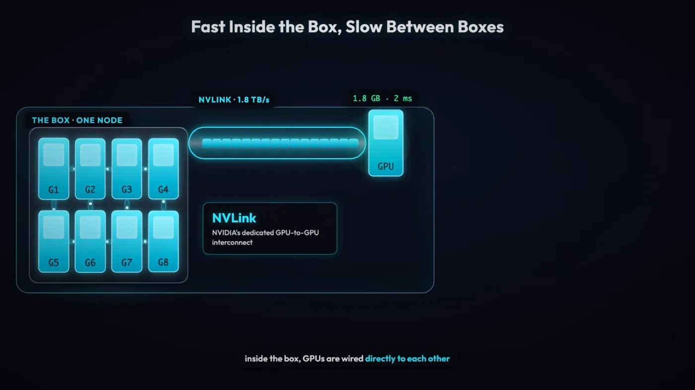
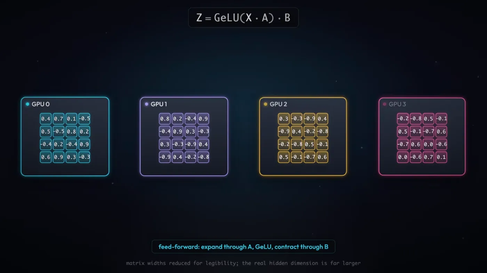
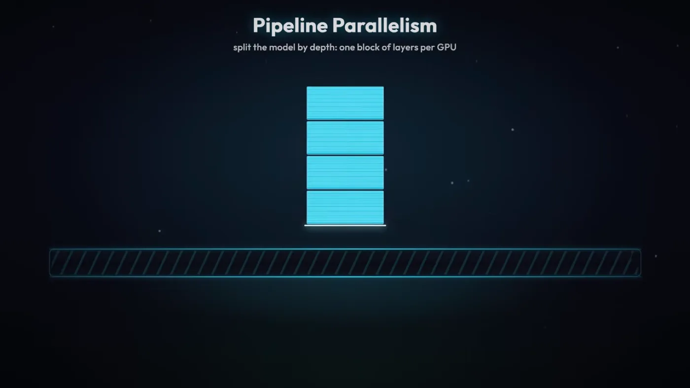
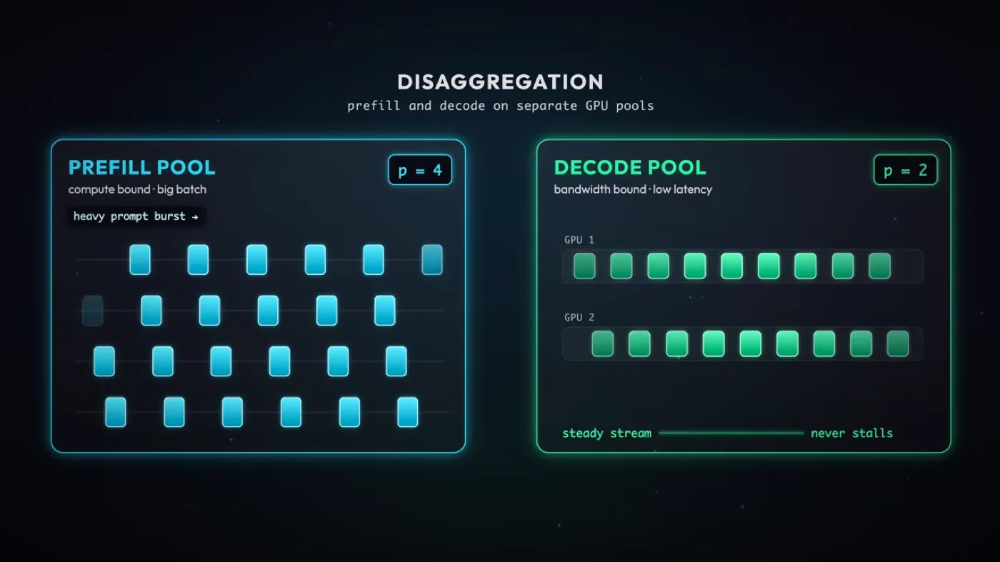
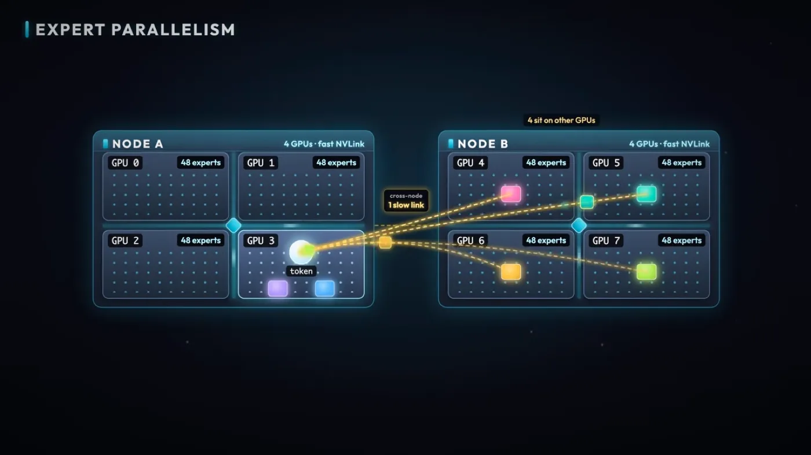

최적화 1편과 2편은 GPU 한 장 안에서 벌어지는 최적화였습니다. 배칭으로 유휴 시간을 줄이고, 추측 디코딩으로 가중치 읽기를 아꼈습니다. 그런데 모델이 커지면 그 전제가 깨집니다. 가중치가 GPU 한 장의 메모리를 넘겨버리면, 모델을 여러 장에 나눠 담는 것 말고는 방법이 없습니다.

나누는 순간 새 병목이 생깁니다. 한 장에서 끝나던 계산이 여러 장에 걸쳐 이어지니, GPU와 GPU 사이에서 값을 주고받아야 하고 그 통신이 계산을 기다리게 만듭니다. 통신이 어떤 패턴으로 일어나는지부터 시작해, 모델을 가중치·레이어·전문가·요청 단계로 나누는 네 가지 축과 각 축이 치르는 통신 비용까지 짚어보겠습니다.

---

<nav id="manual-toc" class="manual-toc" aria-label="목차">

### 목차

**[1부. GPU 간 통신 - 무엇을 얼마나 자주 보내는가](#section-1)**

- [1.1 병목이 생기는 이유 - GPU 한 장에 안 들어간다](#s1-1)
- [1.2 집합 통신 다섯 패턴 - 무엇을 보내는가](#s1-2)
- [1.3 NVLink와 Infiniband - 얼마나 빠르게 보내는가](#s1-3)

**[2부. 모델을 나누는 두 축 - Tensor Parallel과 Pipeline Parallel](#section-2)**

- [2.1 Tensor Parallel - 가중치를 쪼개 나눠 담기](#s2-1)
- [2.2 레이어당 all-reduce 2번 - Attention과 Feed-forward](#s2-2)
- [2.3 NVLink 안에 머물러야 하는 이유 - 900 대 50GB/s](#s2-3)
- [2.4 Pipeline Parallel - 레이어 단위로 쪼개기](#s2-4)
- [2.5 파이프라인 버블과 마이크로배치](#s2-5)
- [2.6 TP 대 PP - 쪼개는 기준의 차이](#s2-6)

**[3부. 요청과 전문가로 나누기 - Prefill-Decode 분리와 MoE](#section-3)**

- [3.1 Prefill과 Decode를 다른 GPU에 - 왜 나누면 이득인가](#s3-1)
- [3.2 MoE - 라우터가 전문가에게 토큰을 보내는 구조](#s3-2)
- [3.3 all-to-all이 병목이다 - MoE 통신과 DeepEP](#s3-3)
- [3.4 병렬화 축 정리 - Ring Attention은 어디에 속하나](#s3-4)

**[전체 흐름 정리](#section-4)** · **[막혔던 곳](#section-5)** · **[출처](#section-6)**

</nav>

---

## 1부. GPU 간 통신 - 무엇을 얼마나 자주 보내는가

<a id="s1-1"></a>

### 1.1 병목이 생기는 이유 - GPU 한 장에 안 들어간다

DeepSeek-V4-Pro는 1.6조 파라미터입니다. FP8로 저장하면 파라미터 하나에 1바이트니 가중치만 약 1.6TB입니다. 고급형 B200 한 장의 메모리는 192GB입니다.

```
1.6TB (가중치) ÷ 192GB (B200 한 장) ≈ 8.3
```

가중치를 담을 자리조차 한 장으로는 8배 넘게 모자랍니다. KV Cache나 활성화 값을 얹을 여유는 아예 계산에 넣지도 않은 숫자입니다. 그러니 모델을 여러 장의 GPU에 나눠 담는 수밖에 없습니다.

나누면 새 문제가 생깁니다. 한 장에서 끝나던 계산이 여러 장에 걸쳐 이어지니, 어느 시점엔가 GPU와 GPU 사이에서 값을 주고받아야 합니다. 이 주고받는 일이 **GPU 간 통신**이고, 여기서 병목이 생깁니다. 계산 자체는 각 GPU가 병렬로 빠르게 처리해도, 그 결과를 서로 넘기는 동안 GPU는 손을 놓고 기다립니다.

핵심 질문은 하나로 좁혀집니다. **무엇을, 얼마나 자주 전송하는가.** 뒤에 나올 병렬화 기법들은 전부 이 질문에 서로 다르게 답하는 방식입니다. 이번 부에서는 그 답을 만드는 두 가지 재료 — 통신이 취하는 **패턴**과, 그 패턴이 실려 가는 **하드웨어 경로** — 를 먼저 정리합니다.

<a id="s1-2"></a>

### 1.2 집합 통신 다섯 패턴 - 무엇을 보내는가

GPU 여러 장이 값을 주고받는 정형화된 방식을 **집합 통신(collective communication)**이라 부릅니다. 다섯 가지 패턴이 반복해서 등장합니다.

**all-reduce** - 모든 GPU가 부분 결과를 내놓고, 합산된 전체 결과를 모든 GPU가 받습니다.

```
GPU0 [a]   GPU1 [b]   GPU2 [c]   GPU3 [d]
   └──────────┴──────────┴──────────┘
              합산: a+b+c+d
   ┌──────────┬──────────┬──────────┐
GPU0 [S]   GPU1 [S]   GPU2 [S]   GPU3 [S]     ← 전부 같은 값 S = a+b+c+d
```

**all-gather** - 합산하지 않고, 모든 GPU가 가진 값을 모든 GPU가 나눠 갖습니다.

```
GPU0 [a]   GPU1 [b]   GPU2 [c]   GPU3 [d]
   └──────────┴──────────┴──────────┘
              모으기 (합산 없음)
   ┌──────────┬──────────┬──────────┐
GPU0 [a,b,c,d]  GPU1 [a,b,c,d]  GPU2 [a,b,c,d]  GPU3 [a,b,c,d]   ← 전부 네 값 다 가짐
```

**reduce-scatter** - 모아서 합산하되, 각 GPU는 합산 결과 중 자기 몫만 갖습니다.

```
GPU0 [a0,a1,a2,a3]   GPU1 [b0,b1,b2,b3]   GPU2 [c0,c1,c2,c3]   GPU3 [d0,d1,d2,d3]
        └──────────────────┴──────────────────┴──────────────────┘
                    조각별 합산: (a0+b0+c0+d0), (a1+b1+c1+d1), ...
   GPU0 [a0+b0+c0+d0]   GPU1 [a1+b1+c1+d1]   GPU2 [a2+b2+c2+d2]   GPU3 [a3+b3+c3+d3]
        ← 각 GPU는 합산 결과 중 한 조각만
```

**all-to-all** - 모든 GPU가 서로 다른 chunk를 서로 다른 모든 GPU로 보냅니다. 다섯 패턴 중 **가장 부하가 큰 패턴**입니다.

```
GPU0 [a0|a1|a2|a3]   GPU1 [b0|b1|b2|b3]   GPU2 [c0|c1|c2|c3]   GPU3 [d0|d1|d2|d3]

   GPU0 → a1을 GPU1에, a2를 GPU2에, a3를 GPU3에   (자기 몫 a0만 남기고 나머지는 흩어 보냄)
   GPU1 → b0을 GPU0에, b2를 GPU2에, b3를 GPU3에
   GPU2, GPU3도 동일하게 흩어 보냄

GPU0 [a0,b0,c0,d0]   GPU1 [a1,b1,c1,d1]   GPU2 [a2,b2,c2,d2]   GPU3 [a3,b3,c3,d3]
        ← 각 GPU가 자신의 조각을 4곳 모두로부터 받음 (송수신이 GPU 수만큼 겹쳐서 발생)
```

**point-to-point** - 한 GPU에서 다른 GPU로 데이터를 전송합니다. 나머지 넷과 달리 전체 GPU가 동시에 관여하지 않는, 가장 단순한 형태입니다.

```
GPU0 [a] ────────────▶ GPU1
                          받은 a로 다음 계산 수행
```

다섯 패턴이 담는 값의 성격이 다릅니다. all-reduce와 reduce-scatter는 **합산**이 들어가고, all-gather와 all-to-all은 **모으거나 흩는 것**뿐입니다. 그리고 all-to-all은 GPU 수가 N이면 오가는 통신 쌍이 N² 규모로 늘어나 부담이 가장 큽니다. 어느 패턴을 얼마나 자주 쓰게 되는지는, 그 통신이 **하드웨어의 어느 위치에서 실행되는지**에 달렸습니다.

<a id="s1-3"></a>

### 1.3 NVLink와 Infiniband - 얼마나 빠르게 보내는가

인터커넥트라는 용어 자체는 최적화 2편 3.3절에서 이미 정의했습니다. 같은 서버(노드) 안의 GPU는 전용 통로로, 서버를 넘어가면 다른 통로로 연결된다는 그 구도가 여기서도 그대로입니다. 다만 이번엔 실제 숫자로 채워보겠습니다.

일반적인 NVIDIA GPU 서버는 **한 노드에 GPU 8개**를 담습니다.

- **노드 안** - GPU끼리 **NVLink**라는 고속 인터커넥트로 연결됩니다.
  - H100 - **900GB/s**
  - B200 - **1,800GB/s**
- **노드 밖** - GPU끼리 **Infiniband**로 연결됩니다. **약 50GB/s**로, NVLink보다 훨씬 느립니다.

```
노드 A (GPU 8장)                         노드 B (GPU 8장)
┌─────────────────────────┐             ┌─────────────────────────┐
│ GPU0 ═══ GPU1 ═══ GPU2   │             │ GPU0 ═══ GPU1 ═══ GPU2   │
│  ║        ║        ║     │  Infiniband │  ║        ║        ║     │
│ GPU3 ═══ GPU4 ═══ GPU5   │ ~50GB/s     │ GPU3 ═══ GPU4 ═══ GPU5   │
│  ║        ║        ║     │◀──────────▶│  ║        ║        ║     │
│ GPU6 ═══ GPU7            │             │ GPU6 ═══ GPU7            │
└─────────────────────────┘             └─────────────────────────┘
    ═══ NVLink (H100 900GB/s, B200 1,800GB/s)
```

노드 안(NVLink)과 노드 밖(Infiniband)의 속도 차이가 18배에서 36배에 이릅니다. **여기서 병목이 발생합니다.**

<figure>
  
  <figcaption>노드 안 <strong>NVLink</strong>와 노드 밖 <strong>Infiniband</strong>의 속도 격차가 한눈에 드러납니다. 뒤에 나올 병렬화 기법들이 어느 통신을 어디에 둘지 정하는 기준이 이 격차 하나입니다. (출처: PY, <a href="https://www.youtube.com/watch?v=Kjq2vCIH3S8&t=225s">The Engineering Behind LLM Inference 03:45</a>)</figcaption>
</figure>

**왜 중요한가** - 통신량이 많은 패턴(all-reduce, all-to-all)을 노드 밖으로 내보내면 그 느린 구간이 그대로 전체 처리 시간에 얹힙니다. 그래서 통신이 잦은 병렬화는 되도록 노드 안에서, NVLink로 끝내려 합니다. 2부에서 볼 Tensor Parallel이 레이어마다 all-reduce를 두 번씩 요구해 NVLink 사용을 권장받는 이유도, 3부에서 볼 MoE의 all-to-all이 계산보다 통신에서 병목이 생기는 이유도 전부 이 숫자 차이 하나에서 갈라져 나옵니다.

---

## 2부. 모델을 나누는 두 축 - Tensor Parallel과 Pipeline Parallel

<a id="s2-1"></a>

### 2.1 Tensor Parallel - 가중치를 쪼개 나눠 담기

모델을 여러 GPU에 나누는 첫 번째 방법은 **가중치 자체를 쪼개는 것**입니다. NVIDIA의 Megatron-LM이 이 방식을 Tensor Parallel(TP)이라는 이름으로 정의했습니다.

한 레이어의 가중치 행렬 하나를 통째로 어느 GPU에 올리는 대신, **행렬을 열이나 행 단위로 잘라 GPU마다 한 조각씩** 나눠 담습니다. 입력은 모든 GPU에 동일하게 들어가지만, 각 GPU는 자기가 가진 조각으로만 계산하기 때문에 결과도 전체가 아니라 **부분 결과**입니다.

```
입력 X (모든 GPU에 동일하게 들어감)
  ↓                ↓                ↓                ↓
GPU0 가중치 조각   GPU1 가중치 조각   GPU2 가중치 조각   GPU3 가중치 조각
  ↓                ↓                ↓                ↓
부분 결과0         부분 결과1         부분 결과2         부분 결과3
```

이 부분 결과들은 그 자체로는 쓸모가 없습니다. 원래 하나였던 가중치 행렬을 잘라놓은 것이라, 조각 하나의 출력은 전체 계산 중 자기 몫만 반영합니다. **네 조각을 전부 합쳐야 원래 가중치로 계산했을 때와 같은 값**이 나옵니다.

<aside class="callout">
<p class="eyebrow">(용어) Tensor Parallel과 Pipeline Parallel</p>

- **Tensor Parallel(TP)** - 한 레이어의 가중치 행렬을 여러 GPU에 쪼개 담고, 부분 결과를 통신으로 합쳐 하나의 최종 값을 만드는 방식
- **Pipeline Parallel(PP)** - 모델 전체를 레이어 단위로 쪼개, GPU마다 서로 다른 레이어(들)를 맡기는 방식

둘 다 "모델을 나눈다"는 목적은 같지만, 나누는 축이 다릅니다. TP는 레이어 **안**을 자르고, PP는 레이어 **사이**를 자릅니다.

</aside>

<figure>
  
  <figcaption>Tensor Parallel의 출발점입니다. 같은 입력이 GPU 전부에 들어가지만, 각 GPU는 <strong>자기 몫의 가중치 조각</strong>으로만 계산해 부분 결과를 냅니다. 이 조각들을 합쳐야 원래 값이 됩니다. (출처: PY, <a href="https://www.youtube.com/watch?v=Kjq2vCIH3S8&t=294s">The Engineering Behind LLM Inference 04:54</a>)</figcaption>
</figure>

<a id="s2-2"></a>

### 2.2 레이어당 all-reduce 2번 - Attention과 Feed-forward

부분 결과를 합치는 통신 패턴이 1부에서 본 **all-reduce**입니다. 모든 GPU가 자기 부분 결과를 내놓고, 모든 GPU가 합산된 전체 결과를 돌려받습니다.

```
부분 결과0   부분 결과1   부분 결과2   부분 결과3
     └───────────┴───────────┴───────────┘
                     ↓ all-reduce (합산)
              전체 결과 (모든 GPU가 동일하게 보유)
```

한 트랜스포머 레이어는 Attention 블록과 Feed-forward 블록, 두 서브레이어로 이뤄져 있습니다. 가중치를 조각냈으니 **둘 다 자기 몫만 계산하고 끝에서 합쳐야** 합니다. 그래서 **레이어 하나를 통과하는 데 all-reduce가 2번** 필요합니다.

```
레이어 입력
  ↓ Attention 블록 - GPU마다 가중치 조각으로 부분 결과 계산
  ↓ all-reduce ①                                    ← 여기서 통신 발생
  Attention 출력 (전체 GPU가 동일하게 보유)
  ↓ Feed-forward 블록 - GPU마다 가중치 조각으로 부분 결과 계산
  ↓ all-reduce ②                                    ← 여기서 통신 발생
  레이어 출력
```

여기서 중요한 제약이 하나 붙습니다. **다음 레이어는 이번 레이어의 all-reduce ②가 끝나야 시작할 수 있습니다.** Feed-forward의 부분 결과가 아직 합쳐지지 않은 상태로는 다음 레이어에 넣을 온전한 입력이 존재하지 않기 때문입니다. GPU 네 장이 각자 계산을 아무리 빨리 끝내도, all-reduce가 끝나기 전에는 그다음으로 넘어갈 수 없습니다.

**왜 중요한가** - TP는 계산을 나눈 대신 **통신을 계산 경로 한가운데 끼워 넣습니다.** 레이어 수가 많을수록 이 대기가 그만큼 누적되고, all-reduce 한 번이 느려지면 그 지연이 모델 전체에 그대로 곱해집니다.

<a id="s2-3"></a>

### 2.3 NVLink 안에 머물러야 하는 이유 - 900 대 50GB/s

1부에서 본 인터커넥트 숫자를 다시 가져와 보겠습니다. 노드 안 GPU끼리는 NVLink로 연결되고(H100 900GB/s, B200 1,800GB/s), 노드를 넘어가면 인피니밴드를 쓰며 50GB/s 수준으로 떨어집니다.

TP의 all-reduce는 **레이어마다 2번씩** 발생하는 통신입니다. GPT급 모델이 레이어를 수십 개 쌓고 있으니, 추론 한 번에 걸리는 all-reduce 횟수는 수십에서 수백 번입니다. 통신 한 번이 느리면 그 지연이 이 횟수만큼 곱해집니다.

```
노드 안 (NVLink)     대역폭 900~1,800GB/s   → all-reduce 지연 작음 → 누적돼도 감당 가능
노드 밖 (Infiniband)  대역폭 50GB/s          → all-reduce 지연 큼   → 레이어 수만큼 누적, 감당 어려움
```

**Megatron 팀이 TP를 한 노드 안에서만 쓰라고 권장한 이유가 여기 있습니다.** 통신 빈도 자체를 줄일 방법이 마땅치 않은 구조라, 대신 통신이 지나가는 통로를 가장 빠른 것으로 고정해버린 것입니다. 노드 안 GPU가 보통 8개인 이유도 이와 맞물립니다. TP로 쪼갤 수 있는 GPU 수가 사실상 한 노드에 꽂힌 개수로 제한됩니다.

<a id="s2-4"></a>

### 2.4 Pipeline Parallel - 레이어 단위로 쪼개기

TP가 레이어 **안**의 가중치를 잘랐다면, Pipeline Parallel(PP)은 레이어 **자체**를 나눕니다. 모델이 레이어 32개짜리면 GPU 4장에 8개씩 묶어서 맡기는 식입니다.

```
GPU0  레이어 1~8         GPU1  레이어 9~16         GPU2  레이어 17~24        GPU3  레이어 25~32
```

한 GPU가 자기 몫의 레이어들을 전부 계산하고 나면, 그 결과를 **다음 레이어를 담당하는 GPU로 그대로 넘깁니다.** 넘겨받은 GPU는 자기 몫을 계산하고 또 다음 GPU로 넘기는 식으로, 데이터가 GPU들을 순서대로 거쳐 갑니다.

TP와 비교하면 통신 성격이 다릅니다.

- **통신 횟수가 적다** - TP는 레이어마다 2번씩 통신하지만, PP는 GPU 경계를 넘어갈 때만 통신합니다. 한 GPU가 레이어 8개를 갖고 있으면 그 8개 사이에는 통신이 전혀 없습니다.
- **통신 패턴이 다르다** - all-reduce처럼 모든 GPU가 값을 주고받는 게 아니라, 이번 결과를 담당한 GPU에서 다음 담당 GPU로만 보내는 **point-to-point**입니다.

전송을 감추기도 TP보다 쉽습니다. **이전 단계의 결과를 다음 GPU로 보내고, 보낸 GPU는 곧바로 그다음 마이크로배치의 같은 구간을 계산하면 됩니다.** 결과를 받는 쪽이 그걸로 뭘 하든, 보내는 쪽은 자기 할 일을 계속할 수 있다는 뜻입니다. TP처럼 "합쳐진 값이 와야만 다음 계산을 시작"하는 구조가 아니라서, 전송 시간이 계산 시간 뒤로 숨습니다. 최적화 2편 3부에서 본 Ring Attention의 "전송을 계산 뒤에 숨기기"와 같은 발상인데, 거기서는 KV 블록을 돌렸고 여기서는 레이어 출력을 돌린다는 점이 다릅니다.

<figure>
  
  <figcaption>Pipeline Parallel의 구조입니다. 각 GPU는 <strong>자기 몫의 레이어</strong>만 들고 있고, 계산이 끝난 결과를 다음 레이어를 가진 GPU로 그대로 넘깁니다. (출처: PY, <a href="https://www.youtube.com/watch?v=Kjq2vCIH3S8&t=383s">The Engineering Behind LLM Inference 06:23</a>)</figcaption>
</figure>

<a id="s2-5"></a>

### 2.5 파이프라인 버블과 마이크로배치

전송은 잘 숨겨져도, PP에는 TP에 없는 문제가 하나 있습니다. **파이프라인 버블(pipeline bubble)** 입니다.

GPU 4장이 레이어를 나눠 가진 상태에서 배치 하나를 통째로 흘려보내면 이렇게 됩니다.

```
GPU0(레이어 1~8)    [ 계산 ]
GPU1(레이어 9~16)           [ 대기 ][ 계산 ]
GPU2(레이어 17~24)                  [ 대기 ][ 계산 ]
GPU3(레이어 25~32)                          [ 대기 ][ 계산 ]
                                                    ↑ 여기서야 배치 전체 결과 완성
```

GPU1은 GPU0의 결과가 도착할 때까지 아무 일도 못 하고 기다립니다. GPU2와 GPU3도 마찬가지입니다. 그리고 GPU0은 계산을 제일 먼저 끝내지만, 배치 전체가 GPU3까지 다 흘러갈 때까지는 다음 할 일이 없어 그대로 놀고 있습니다. **GPU 4장 중 실제로 계산하고 있는 건 어느 순간에도 한 장뿐입니다.** GPU를 늘린 만큼 속도가 안 나는 이유가 이 유휴시간입니다.

**해결책이 마이크로배치(micro batch)입니다.** 배치를 통째로 넣는 대신 잘게 쪼개서, 앞 조각이 GPU1로 넘어가는 동안 GPU0이 곧바로 다음 조각을 계산하게 만듭니다. 배치를 4개의 마이크로배치(m1~m4)로 쪼갠 경우를 보겠습니다.

```
GPU0(레이어 1~8)    [m1][m2][m3][m4]
GPU1(레이어 9~16)        [m1][m2][m3][m4]
GPU2(레이어 17~24)           [m1][m2][m3][m4]
GPU3(레이어 25~32)               [m1][m2][m3][m4]
```

앞서의 그림과 비교하면 **GPU가 노는 구간이 시작과 끝의 계단 모양(warm-up과 cool-down)에만 남고, 가운데는 4장이 동시에 서로 다른 마이크로배치를 계산**합니다. 통째로 흘렸을 때는 매 순간 GPU 한 장만 일하던 것이, 마이크로배치로 쪼갠 뒤에는 대부분의 구간에서 네 장이 동시에 일합니다.

```
현재 상태   배치를 통째로 흘려보냄       → 어느 순간에도 GPU 1장만 계산 중, 유휴시간이 큼
목표 상태   배치를 마이크로배치로 쪼갬   → 대부분의 구간에서 GPU 전부가 동시에 계산 중
```

- **무엇을 하는가** - 큰 배치를 여러 개의 작은 마이크로배치로 나눠 파이프라인에 순차로 흘려보낸다
- **왜 되는가** - 각 GPU가 한 마이크로배치를 다음 GPU로 넘기자마자 자기 몫의 다음 마이크로배치를 계산할 수 있어, 앞 GPU가 결과를 넘긴 뒤 놀 필요가 없어진다

**왜 중요한가** - 버블은 GPU 장수를 늘릴수록 상대적으로 커지는 구조적 비용입니다. GPU가 4장이면 계단 구간이 파이프라인 전체 길이의 일부지만, GPU가 늘어날수록 계단도 길어집니다. 마이크로배치 개수를 GPU 수보다 충분히 크게 잡아야 이 비용이 무시할 만한 수준으로 줄어듭니다.

<a id="s2-6"></a>

### 2.6 TP 대 PP - 쪼개는 기준의 차이

두 방식을 나란히 놓으면 이렇습니다.

| | Tensor Parallel | Pipeline Parallel |
|---|---|---|
| 쪼개는 단위 | 레이어 **안**의 가중치 | 레이어 **자체** |
| 통신 패턴 | all-reduce (전원 참여) | point-to-point (다음 GPU로만) |
| 통신 빈도 | 레이어마다 2번 | GPU 경계를 넘을 때만 |
| 유휴시간 | 없음 (전원이 매 레이어에 참여) | 구조적으로 존재 (버블), 마이크로배치로 완화 |
| 배치 위치 | 한 노드 안(NVLink) | 노드 안팎 모두 가능 |

TP는 모든 GPU가 **매 레이어의 계산에 참여**하기 때문에 어느 GPU도 구조적으로 놀지 않습니다. 대신 all-reduce가 끝날 때까지 전원이 동시에 멈춰서 기다리는 대가를 치릅니다. PP는 그 반대입니다. GPU마다 자기 담당 레이어만 계산하니 통신 자체는 훨씬 드물지만, 담당 구간이 다른 GPU들 사이에 시차가 생겨 버블이라는 유휴시간이 구조적으로 남습니다.

이 차이가 배치 위치로 이어집니다. TP는 통신이 잦고 무거워서 가장 빠른 통로(NVLink) 안에 갇혀야 하고, PP는 통신이 드물어서 노드 경계를 넘어도 버틸 여지가 있습니다. 실제로는 두 축을 동시에 씁니다. 한 노드 안의 GPU들은 TP로 묶고, 노드와 노드 사이는 PP로 이어서, 각 통신 패턴을 그것이 버틸 수 있는 인터커넥트에 맞춰 배치하는 방식입니다.

---

## 3부. 요청과 전문가로 나누기 - Prefill-Decode 분리와 MoE

<a id="s3-1"></a>

### 3.1 Prefill과 Decode를 다른 GPU에 - 왜 나누면 이득인가

최적화 1편 1.2절에서 본 대로 prefill과 decode는 연산 특성이 다릅니다. prefill은 compute-bound, decode는 memory bandwidth-bound입니다. 지금까지 본 TP·PP는 이 둘을 같은 GPU 집합 위에서 함께 돌리는 걸 전제로 했습니다.

**Prefill-Decode Disaggregation은 이 둘을 아예 서로 다른 GPU(집단)로 분리합니다.** 어떤 GPU 무리는 prefill만 맡고, 다른 GPU 무리는 decode만 맡습니다.

```
분리 전 - 같은 GPU 무리가 prefill도, decode도 처리
GPU 무리 A   [ 요청1 prefill ] [ 요청1 decode ] [ 요청2 prefill ] [ 요청2 decode ] ...
             compute-bound 구간과 memory bandwidth-bound 구간이 번갈아 끼어든다

분리 후 - 단계별로 GPU 무리를 나눔
Prefill GPU 무리   [ 요청1 prefill ][ 요청2 prefill ][ 요청3 prefill ] ...
Decode GPU 무리                    [ 요청1 decode ][ 요청2 decode ][ 요청3 decode ] ...
```

같은 GPU 무리가 두 단계를 번갈아 처리하면, 그 무리에 건 병렬화 방식과 배치 크기는 둘 중 어느 쪽에도 완전히 맞지 않는 절충값이 됩니다. **단계를 분리하면 각 단계에 맞는 병렬화와 배칭을 따로 걸 수 있습니다.** prefill 쪽 GPU 무리는 compute-bound 특성에 맞춰 구성하고, decode 쪽 GPU 무리는 memory bandwidth-bound 특성에 맞춰 요청을 최대한 많이 묶는 배칭에 집중할 수 있습니다. 두 무리의 대수 비율도 각 단계의 부하에 맞춰 따로 조절할 수 있습니다.

<figure>
  
  <figcaption>Prefill 전담 GPU 무리와 Decode 전담 GPU 무리가 나뉘어 있습니다. 각 무리가 자기 단계의 연산 특성에 맞는 병렬화·배칭을 독립적으로 가져갑니다. (출처: PY, <a href="https://www.youtube.com/watch?v=Kjq2vCIH3S8&t=558s">The Engineering Behind LLM Inference 09:18</a>)</figcaption>
</figure>

<a id="s3-2"></a>

### 3.2 MoE - 라우터가 전문가에게 토큰을 보내는 구조

<aside class="callout">
<p class="eyebrow">(용어) MoE(Mixture of Experts)</p>

모델 전체가 하나의 큰 Feed-forward 레이어를 쓰는 대신, 여러 개의 작은 Feed-forward 레이어("전문가")를 두고 토큰마다 그중 일부에게만 보내는 구조입니다. 토큰 하나가 전체 전문가를 다 거치지 않고 일부만 거치기 때문에, 파라미터 총량은 크지만 토큰 하나를 처리하는 데 드는 실제 연산량은 그보다 작습니다.

</aside>

대표적인 모델이 DeepSeek-V4입니다. MoE 구조에서는 **라우터(router)가 요청, 즉 토큰마다 그 토큰을 처리할 적절한 전문가로 라우팅**합니다.

전문가들은 GPU 여러 장에 흩어져 있을 수 있습니다. **같은 GPU에 있는 전문가로 보낼 수도, 다른 GPU에 있는 전문가로 보낼 수도 있습니다.** 어느 전문가가 어느 GPU에 있는지는 라우터의 판단과 무관하게 배치 단계에서 미리 정해져 있고, 라우터는 토큰을 그 전문가가 있는 곳으로 보내는 역할만 합니다.

<figure>
  
  <figcaption>전문가들이 GPU 여러 장에 나뉘어 있고, 라우터가 정한 목적지에 따라 <strong>토큰이 자기 GPU를 벗어나 다른 GPU의 전문가</strong>에게로 건너갑니다. 이 왕복이 all-to-all 통신입니다. (출처: PY, <a href="https://www.youtube.com/watch?v=Kjq2vCIH3S8&t=608s">The Engineering Behind LLM Inference 10:08</a>)</figcaption>
</figure>

<a id="s3-3"></a>

### 3.3 all-to-all이 병목이다 - MoE 통신과 DeepEP

토큰을 각 전문가에게 보내고, 전문가가 처리한 결과를 다시 원래 토큰 자리로 모으는 이 왕복이 1부에서 정의한 all-to-all입니다. 모든 GPU가 서로 다른 조각을 서로 다른 모든 GPU로 보내는, 통신 패턴 중 가장 부하가 큰 그 패턴입니다.

```
토큰들이 라우터를 거쳐 흩어졌다가(dispatch) 다시 모이는(combine) 흐름

GPU0 토큰 [t1 t2 t3 t4]
GPU1 토큰 [t5 t6 t7 t8]
              │ 라우터가 각 토큰의 목적지 전문가를 결정
              ▼
        ┌── all-to-all (dispatch) ──┐
        │  t1,t7 → GPU0의 전문가 A   │
        │  t3,t5 → GPU1의 전문가 B   │
        │  t2,t8 → GPU2의 전문가 C   │
        │  t4,t6 → GPU3의 전문가 D   │
        └────────────────────────────┘
              │ 각 GPU가 자기 몫의 전문가 연산 수행
              ▼
        ┌── all-to-all (combine) ───┐
        │  전문가 연산 결과를        │
        │  원래 토큰이 있던 GPU로     │
        │  되돌려 보냄               │
        └────────────────────────────┘
              ▼
GPU0 결과 [t1 t2 t3 t4]   GPU1 결과 [t5 t6 t7 t8]   (원래 자리로 복원)
```

**MoE의 병목은 전문가 자체의 연산이 아니라 이 all-to-all 통신에 걸리는 시간입니다.** 전문가 하나가 처리하는 토큰 수는 애초에 적게 설계돼 있어 연산 자체는 가볍습니다. 반면 dispatch와 combine 두 번의 all-to-all은 토큰마다 목적지가 다 달라서 GPU 사이를 오가는 데이터가 많고, 그 왕복이 매 레이어마다 반복됩니다. 전문가 배치가 GPU 여러 장, 심지어 여러 노드에 걸쳐 있으면 이 통신은 인터커넥트 대역폭에 그대로 발목이 잡힙니다.

이 통신 구간을 줄이기 위해 DeepSeek이 발표한 통신 라이브러리가 **DeepEP**입니다. MoE의 dispatch·combine all-to-all에 맞춰 통신 경로와 겹침(overlap)을 최적화한 방식으로, 병목이 전문가 연산이 아니라 통신이라는 진단에서 나온 대응입니다.

<a id="s3-4"></a>

### 3.4 병렬화 축 정리 - Ring Attention은 어디에 속하나

여기까지 나온 병렬화는 각기 다른 축을 자릅니다.

| 축 | 나누는 대상 | 오가는 통신 |
|---|---|---|
| Tensor Parallel | 한 레이어의 가중치 행렬 | all-reduce |
| Pipeline Parallel | 레이어(계층) | point-to-point |
| Prefill-Decode 분리 | 요청 처리 단계 | GPU 무리 간 요청 라우팅 |
| MoE | 전문가(파라미터) | all-to-all |

긴 컨텍스트로 KV Cache가 GPU 한 장을 넘칠 때 시퀀스 축을 자르는 문제는 최적화 2편 3부에서 본 Ring Attention이 담당합니다. 위 표의 네 축이 "모델을 어떻게 나눠 담을까"와 "요청을 어떻게 단계·전문가별로 흘려보낼까"를 다룬다면, Ring Attention은 그와 별개로 "시퀀스 하나의 KV를 어떻게 나눠 담을까"를 다루는 축입니다.

---

## 전체 흐름 정리

```
모델이 GPU 한 장을 넘칠 때 → 여러 장에 나눔 → 통신이 새 병목이 된다

통신 패턴 (무엇을 얼마나 자주 보내는가)
    all-reduce · all-gather · reduce-scatter · all-to-all · point-to-point
    노드 안 NVLink 900~1,800GB/s   vs   노드 밖 Infiniband ~50GB/s  ← 병목

모델·요청을 나누는 네 축
    Tensor Parallel     레이어 안 가중치를 쪼갬   통신 all-reduce (레이어당 2번) → NVLink 안에 가둠
    Pipeline Parallel   레이어 자체를 쪼갬        통신 point-to-point (드묾)     → 노드 넘어도 OK, 버블은 마이크로배치로
    MoE                 전문가(파라미터)를 쪼갬    통신 all-to-all (가장 무거움)   → 병목, DeepEP로 대응
    Prefill-Decode 분리 요청 처리 단계를 쪼갬      단계별로 GPU 무리를 나눔

    시퀀스 축(KV) = 최적화 2편 3부 Ring Attention

실제 배치: 노드 안은 TP(잦은 통신 → NVLink), 노드 사이는 PP(드문 통신)로 겹쳐 쓴다
```

한 줄로 줄이면 이렇습니다. **나누면 계산은 여러 장에 흩어지지만 통신이 새 병목이 되고, 각 병렬화 축은 자기 통신 패턴을 그것이 버틸 수 있는 인터커넥트에 맞춰 배치하는 것이 핵심입니다.**

무엇을 쪼개느냐가 어떤 통신을 부르고, 그 통신이 어느 인터커넥트를 타야 하는지가 세 부를 관통합니다. TP는 가중치를 쪼개 all-reduce를 부르고 그래서 NVLink에 갇히며, PP는 레이어를 쪼개 point-to-point만 쓰니 노드를 넘고, MoE는 전문가를 쪼개 가장 무거운 all-to-all을 부르니 그 통신 자체가 병목이 됩니다.

---

## 출처

- PY, [The Engineering Behind LLM Inference: Parallelism](https://www.youtube.com/watch?v=Kjq2vCIH3S8) - [01:20 모델이 GPU 한 장에 안 들어간다](https://www.youtube.com/watch?v=Kjq2vCIH3S8&t=80s), [02:43 무엇을 얼마나 자주 보내는가](https://www.youtube.com/watch?v=Kjq2vCIH3S8&t=163s), [02:50 all-reduce](https://www.youtube.com/watch?v=Kjq2vCIH3S8&t=170s), [03:02 all-gather](https://www.youtube.com/watch?v=Kjq2vCIH3S8&t=182s), [03:08 reduce-scatter](https://www.youtube.com/watch?v=Kjq2vCIH3S8&t=188s), [03:11 all-to-all](https://www.youtube.com/watch?v=Kjq2vCIH3S8&t=191s), [03:21 point-to-point](https://www.youtube.com/watch?v=Kjq2vCIH3S8&t=201s), [03:45 NVLink와 Infiniband, 노드당 GPU 8개](https://www.youtube.com/watch?v=Kjq2vCIH3S8&t=225s)
- PY, [같은 영상 - Tensor·Pipeline Parallel](https://www.youtube.com/watch?v=Kjq2vCIH3S8&t=294s) - [04:54 Megatron-LM Tensor Parallel, 가중치 분산](https://www.youtube.com/watch?v=Kjq2vCIH3S8&t=294s), [05:26 부분 결과를 all-reduce로 합침](https://www.youtube.com/watch?v=Kjq2vCIH3S8&t=326s), [05:44 레이어당 all-reduce 2번, 다음 레이어는 순서 대기](https://www.youtube.com/watch?v=Kjq2vCIH3S8&t=344s), [06:02 Megatron 팀의 NVLink 권장](https://www.youtube.com/watch?v=Kjq2vCIH3S8&t=362s), [06:23 Pipeline Parallel, 레이어 단위 분할](https://www.youtube.com/watch?v=Kjq2vCIH3S8&t=383s), [06:51 PP는 전송 횟수가 적음](https://www.youtube.com/watch?v=Kjq2vCIH3S8&t=411s), [07:02 PP의 전송 시간 hiding](https://www.youtube.com/watch?v=Kjq2vCIH3S8&t=422s), [07:34 pipeline bubble](https://www.youtube.com/watch?v=Kjq2vCIH3S8&t=454s), [07:40 micro batch](https://www.youtube.com/watch?v=Kjq2vCIH3S8&t=460s)
- PY, [같은 영상 - Prefill-Decode 분리·MoE·Ring Attention](https://www.youtube.com/watch?v=Kjq2vCIH3S8&t=558s) - [09:18 Prefill-Decode Disaggregation](https://www.youtube.com/watch?v=Kjq2vCIH3S8&t=558s), [09:46 MoE, DeepSeek-V4, 라우터](https://www.youtube.com/watch?v=Kjq2vCIH3S8&t=586s), [10:08 전문가는 여러 GPU에 분산](https://www.youtube.com/watch?v=Kjq2vCIH3S8&t=608s), [10:18 전문가들이 all-to-all 수행](https://www.youtube.com/watch?v=Kjq2vCIH3S8&t=618s), [10:53 all-to-all 통신이 병목](https://www.youtube.com/watch?v=Kjq2vCIH3S8&t=653s), [11:02 DeepEP](https://www.youtube.com/watch?v=Kjq2vCIH3S8&t=662s), [13:00 Ring Attention](https://www.youtube.com/watch?v=Kjq2vCIH3S8&t=780s)
