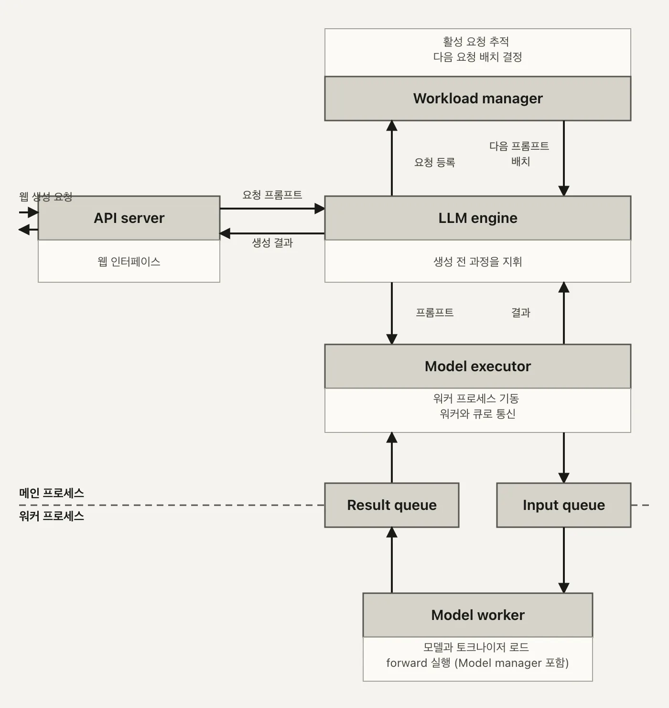
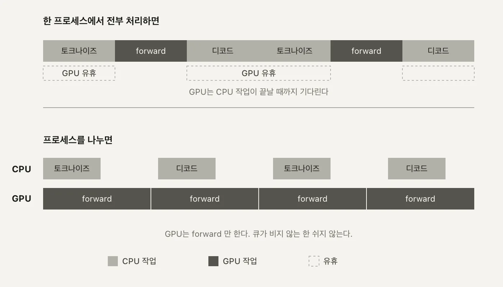
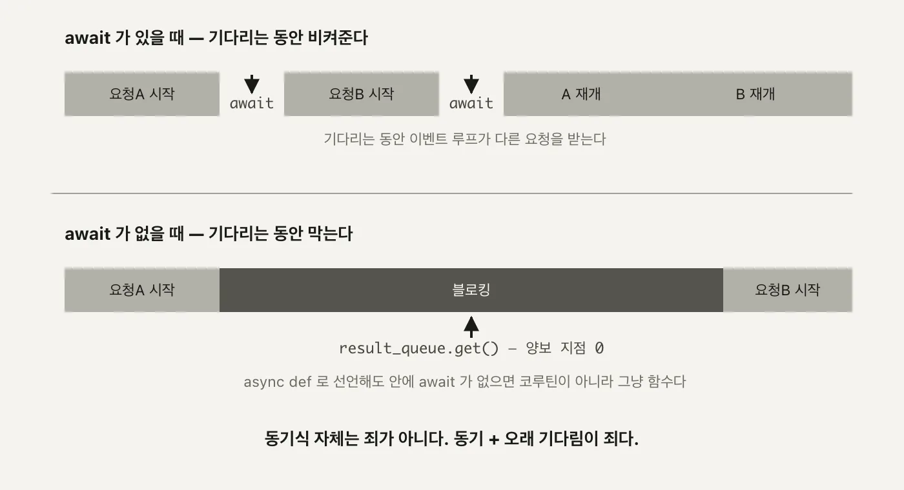

트랜스포머 시리즈에서는 토큰 하나가 벡터가 되고, 문맥을 참조해 다음 토큰의 확률이 되는 계산 자체를 따라갔습니다. 그 계산을 실제 요청-응답 서비스로 돌리는 건 다른 문제입니다. 요청은 한 번에 하나만 오지 않고, GPU 한 장은 비싸고, 모델 코드 한 줄이 죽어도 API 서버 전체가 죽으면 안 됩니다.

`facebook/opt-125m` 하나를 FastAPI로 서빙하는 실습 코드는 여섯 조각으로 갈라져 있습니다. 요청을 받는 **API server**, 그 요청을 조율하는 **LLM engine**, 큐와 배치를 관리하는 **Workload manager**, GPU 워커 프로세스를 기동하는 **Model executor**, 실제 추론을 맡는 별도 프로세스 **Model worker**, 그 안에서 모델과 토크나이저를 불러오는 **Model manager**.

---

<nav id="manual-toc" class="manual-toc" aria-label="목차">

### 목차

**[1부. 서빙은 generate() 호출이 아니다](#section-1)**

- [1.1 단일 모델 서빙의 설계 목표](#s1-1)
- [1.2 여섯 컴포넌트](#s1-2)
- [1.3 GPU 프로세스를 떼어내는 이유](#s1-3)

**[2부. 요청 하나가 지나가는 길](#section-2)**

- [2.1 서버가 뜨기 전에 모델을 올린다](#s2-1)
- [2.2 /basic_generate 의 전체 경로](#s2-2)
- [2.3 mp.Queue 두 개로만 통신한다](#s2-3)
- [2.4 프로세스 셋과 GPU 14.5GB](#s2-4)

**[3부. 코드를 읽다 걸린 것](#section-3)**

- [3.1 batch_data 라는 이름 - 단건도 크기 1의 배치](#s3-1)
- [3.2 async def 인데 서버가 멈춘다](#s3-2)
- [3.3 힌트와 다른 반환값, 부르는 곳 없는 종료 신호](#s3-3)

**[전체 흐름 정리](#section-4)** · **[막혔던 곳](#section-5)** · **[출처](#section-6)**

</nav>

---

## 1부. 서빙은 generate() 호출이 아니다

<a id="s1-1"></a>

### 1.1 단일 모델 서빙의 설계 목표

노트북에서 `model.generate("안녕하세요")`를 부르면 그 프로세스 하나가 끝날 때까지 아무도 신경 쓸 게 없습니다. 서비스로 바꾸는 순간 조건이 세 개 덧붙습니다.

- **요청은 동시에 여러 개 온다**
  - 스크립트는 한 번에 한 문장만 처리하면 끝나지만, 서비스는 여러 사용자의 요청이 겹쳐 들어오는 걸 전제로 짜야 합니다. 요청 A를 처리하는 도중에 요청 B가 도착하는 게 예외 상황이 아니라 기본값입니다.
- **GPU는 비싸고 대수가 적다**
  - CPU 코어처럼 손쉽게 늘릴 수 있는 자원이 아닙니다. 한 장으로 최대한 많은 요청을 감당해야 하니, GPU가 노는 시간은 그대로 손해입니다. 요청이 없어도 GPU 메모리에 모델은 계속 올라가 있어야 하고, 그 카드를 다른 모델과 나눠 쓰기도 쉽지 않습니다.
- **모델 프로세스가 죽어도 API는 죽으면 안 된다**
  - 추론 코드 한 줄이 예외를 던졌다고 서버 전체가 재시작되면, 그 요청과 무관한 다른 사용자의 연결까지 끊깁니다. 모델이 죽는 것과 서버가 죽는 것은 서로 다른 사건이어야 합니다.

**왜 중요한가** - 이 세 조건이 이후 모든 구조 선택의 근거입니다. 컴포넌트를 여섯 개로 쪼갠 것도, GPU 연산을 별도 프로세스로 뗀 것도, 프로세스 사이 통신을 큐 두 개로 좁힌 것도 전부 이 세 조건에서 역산됩니다. 반대로 이 세 조건이 없었다면 `main.py` 한 파일에 `model.generate()`를 그대로 박아 넣어도 충분했을 겁니다.

```
스크립트                          서비스
한 번에 한 요청                   여러 요청이 겹쳐 들어온다
프로세스가 끝나면 그만            프로세스는 계속 떠 있어야 한다
GPU는 그때만 쓰고 놓는다          GPU는 다음 요청을 위해 계속 쥐고 있어야 한다
죽으면 그 실행만 실패             죽으면 그 순간 떠 있던 모든 요청이 영향받는다
```

이 표의 오른쪽 칸을 코드로 옮긴 결과가 이 글에서 볼 여섯 컴포넌트입니다. "여러 요청이 겹친다"는 Workload manager의 큐로, "GPU를 계속 쥐고 있어야 한다"는 서버 기동 시점의 모델 로드로, "죽어도 전체가 안 죽어야 한다"는 프로세스 분리로 각각 대응됩니다.

<a id="s1-2"></a>

### 1.2 여섯 컴포넌트

실습 코드는 책임을 이렇게 나눠뒀습니다.

| 컴포넌트 | 역할 | 파일 | 줄 수 |
|---|---|---|---|
| API server | HTTP 요청·응답 처리 | `main.py` | 93 |
| LLM engine | Workload manager와 Model executor 조율 | `llm/llm.py` | 173 |
| Workload manager | 큐잉과 배치 결정 | `llm/workload_manager.py` | 89 |
| Model executor | 워커 프로세스 기동과 IPC | `llm/model_executor.py` | 71 |
| Model worker | 별도 프로세스에서 실제 추론 | `llm/model_worker.py` | 139 |
| Model manager | 모델·토크나이저 로드 | `llm/model_manager.py` | 15 |

각 파일이 실제로 하는 일은 이렇습니다.

- **API server(`main.py`)** - HTTP 요청을 받고 Pydantic으로 검증한 뒤, 결과를 응답 모델로 감싸 돌려주는 것 말고는 하지 않습니다. 판단은 전부 아래로 위임합니다.
- **LLM engine(`llm.py`)** - 이 시스템에서 제일 큰 파일(173줄)입니다. Workload manager에게 다음 배치를 물어보고, Model executor에게 그 배치를 실행시키고, 스트리밍 요청이면 별도 스레드로 토큰을 클라이언트별 큐에 넣어줍니다. 오케스트레이터입니다.
- **Workload manager(`workload_manager.py`)** - 들어온 요청을 `queue.Queue` 두 개(배치용, 스트리밍용)에 쌓아두고, `batch_size = 4`라는 상수만큼씩 꺼내 다음 배치를 결정합니다.
- **Model executor(`model_executor.py`)** - 71줄짜리 얇은 파일입니다. 하는 일은 워커 프로세스 하나를 띄우고, 큐 두 개로 그 프로세스와 이야기하는 것뿐입니다.
- **Model worker(`model_worker.py`)** - 실제로 토크나이즈, `model.generate()`, 디코드를 실행하는 별도 프로세스입니다. 139줄 중 대부분이 이 추론 로직입니다.
- **Model manager(`model_manager.py`)** - 15줄짜리, `AutoModelForCausalLM.from_pretrained`와 `AutoTokenizer.from_pretrained`를 부르는 게 전부입니다.

<figure>
  
  <figcaption>화면엔 박스가 다섯 개인데 표의 이름은 여섯 개입니다. <strong>Model manager가 독립된 박스가 아니라 Model worker 박스 안에</strong> 들어 있어서입니다. Model worker 프로세스가 뜰 때 그 내부에서 <code>ModelManager().load_model()</code>을 호출해 모델과 토크나이저를 불러오니, 박스 개수와 컴포넌트 개수가 하나 어긋납니다. 가운데를 가로지르는 점선이 <strong>프로세스 경계</strong>입니다. (자작 도식)</figcaption>
</figure>

경계 왼쪽 넷(API server, LLM engine, Workload manager, Model executor)은 메인 프로세스 안에서 함수 호출로 이어집니다. 경계 오른쪽 둘(Model worker, Model manager)은 `mp.Process`로 띄운 별도 프로세스 안에 있습니다. 왜 하필 여기에 경계를 그었는지가 다음 절입니다.

여섯을 넷과 둘로 나눈 기준도 눈여겨볼 만합니다. LLM engine과 Workload manager는 둘 다 메인 프로세스 안에 있지만 굳이 파일을 나눴습니다. LLM engine은 스레드를 띄우고 큐를 조율하는 제어 흐름을 담당하고, Workload manager는 그 밑에서 "지금 배치로 뭘 꺼낼지"라는 순수한 상태 관리만 합니다. 오케스트레이션 로직과 큐 상태를 한 파일에 몰아넣지 않고 나눠두면, Workload manager 하나만 떼어서 배치 결정 로직을 테스트하기가 쉬워집니다.

<a id="s1-3"></a>

### 1.3 GPU 프로세스를 떼어내는 이유

<aside class="callout">
<p class="eyebrow">(용어) GIL - Global Interpreter Lock</p>

CPython 인터프리터는 한 프로세스 안에서 한 번에 파이썬 바이트코드 한 줄만 실행합니다. 이 락 때문에 스레드를 여러 개 띄워도 순수 연산은 동시에 돌지 않습니다.

- **스레드(Thread)** - 같은 프로세스 안에서 메모리를 공유합니다. I/O 대기 중엔 락을 풀어주지만, 연산끼리는 못 겹칩니다.
- **프로세스(Process)** - 각자 별도의 인터프리터, 별도의 GIL을 가집니다. 진짜로 동시에 돕니다.

`llm.py`가 스트리밍 처리 루프에는 스레드(`threading.Thread`)를 쓰고 모델 추론에는 프로세스(`mp.Process`)를 쓰는 이유가 여기서 갈립니다. 큐를 기다리는 I/O는 스레드로 충분하지만, GPU를 실제로 돌리는 연산은 프로세스가 필요합니다.

</aside>

경계를 여기 그은 이유는 두 가지입니다.

- **격리** - Model worker 프로세스가 CUDA 에러나 메모리 부족으로 죽어도 API server 프로세스는 살아 있습니다. FastAPI는 계속 연결을 받고, 다음 요청은 새 워커가 뜨면 다시 처리됩니다. 같은 프로세스 안에 있었다면 워커의 크래시가 곧 서버 전체의 크래시입니다.
- **중첩** - 메인 프로세스가 다음 요청을 토크나이즈하거나 이전 응답을 디코드하는 동안, 워커 프로세스는 GPU에서 forward pass를 돌립니다. 하나의 프로세스가 순서대로 처리했다면 이 둘은 절대 겹칠 수 없습니다. CPU 작업과 GPU 작업이 같은 스레드 안에 있으면 GPU가 계산하는 동안 CPU는 다음 할 일을 못 하고 그 계산이 끝나기만 기다립니다.

격리는 스레드로는 흉내 낼 수 없습니다. 스레드는 같은 주소 공간을 공유하니, CUDA 드라이버가 세그폴트를 일으키거나 GPU 컨텍스트가 오염되면 그 메모리를 같이 보고 있는 API server 스레드까지 함께 죽습니다. GIL이 막는 건 "동시에 계산이 도는 것"이지 "한쪽이 죽으면 다른 쪽도 죽는 것"이 아닙니다. 격리를 얻으려면 애초에 주소 공간이 다른 별도 OS 프로세스여야 하고, 그래서 `threading.Thread`가 아니라 `mp.Process`입니다.

<figure>
  
  <figcaption>위쪽처럼 한 프로세스가 순서대로 처리하면 <strong>forward 사이사이 GPU가 비어 있는 구간</strong>이 생깁니다. 토크나이즈·디코드는 CPU 일이라 그 시간 동안 GPU가 할 일이 없어서입니다. 아래쪽처럼 프로세스를 나누면 CPU 행과 GPU 행이 따로 돌아, GPU 행에 빈칸이 사라집니다. GPU는 비싸고 대수가 적다는 1.1절의 전제가 여기서 실제 시간축으로 바뀝니다. (자작 도식)</figcaption>
</figure>

---

## 2부. 요청 하나가 지나가는 길

<a id="s2-1"></a>

### 2.1 서버가 뜨기 전에 모델을 올린다

`main.py`의 `__main__` 블록을 보면 서버를 띄우기 전에 모델부터 올립니다.

```python
if __name__ == "__main__":
    import uvicorn
    signal.signal(signal.SIGINT, signal_handler)
    signal.signal(signal.SIGTERM, signal_handler)

    # Initialize LLM before starting the server
    get_llm()
    uvicorn.run(app, host="0.0.0.0", port=8000)
```

`get_llm()`은 `multiprocessing.Lock`으로 감싼 싱글턴입니다.

```python
def get_llm():
    global _llm
    with _llm_lock:
        if _llm is None:
            _llm = LLMEngine()
            # Register cleanup
            atexit.register(cleanup)
        return _llm
```

(`main.py:27-34`) 락이 있는 이유는 FastAPI의 각 엔드포인트가 `Depends(get_llm)`으로 이 함수를 매 요청마다 부르기 때문입니다. 락이 없으면 동시에 들어온 요청 두 개가 동시에 `_llm is None`을 통과해 `LLMEngine()`을 두 번 만들 수 있습니다. `LLMEngine.__init__`은 GPU에 모델을 올리고 워커 프로세스를 띄우는 무거운 작업이라, 두 번 실행되면 GPU 메모리가 두 배로 나갑니다.

그런데 `uvicorn.run()` 앞에서 `get_llm()`을 미리 불러버리면, 애초에 락으로 막아야 할 동시 접근 자체가 일어나지 않습니다. 서버가 뜨기 전에 모델을 미리 올려두는 이유는 셋입니다.

- **첫 요청자가 로딩을 기다리지 않는다** - 모델을 올리는 15초가 특정 사용자의 응답 시간에 얹히지 않습니다.
- **lazy 로딩은 이벤트 루프를 막는다** - 첫 요청이 왔을 때야 모델을 올린다면, 그 로딩 도중엔 이벤트 루프가 통째로 막혀 다른 요청도 같이 멈춥니다.
- **"포트가 열렸다 = 준비됐다"가 성립한다** - `uvicorn.run()` 이전에 로드가 끝나 있으니, 헬스체크가 포트를 확인하는 순간 모델도 이미 응답 가능한 상태입니다.

`LLMEngine.__init__` 안에서는 `model_executor.setup_worker("facebook/opt-125m")`을 불러 실제 워커 프로세스를 띄웁니다.

```python
def setup_worker(self, model_name: str):
    logger.debug(f"Setting up worker with model: {model_name}")
    self.worker_process = mp.Process(
        target=ModelWorker.run,
        args=(model_name, self.task_queue, self.result_queue)
    )
    logger.debug("Starting worker process")
    self.worker_process.start()
    logger.debug("Worker process started")
```

(`model_executor.py:23-31`) 같은 `__init__` 안에서 `VLLM(model="facebook/opt-125m")`도 따로 하나 더 만듭니다. HuggingFace 워커와 vLLM 엔진, 두 추론 스택이 동시에 GPU에 올라간다는 뜻입니다. 이게 2.4절에서 프로세스가 둘이 아니라 셋으로 보이는 이유입니다. `max_tokens`은 20으로 고정돼 있습니다.

시작할 때뿐 아니라 끝날 때를 대비한 코드도 있습니다. `main.py`는 시그널 핸들러와 `atexit` 훅을 같이 등록해둡니다.

```python
def cleanup():
    global _llm
    if _llm is not None:
        try:
            _llm._cleanup()
        except:
            pass
        _llm = None

def signal_handler(signum, frame):
    cleanup()
    exit(0)
```

(`main.py:18-25`, `82-84`) `SIGINT`나 `SIGTERM`을 받으면 `cleanup()`이 불려 `_llm._cleanup()`으로 이어집니다. 정상 종료를 위한 뼈대는 갖춰져 있는 셈인데, 그 뼈대가 실제로 워커 프로세스까지 정리하는지는 3.3절에서 다시 따라가 봅니다.

덧붙이면 `_llm_lock`은 `threading.Lock`이 아니라 `multiprocessing.Lock`입니다. 이 서버는 uvicorn을 단일 프로세스, 단일 이벤트 루프 위에서 돌립니다. `get_llm()` 안에 `await`가 없으니 이 함수가 실행되는 동안 다른 코루틴이 끼어들 여지가 애초에 없고, 그렇다면 프로세스 간 락까지는 필요 없어 보입니다. 그런데도 `multiprocessing.Lock`을 채워둔 건, 나중에 uvicorn을 `workers=N`으로 여러 프로세스로 띄우는 배포까지 미리 대비해둔 모양새입니다. 지금 당장 필요한 락은 아니지만, 구조를 바꿀 때 다시 손대지 않아도 되게 여지를 남겨둔 선택입니다.

<a id="s2-2"></a>

### 2.2 /basic_generate 의 전체 경로

`main.py`는 엔드포인트 네 개를 노출합니다. `/basic_generate`(단건), `/generate`(배치, 최대 4개), `/generate_stream`(SSE), `/generate_vllm`(vLLM 직접 호출). 이 글은 `/basic_generate` 하나만 끝까지 따라갑니다. `/generate`의 배칭은 2편이, `/generate_stream`과 `/generate_vllm`은 3편이 다룹니다.

요청 하나가 지나가는 길을 파일과 줄 번호로 짚으면 이렇습니다.

```
main.py:basic_generate:62-65
    ↓ llm.basic_generate(request.prompt)
llm.py:LLMEngine.basic_generate:76-83
    ↓ Sequence 하나를 리스트에 담아 execute_batch([sequence])
model_executor.py:execute_batch:33-46
    ↓ task_queue.put((prompts, False))
──────────────────── 프로세스 경계 ────────────────────
model_worker.py:run:115-140
    ↓ batch_data = task_queue.get()
model_worker.py:generate:25-66
    ↓ 토크나이즈 → model.generate() → 디코드
──────────────────── 프로세스 경계 ────────────────────
    ↑ result_queue.put(('complete', results))
model_executor.py:execute_batch
    ↑ results = result_queue.get()
llm.py:basic_generate
    ↑ results[1][0]['generated_text']
main.py:basic_generate
    ↑ GenerateResponse(generated_text=...)
```

API server 쪽 코드는 두 줄입니다.

```python
@app.post("/basic_generate", response_model=GenerateResponse)
async def basic_generate(request: GenerateRequest, llm: LLMEngine = Depends(get_llm)):
    generated_text = llm.basic_generate(request.prompt)
    return GenerateResponse(generated_text=generated_text)
```

```python
class GenerateRequest(BaseModel):
    prompt: str

class GenerateResponse(BaseModel):
    generated_text: str
```

(`main.py:36-40`) `request: GenerateRequest`가 함수 시그니처에 오는 순간 FastAPI가 요청 본문을 이 스키마로 검증합니다. `prompt` 필드가 없거나 문자열이 아니면 핸들러 코드에 닿기도 전에 422 에러로 되돌아갑니다. `llm: LLMEngine = Depends(get_llm)`은 FastAPI의 의존성 주입인데, 매 요청마다 `get_llm()`을 부르지만 2.1절에서 본 싱글턴 덕분에 실제로 새로 만들어지는 건 없고 이미 떠 있는 `LLMEngine` 인스턴스를 그대로 돌려받습니다.

LLM engine 쪽에서 받아 처리하는 부분은 이렇습니다.

```python
    def basic_generate(self, prompt: str) -> str:

        sequence = Sequence(str(uuid.uuid4()), prompt, None, None)

        # Execute the batch
        results = self.model_executor.execute_batch([sequence])

        return results[1][0]['generated_text']
```

(`llm.py:76-83`) 단건 요청 하나가 `Sequence` 객체 하나로 바뀌고, 그 객체가 크기 1짜리 리스트에 담겨 `execute_batch`로 넘어갑니다. 이 대목은 3.1절에서 다시 봅니다.

여기서 눈여겨볼 게 하나 있습니다. 이 경로 어디에도 **Workload manager가 등장하지 않습니다.** `basic_generate`는 `self.workload_manager`를 한 번도 부르지 않고 `self.model_executor.execute_batch`로 곧장 넘어갑니다. 1.2절에서 그린 여섯 컴포넌트는 이 시스템 전체가 갖춘 조각이지만, `/basic_generate` 하나만 놓고 보면 큐잉과 배치 결정을 맡는 조각은 건너뜁니다. Workload manager가 실제로 일하는 건 `/generate`의 배치 처리와 스트리밍 쪽이고, 그 이야기는 2편에서 이어집니다.

<a id="s2-3"></a>

### 2.3 mp.Queue 두 개로만 통신한다

<aside class="callout">
<p class="eyebrow">(용어) queue.Queue와 multiprocessing.Queue</p>

이름이 비슷하지만 건너는 경계가 다릅니다.

- **queue.Queue** - 같은 프로세스 안에서 스레드끼리 값을 주고받습니다. 메모리를 참조 그대로 넘깁니다. `workload_manager.py`가 씁니다.
- **multiprocessing.Queue** - 프로세스 경계를 넘습니다. 값을 pickle로 직렬화해 OS 파이프로 보내고, 받는 쪽이 역직렬화합니다. `model_executor.py`가 씁니다.

같은 이름의 `.put()` / `.get()`이지만, 뒤에서 일어나는 일은 참조 복사와 직렬화 전송으로 완전히 다릅니다.

</aside>

`ModelExecutor`가 프로세스 경계를 넘는 통로는 `task_queue`와 `result_queue`, 둘뿐입니다.

```python
    def execute_batch(self, prompts: List[Dict[str, Any]]) -> List[Dict[str, Any]]:
        if not prompts:
            logger.debug("Empty batch received")
            return []

        logger.debug(f"Sending batch to worker: {prompts}")
        # Send batch to worker
        self.task_queue.put((prompts, False))

        # Get results
        logger.debug("Waiting for results from worker")
        results = self.result_queue.get()
        logger.debug(f"Received results from worker: {results}")
        return results
```

(`model_executor.py:33-46`) 실제로 프로세스 경계를 넘나드는 줄은 `task_queue.put(...)`과 `result_queue.get()`, 이 두 줄뿐입니다. 나머지는 전부 로깅이거나 빈 배치 처리입니다.

두 큐는 `ModelExecutor.__init__`에서 `mp.Queue()`로 미리 만들어지고, `setup_worker`가 `mp.Process(target=ModelWorker.run, args=(model_name, self.task_queue, self.result_queue))`로 그 큐 객체를 워커 프로세스에 인자로 넘깁니다. 큐를 먼저 만들고 그 참조를 프로세스 생성 인자로 넘기는 순서가 중요합니다. 두 프로세스는 메모리를 공유하지 않으니, `mp.Queue` 객체 자체가 내부적으로 파일 디스크립터와 락을 pickle로 실어 나를 수 있게 만들어져 있어야 하고, 그래서 프로세스가 뜨기 전에 큐부터 만들어 인자로 건네는 이 순서를 지켜야 합니다.

**왜 중요한가** - IPC 통로가 이 두 줄로 좁혀져 있다는 게 이 구조의 단순함입니다. 메인 프로세스는 워커 프로세스의 내부 구현을 몰라도 되고, 워커 프로세스도 API server의 존재를 몰라도 됩니다. 두 프로세스가 아는 건 오직 큐 두 개의 존재뿐입니다.

단순한 만큼 짚어야 할 한계도 있습니다. `mp.Queue()`는 크기 제한 없이 만들어져 있습니다. `task_queue`에 넣는 속도가 워커가 처리하는 속도보다 빠르면, 큐에 쌓인 항목이 계속 늘어나며 메모리를 먹습니다. `/basic_generate`처럼 요청 하나가 처리를 마칠 때까지 다음 `execute_batch` 호출 자체가 `result_queue.get()`에 막혀 있는 구조에서는 실제로 이 문제가 잘 드러나지 않지만, 큐 앞단에 요청을 쌓아두고 계속 흘려보내는 구조로 바뀌면 큐 크기에 상한이 없다는 게 그대로 위험 요인이 됩니다.

<a id="s2-4"></a>

### 2.4 프로세스 셋과 GPU 14.5GB

실제로 서버를 띄우고 확인하면 이렇습니다.

```bash
curl -X POST http://localhost:8000/basic_generate \
  -H "Content-Type: application/json" \
  -d '{"prompt": "Hello, I am"}'
```

```
{"generated_text": "Hello, I am a student at the University of California, Berkeley..."}
```

기동 로그에는 `model.safetensors` 251MB를 내려받는 줄과 vLLM의 `init engine` 15.36초가 찍힙니다. `init engine`은 `LLMEngine.__init__` 안에서 `VLLM(model=...)`을 생성하는 동안 vLLM이 내부적으로 GPU 메모리 프로파일링과 KV 캐시 크기 계산을 마치는 시간입니다. 이 15.36초가 2.1절에서 "서버가 뜨기 전에 모델을 올리는" 이유 중 하나인 "첫 요청자가 로딩을 기다리지 않는다"를 실측치로 보여줍니다. 이 시간이 첫 요청의 응답 시간에 얹혔다면 사용자는 15초 넘게 기다렸을 겁니다.

프로세스는 셋입니다.

| PID | 역할 | GPU 메모리 |
|---|---|---|
| 30195 | 부모, uvicorn + FastAPI | - |
| 30237 | 자식, ModelWorker(HuggingFace) | 788MiB |
| 30323 | 자식, vLLM EngineCore | 13,762MiB |

`nvidia-smi`로 보면 RTX 4070 Ti Super 16,376MiB 중 14,581MiB를 쓰고 있는데, **GPU-Util은 0%** 입니다. 요청을 하나도 안 보낸 상태라 GPU는 메모리만 쥐고 계산은 안 하고 있다는 뜻입니다. 1.3절에서 그린 "GPU가 비는 구간"이 여기서는 애초에 계산이 시작도 안 한 상태로 나타납니다.

13,762MiB라는 vLLM 프로세스의 메모리가 눈에 띄게 큽니다. `opt-125m`의 가중치 파일 자체는 251MB, GiB로 환산하면 0.24GiB에 불과합니다. 차이가 나는 이유는 vLLM의 `gpu_memory_utilization` 기본값이 0.9라서입니다. vLLM은 시작할 때 GPU 전체 메모리의 90%를 미리 확보해 KV 캐시 자리로 잡아둡니다. 이 카드에서는 그 결과로 356,816 토큰치의 KV 캐시 공간이 잡힙니다.

```
가중치 파일         0.24GiB   (model.safetensors, 251MB)
vLLM 프로세스 실사용  13.44GiB  (13,762MiB, gpu_memory_utilization=0.9로 선점)
                        └── 차이 대부분이 KV 캐시 예약분 (356,816 토큰)
```

**모델은 작은데 프로세스가 쥔 메모리는 크다**는 게, 가중치 크기만으로 GPU 메모리를 가늠하면 안 되는 이유입니다. 이 실습 코드는 `LLMEngine.__init__` 안에서 HuggingFace 워커와 vLLM 엔진을 동시에 올려두기 때문에, 실제로는 한 모델을 두 번 서빙할 준비를 하고 있는 셈이고 GPU 메모리도 그만큼 이중으로 나갑니다.

1.1절에서 "GPU는 비싸고 대수가 적다"고 했던 전제를 여기 다시 대입해보면, 이 이중 로드는 학습용 코드라서 봐줄 수 있는 비효율입니다. 실서비스라면 `/basic_generate`·`/generate`가 쓰는 HuggingFace 경로와 `/generate_vllm`이 쓰는 vLLM 경로 중 하나만 남기고 나머지를 걷어내는 편이, 788MiB와 13,762MiB를 동시에 쥐고 있는 지금보다 같은 카드로 더 많은 요청을 받을 수 있는 방법입니다.

---

## 3부. 코드를 읽다 걸린 것

<a id="s3-1"></a>

### 3.1 batch_data 라는 이름 - 단건도 크기 1의 배치

`WorkloadManager`가 정의하는 `Sequence`는 이렇게 생겼습니다.

```python
class Sequence:
    def __init__(self, seq_id: str, prompt: str, client_stream, loop):
        self.id = seq_id
        self.prompt = prompt
        self.output = []
        self.finished = False
        self.loop = loop
        self.client_stream = client_stream
        self.token_count = 0
```

(`workload_manager.py:6-14`) `client_stream`과 `loop`은 스트리밍 요청에서만 값이 채워지는 필드입니다. `/basic_generate`는 단건 동기 요청이라 `Sequence(str(uuid.uuid4()), prompt, None, None)`처럼 두 필드에 그냥 `None`을 넣습니다. 스트리밍용 필드가 있는 같은 클래스를 단건 요청에도 그대로 씁니다.

`ModelExecutor.execute_batch`가 큐에 태워 보내는 값은 `(prompts, False)`라는 튜플이고, 워커 쪽에서 이걸 받는 변수 이름이 `batch_data`입니다.

```python
            batch_data = task_queue.get()
            logger.debug(f"Received batch: {batch_data}")

            if batch_data is None:  # Shutdown signal
                logger.debug("Received shutdown signal")
                break

            batch, is_streaming = batch_data
```

(`model_worker.py:124-133`) `/basic_generate`는 프롬프트 하나짜리 요청인데도 2.2절에서 본 것처럼 `execute_batch([sequence])`로 **리스트에 담아** 보냅니다. 워커 입장에서는 요청이 몇 건이었는지 알 필요가 없습니다. `generate()`가 받는 `prompts` 인자는 항상 리스트이고, 토크나이저의 `padding=True`도 원소가 하나든 넷이든 똑같이 동작합니다.

단건을 다건의 특수한 경우(크기 1의 배치)로 취급하면 워커 쪽 코드가 단건용과 배치용 두 벌로 갈라지지 않습니다. `batch_data`라는 이름이 단건 요청에도 그대로 붙는 게 이 설계의 흔적입니다.

대가도 있습니다. 원소 하나짜리 배치는 배칭이 주는 이득(GPU 한 번의 forward pass로 여러 요청을 처리하는 것) 없이, 토크나이저의 `padding=True`·`truncation=True` 같은 배치 전용 인자만 그대로 통과합니다. 패딩할 다른 시퀀스가 없으니 패딩은 사실상 no-op이지만, 코드 경로는 크기 4짜리 배치와 완전히 동일하게 돕니다. 코드가 한 벌로 끝나는 대신, 단건 처리에서 배치 처리 코드를 매번 통과하는 비용을 치르는 셈입니다.

<a id="s3-2"></a>

### 3.2 async def 인데 서버가 멈춘다

`basic_generate`는 `async def`로 선언돼 있습니다. 그런데 이 함수가 처리되는 동안 다른 요청은 전혀 못 받습니다.

```
현재 상태   async def 로 선언된 엔드포인트
                ↓
목표 상태   그 요청을 처리하는 동안 다른 요청도 같이 서비스된다
                ↓
실제        결과가 돌아올 때까지 이벤트 루프 전체가 멈춘다
```

이유는 이 호출 경로 안 어디에도 `await`가 없기 때문입니다. asyncio의 이벤트 루프는 단일 스레드 위에서 코루틴 여러 개를 번갈아 실행하는 **협조적 스케줄링**입니다. "협조적"이라는 말은 각 코루틴이 알아서 제어권을 돌려줘야 다음 코루틴 차례가 온다는 뜻입니다. `async def`는 코루틴을 만든다는 보장일 뿐, 그 안에서 `await`로 제어권을 이벤트 루프에 돌려주지 않으면 이벤트 루프는 그 함수가 끝날 때까지 다른 어떤 코루틴도 실행하지 못합니다. 협조하기로 약속된 자리에서 협조를 안 하는 셈입니다. `basic_generate` → `llm.basic_generate` → `execute_batch`로 이어지는 경로의 끝은 `result_queue.get()`이고, 이건 순수한 블로킹 호출이라 양보 지점이 0입니다.

<figure>
  
  <figcaption><code>await</code>가 있으면 요청A가 양보하는 순간 요청B가 끼어듭니다. <code>await</code>가 없으면 요청A의 블로킹 구간 전체가 끝나야 요청B가 시작됩니다. 이 코드에서 <code>await</code>를 제대로 쓴 곳은 <code>/generate_stream</code>의 <code>await queue.get()</code> 하나뿐이라, 나머지 엔드포인트는 전부 아래쪽 타임라인을 따릅니다. (자작 도식)</figcaption>
</figure>

그렇다고 동기 호출 자체가 문제인 건 아닙니다. `WorkloadManager.get_next_batch`도 내부적으로 `queue.Queue.get()`을 쓰지만, `empty()`로 먼저 확인하고 나서만 부르기 때문에 즉시 돌아옵니다.

```python
            while len(self.active_sequences) < self.batch_size and not self.incoming_queue.empty():
                sequence = self.incoming_queue.get()
                self.active_sequences.append(sequence)
```

(`workload_manager.py:50-52`) 반면 `execute_batch`의 `result_queue.get()`은 이런 가드가 없어서 GPU가 forward pass를 끝낼 때까지 몇 초든 그대로 기다립니다. **동기식 호출 자체가 죄가 아니라, 동기식 호출이 오래 걸리는 게 죄**입니다. 짧게 끝나는 동기 호출은 이벤트 루프를 막아도 티가 안 나고, 몇 초짜리 동기 호출이 `await` 없이 코루틴 안에 들어가면 서버 전체가 그만큼 멈춥니다. 고치는 방법(예: `asyncio.to_thread`로 블로킹 호출을 별도 스레드에 넘기기)은 이 글의 범위 밖입니다. 여기서는 왜 멈추는지 원인만 짚습니다.

<a id="s3-3"></a>

### 3.3 힌트와 다른 반환값, 부르는 곳 없는 종료 신호

`execute_batch`의 타입 힌트는 2.3절에서 본 것처럼 `List[Dict[str, Any]]`입니다. 그런데 실제로 큐를 타고 돌아오는 값은 리스트가 아니라 튜플입니다. 워커 쪽 마지막 분기를 보면 이렇습니다.

```python
            if is_streaming:
                # Handle streaming generation
                result_queue.put(('stream', worker.generate_forward_batch(batch)))
            else:
                # Handle regular generation
                result_queue.put(('complete', worker.generate(batch)))
```

(`model_worker.py:135-140`) 항상 `('complete', 결과리스트)` 꼴의 튜플이 올라갑니다. 그래서 `llm.py:83`의 반환문이 `results[0]`이 아니라 `results[1][0]['generated_text']`로 한 칸 더 들어가 있는 겁니다. `results[0]`은 `'complete'`라는 문자열이고, 실제 결과 리스트는 `results[1]`에 있습니다. 타입 힌트만 보고 `execute_batch`가 리스트를 돌려준다고 믿으면, 왜 호출부마다 `[1]`을 붙이는지 코드를 직접 열어보기 전까진 알 수 없습니다.

종료 처리에는 이 코드베이스에 종료 메커니즘이 사실 **두 벌** 있다는 게 더 걸립니다. 하나는 2.1절에서 본 `atexit.register(cleanup)`으로 이어지는 경로입니다.

```python
    def _cleanup(self):
        """Cleanup function to be called when the program exits."""
        # The thread will be automatically terminated since it's a daemon thread
        pass
```

(`llm.py:70-73`) `cleanup()` → `_llm._cleanup()`으로 불리는 이 함수는 주석만 남기고 몸통이 `pass`입니다. 데몬 스레드는 프로세스가 죽으면 같이 죽는다는 설명은 맞지만, 정작 별도 프로세스인 Model worker는 데몬 스레드가 아니라서 이 설명이 적용되지 않습니다. 워커 프로세스를 정리하는 코드는 여기 없습니다.

다른 하나는 `model_worker.py:129`의 `None` 수신 분기입니다.

```python
            if batch_data is None:  # Shutdown signal
                logger.debug("Received shutdown signal")
                break
```

이 저장소 전체를 뒤져도 `task_queue.put(None)`을 호출하는 곳이 없습니다. `task_queue.put`은 `execute_batch`와 `execute_forward_batch` 두 곳에서만 쓰이고, 둘 다 `(prompts, False)` 또는 `(prompts, True)`만 보냅니다. 실제로 워커 프로세스를 정리하는 건 `ModelExecutor.__del__`입니다.

```python
    def __del__(self):
        if self.worker_process:
            logger.debug("Terminating worker process")
            self.worker_process.terminate()
            self.worker_process.join()
            logger.debug("Worker process terminated")
```

(`model_executor.py:67-72`) `terminate()`는 OS 시그널로 프로세스를 강제 종료하는 하드 킬이고, 이 함수는 가비지 컬렉션이 `ModelExecutor` 객체를 회수할 때 불립니다. 문제는 파이썬에서 `__del__`이 언제 불릴지는 보장되지 않는다는 점입니다. CPython은 대개 참조 카운트가 0이 되는 순간 즉시 회수하지만, 인터프리터가 종료되는 시점에는 객체들의 소멸 순서가 뒤섞일 수 있고 순환 참조가 있으면 아예 늦게 불리거나 건너뛸 수도 있습니다. `atexit.register(cleanup)`이 명시적으로 순서를 정해 부르는 훅인 것과 달리, `__del__`은 "언젠가 회수될 때" 불리는 훅이라 종료 타이밍을 코드가 통제하지 못합니다.

정리하면 종료 경로가 이렇게 세 갈래로 나뉘어 있습니다. `atexit`으로 등록된 `cleanup()`은 아무것도 안 하고, 워커가 스스로 우아하게 빠져나가는 `None` 분기는 아무도 트리거하지 않고, 실제 정리는 타이밍이 보장되지 않는 `__del__`의 강제 종료 하나뿐입니다. 종료를 우아하게 하려는 흔적은 코드 두 군데에 남아 있지만, 실제로 실행되는 건 셋 중 가장 거칠고 가장 불확실한 방법입니다.

---

## 전체 흐름 정리

```
서버가 뜨기 전
    get_llm() → LLMEngine() → setup_worker() 로 워커 프로세스 기동      ← 2.1
    facebook/opt-125m 을 HuggingFace 워커와 vLLM 엔진, 두 스택에 로드

요청 도착 (/basic_generate)
    main.py:basic_generate            async def 인데 await 없음         ← 3.2
        ↓
    llm.py:basic_generate             Sequence 1개를 [sequence] 로 감싼다 ← 3.1
        ↓
    model_executor.py:execute_batch   task_queue.put((prompts, False))  ← 2.3
        │
    ─── 프로세스 경계 ───
        ↓
    model_worker.py:run                batch_data = task_queue.get()     ← 3.1
    model_worker.py:generate            토크나이즈 → model.generate() → 디코드
        ↓
    result_queue.put(('complete', results))                             ← 3.3
        │
    ─── 프로세스 경계 ───
        ↓
    execute_batch                     results = result_queue.get() (블로킹) ← 3.2
    llm.py:basic_generate             results[1][0]['generated_text']    ← 3.3
    main.py:basic_generate            GenerateResponse 로 응답
```

한 줄로 줄이면 이렇습니다. **API server부터 Model executor까지 넷은 한 프로세스 안 함수 호출로 이어지고, Model worker와 Model manager는 별도 프로세스에서 mp.Queue 두 개로만 그 넷과 이야기합니다.**

세 부의 공통점이 하나 있습니다. **어느 것도 `/basic_generate`가 돌려주는 텍스트 자체를 바꾸지 않았습니다.** 컴포넌트를 여섯으로 쪼갠 것도, GIL을 피해 GPU 연산을 별도 프로세스로 뗀 것도, 프로세스 사이 통신을 큐 두 개로 좁힌 것도 전부 정답이 아니라 **그 정답에 도달하는 방식**을 다루는 이야기였습니다. 3부에서 본 틈들(단건도 배치로 취급하는 것, `await` 없는 코루틴, 힌트와 다른 반환값, 호출되지 않는 종료 신호) 역시 결과 텍스트에는 영향을 주지 않습니다. 대신 그 결과가 얼마나 빨리, 얼마나 안전하게 돌아오는지에 영향을 줍니다.

기억할 숫자 넷을 정리해 둡니다.

| 숫자 | 뜻 | 왜 중요한가 |
|---|---|---|
| **6개 컴포넌트, 박스 5개** | Model manager가 Model worker 프로세스 안에 있다 | 프로세스 경계가 컴포넌트 경계와 정확히 겹치지 않는다 |
| **mp.Queue 2개** | task_queue와 result_queue, 프로세스 경계를 넘는 통로는 이것뿐 | IPC 표면이 좁아 두 프로세스가 서로의 내부를 몰라도 된다 |
| **프로세스 3개, GPU 14.58GB** | 부모(uvicorn) + 자식(ModelWorker 788MiB) + 자식(vLLM EngineCore 13,762MiB) | 같은 __init__ 안에서 두 추론 스택을 동시에 올려서다 |
| **GPU-Util 0%** | 모델은 올라와 있는데 계산은 하나도 안 돈다 | 프로세스를 나눈 것과 GPU를 놀리지 않는 것은 별개 문제다 |

---

## 막혔던 곳

**이름이 `batch_data`인데 단건 요청도 여기로 오나?** 옵니다. `llm.py:78-81`이 `[sequence]`로 감싸 크기 1의 배치로 만듭니다. 단건을 다건의 특수한 경우로 취급해 워커 코드가 한 벌로 끝납니다.

**`async def`인데 왜 한 요청을 처리하는 동안 다른 요청을 못 받나?** 안에 `await`가 없습니다. `result_queue.get()`은 블로킹 호출이라 양보 지점이 0입니다. 이 코드에서 `await`를 제대로 쓴 곳은 `/generate_stream`의 `await queue.get()` 하나뿐입니다.

**그럼 동기 호출은 다 나쁜가?** 아닙니다. `get_next_batch`의 `get()`은 `empty()` 가드가 있어 즉시 돌아옵니다. `execute_batch`의 `get()`은 가드 없이 GPU 완료를 몇 초 기다립니다. **동기식 자체는 죄가 아닙니다. 동기 + 오래 기다림이 죄입니다.**

**타입 힌트는 `List[Dict]`인데 호출부는 왜 `results[1]`로 꺼내나?** 실제 반환값이 `('complete', results)` 튜플이라서입니다. 힌트를 믿지 말고 실제 반환값을 찍어봐야 합니다.

**워커에 종료 신호를 받는 코드가 있는데 왜 안 죽나?** `model_worker.py:129`에 `None`을 받으면 `break`하는 코드가 있는데, `task_queue.put(None)`을 부르는 곳이 코드 전체에 없습니다. `__del__`은 `terminate()`만 합니다.

**왜 서버가 뜨기 전에 모델을 미리 로드하나?** 셋입니다. 첫 요청자가 로딩을 기다리지 않고, lazy로 두면 로딩하는 동안 이벤트 루프가 막혀 서버 전체가 무응답이 되고, `uvicorn.run()` 전에 로드하면 "포트가 열렸다 = 진짜 준비됐다"가 성립합니다.

---

## 출처

- 스터디 교재, Model Serving System Design 3장
- 실습 코드, https://github.com/orca3/llm-model-inference
- vLLM 문서, https://docs.vllm.ai
- 서빙 구조를 이해하면서 참고한 글 — [devlos.tistory.com/128](https://devlos.tistory.com/128)
