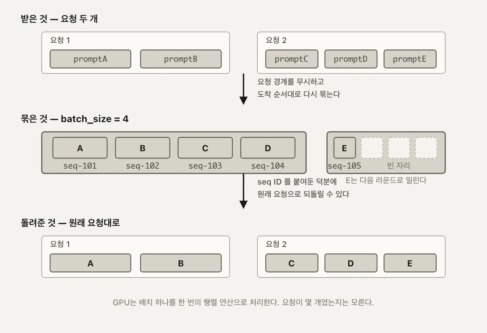
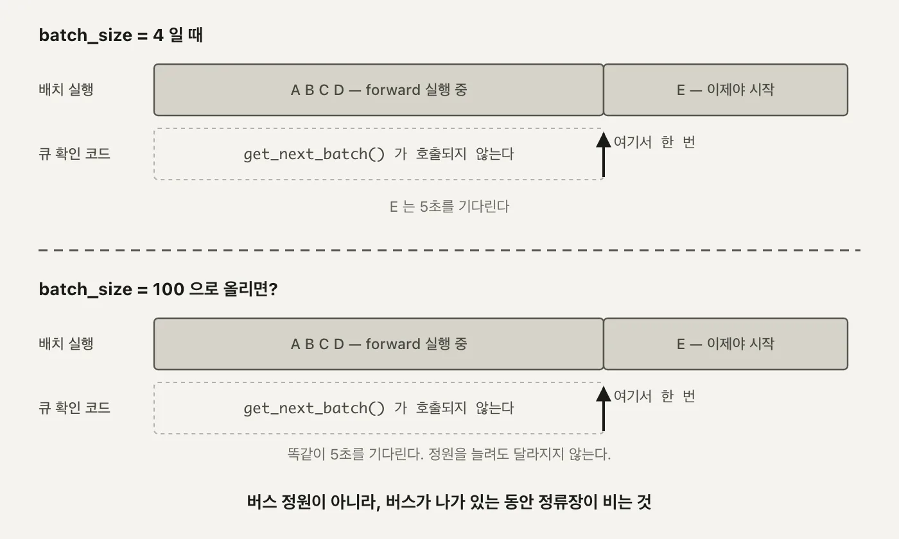
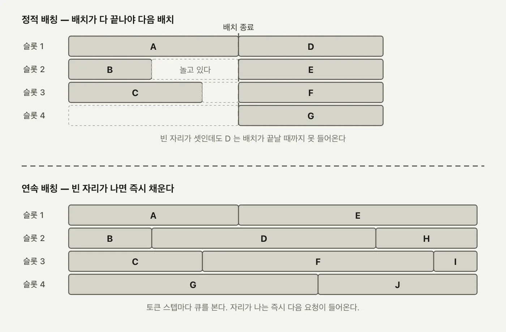

1편에서 요청 하나가 들어와서 나가기까지 거치는 부품들을 봤습니다. 그 구조가 다 갖춰져 있어도 GPU 앞에 요청이 여러 개 쌓이면 처리량 문제가 그대로 남습니다. 프롬프트를 한 번에 하나씩만 넣으면 GPU 코어 대부분이 유휴 상태로 남고, 다음 요청은 그 앞의 요청이 끝날 때까지 순서대로 기다립니다.

배칭(batching)은 이 문제를 **여러 프롬프트를 묶어서 한 번의 forward pass로 같이 계산**하는 방법으로 풉니다. 그런데 묶는 기준이 "요청"이 아닙니다.

---

<nav id="manual-toc" class="manual-toc" aria-label="목차">

### 목차

**[1부. 배치가 처리량을 올리는 원리](#section-1)**

- [1.1 요청 경계를 무시하고 다시 묶는다](#s1-1)
- [1.2 Sequence - 흩어진 프롬프트를 되찾는 표](#s1-2)
- [1.3 배칭 여섯 단계](#s1-3)

**[2부. WorkloadManager - batch_size = 4](#section-2)**

- [2.1 FIFO 큐와 고정 배치](#s2-1)
- [2.2 응답을 원래 요청으로 되돌리기](#s2-2)
- [2.3 프롬프트 여섯 개가 4 + 2로 갈린다](#s2-3)

**[3부. 직접 잰 처리량 - 1개에서 64개까지](#section-3)**

- [3.1 측정 방법](#s3-1)
- [3.2 0.318초 대 0.057초, 그리고 5.213초 대 0.082초](#s3-2)
- [3.3 ceil(N/4) x 0.33초](#s3-3)
- [3.4 새 요청이 기다리는 진짜 이유](#s3-4)

**[4부. Continuous Batching](#section-4)**

- [4.1 정적 배칭이 멈춰 세우는 것](#s4-1)
- [4.2 토큰 스텝마다 큐를 본다](#s4-2)

**[전체 흐름 정리](#section-5)** · **[막혔던 곳](#section-6)** · **[출처](#section-7)**

</nav>

---

## 1부. 배치가 처리량을 올리는 원리

<a id="s1-1"></a>

### 1.1 요청 경계를 무시하고 다시 묶는다

API 요청 하나에 프롬프트가 여러 개 담길 수 있습니다. `/generate` 엔드포인트가 받는 `BatchGenerateRequest`부터가 `prompts: List[str]`입니다. 그런데 서버 안에서 실제로 GPU에 올라가는 배치는 **이 요청 단위와 다릅니다.**

두 요청이 동시에 들어온 상황을 보겠습니다.

```
요청1   prompt A, prompt B               (seq-101, seq-102)
요청2   prompt C, prompt D, prompt E     (seq-103, seq-104, seq-105)

            ↓ 서버가 다시 묶는다

Batch1  A, B, C, D    ← 요청1의 절반 + 요청2의 절반
Batch2  E             ← 요청2에서 남은 한 개
```

요청1의 프롬프트 두 개가 나뉘지 않고, 요청2의 프롬프트 세 개 중 두 개(C, D)만 요청1의 나머지와 섞여 Batch1에 들어갑니다. 남은 E 하나가 Batch2로 넘어갑니다. **묶는 기준이 "어느 요청에서 왔는가"가 아니라 "지금 이 순간 GPU가 한 번에 감당할 수 있는 개수"** 이기 때문입니다.

- **요청 안에서도 갈라진다** - 같은 요청의 프롬프트라도 배치 경계에 걸리면 서로 다른 라운드에서 처리됩니다.
- **요청끼리도 합쳐진다** - 다른 요청에서 온 프롬프트라도 같은 라운드에 들어가면 하나의 텐서로 묶여 계산됩니다.

이렇게까지 해서 다시 묶는 이유는 GPU가 일하는 방식 때문입니다. 행렬곱 하나를 프롬프트 1개짜리로 돌리든 4개짜리로 돌리든, GPU 입장에서는 코어를 채우는 정도만 다를 뿐 걸리는 시간이 크게 늘지 않습니다. 프롬프트를 하나씩 순서대로 처리하면 이 여유를 그냥 버리는 셈입니다. 3부에서 실제로 잰 숫자를 보면, 프롬프트 1개짜리 라운드와 4개짜리 라운드의 처리 시간이 0.318초와 0.340초로 거의 같습니다. 넷을 한꺼번에 계산하는 비용이 하나를 계산하는 비용에 거의 얹혀 나온다는 뜻이고, 이게 배칭으로 처리량을 올릴 수 있는 근거입니다.

```
프롬프트 1개    [ A            ]  →  GPU 커널 1회 실행,  코어 대부분 유휴
프롬프트 4개    [ A  B  C  D   ]  →  GPU 커널 1회 실행,  같은 코어를 4배 채워서 사용
```

커널을 실행하는 오버헤드, 가중치를 GPU 메모리에서 읽어오는 시간은 배치 크기와 거의 무관합니다. 늘어나는 건 그 위에서 도는 곱셈·덧셈 횟수뿐이고, GPU는 원래 이걸 병렬로 처리하도록 만들어진 장치입니다. 그래서 프롬프트 1개를 4번 순서대로 처리하는 것보다, 4개를 한 번에 처리하는 쪽이 시간당 더 많은 요청을 처리합니다. 요청을 순서대로 하나씩 처리하는 방식과 묶어서 처리하는 방식의 차이가 결국 이 여유를 쓰느냐 버리느냐의 차이입니다.

**왜 중요한가** - 요청 경계가 사라진다는 건 "결과를 어느 요청으로 돌려줘야 하는지"를 서버가 별도로 기억해야 한다는 뜻입니다. 그 기억 장치가 다음 절의 `Sequence`입니다.

<a id="s1-2"></a>

### 1.2 Sequence - 흩어진 프롬프트를 되찾는 표

프롬프트가 배치 사이로 흩어지고 나면, 결과가 돌아왔을 때 "이 텍스트가 원래 어느 요청, 어느 프롬프트의 것이었나"를 알아야 합니다. 이 역할을 하는 게 `Sequence`입니다.

```python
class Sequence:
    def __init__(self, seq_id: str, prompt: str, client_stream, loop):
        self.id = seq_id
        self.prompt = prompt
        self.output = []
        self.finished = False
        self.loop = loop
        self.client_stream = client_stream
        self.token_count = 0
```

(`workload_manager.py:6-14`)

- **`id`** - 이게 앞 절의 `seq-101` 같은 고유 키입니다. 배치가 어떻게 재조합되든 이 값 하나로 원래 요청을 되찾습니다.
- **`prompt`** - 초기 입력 텍스트. 스트리밍 경로에서는 생성된 토큰이 여기 계속 이어붙습니다.
- **`output`** - 지금까지 생성된 텍스트 조각들의 리스트.
- **`finished`** - 이 시퀀스의 생성이 끝났는지.
- **`token_count`** - 지금까지 생성한 토큰 수. 스트리밍 경로에서 `seq.token_count > self.max_tokens`(`llm.py:48`)를 넘기면 아직 EOS가 안 나와도 강제로 스트림을 끊는 안전장치로 씁니다.
- **`client_stream`, `loop`** - 스트리밍 요청일 때 토큰을 돌려줄 큐와 이벤트 루프. 배치 요청이면 둘 다 `None`입니다.

이 필드들이 실제로 채워지는 지점도 한 곳에 모여 있습니다.

```python
def update_sequence_output(self, seq_id: str, token: str, is_finished: bool = False):
    if seq_id in self.sequence_map:
        sequence = self.sequence_map[seq_id]
        sequence.output.append(token)
        sequence.prompt += token
        sequence.token_count += 1
        sequence.finished = is_finished
        return sequence
    return None
```

(`workload_manager.py:82-89`)

`sequence.prompt += token`이 눈에 띕니다. 프롬프트 필드가 입력만 담아두는 게 아니라 **생성된 텍스트까지 이어붙이는 누적 버퍼**로도 쓰입니다. 스트리밍 경로에서 다음 토큰을 예측하려면 지금까지 만든 텍스트 전체가 다시 입력으로 들어가야 하는데, 그 입력을 매번 새로 조립하지 않고 `Sequence` 하나가 계속 들고 있는 겁니다.

<aside class="callout">
<p class="eyebrow">(용어) Sequence</p>

배칭이 섞어놓는 건 **계산**이지 **정체성**이 아닙니다. `Sequence`는 프롬프트 하나마다 하나씩 만들어지는 레코드로, 그 프롬프트가 어느 배치를 거치든 고유 ID로 계속 따라다닙니다. `WorkloadManager`가 `sequence_map: Dict[str, Sequence]`라는 딕셔너리에 이 레코드들을 전부 들고 있습니다.

</aside>

<figure>
  
  <figcaption>왼쪽의 <strong>요청 경계</strong>와 가운데의 <strong>배치 경계</strong>가 서로 어긋납니다. 요청1의 promptB와 요청2의 promptC·D가 같은 Batch1로 섞이고, 남은 promptE만 Batch2로 넘어갑니다. 오른쪽 화살표가 이 글의 핵심을 보여줍니다. 계산은 배치 단위로 흩어져도 <code>seq-101</code>~<code>seq-105</code> ID만 있으면 결과가 정확히 원래 요청으로 돌아갑니다. (자작 도식)</figcaption>
</figure>

<a id="s1-3"></a>

### 1.3 배칭 여섯 단계

프롬프트가 들어와서 결과로 나가기까지 실제로 거치는 단계는 여섯 개입니다.

| 단계 | 하는 일 | 담당 |
|---|---|---|
| 1. Request intake | 사용자가 `/generate`를 호출한다 | `main.py`의 FastAPI 라우트 |
| 2. Prompt queuing | 프롬프트마다 `Sequence`를 만들어 FIFO 큐에 넣는다 | `add_request` |
| 3. Prompt tracking and batching | 큐에서 최대 `batch_size`개를 꺼내 활성 목록에 담는다 | `get_next_batch` |
| 4. Batch execution | 활성 목록을 워커 프로세스로 보낸다 | `execute_batch` |
| 5. Model inference | 배치를 하나의 텐서로 토큰화해 `model.generate()`를 한 번 돌린다 | `ModelWorker.generate` |
| 6. Response mapping | 결과를 `request_id`로 다시 묶어 워크로드 매니저와 `Sequence`에 반영한다 | `update_sequence_output` |

1-2단계는 요청이 들어오는 쪽, 5단계가 실제 GPU 계산이고, 3단계와 6단계가 요청 경계와 배치 경계를 잇는 접착제입니다. 4단계에서 3-5단계를 감싸는 프로세스 경계를 한 번 왕복하는 비용이 붙는데, 이 비용이 3부에서 잰 N=1 격차의 원인 중 하나입니다.

**왜 중요한가** - 여섯 단계 중 GPU가 실제로 일하는 건 5단계뿐입니다. 나머지 다섯 단계는 전부 "그 5단계를 얼마나 자주, 얼마나 크게 도느냐"를 결정하는 관리 계층입니다. 2부에서 볼 `WorkloadManager`가 3, 6단계를, `ModelExecutor`가 4단계를 맡습니다.

---

## 2부. WorkloadManager - batch_size = 4

<a id="s2-1"></a>

### 2.1 FIFO 큐와 고정 배치

이 프로젝트의 배칭 구현은 `WorkloadManager` 하나에 들어 있습니다.

```python
class WorkloadManager:
    def __init__(self):
        self.incoming_queue: Queue[Sequence] = Queue()
        self.active_sequences: List[Sequence] = []

        self.incoming_streaming_queue: Queue[Sequence] = Queue()
        self.active_streaming_sequences: List[Sequence] = []
        self.batch_size = 4  # Process up to 4 sequences at a time
        self.sequence_map: Dict[str, Sequence] = {}

    # for basic generate and batch generate
    def add_request(self, prompt: str) -> str:
        request_id = str(uuid.uuid4())
        sequence = Sequence(request_id, prompt, None, None)
        self.incoming_queue.put(sequence)
        self.sequence_map[request_id] = sequence
        return request_id
```

(`workload_manager.py:16-32`)

`batch_size = 4`가 이 글에서 다루는 배칭의 정원입니다. `add_request()`는 프롬프트마다 `Sequence`를 만들어 큐에 넣고, `sequence_map`에도 같이 등록합니다. 큐잉과 등록이 한 번에 일어나서, 이후 어느 배치에서 처리되든 `sequence_map[request_id]`로 바로 찾을 수 있습니다. `Queue`를 쓰는 이유도 단순합니다. 배칭 처리 루프와 요청을 받는 쪽이 같은 자료구조를 안전하게 주고받아야 하는데, 파이썬 표준 `Queue`가 그 잠금을 알아서 해줍니다.

큐도 활성 목록도 **두 벌씩**입니다. `incoming_queue`/`active_sequences`는 `/generate`처럼 결과를 한 번에 통째로 돌려주는 배치 요청용이고, `incoming_streaming_queue`/`active_streaming_sequences`는 `/generate_stream`처럼 토큰이 나올 때마다 바로 흘려보내야 하는 요청용입니다. 둘을 갈라놓은 이유는 두 경로가 서로 다른 리듬으로 돕니다. 배치 요청은 `model.generate()` 한 번으로 끝까지 생성하는 반면, 스트리밍 요청은 토큰 하나마다 배치를 다시 도니, 같은 큐에 섞이면 한쪽이 다른 쪽의 진행을 방해합니다. 이 글은 `/generate`와 `/generate_vllm`만 다루니, 이후로는 스트리밍이 아닌 쪽(`incoming_queue`, `active_sequences`)만 따라갑니다.

정원을 채우는 쪽은 따로 있습니다.

```python
def get_next_batch(self, is_streaming: bool = False) -> List[Sequence]:
    if is_streaming:
        while len(self.active_streaming_sequences) < self.batch_size and not self.incoming_streaming_queue.empty():
            sequence = self.incoming_streaming_queue.get()
            self.active_streaming_sequences.append(sequence)

        return self.active_streaming_sequences
    else:
        while len(self.active_sequences) < self.batch_size and not self.incoming_queue.empty():
            sequence = self.incoming_queue.get()
            self.active_sequences.append(sequence)

        return self.active_sequences
```

(`workload_manager.py:42-54`)

`while` 조건이 두 개입니다. **정원(`batch_size`)이 남아 있고, 큐도 비어 있지 않을 때만** 꺼냅니다. 둘 중 하나라도 걸리면 멈춥니다. 즉 이 함수는 "4개를 채울 때까지 기다리는" 함수가 아니라 "지금 당장 꺼낼 수 있는 만큼만 꺼내고 바로 리턴하는" 함수입니다. 큐에 2개뿐이면 2개만 담아 리턴하고, 6개가 밀려 있으면 4개만 담고 나머지 2개는 큐에 남겨둡니다. 큐가 아예 비어 있으면 빈 리스트를 그대로 돌려주고, 호출한 쪽이 `time.sleep(0.1)` 뒤 다시 시도합니다.

<a id="s2-2"></a>

### 2.2 응답을 원래 요청으로 되돌리기

배치가 GPU를 한 번 돌고 나면 결과를 원래 요청으로 되돌려야 합니다. 이 왕복을 담당하는 게 `LLMEngine.generate()`입니다.

```python
while not self._is_batch_finished(request_ids):
    sequences = self.workload_manager.get_next_batch()
    if not sequences:
        time.sleep(0.1)
        continue

    # Execute the next batch in one go, it may not be the same prompts as the prompts in the request.
    results = self.model_executor.execute_batch(sequences)

    # Update results in workload manager
    for result in results[1]:
        self.workload_manager.remove_active_sequence(result['request_id'])
        self.workload_manager.update_sequence_output(result['request_id'], result['generated_text'], is_finished=True)
```

(`llm.py:99-113`, 전체 메서드는 `llm.py:92-121`)

주석 그대로입니다. **"실행되는 배치가 이 요청의 프롬프트와 같은 구성이 아닐 수 있다."** 요청이 프롬프트 5개를 submit해도, 실제로 도는 배치에는 다른 요청의 프롬프트가 섞여 있을 수 있다는 뜻입니다. 그래서 결과를 되돌리는 열쇠는 오직 `result['request_id']`뿐입니다.

`execute_batch()`가 배치를 워커 프로세스로 보내고 받아오는 부분도 짧습니다.

```python
def execute_batch(self, prompts):
    ...
    self.task_queue.put((prompts, False))   # 메인 프로세스 → 워커 프로세스
    ...
    results = self.result_queue.get()       # 워커 프로세스 → 메인 프로세스, 다 돌 때까지 블로킹
    return results
```

(`model_executor.py:33-46`)

`task_queue`와 `result_queue`는 둘 다 `multiprocessing.Queue`입니다. 배치 하나를 처리하려면 이 큐를 통해 **프로세스 경계를 한 번 왕복**해야 하고, `result_queue.get()`은 워커가 배치 전체의 생성을 끝낼 때까지 블로킹합니다. 이 왕복 구조가 3부에서 `/generate`와 `/generate_vllm`의 N=1 격차를 설명하는 근거입니다.

이 흐름이 안전하게 돌려면 `LLMEngine` 인스턴스가 요청들 사이에서 겹치지 않아야 합니다. `main.py`는 이걸 전역 싱글턴과 락으로 처리합니다.

```python
_llm = None
_llm_lock = multiprocessing.Lock()

def get_llm():
    global _llm
    with _llm_lock:
        if _llm is None:
            _llm = LLMEngine()
        return _llm
```

(`main.py:15-34`, 발췌)

FastAPI가 여러 요청을 동시에 받아도 `get_llm()`을 거치는 이상 `LLMEngine`은 프로세스당 하나뿐입니다. `WorkloadManager`의 큐와 `sequence_map`도 이 하나의 인스턴스에 딸려 있으니, 서로 다른 HTTP 요청에서 온 `Sequence`들이 같은 큐에 안전하게 같이 쌓일 수 있습니다. 배칭이 "요청 경계를 무시하고 다시 묶는" 일을 할 수 있는 것도 결국 이 하나의 공유 상태가 있기 때문입니다.

여기서 제거가 두 단계로 나뉘는 것도 눈에 띕니다.

- **`remove_active_sequence`** - 활성 목록에서만 뺍니다. 다음 라운드에 정원 한 자리를 비워주는 역할입니다. `sequence_map`에는 그대로 남아 있습니다.
- **`remove_finished_sequence`** (`workload_manager.py:64-71`) - `sequence_map`에서까지 완전히 삭제합니다.

```python
def is_sequence_finished(self, seq_id: str) -> bool:
    if seq_id in self.sequence_map:
        sequence = self.sequence_map[seq_id]
        return sequence.finished
    return False
```

(`workload_manager.py:73-77`)

`_is_batch_finished()`가 원래 요청에 있던 모든 `request_id`에 대해 이 함수를 확인합니다. 하나라도 `False`면 바깥 `while` 루프가 계속 돕니다. 전부 `True`가 되고 나서야 `generate()`는 각 `request_id`로 `sequence.output[0]`을 모으고, 그제서야 `remove_finished_sequence`로 완전히 정리합니다. **활성 목록에서 빠지는 시점**과 **완전히 삭제되는 시점**이 다른 이유가 이겁니다. 호출한 쪽이 결과를 다 읽어갈 때까지는 `sequence_map`에 남겨둬야 합니다.

request_id를 텍스트에 다시 붙이는 지점은 워커 프로세스 안에도 있습니다.

```python
results = [
    {
        'request_id': request_id,
        'generated_text': generated_text
    }
    for request_id, generated_text in zip(request_ids, generated_texts)
]
```

(`model_worker.py:58-64`)

`zip(request_ids, generated_texts)`가 배치로 들어간 순서와 배치로 나온 순서가 같다는 전제 하나로 짝을 맞춥니다. 토큰화부터 `model.generate()`까지 순서를 흩트리지 않는 한, 이 zip 하나로 계산 결과가 다시 request_id를 달고 나옵니다.

<a id="s2-3"></a>

### 2.3 프롬프트 여섯 개가 4 + 2로 갈린다

`batch_size = 4`가 실제로 어떻게 나뉘는지 로그로 확인했습니다. 프롬프트 여섯 개(`a`~`f`)를 `/generate`로 한 번에 보내면, 서버 로그에 이렇게 찍힙니다.

```
Batch input shape: torch.Size([4, ...])   ← 1라운드, a b c d
Batch input shape: torch.Size([2, ...])   ← 2라운드, e f
```

두 라운드입니다. `get_next_batch()`가 첫 호출에서 정원인 4개(a~d)를 채우고, 남은 e, f는 큐에 그대로 남았다가 두 번째 호출에서 꺼내집니다. `/generate`에 프롬프트 6개를 한 번에 보내도 내부적으로는 `add_request()`가 6번 호출돼 `Sequence` 6개가 큐에 나란히 쌓이고, 이후 `get_next_batch()`가 정원 단위로 잘라 꺼내는 방식입니다.

이 shape의 두 번째 숫자(토큰 길이)는 라운드마다 배치에 어떤 프롬프트가 섞였느냐에 따라 달라집니다. 실제로 pytest의 `test_generate_batch`가 보내는 다섯 개짜리 배치에서는 `torch.Size([4, 5])` 다음 `torch.Size([1, 6])`이 찍힙니다. 첫 라운드에 든 네 프롬프트 중 제일 긴 것에 맞춰 길이가 5로 패딩됐고, 두 번째 라운드는 프롬프트 하나뿐이라 그 프롬프트 고유의 토큰 길이(6)가 패딩 없이 그대로 나온 겁니다. 길이가 다른 프롬프트를 하나의 텐서로 묶으려면 패딩이 있어야 하고, 그 패딩이 이 코드에 있습니다.

```python
inputs = self.tokenizer(
    prompt_texts,
    return_tensors="pt",
    padding=True,
    truncation=True,
    max_length=512
).to(self.device)
```

(`model_worker.py:33-39`)

`padding=True`가 배치 안에서 제일 긴 프롬프트에 맞춰 나머지를 채웁니다. `truncation=True`와 `max_length=512`는 반대쪽 극단을 막습니다. 배치 하나가 하나의 텐서여야 `model.generate()`를 한 번만 부를 수 있고, 텐서가 되려면 모든 행의 길이가 같아야 하니, 패딩은 배칭이 성립하기 위한 전제 조건입니다.

---

## 3부. 직접 잰 처리량 - 1개에서 64개까지

<a id="s3-1"></a>

### 3.1 측정 방법

`/generate`와 `/generate_vllm` 둘 다 `prompts: List[str]`을 받으므로, 동시 요청 N개를 리스트 길이 N짜리 요청 하나로 만들어 두 엔드포인트에 각각 보내고, 응답이 돌아오기까지 걸린 시간을 쟀습니다. `LLMEngine.generate()`가 프롬프트마다 `add_request()`를 호출해 큐에 나란히 쌓으므로, 이 방식은 실제로 N개의 요청이 거의 동시에 도착한 상황과 같은 처리 경로를 탑니다. N을 1, 4, 16, 64로 늘려가며 같은 방식으로 반복했고, 모델은 두 경로 모두 `facebook/opt-125m`으로 동일합니다.

측정은 요청을 보내기 직전과 응답을 받은 직후에 시각을 찍어 그 차이를 쓰는 방식입니다. 클라이언트 쪽에서 잰 왕복 시간이라 네트워크 왕복이나 FastAPI의 요청 파싱 시간도 약간 섞여 있지만, N을 1에서 64로 64배 늘려도 이 고정 비용은 거의 그대로이므로 두 엔드포인트 사이의 상대적인 차이를 보는 데는 영향이 없습니다.

두 엔드포인트가 실제로 정상 동작한다는 건 `pytest tests/`로 따로 확인했습니다. 결과는 `8 passed, 3 warnings in 51.23s`. 여덟 개는 `test_api.py`의 기본·배치·스트리밍 테스트 네 개와 `test_vllm.py`의 vLLM 테스트 네 개를 합친 숫자입니다. 51초 중 대부분은 **맨 처음 테스트 하나**가 씁니다. 워커 프로세스를 fork하고, HF 모델과 vLLM 모델을 둘 다 로드하는 일이 거기서 한 번에 일어나기 때문입니다. 그 뒤로 이어지는 나머지 일곱 개는 이미 떠 있는 모델을 재사용해서 곧바로 통과합니다. 아래 처리량 표의 숫자들도 모델이 이미 로드돼 있는 상태에서 잰 값입니다.

<a id="s3-2"></a>

### 3.2 0.318초 대 0.057초, 그리고 5.213초 대 0.082초

| 동시 요청 N | `/generate` | `/generate_vllm` | 배수 |
|---|---|---|---|
| 1 | 0.318초 | 0.057초 | 5.6배 |
| 4 | 0.340초 | 0.059초 | 5.8배 |
| 16 | 1.285초 | 0.057초 | 22배 |
| 64 | 5.213초 | 0.082초 | 64배 |

`/generate`는 N이 늘수록 시간이 거의 선형으로 늘어납니다. N=4에서 N=64로 16배 늘었는데 처리 시간도 0.340초에서 5.213초로 약 15배 늘었습니다. `/generate_vllm`은 N이 1이든 64든 0.057-0.082초 사이에 머뭅니다. 분자(`/generate` 시간)는 N을 따라 커지고 분모(`/generate_vllm` 시간)는 거의 그대로다 보니, N=1에서 이미 5.6배였던 격차가 N=64에서는 64배로 그대로 벌어집니다.

같은 표를 처리량(초당 몇 개를 처리했나)으로 바꿔 보면 더 뚜렷합니다.

| 동시 요청 N | `/generate` 처리량 | `/generate_vllm` 처리량 |
|---|---|---|
| 1 | 3.14 req/s | 17.54 req/s |
| 4 | 11.76 req/s | 67.80 req/s |
| 16 | 12.45 req/s | 280.70 req/s |
| 64 | 12.28 req/s | 780.49 req/s |

`/generate`는 N=4를 넘기면 처리량이 **더 안 올라갑니다.** 12 req/s 언저리에 그대로 머뭅니다. `batch_size = 4`가 한 라운드에 실어 나르는 정원이고, 라운드 하나가 도는 시간이 대략 고정이니, 정원을 채운 뒤로는 요청을 아무리 더 넣어도 초당 처리량이 늘 수가 없습니다. 반대로 `/generate_vllm`은 N을 따라 처리량이 계속 커집니다. 정원이라는 개념 자체가 고정돼 있지 않기 때문이고, 그 이유는 4부에서 다룹니다.

<a id="s3-3"></a>

### 3.3 ceil(N/4) x 0.33초

`/generate` 쪽 숫자는 우연이 아닙니다. `batch_size = 4`니까 N개의 프롬프트는 `ceil(N/4)`라운드로 나뉘고, 라운드 하나에 걸리는 시간은 이미 N=1에서 쟀습니다. 0.318초입니다. N=1은 정확히 라운드 1개짜리 측정이니, 이 값을 라운드 상수로 그대로 씁니다.

```
N=1    ceil(1/4) = 1라운드   ×  0.318초  =  0.318초   (실측 0.318초)
N=4    ceil(4/4) = 1라운드   ×  0.318초  =  0.318초   (실측 0.340초)
N=16   ceil(16/4) = 4라운드  ×  0.318초  =  1.272초   (실측 1.285초)
N=64   ceil(64/4) = 16라운드 ×  0.318초  =  5.088초   (실측 5.213초)
```

N=64는 16라운드, 예측은 반올림해서 약 5.1초, 실측은 5.213초입니다. 라운드당 시간을 어림잡아 0.33초로 두고 16을 곱해도 5.28초로 큰 차이가 나지 않습니다. 예측과 실측의 작은 차이는 라운드마다 패딩 길이가 달라 텐서 크기가 조금씩 다른 데서 옵니다. N=4가 N=1보다 오히려 조금 더 걸린 것(0.318초 → 0.340초)도 같은 이유입니다. 프롬프트 4개를 한 텐서로 묶으려면 그중 제일 긴 프롬프트에 나머지를 맞춰야 하니, 프롬프트가 하나뿐일 때보다 패딩된 길이가 길어질 가능성이 있고 토큰화·연산량도 그만큼 늘어납니다. 그래도 그 차이는 0.022초뿐이라 `ceil(N/4)`가 라운드 수를 결정한다는 큰 그림은 바뀌지 않습니다. `/generate`의 처리 시간은 **라운드 수 곱하기 라운드당 시간**이라는 식 하나로 거의 그대로 설명됩니다.

<a id="s3-4"></a>

### 3.4 새 요청이 기다리는 진짜 이유

2.3절의 e, f는 정원이 모자라서 기다린 게 아닙니다. **a~d가 든 라운드가 돌아가는 동안, 큐를 들여다보는 코드 자체가 실행되지 않기 때문**입니다. `get_next_batch()`는 `LLMEngine.generate()`의 `while` 루프 맨 위에서만 불리고, 그 루프는 `execute_batch()`가 결과를 들고 돌아와야 다음 줄로 넘어갑니다. 라운드가 도는 동안은 이 함수 자체가 호출되지 않으니, 큐에 뭐가 쌓여 있든 그 라운드에 끼어들 방법이 없습니다.

<figure>
  
  <figcaption>위아래 타임라인의 <strong>정원만 다르고 진행 방식은 같습니다.</strong> <code>batch_size</code>를 4에서 100으로 올려도, 새 요청이 들어갈 수 있는 시점은 진행 중인 라운드가 끝나는 순간으로 똑같습니다. 버스 정원이 문제가 아니라 <strong>버스가 나가 있는 동안 정류장 자체를 보지 않는다</strong>는 게 두 타임라인이 겹치는 이유입니다. (자작 도식)</figcaption>
</figure>

정원을 아무리 늘려도 이 구조는 바뀌지 않습니다. 정원이 100이어도 동시 요청이 101개면 101번째 요청은 정확히 같은 이유로 다음 라운드를 기다립니다. 정원이 병목이 아니라 **라운드가 통째로 끝나야 다음 순번을 볼 수 있다는 구조**가 병목입니다. N=16에서 GPU가 opt-125m 하나 돌리는 데 1.285초씩이나 걸린 것도 계산량이 커서가 아닙니다. `/generate_vllm`이 같은 N=16을 0.057초에 처리한 게 그 증거입니다.

이게 용량 산정에도 그대로 영향을 줍니다. `/generate` 경로로 초당 12개보다 많은 요청을 받고 싶으면, `batch_size`를 올리거나 GPU를 더 두는 것 말고는 방법이 없습니다. 반면 `/generate_vllm`은 같은 GPU 한 장으로 N=64까지도 처리량이 계속 오릅니다. 하루 단위로 늘려보면 격차가 더 커집니다.

```
/generate       12.28 req/s × 86,400초  ≈ 하루 106만 건
/generate_vllm  780.49 req/s × 86,400초 ≈ 하루 6,743만 건
```

같은 GPU 한 장, 같은 모델인데 하루에 처리할 수 있는 요청 수가 60배 넘게 벌어집니다. "이 서비스에 GPU가 몇 장 필요한가"라는 질문의 답이 배칭 방식 하나로 이렇게까지 갈리는 셈입니다. 4부에서 이 구조 자체를 없애는 방식을 보겠습니다.

---

## 4부. Continuous Batching

<a id="s4-1"></a>

### 4.1 정적 배칭이 멈춰 세우는 것

지금까지 본 배칭에는 이름이 있습니다. **정적 배칭(static batching)** - 라운드 하나가 시작되면 그 라운드에 속한 시퀀스 전부가 끝나야 라운드가 끝난 것으로 칩니다. opt-125m처럼 프롬프트마다 실제 생성 길이가 달라도, `model.generate()` 호출 하나가 배치 전체를 감싸고 있어서 제일 늦게 끝나는 시퀀스가 나머지 전부를 붙잡습니다. A, B, C가 먼저 끝나도 D가 끝날 때까지 그 자리는 비어 있는 채로 기다립니다.

<aside class="callout">
<p class="eyebrow">(용어) 정적 배칭과 연속 배칭</p>

- **정적 배칭(static batching)** - 배치에 담긴 시퀀스 구성이 라운드 시작 시점에 고정되고, 그 라운드가 끝날 때까지 바뀌지 않는 방식
- **연속 배칭(continuous batching)** - 배치 구성을 매 토큰 스텝마다 다시 계산해, 끝난 시퀀스는 즉시 빼고 대기 중인 시퀀스를 즉시 채우는 방식

이름의 차이가 그대로 "언제 큐를 다시 보는가"의 차이입니다.

</aside>

이 프로젝트의 정적 배칭이 이렇게 굳어 있는 데는 구체적인 이유가 있습니다. `ModelWorker.generate()`(`model_worker.py:25-66`) 안에서 배치 전체가 `self.model.generate(...)` 호출 **하나**에 들어갑니다. 파이썬 코드 입장에서 이 호출은 한 줄이고, 그 한 줄이 반환될 때까지 배치에 새 행을 끼워 넣을 방법이 없습니다. 게다가 이 호출 자체가 `mp.Queue`를 건너 별도 프로세스 안에서 돕니다. 메인 프로세스는 `result_queue.get()`으로 그 프로세스가 배치 전체를 끝내고 돌려줄 때까지 블로킹 상태로 기다릴 뿐, 중간에 개입할 여지가 아예 없습니다.

<figure>
  
  <figcaption>위쪽이 정적 배칭입니다. A, B, C가 끝난 뒤에도 D가 끝날 때까지 그 슬롯들은 <strong>점선으로 비어 있습니다.</strong> 아래쪽 연속 배칭은 슬롯이 비는 순간 바로 다음 요청이 채웁니다. 같은 GPU, 같은 작업량인데 위는 빈 시간이 있고 아래는 없습니다. (자작 도식)</figcaption>
</figure>

<a id="s4-2"></a>

### 4.2 토큰 스텝마다 큐를 본다

vLLM의 연속 배칭(continuous batching)은 "배치가 통째로 끝나야 큐를 본다"는 전제 자체를 없앱니다. 배치 전체의 완료를 기다리는 대신, **토큰을 한 스텝 생성할 때마다(수십 밀리초 단위로) 대기 큐를 확인**합니다. 어떤 시퀀스가 그 스텝에서 끝나면 슬롯이 그 즉시 비고, 대기 중이던 다음 요청이 바로 그 슬롯에 들어갑니다. 라운드라는 단위 자체가 없어지는 셈입니다.

3.2절에서 `/generate_vllm`이 N=1부터 N=64까지 0.057-0.082초에 머문 것도 이 두 가지가 겹친 결과입니다. opt-125m이 작아서 64개 시퀀스가 GPU 한 웨이브에 다 들어가고, 설령 안 들어가더라도 라운드 경계 자체가 없으니 앞선 시퀀스가 끝나는 대로 새 시퀀스가 바로 이어 들어갑니다. `batch_size`라는 고정 정원을 올려서 얻는 여유가 아니라, 정원이라는 개념 자체를 매 스텝 다시 계산하는 방식이라 N이 늘어도 곡선이 거의 평평하게 유지됩니다.

이 프로젝트 안에도 토큰 하나씩 도는 루프가 이미 있습니다. `/generate_stream`이 쓰는 `requests_processing_loop`(`llm.py:32-68`)는 `while True`로 돌면서 매 반복마다 `get_next_batch(is_streaming=True)`를 다시 부르고, `generate_forward_batch`(`model_worker.py:68-113`)가 배치마다 토큰을 하나씩만 만들어 돌려줍니다. `/generate`가 `model.generate()` 호출 하나에 배치 전체의 생성을 통째로 맡기는 것과 대조적으로, 이 루프는 스텝 사이마다 큐를 다시 확인하니 새 스트리밍 요청이 끼어들 여지가 있습니다. 다만 이 루프도 한 스텝 안에서는 여전히 고정 폭 배치를 동기적으로 처리합니다. vLLM처럼 시퀀스별로 슬롯을 독립적으로 채우고 비우는 스케줄러가 있는 게 아니라, "토큰 한 개 분량의 정적 배칭"을 아주 잘게 반복하는 구조에 가깝습니다.

vLLM 쪽 스케줄러는 이걸 한 단계 더 밀어붙입니다. 디코딩 반복 하나(iteration)마다 지금 배치에 있는 시퀀스들의 다음 토큰을 계산하는 동시에, 그 반복이 끝나는 시점에 "끝난 시퀀스가 있는가"와 "대기 큐에 새 시퀀스가 있는가"를 같이 확인합니다. 끝난 자리가 있으면 그 자리만큼 대기 큐에서 새 시퀀스를 채워 다음 반복에 곧바로 합류시킵니다. 반복 단위가 배치 전체가 아니라 토큰 한 개이기 때문에, 어떤 시퀀스가 언제 끝나든 그다음 반복부터는 이미 다른 시퀀스로 그 자리가 채워져 있습니다.

---

## 전체 흐름 정리

```
요청 도착
    /generate 로 프롬프트 N개가 들어온다
    → add_request() 가 Sequence 를 만들어 FIFO 큐에 적재

배치 구성
    get_next_batch() 가 큐에서 최대 batch_size(4)개를 꺼내 활성 목록으로
    → 정원을 못 채우면 채운 만큼만, 넘치면 나머지는 큐에 남는다

배치 실행
    execute_batch() 가 활성 목록을 워커 프로세스로 전달 (mp.Queue 왕복)
    → model_worker.py 에서 padding=True 로 하나의 텐서로 합쳐 model.generate() 한 번

응답 매핑
    zip(request_ids, generated_texts) 로 request_id 를 다시 붙여 반환
    → update_sequence_output() 이 Sequence.output 에 반영, is_sequence_finished() 로 전체 완료 확인

    ↑ 이 네 단계가 라운드 하나. 정적 배칭은 이 라운드가 통째로 끝나야
      다음 라운드가 시작된다              ← 정적 배칭의 한계
      연속 배칭은 토큰 스텝마다 큐를 봐서 슬롯이 비는 즉시 채운다  ← Continuous Batching
```

기억할 숫자 세 개를 정리해 둡니다.

| 숫자 | 뜻 | 왜 중요한가 |
|---|---|---|
| **batch_size = 4** | `WorkloadManager`가 한 라운드에 담는 정원 | N개의 프롬프트가 `ceil(N/4)`라운드로 나뉘는 기준 |
| **0.318초** | 라운드 하나(N=1)에 걸리는 실측 시간 | `ceil(N/4) × 0.318초`로 `/generate`의 처리 시간을 거의 그대로 예측한다 |
| **64배** | N=64에서 `/generate`와 `/generate_vllm`의 처리 시간 배수 | 라운드 단위 정적 배칭과 토큰 스텝 단위 연속 배칭의 격차가 N이 커질수록 그대로 벌어진다 |

---

## 막혔던 곳

**프롬프트 여섯 개를 한 번에 보냈는데 왜 4 + 2로 갈리나?** `workload_manager.py:23`의 `batch_size = 4` 때문입니다. 로그에 `torch.Size([4, ...])` 다음 `torch.Size([2, ...])`가 찍히는 게 그 두 라운드입니다. pytest가 보내는 다섯 개짜리 배치에서도 `torch.Size([4, 5])` 다음 `torch.Size([1, 6])`으로 같은 패턴이 나옵니다.

**그럼 e가 기다리는 건 정원이 모자라서인가?** 아닙니다. **배치가 도는 동안 큐를 보는 코드가 실행되지 않아서**입니다. `get_next_batch()`는 활성 배치가 끝난 뒤에야 다시 불립니다. `batch_size`를 100으로 올려도 대기 시간은 그대로입니다. 버스 정원이 아니라 버스가 나가 있는 동안 정류장이 비는 것입니다. `execute_batch()`가 `result_queue.get()`으로 블로킹된 채 워커의 응답을 기다리는 동안은, 그 함수를 호출한 `while` 루프 자체가 다음 줄로 넘어가지 못합니다.

**N=1이면 배칭할 게 없는데 왜 5.6배나 차이가 나나?** 배칭 이전 단계에서 이미 벌어집니다. 직접 만든 쪽은 `mp.Queue`로 프로세스 경계를 왕복하고, vLLM은 같은 프로세스 안에서 최적화된 루프를 돕니다. 배칭 자체를 켜기도 전에 이미 5배 넘게 벌어진 격차가, N이 늘면서 배칭의 격차와 그대로 겹쳐집니다.

**`ceil(N/4) × 0.33초`가 왜 맞나?** 라운드 수 곱하기 라운드당 시간이라서입니다. N=64면 16라운드고 예측이 5.1초, 실측이 5.213초입니다. 라운드당 시간이 프롬프트 개수와 거의 무관하다는 게 1부에서 본 "배치 크기를 늘려도 GPU 시간이 크게 안 늘어난다"는 사실 그대로입니다.

**배치 크기를 키우면 무조건 좋은가?** 처리량은 오르지만 큐 대기 시간과 개별 요청의 지연이 같이 늡니다. 정원이 클수록 그 정원을 다 채울 때까지, 혹은 배치 전체가 끝날 때까지 먼저 도착한 요청도 더 오래 기다릴 수 있습니다. 프로덕션은 최대 배치 크기만 보지 않고 최대 배치 토큰 수, 타임아웃, 요청 우선순위를 함께 겁니다.

**vLLM은 왜 N이 늘어도 평평한가?** 두 가지가 겹칩니다. opt-125m이 작아 64 시퀀스가 GPU 한 웨이브에 들어가고, 연속 배칭이 라운드 경계 자체를 없앱니다. `/generate`의 처리량이 N=4를 넘기면서 12 req/s 근처에 그대로 머무는 것과 정반대로, `/generate_vllm`의 처리량은 N을 따라 계속 오릅니다.

---

## 출처

- 스터디 교재: Model Serving System Design, 3장
- 실습 코드: https://github.com/orca3/llm-model-inference
- Continuous batching 설명 영상: https://www.youtube.com/watch?v=GZtrmqgZk_I
- vLLM 문서: https://docs.vllm.ai
- 서빙 구조를 이해하면서 참고한 글 - [devlos.tistory.com/128](https://devlos.tistory.com/128)
- 배칭이 왜 필요한지 정리하면서 참고한 글 - [winning-the-lotto.tistory.com/23](https://winning-the-lotto.tistory.com/23)
