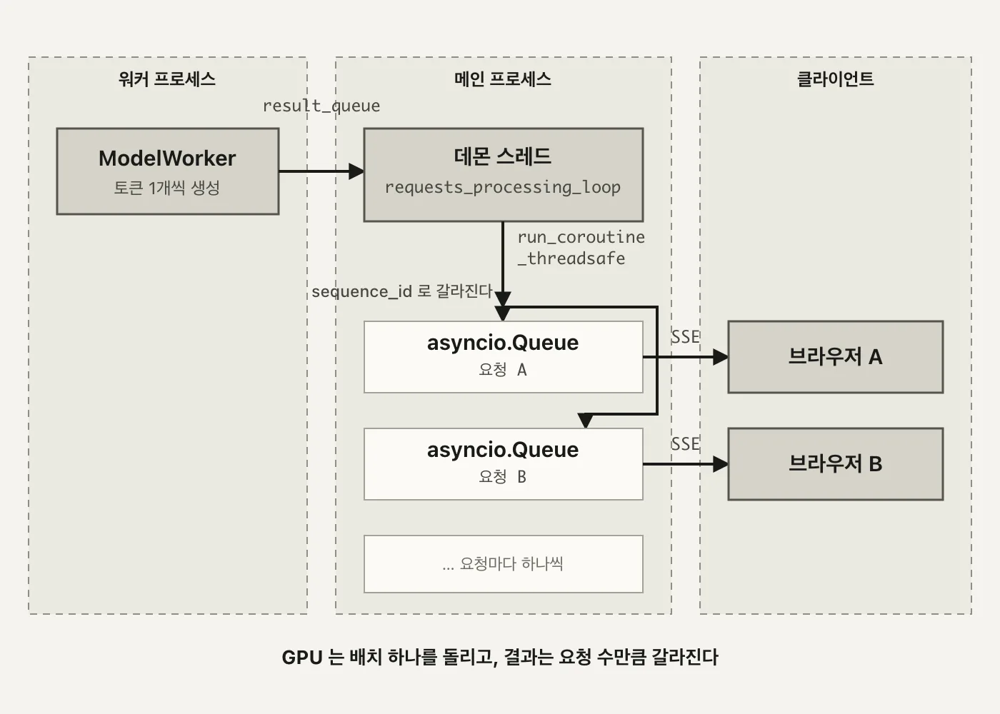
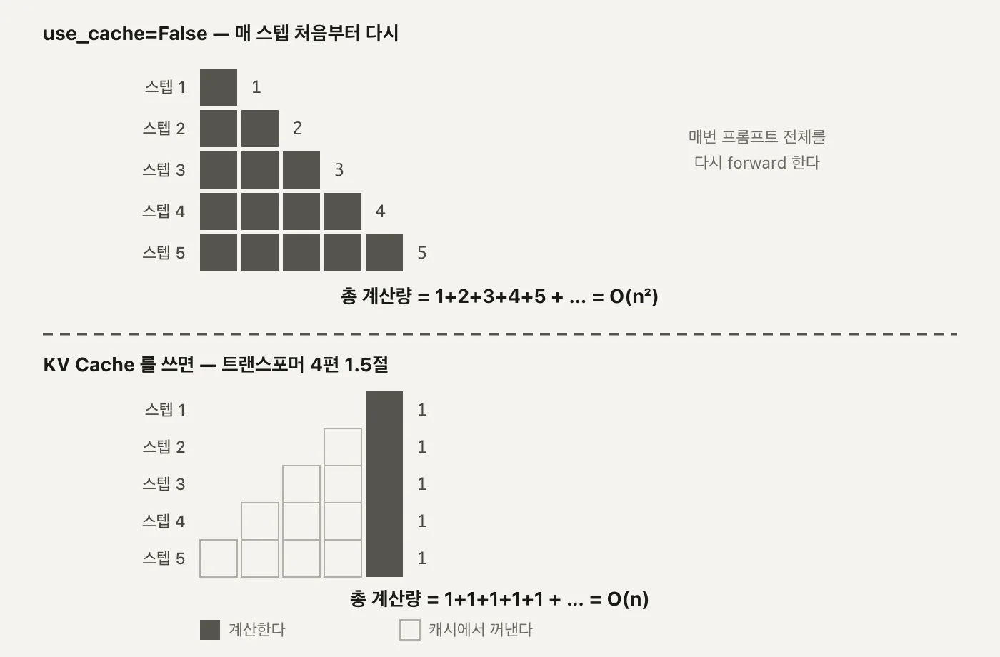
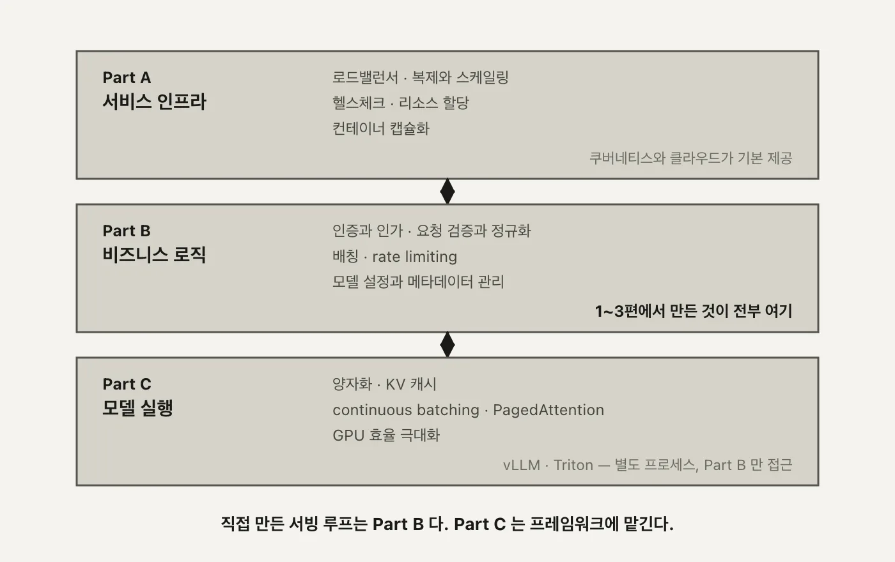

2편에서 만든 `/generate`는 배치가 끝나야 응답 하나를 돌려줍니다. `max_tokens=20`이면 20번의 생성 스텝이 전부 끝난 뒤에야 글자가 나옵니다. 이번 편은 그 대기를 SSE로 잘게 쪼개는 이야기로 시작해서, 쪼개다 보니 드러난 반면교사(캐시 없는 forward)를 지나, 결국 그 반면교사를 통째로 걷어내고 vLLM으로 갈아타는 데까지 갑니다.

---

<nav id="manual-toc" class="manual-toc" aria-label="목차">

### 목차

**[1부. 스트리밍](#section-1)**

- [1.1 전체 생성을 기다리는 비용](#s1-1)
- [1.2 SSE - data 한 줄씩 밀어내기](#s1-2)
- [1.3 요청마다 asyncio.Queue 하나](#s1-3)
- [1.4 배치 스레드에서 이벤트 루프로](#s1-4)
- [1.5 22스텝 내내 배치 크기 2](#s1-5)

**[2부. 캐시 없는 스트리밍이 남긴 것](#section-2)**

- [2.1 use_cache=False 와 O(n²)](#s2-1)
- [2.2 선언만 되고 쓰이지 않는 stream_states](#s2-2)

**[3부. vLLM으로 갈아타기](#section-3)**

- [3.1 303줄 대 20줄](#s3-1)
- [3.2 0.24GiB 모델이 VRAM 90퍼센트를 잡는 이유](#s3-2)
- [3.3 vLLM인데 배칭이 붙지 않았다](#s3-3)

**[4부. 일반화된 설계](#section-4)**

- [4.1 단일 모델 서빙의 요구사항](#s4-1)
- [4.2 인프라와 비즈니스 로직과 모델 실행](#s4-2)

**[전체 흐름 정리](#section-5)** · **[막혔던 곳](#section-6)** · **[출처](#section-7)**

</nav>

---

## 1부. 스트리밍

<a id="s1-1"></a>

### 1.1 전체 생성을 기다리는 비용

1편 1.2절에서 그린 여섯 컴포넌트, 2편 1.1~1.2절에서 만든 배치 재구성 — 이 둘이 맞물려 돌아가는 결과가 `/generate`입니다. 문제는 사용자가 보는 화면입니다. `llm.py`의 `self.max_tokens = 20`이 뜻하는 건, 요청 하나가 응답을 받기까지 **생성 스텝 20번이 전부 끝나야 한다**는 것입니다. 2편 1.1~1.2절에서 만든 배치가 다 돌 때까지 화면에는 아무 글자도 없습니다.

여기서 짚어야 할 게 하나 있습니다. **스트리밍은 이 20번의 계산량을 줄이지 않습니다.** 모델이 하는 일은 그대로입니다. 바뀌는 건 그 20개 토큰을 **한 번에 몰아서 줄지, 하나씩 흘려보낼지**뿐입니다. 첫 글자가 화면에 뜨는 시점(time to first token)이 당겨질 뿐, 마지막 글자가 뜨는 시점은 그대로입니다.

```
비스트리밍   [ ─────────── 20스텝 계산 ─────────── ]  →  응답 한 번에 도착
스트리밍     [1][2][3][4] ...................... [20]
             ↑ 여기서부터 화면에 표시                  ↑ 마지막 토큰 도착 시점은 동일
```

두 줄의 오른쪽 끝은 같은 시점입니다. 다만 사람은 그 둘을 다르게 느낍니다. 20토큰이 한 번에 뚝 떨어지는 것과, 첫 토큰이 즉시 뜨고 나머지가 타이핑되듯 이어지는 것 — 같은 시간이어도 체감은 후자가 훨씬 짧습니다.

`max_tokens=20`은 이 데모에 맞춘 작은 값입니다. 실서비스에서 흔한 `max_tokens=512`나 `1024`였다면, 비스트리밍 쪽의 대기 시간은 그 배로 늘어나지만 스트리밍 쪽의 "첫 토큰까지" 시간은 거의 그대로입니다. 응답이 길어질수록 두 방식의 체감 격차도 같이 벌어집니다.

<a id="s1-2"></a>

### 1.2 SSE - data 한 줄씩 밀어내기

이 체감 지연을 줄이는 전송 방식이 SSE입니다.

<aside class="callout">
<p class="eyebrow">(용어) SSE</p>

Server-Sent Events. HTTP 연결 하나를 계속 열어둔 채 서버가 클라이언트로 텍스트를 계속 밀어보내는 방식입니다. `data: `로 시작하는 한 줄이 이벤트 하나고, 그 뒤에 빈 줄(`\n\n`)이 와야 이벤트가 끝난 걸로 인식됩니다. 클라이언트가 다시 물어보는 폴링과 달리, 연결 하나로 여러 이벤트를 계속 받습니다.

</aside>

실제로 나가는 한 줄은 이렇습니다.

```
data: {"token":" a","sequence_id":"..."}\n\n
```

FastAPI 쪽 구현은 `main.py:generate_stream:48-59`입니다.

```python
@app.post("/generate_stream")
async def generate_stream(request: GenerateRequest, llm: LLMEngine = Depends(get_llm)):
    async def event_generator():
        loop = asyncio.get_event_loop()
        async for token in llm.event_generator(loop, request.prompt):
            # token = 'data: {"token": " a", "sequence_id": "8310f5e1-6f6f-480e-b2f9-c8144a12cc17"}\n\n'
            yield token

    return StreamingResponse(
        event_generator(),
        media_type="text/event-stream"
    )
```

`StreamingResponse`에 `media_type="text/event-stream"`을 지정하는 게 전부입니다. 나머지는 안에서 `yield`되는 문자열이 SSE 포맷을 지키기만 하면 됩니다. `data: `로 시작하지 않으면 브라우저의 이벤트 파서가 그 줄을 무시하고, `\n\n`이 빠지면 다음 줄과 한 이벤트로 합쳐집니다. 방향은 서버에서 클라이언트로만 흐릅니다. 클라이언트가 서버에 뭔가 다시 보내야 하면 SSE가 아니라 별도의 요청이나 웹소켓이 필요합니다. 이 서비스는 토큰을 밀어내기만 하면 되니 SSE로 충분합니다.

`tests/test_stream.sh`가 실제로 이 엔드포인트를 이렇게 부릅니다.

```bash
curl -N -H "Accept: text/event-stream" \
     -H "Content-Type: application/json" \
     -d '{"prompt": "Hello, I am"}' \
     http://localhost:8000/generate_stream
```

`-N`이 curl의 버퍼링을 끄는 옵션입니다. 이게 없으면 curl이 응답을 다 받을 때까지 화면에 아무것도 안 찍어서, 서버는 스트리밍을 하고 있는데 클라이언트 쪽에서 뭉쳐 보이는 착시가 생깁니다.

문제는 이 `yield` 뒤에 있는 물건이 배치 하나에서 나온 토큰이라는 것입니다.

<a id="s1-3"></a>

### 1.3 요청마다 asyncio.Queue 하나

2편에서 만든 배치는 요청 여러 개를 한 덩어리로 묶어 도는 구조입니다. 스트리밍에서도 배치는 그대로 돕니다. 문제는 그 배치가 **시간차로 들고 나는** 상태로 돈다는 것입니다.

```
T0   배치 = [ A ]
T1   배치 = [ A, B ]
T2   배치 = [ A, B, C ]
T3   배치 = [ B, C, D ]        ← A는 끝나서 빠지고, D가 새로 들어옴
```

A, B, C, D는 서로 다른 사용자의 요청이고, 각자 자기 브라우저에만 자기 토큰이 가야 합니다. 배치 스레드가 뱉는 결과는 `sequence_id`가 붙은 토큰 목록 하나뿐이라, 이걸 사용자별로 갈라 보낼 통로가 필요합니다.

이 회전이 가능한 이유가 `workload_manager.py:42-48`의 `get_next_batch(is_streaming=True)`에 있습니다. `active_streaming_sequences`가 `batch_size`(4) 밑으로 떨어질 때마다 대기 큐에서 새 요청을 채워 넣는 `while` 루프입니다. A가 빠지면 그 자리가 비고, 다음 호출에서 바로 D가 그 자리를 메웁니다. 2편 4부에서 도식으로 본 그 연속 배칭이, 스트리밍 경로에서는 이 while 루프로 실제로 돌고 있습니다.

`WorkloadManager`는 이 풀을 `/generate`용과 완전히 분리해 둡니다. `incoming_queue`·`active_sequences`가 비스트리밍 몫이고, `incoming_streaming_queue`·`active_streaming_sequences`가 스트리밍 몫입니다. 같은 `self.batch_size=4` 값을 참조하지만 두 풀은 서로 다른 리스트라, 스트리밍 요청이 몰려도 비스트리밍 배치의 자리를 빼앗지 않고 그 반대도 마찬가지입니다. 그 통로가 요청마다 하나씩 만드는 `asyncio.Queue`입니다. `llm.py:event_generator:123-149`에서 만듭니다.

```python
async def event_generator(self, loop, prompt: str):
    asyncio.set_event_loop(loop)
    queue = asyncio.Queue()

    # Add streaming request to workload manager with the queue
    seq_id = self.workload_manager.add_streaming_request(prompt, queue, loop)

    try:
        while True:
            data = await queue.get()
            if data is None:  # End of stream
                break
            yield f"data: {data}\n\n"
    ...
```

`add_streaming_request`가 `Sequence` 객체에 이 큐와 이벤트 루프(`loop`)를 같이 박아둡니다. 배치 스레드가 이 시퀀스의 토큰을 만들 때마다, 그 시퀀스에 붙은 큐를 찾아 넣어주기만 하면 됩니다. `await queue.get()`이 다음 토큰이 올 때까지 기다리는 지점이고, `None`이 들어오면 스트림이 끝난 걸로 보고 루프를 빠져나갑니다.

큐를 요청마다 하나씩 두지 않고 배치 전체가 공유하는 큐 하나만 뒀다면 어떻게 될지 생각해보면 이 설계가 왜 필요한지 드러납니다. 배치 결과는 `[{sequence_id: A, token: ...}, {sequence_id: B, token: ...}]`처럼 여러 요청의 토큰이 한 목록에 섞여 나옵니다. 큐가 하나뿐이면 A의 `event_generator`가 `queue.get()`을 불렀을 때 B의 토큰을 받아버릴 수도 있습니다. `sequence_id`로 라우팅해서 각자의 큐에 나눠 넣어야, 각 `event_generator`가 자기 몫만 받습니다.

<a id="s1-4"></a>

### 1.4 배치 스레드에서 이벤트 루프로

큐까지는 만들었는데, 그 큐에 값을 넣는 쪽이 문제입니다. 배치를 돌리는 코드는 1편 3.2절에서 본 그 이벤트 루프 위에 있지 않습니다. `llm.py:requests_processing_loop:32-68`는 **데몬 스레드** 하나에서 무한 루프로 돕니다.

```python
def requests_processing_loop(self):
    """Process requests in a loop."""
    while True:
        try:
            active_sequences = self.workload_manager.get_next_batch(is_streaming=True)
            if not active_sequences:
                time.sleep(0.1)
                continue

            prompts = [{'prompt': seq.prompt, 'request_id': seq.id} for seq in active_sequences]
            prompts_results = self.model_executor.execute_forward_batch(prompts)
            ...
```

이 스레드는 `await`도 이벤트 루프도 모릅니다. 그런데 값을 넣어야 할 `asyncio.Queue`는 FastAPI의 이벤트 루프 스레드에 묶여 있습니다. **스레드 경계를 넘어야** 합니다. 여기서 쓰는 게 `asyncio.run_coroutine_threadsafe`입니다. `llm.py:46-63`입니다.

```python
for result in prompts_results:
    seq = self.workload_manager.get_sequence(result['request_id'])
    if result['is_finished'] or seq.token_count > self.max_tokens:
        asyncio.run_coroutine_threadsafe(
            seq.client_stream.put(None),
            seq.loop
        )
        seq.finished = True
        self.workload_manager.remove_finished_sequence(result['request_id'])
    else:
        asyncio.run_coroutine_threadsafe(
            seq.client_stream.put(
                json.dumps({"token": result['token'], "sequence_id": result['request_id']})
            ),
            seq.loop
        )
        self.workload_manager.update_sequence_output(result['request_id'], result['token'])
```

`seq.client_stream`이 1.3절에서 만든 그 `asyncio.Queue`고, `seq.loop`가 그 큐가 속한 이벤트 루프입니다. `run_coroutine_threadsafe(coroutine, loop)`는 "이 코루틴을 저 루프에서 실행해줘"를 스레드 안전하게 부탁하는 함수입니다.

데몬 스레드는 그냥 `queue.put_nowait(...)`을 직접 부를 수 없습니다. `asyncio.Queue`는 애초에 스레드 안전하게 설계된 자료구조가 아니라, 하나의 이벤트 루프 안에서만 안전하다는 전제로 만들어졌습니다. 데몬 스레드가 그 큐를 직접 건드리면, 이벤트 루프가 마침 그 큐의 내부 상태를 읽고 있는 순간과 겹칠 수 있습니다. `run_coroutine_threadsafe`는 "직접 건드리지 말고, 그 큐가 안전한 루프에게 대신 해달라고 예약만 걸어라"는 우회로입니다.

내부적으로는 `call_soon_threadsafe`를 씁니다. 데몬 스레드가 `run_coroutine_threadsafe(coroutine, loop)`를 부르면, 그 코루틴을 즉시 실행하는 게 아니라 대상 루프의 실행 큐에 "다음 턴에 이걸 돌려라"는 콜백 하나를 안전하게 끼워 넣습니다. 실제 `queue.put(...)`은 그 콜백이 이벤트 루프 자신의 스레드 위에서 실행될 때 일어납니다. 1편 3.2절에서 본 그 이벤트 루프가 여기서는 데몬 스레드의 부탁을 받아 자기 턴에 대신 처리해주는 역할을 맡는 셈입니다.

<figure>
  
  <figcaption>선 하나가 갈라지는 지점이 두 곳입니다. 워커에서 <code>result_queue</code>로 나온 토큰은 아직 배치 전체가 섞여 있는 하나의 흐름이고, <code>run_coroutine_threadsafe</code>를 건너 요청별 <code>asyncio.Queue</code>에 담기는 순간 비로소 사용자 단위로 갈라집니다. 데몬 스레드(왼쪽 절반)와 이벤트 루프(오른쪽 절반)가 서로 다른 실행 문맥이라는 게 이 그림의 핵심입니다. (자작 도식)</figcaption>
</figure>

<a id="s1-5"></a>

### 1.5 22스텝 내내 배치 크기 2

2편 2.2절에서 배치 shape 로그로 `batch_size=4`가 실제 실행에 찍히는 걸 확인했습니다. 스트리밍에서도 같은 로그가 찍힙니다. 요청 두 개를 동시에 스트리밍으로 열어보면 이렇습니다.

```
스텝 1    torch.Size([2, 4])
스텝 2    torch.Size([2, 5])
...
스텝 22   torch.Size([2, 25])
```

**22스텝 내내 앞자리가 2로 고정**됩니다. `torch.Size([1, ...])`는 한 번도 나오지 않습니다. 두 요청이 T0에 같이 배치에 들어가서, 한쪽이 먼저 끝나지 않는 한 끝까지 같은 배치 슬롯에서 나란히 처리된다는 뜻입니다. `batch_size`가 4이니 이 자리는 최대 넷까지 늘어날 수 있는데, 이번 실행에서는 둘만 겹쳐 앞자리가 2에 머물렀습니다. 세 번째 스트리밍 요청이 같은 시간대에 들어왔다면 1.3절의 `get_next_batch(is_streaming=True)`가 그 자리도 채워, 앞자리는 3이 됐을 것입니다.

뒷자리 숫자(4 → 25)가 매 스텝 1씩 느는 건 `workload_manager.py:86`의 `sequence.prompt += token` 때문입니다. 토큰이 하나 생길 때마다 그 프롬프트 문자열에 이어붙고, 다음 스텝에서 그 늘어난 문자열을 통째로 다시 토크나이즈합니다.

---

## 2부. 캐시 없는 스트리밍이 남긴 것

<a id="s2-1"></a>

### 2.1 use_cache=False 와 O(n²)

1.5절에서 본 그 매 스텝 재토크나이즈, 그 뒤에 `model_worker.py:88-100`이 있습니다.

```python
with torch.no_grad():
    outputs = self.model(
        input_ids=encoded.input_ids,
        attention_mask=encoded.attention_mask,
        use_cache=False
    )

    next_token_logits = outputs.logits[:, -1, :]
    next_token = torch.multinomial(
        torch.softmax(next_token_logits / 0.7, dim=-1),
        num_samples=1
    ).squeeze(-1)
```

`use_cache=False`입니다. 트랜스포머 4편 1.5절에서 본 KV Cache를 여기서는 아예 쓰지 않습니다. `with torch.no_grad():`도 같이 붙어 있는데, 이건 역전파용 그래디언트를 안 쌓겠다는 뜻입니다. 학습이 아니라 추론만 하니 당연히 켜야 하는 설정이고, `use_cache`와는 별개의 문제입니다 — 그래디언트를 안 쌓는 것과 이전 스텝의 K·V를 재사용하는 것은 서로 다른 절약입니다. 그 결과가 이렇습니다.

```
스텝 1   ■
스텝 2   ■■
스텝 3   ■■■
스텝 4   ■■■■         ← 매번 처음부터 다시 forward
스텝 5   ■■■■■
         └── 총 계산량 = 1+2+3+4+5 … = O(n²)
```

트랜스포머 4편 1.5절에서 KV Cache를 쓰면 각 스텝이 ■ 하나로 끝난다고 했던 그 그림의 반대입니다. 여기서는 스텝마다 지금까지의 토큰 전부를 다시 forward합니다. `outputs.logits[:, -1, :]`로 마지막 위치의 로짓만 꺼내 쓰는 건 트랜스포머 3편에서 본 그 방식 그대로인데, 그 로짓 하나를 얻으려고 매번 전체를 다시 계산한다는 게 다릅니다. `temperature=0.7`로 나눈 뒤 `torch.softmax`를 취하고 `torch.multinomial`로 샘플링하는 부분도 트랜스포머 3편의 샘플링과 같습니다. 바뀐 건 그 앞의 forward뿐입니다.

1.5절에서 본 실제 로그로 숫자를 넣어보겠습니다. 시퀀스 길이가 22스텝 동안 4에서 25까지 늘었으니, opt-125m의 레이어 12개·히든 768(3부 3.2절에서 쓴 값 그대로)을 트랜스포머 4편의 `L² · D` 공식에 넣어 스텝별 Q·K 내적 횟수를 전부 더하면 이렇습니다.

```
Σ(L=4→25) L²  =  5,511
Q·K 내적 총합  =  5,511 × 768 × 12개 레이어  ≈  5,079만 번

KV Cache를 썼다면  Σ(L=4→25) L  =  319
                   319 × 768 × 12  ≈  294만 번

294만 번의 약 17배
```

같은 22스텝, 같은 opt-125m인데 `use_cache=False` 하나가 이 차이를 만듭니다.

#### 패딩까지 얹히는 비용

`model_worker.py:77-83`의 토크나이저 호출에 `padding=True`가 있습니다. 배치 안의 요청마다 지금까지 만든 토큰 수가 다르면, 짧은 쪽은 긴 쪽 길이에 맞춰 패딩 토큰으로 채워집니다. 1.5절 로그의 `torch.Size([2, L])`에서 L은 그 배치 안에서 **가장 긴 시퀀스의 길이**입니다.

`attention_mask`가 패딩 위치를 0으로 마스킹해 어텐션 가중치 계산에서는 제외되지만, `L² · D`의 L 자체가 이미 긴 쪽 기준으로 잡혀 있어 짧은 요청도 그만큼의 행렬 연산을 떠안습니다. `use_cache=False`가 만드는 O(n²) 위에, 요청 간 길이 차이로 인한 패딩 낭비가 한 겹 더 얹히는 셈입니다.

<figure>
  
  <figcaption>왼쪽 삼각형이 이 코드가 실제로 하는 일이고, 오른쪽 막대가 트랜스포머 4편 1.5절에서 본 KV Cache의 결과입니다. 스텝 수가 같아도 밑변의 넓이(총 계산량)가 다릅니다. 이 코드는 일부러 오른쪽을 버리고 왼쪽을 선택한 반면교사입니다. (자작 도식)</figcaption>
</figure>

<a id="s2-2"></a>

### 2.2 선언만 되고 쓰이지 않는 stream_states

`model_worker.py:23`을 보면 흔적이 하나 남아 있습니다.

```python
self.stream_states = {}  # request_id -> (input_ids, attention_mask, past_key_values)
```

주석이 의도를 그대로 말해줍니다. 요청마다 `input_ids`, `attention_mask`, 그리고 `past_key_values`(KV Cache 그 자체)를 들고 있다가 다음 스텝에서 이어 쓰겠다는 설계입니다. 그런데 이 딕셔너리는 이 한 줄 말고는 파일 어디에서도 다시 나오지 않습니다. 읽지도, 쓰지도 않습니다. `generate_forward_batch`는 매 호출마다 `prompts`에 담긴 문자열을 처음부터 다시 토크나이즈하고, `past_key_values`를 넘기지도 받지도 않습니다.

이름과 주석까지 지어놓고 실제로 연결하지 않은 상태입니다. 왜 완성되지 못했는지는 코드만으로는 알 수 없습니다. 다만 흔적은 분명합니다 — 캐시를 붙이려던 설계가 있었고, `past_key_values`를 어디에 어떻게 넣을지까지 주석에 적어뒀는데, 실제 `generate` 호출에는 그 값을 넘기는 코드가 한 줄도 없습니다. 선언된 딕셔너리와 실제로 도는 코드 사이에 벌어진 이 틈이, 죽은 코드를 지우지 않고 그대로 뒀을 때 다음 사람이 겪는 혼란의 전형입니다. 이름만 보고 "여기 캐시가 있겠구나" 생각했다가, 실제로는 매번 O(n²)로 돈다는 걸 나중에야 알게 됩니다.

이 흔적의 결말은 3부에서 납니다. `use_cache=False`를 고쳐 캐시를 완성하는 대신, `model_worker.py` 자리 자체를 vLLM으로 들어냅니다. 미완성 설계를 이어받아 완성하는 것보다, 그 자리를 통째로 프레임워크에 넘기는 쪽을 택한 셈입니다.

---

## 3부. vLLM으로 갈아타기

<a id="s3-1"></a>

### 3.1 303줄 대 20줄

2부까지 본 것 — 배치 재구성(2편), 요청별 큐와 스레드 브리지(1부), 캐시 없는 forward(2부) — 이걸 전부 손으로 짜면 얼마나 되는지 세보겠습니다.

```
workload_manager.py    90줄
model_executor.py      72줄
model_worker.py       141줄
                      ─────
                      303줄
```

vLLM으로 같은 일을 하면 `llm.py:151-174`, 약 20줄입니다.

```python
def generate_vllm(self, prompts: List[str]) -> List[str]:
    sampling_params = SamplingParams(
        temperature=0.7,
        top_p=0.95,
        max_tokens=self.max_tokens
    )

    outputs = self.vllm_model.generate(prompts, sampling_params)

    generated_texts = [output.outputs[0].text for output in outputs]
    return generated_texts
```

`vllm_model.generate(prompts, sampling_params)` 한 줄이 배칭, 스케줄링, KV 캐시를 전부 대체합니다. 303줄 중 어느 것도 다시 짤 필요가 없습니다. 워크로드 매니저의 배치 재구성도, 프로세스 간 큐도, 캐시 관리도 프레임워크 안으로 들어갑니다.

303줄이 하던 일을 vLLM 내부의 이름으로 대응시켜보면 이렇습니다.

- **`workload_manager.py`의 배치 재구성(2편 1.1~1.2절)** → vLLM의 스케줄러가 담당합니다. 요청을 큐에 쌓고 배치로 묶는 역할이 같습니다
- **`model_worker.py`의 `use_cache=False`(2부)** → vLLM은 PagedAttention으로 KV 캐시를 관리합니다. 캐시를 안 쓰는 선택지가 아예 없다는 게 이 시리즈가 손으로 짠 버전과 가장 다른 점입니다
- **`model_executor.py`의 프로세스 간 큐(1편 2.4절)** → vLLM 안에서도 별도 워커로 나뉘지만, 그 경계를 우리 코드가 신경 쓸 필요가 없어집니다

이름은 다르지만 하는 일의 종류는 같습니다. 차이는 그 일을 누가 유지보수하느냐입니다.

테스트도 같이 줄어듭니다. `tests/test_vllm.py`는 `generate_vllm` 하나만 검증하면 됩니다. `workload_manager.py`의 배치 재구성 로직, `model_executor.py`의 프로세스 간 큐, `model_worker.py`의 forward 루프 — 303줄에 대응하던 테스트 케이스들이 vLLM 내부로 넘어가면서 우리 코드 밖의 일이 됩니다. 유지보수할 코드가 줄면 검증해야 할 표면적도 같이 줄어듭니다.

#### 스케줄러와 PagedAttention이 대신하는 것

vLLM 안에서는 이 두 역할에 각자 이름이 붙어 있습니다. **스케줄러**가 워크로드 매니저 자리를 대신해 요청을 큐에 쌓고 GPU 여유가 생길 때마다 배치에 끼워 넣습니다 — 2편 4부에서 본 그 연속 배칭입니다. **PagedAttention**이 KV 캐시 관리를 대신합니다. 시퀀스마다 캐시를 통짜 배열로 미리 잡아두는 대신, OS의 가상 메모리처럼 고정 크기 블록 단위로 나눠 필요한 만큼만 할당합니다.

`model_worker.py`가 매 스텝 전체 시퀀스를 다시 forward하며 캐시 자체를 포기한 것과는 정반대 방향입니다. vLLM은 캐시를 유지하면서, 그 캐시가 차지하는 메모리를 잘게 쪼개 관리하는 쪽을 택했습니다. 3부 3.2절에서 본 `gpu_memory_utilization`이 조정하는 게 바로 이 블록들을 위해 미리 잡아두는 메모리 풀의 크기입니다.

<a id="s3-2"></a>

### 3.2 0.24GiB 모델이 VRAM 90퍼센트를 잡는 이유

코드는 20줄로 줄었는데, 처음 띄우면 초기화부터 막힙니다. `facebook/opt-125m` 가중치는 0.24GiB입니다. 그런데 vLLM은 `gpu_memory_utilization` 기본값이 0.9라, VRAM의 90%를 미리 선점합니다.

```
VRAM 6GB 카드     0.9 × 6GB = 5.4GB 요구
실가용 VRAM       5.2GB
                  → 초기화 실패
```

가중치가 0.24GiB뿐인데 왜 90%나 잡느냐 하면, 이 90%가 가중치용이 아니라 **KV 캐시용**이기 때문입니다. vLLM은 시작할 때 "이 모델이 이 GPU에서 몇 토큰의 KV 캐시를 버틸 수 있는가"를 계산하고, 그 계산에 쓸 메모리를 미리 통째로 확보합니다. 조정 값은 이렇습니다.

```
gpu_memory_utilization = 0.50
max_model_len          = 512
max_num_seqs           = 16
enforce_eager          = True
```

0.50이 충분한 이유는 계산으로 나옵니다. opt-125m은 레이어 12개, 히든 차원 768입니다.

```
토큰당 KV 캐시   12 레이어 × 768 히든 × 2(K, V) × 2바이트(fp16)  =  36,864바이트 ≈ 36KB

3.0GB 중 가중치·컨텍스트를 빼고 2GB만 남아도
2GB ÷ 36KB/토큰  ≈  58,254 토큰
```

5만 토큰이 넘습니다. `max_model_len=512`로 시퀀스 길이를 제한한 이 서비스에서는 넘치는 수준입니다.

네 개의 조정 값이 맡은 역할이 각각 다릅니다.

- **`gpu_memory_utilization=0.50`** — KV 캐시용으로 미리 잡아둘 VRAM 비율. 위 계산이 이 값을 뒷받침합니다
- **`max_model_len=512`** — 시퀀스 하나가 가질 수 있는 최대 토큰 수. 이 상한이 KV 캐시 크기 계산의 분모 역할을 합니다
- **`max_num_seqs=16`** — 배치에 동시에 들어갈 수 있는 시퀀스 수의 상한. 이 값이 크면 스케줄러가 한 번에 더 많이 묶으려다 메모리를 더 요구합니다
- **`enforce_eager=True`** — CUDA 그래프를 미리 캡처해두는 최적화를 끕니다. 이 캡처 자체가 VRAM을 추가로 요구하므로, 6GB처럼 여유가 빠듯한 카드에서는 꺼서 초기화를 통과시킵니다

넷 다 "얼마나 빠르게"가 아니라 "얼마나 작게 시작할 수 있는가"를 조정하는 값입니다. VRAM 24GB급 카드라면 `0.9 × 24GB = 21.6GB`가 대부분의 카드에서 여유 안에 들어와, 기본값 그대로도 초기화가 통과합니다. 이 조정이 필요해지는 지점은 VRAM이 빠듯한 소형 GPU에서 opt-125m처럼 작은 모델을 돌릴 때뿐입니다.

<a id="s3-3"></a>

### 3.3 vLLM인데 배칭이 붙지 않았다

프롬프트 세 개를 한 요청에 넣으면 이렇습니다.

```
$ curl -s -X POST localhost:8000/generate_vllm \
    -H 'Content-Type: application/json' \
    -d '{"prompts":["...","...","..."]}'

Processed prompts: 100%|██| 3/3 [00:00<00:00, 77.09it/s, est. speed input: 359.96 toks/s, output: 1542.60 toks/s]
```

경계값도 확인해두겠습니다.

```bash
$ curl -s -X POST localhost:8000/generate_vllm \
    -H 'Content-Type: application/json' -d '{"prompts":[]}'
HTTP 200   {"generated_texts":[]}

$ curl -s -X POST localhost:8000/generate_vllm \
    -H 'Content-Type: application/json' -d '{"invalid_field":["Hello"]}'
HTTP 422   {"detail":[{"loc":["body","prompts"],"msg":"Field required", ...}]}
```

빈 리스트는 에러가 아니라 빈 결과로 처리됩니다. `generate_vllm`이 빈 리스트를 그대로 `vllm_model.generate([], ...)`에 넘겨도 vLLM이 빈 출력을 돌려주기 때문입니다. 필드 이름이 틀리면 vLLM까지 가지도 못하고, Pydantic이 `BatchGenerateRequest` 스키마 검증 단계에서 먼저 막습니다.

반전은 여기서 나옵니다. **요청 두 개를 동시에 보내면 continuous batching이 붙지 않고 순차 처리됩니다.** 3.1절의 `generate_vllm`이 동기 호출이고, vLLM이 제공하는 `AsyncLLMEngine`을 쓰지 않았기 때문입니다. `vllm_model.generate(...)`는 호출한 스레드를 그 요청이 끝날 때까지 붙잡습니다. 두 번째 요청은 첫 번째가 다 끝나야 시작됩니다.

한 요청 안의 프롬프트 세 개는 배칭됩니다. `LLM.generate`에 리스트로 같이 들어갔기 때문입니다. 요청 자체가 둘로 나뉘면 얘기가 다릅니다. 프레임워크를 가져다 썼다고 그 프레임워크의 기능이 자동으로 켜지는 게 아닙니다. 이 서비스는 프로세스 하나에 사실상 이벤트 루프 하나라, 수평 확장을 생각하기 전에 **단일 프로세스 안의 동시성**부터 제한적입니다.

vLLM은 `AsyncLLMEngine`이라는 비동기 인터페이스를 따로 제공합니다. 요청을 큐에 넣어두고 내부 스케줄러가 알아서 여러 요청을 하나의 배치로 묶어 도는 방식이라, `await`로 여러 요청을 동시에 흘려보내면 그때는 서로 다른 요청이 같은 배치에 묶입니다. 지금 코드는 이 인터페이스를 쓰지 않고 동기 `LLM.generate`를 그대로 불렀을 뿐입니다. 프레임워크가 제공하는 기능과, 그 프레임워크를 실제로 호출하는 방식은 별개라는 게 이 절의 요점입니다.

`AsyncLLMEngine`으로 바꿔도 해결되는 건 **프로세스 하나 안의 동시성**뿐입니다. GPU 한 대, 프로세스 하나를 벗어나는 확장 — 여러 대에 나눠 받고 앞단에서 트래픽을 고르게 뿌리는 일 — 은 이 서비스 코드 밖의 문제입니다.

---

## 4부. 일반화된 설계

<a id="s4-1"></a>

### 4.1 단일 모델 서빙의 요구사항

지금까지 세 편에 걸쳐 만든 걸 요구사항 목록에 대보면 이렇습니다. 일반적인 서비스에 걸리는 것 여섯 개와, LLM이라서 추가되는 것 네 개입니다.

- **낮은 지연**
  - 1부의 SSE 전송이 체감 지연을, 3부의 vLLM이 실제 처리 시간을 줄입니다
- **높은 처리량**
  - 2편의 정적·연속 배칭이 담당합니다. 요청을 하나씩 처리하지 않고 묶어서 GPU 유휴 시간을 줄입니다
- **확장성**
  - 이 시리즈가 아직 손대지 않은 부분입니다. 프로세스 하나, GPU 한 대를 벗어난 적이 없습니다
- **신뢰성과 가용성**
  - 1편에서 다룬 프로세스 분리입니다. 모델 워커가 죽어도 API 서버 프로세스는 살아 있습니다
- **자원 효율**
  - 3부 3.2절의 VRAM 튜닝입니다. 있는 메모리를 얼마나 촘촘하게 쓰느냐의 문제입니다
- **관측 가능성**
  - `logger.debug` 몇 줄을 찍는 수준에 머물러 있습니다. 요청별 지연이나 큐 길이를 재는 지표는 아직 없습니다

LLM이라서 추가되는 네 개는 이렇습니다.

- **모델 크기**
  - 3부 3.2절에서 본 그 VRAM 선점 문제입니다. 0.24GiB 가중치인데도 GPU 한 대를 통째로 요구합니다
- **KV 캐시**
  - 2부에서 일부러 꺼둔 채로 본 그 메모리입니다. 켜면 속도를 얻는 대신 시퀀스마다 메모리를 붙들어야 합니다
- **스트리밍**
  - 1부 전체입니다. 다른 일반 API에는 없는, 응답을 토큰 단위로 쪼개 보내야 하는 요구사항입니다
- **가변 길이 배칭**
  - 2편의 배치 재구성과 3부 3.3절의 요청 단위 동시성 한계입니다. 프롬프트마다 길이가 달라 패딩(2부 2.1절)이 끼어듭니다

일반 요구사항 여섯 개는 웹 서비스 어디에나 있지만, 이 네 개는 모델이 토큰을 하나씩 순차로 만들고 그 중간 상태(KV 캐시)를 메모리에 들고 있어야 한다는 사실에서만 나옵니다.

<a id="s4-2"></a>

### 4.2 인프라와 비즈니스 로직과 모델 실행

이 요구사항들을 실제 서비스는 세 층으로 나눠 처리합니다.

```
Part A  서비스 인프라   ─ 로드밸런서 · 복제 · 헬스체크 · 리소스 할당
                          (쿠버네티스 / 클라우드가 기본 제공)

Part B  비즈니스 로직   ─ 인증 · 요청 검증 · 배칭 · rate limiting · 모델 설정
                          (1~3편에서 만든 것이 전부 여기)

Part C  모델 실행       ─ 양자화 · KV 캐시 · continuous batching
                          (vLLM / Triton — 별도 프로세스, B만 접근 가능)
```

<figure>
  
  <figcaption>1~3편에서 만든 <code>WorkloadManager</code>, <code>ModelExecutor</code>, SSE 브리지, vLLM 연동은 전부 <strong>Part B</strong> 한 칸입니다. 로드밸런서나 복제는 이 시리즈가 건드린 적이 없고, <code>ModelWorker</code>가 하던 forward 자체도 3부에서 vLLM에 넘기면서 사실상 Part C로 이관됐습니다. 세 칸 중 어디를 만들고 있었는지가 여기서 정리됩니다. (자작 도식)</figcaption>
</figure>

Part B가 Part C에 직접 forward를 요청하지 않고 vLLM이라는 별도 프로세스를 통하는 구조는, 1편 2.4절에서 본 그 프로세스 분리의 연장입니다. 다만 이번에는 분리의 이유가 GPU 유휴 방지가 아니라 **양자화와 KV 캐시 관리라는 전문 영역을 프레임워크에 위임**하는 것입니다.

경계도 한 방향입니다. Part B는 Part C의 가중치나 KV 캐시에 직접 손대지 않고, `vllm_model.generate(...)` 같은 호출 하나로만 이야기합니다. 3부 3.2절에서 본 VRAM 부족으로 초기화가 실패하는 것도 이 경계 안에서 벌어지는 일입니다 — Part B 코드는 20줄 그대로인데, 실패는 Part C 안에서 일어납니다.

Part A는 이 시리즈가 한 번도 다루지 않은 칸입니다. `WorkloadManager`와 vLLM 프로세스가 이미 떠 있다고 가정하고, 그 위에서 도는 로드밸런서·헬스체크·복제 정책을 가리킵니다. 쿠버네티스라면 `Deployment`와 `Service`가 이 칸을 채우는 표준 구성입니다.

---

## 전체 흐름 정리

```
모델 워커 (별도 프로세스)              메인 프로세스 (이벤트 루프)             브라우저
generate_forward_batch
  outputs.logits[:, -1, :]
  torch.multinomial(temperature=0.7)
  → 토큰 1개 + sequence_id
        │
        └─ result_queue ───────────▶ requests_processing_loop (데몬 스레드)
                                            │
                                     run_coroutine_threadsafe(
                                       seq.client_stream.put(...), seq.loop)
                                            │
                                            ▼
                                   asyncio.Queue[sequence_id]
                                            │ await queue.get()
                                            ▼
                                   yield f"data: {...}\n\n"
                                            │
                                            └── SSE ──────────────────▶ 토큰 1개 렌더링
```

토큰 하나가 이 경로를 22번(1.5절 기준) 왕복하는 동안, 2부에서는 그 경로 안쪽의 forward가 `use_cache=False`로 매번 통째로 다시 도는 걸 봤고, 3부에서는 그 경로 전체를 vLLM 20줄로 바꿔치기했습니다. 세 편에서 만든 게 4부에서 확인한 대로 전부 Part B 한 칸이라는 것도 같이 남습니다.

한 줄로 줄이면 이렇습니다. 배치 하나에서 나온 토큰을 사용자별로 갈라 보내는 다리가 필요했고(1부), 그 다리 안쪽의 계산은 일부러 캐시를 꺼둔 반면교사였고(2부), 그 반면교사를 프레임워크로 통째로 대체했습니다(3부).

세 부의 공통점은 전부 같은 함수 하나에서 갈라져 나온다는 것입니다. `use_cache=False`도, `result_queue`도, `run_coroutine_threadsafe`도 결국 `generate_forward_batch` 하나를 어떻게 다뤘는지의 결과이고, 3부는 이 함수 자체를 vLLM으로 바꿔 그 갈래를 통째로 걷어냈습니다.

기억할 숫자 세 개를 정리해 둡니다.

| 숫자 | 뜻 | 왜 중요한가 |
|---|---|---|
| **303줄 → 20줄** | 직접 구현 대 vLLM 코드량 | vLLM 한 줄이 배칭·스케줄링·KV 캐시를 통째로 대체한다는 증거 |
| **0.9 → 0.50** | `gpu_memory_utilization` 기본값과 조정값 | 6GB 카드에서 기본값이면 초기화 자체가 실패한다 |
| **36KB** | opt-125m KV 캐시, 토큰당 크기 | 조정값 0.50이 충분한 이유가 여기서 계산으로 나온다 |

---

## 막혔던 곳

**스트리밍은 전체 생성 시간을 줄이나?** 아닙니다. 모델이 하는 계산량은 그대로입니다. 첫 토큰까지 걸리는 시간이 줄어 체감 지연이 줄 뿐입니다.

**배치는 하나인데 두 사람에게 어떻게 따로 보내나?** `sequence_id`로 갈라 요청별 `asyncio.Queue`에 나눠 넣습니다. 배치 스레드와 클라이언트의 이벤트 루프는 서로 다른 스레드라 `asyncio.run_coroutine_threadsafe`로 경계를 넘깁니다.

**왜 `use_cache=False`로 짜놨나?** 매 스텝 프롬프트 전체를 다시 forward하므로 O(n²)가 됩니다. `stream_states`는 선언만 되고 쓰이지 않습니다. KV 캐시가 왜 필요한지 몸으로 알게 하는 반면교사입니다. (트랜스포머 4편 1.5절 참조)

**vLLM을 붙였는데 왜 동시 요청이 배칭되지 않나?** `generate_vllm`이 동기 호출이고 `AsyncLLMEngine`을 쓰지 않아서입니다. 프레임워크를 가져다 쓴다고 그 기능이 자동으로 켜지지는 않습니다.

**0.24GiB짜리 모델인데 왜 VRAM을 90퍼센트나 잡나?** `gpu_memory_utilization` 기본값이 0.9라서입니다. 가중치가 아니라 KV 캐시용으로 미리 잡아두는 것이라, 6GB 카드에서는 이 기본값으로 초기화 자체가 실패합니다.

**0.50이면 충분하다는 근거는?** opt-125m의 KV 캐시는 토큰당 약 36KB입니다. 3.0GB 중 가중치와 컨텍스트를 빼고 2GB만 남아도 5만 토큰이 넘게 들어갑니다.

**배치와 스트리밍이 같은 `result_queue`를 쓰는데 결과가 섞이지 않나?** 아직 확인하지 못했습니다. `execute_batch`(`model_executor.py:44`)와 `execute_forward_batch`(`model_executor.py:59`)가 같은 `self.result_queue`를 각자 다른 스레드에서 `get()`합니다. 배치는 이벤트 루프 스레드에서, 스트리밍은 데몬 스레드에서 부르므로 이론적으로는 혼선이 가능합니다. 재현 실험은 남겨뒀습니다.

---

## 출처

- 스터디 교재: Model Serving System Design, 3장
- 실습 코드: [orca3/llm-model-inference](https://github.com/orca3/llm-model-inference)
- vLLM 문서: [docs.vllm.ai](https://docs.vllm.ai)
- 서빙 구조를 이해하면서 참고한 글 — [devlos.tistory.com/128](https://devlos.tistory.com/128)
- 스트리밍의 필요성과 프레임워크 선택을 정리하면서 참고한 글 — [winning-the-lotto.tistory.com/23](https://winning-the-lotto.tistory.com/23)
