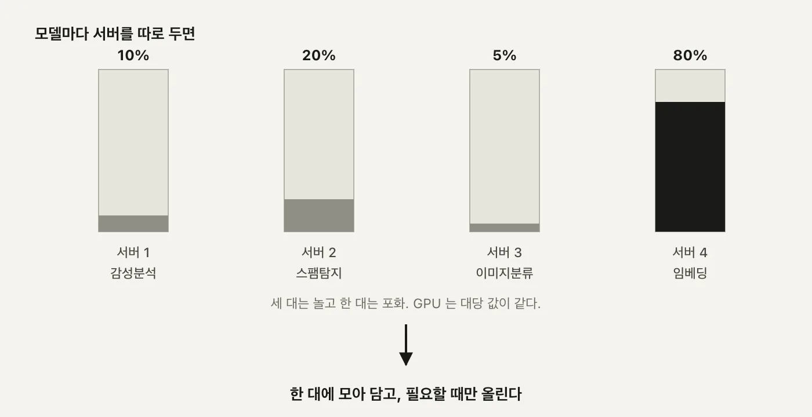
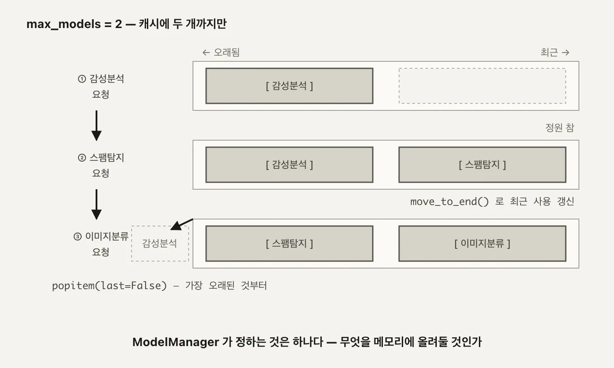
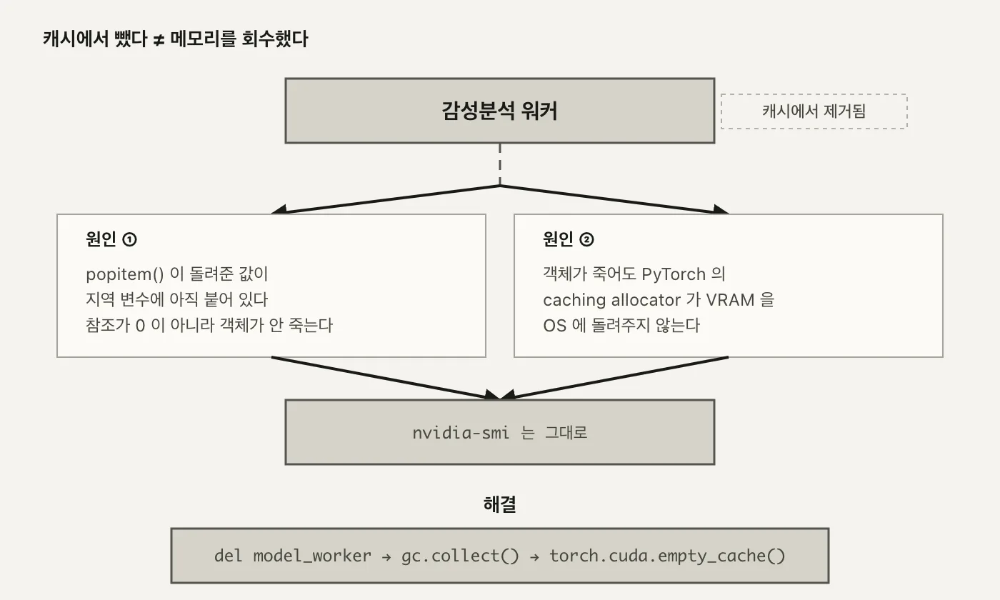
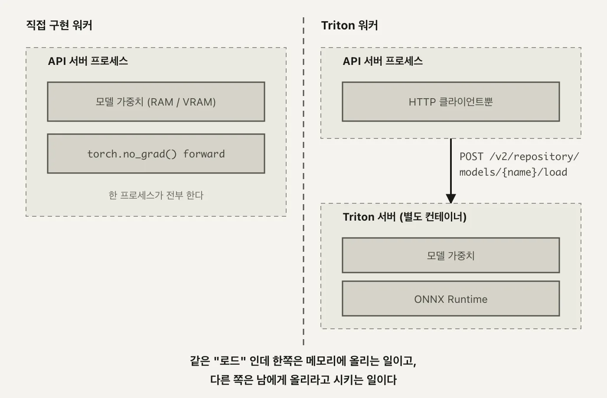
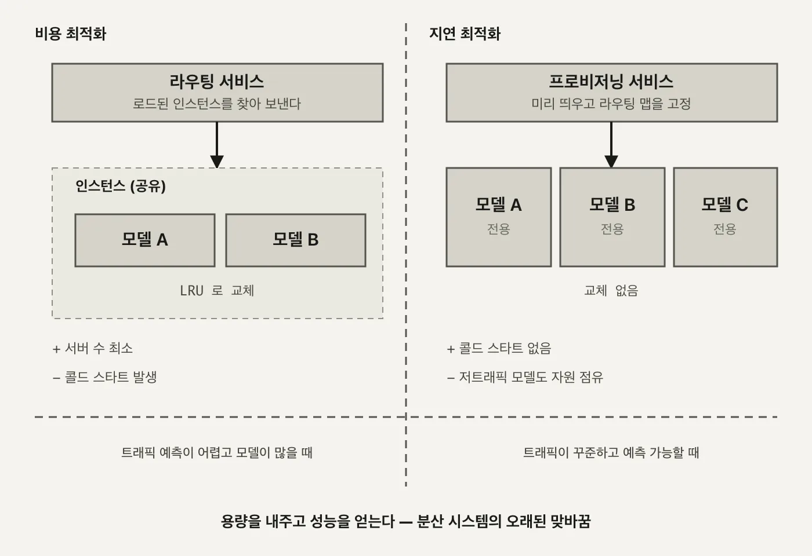

1편에서 요청 하나가 API server부터 GPU 안의 model worker까지 어떻게 내려가는지 봤고, 2편에서 그 요청들을 정적 배치로 묶었고, 3편에서 vLLM에 그 배치를 맡기면서 서비스 인프라·비즈니스 로직·모델 실행이라는 세 겹 구조를 그렸습니다. 지금까지 만든 서버는 이 세 겹 중 어디에 있든 상대하는 모델이 늘 하나였습니다.

실제 서비스는 모델을 하나만 올려두지 않습니다. 감성분석, 스팸탐지, 이미지 분류처럼 성격이 다른 모델 여러 개를 같은 서비스가 나눠 씁니다. 모델마다 서버를 따로 두면 무슨 일이 생기는지, 한 서버가 여러 모델을 안전하게 나눠 쓰려면 무엇을 결정해야 하는지가 이번 편의 주제입니다.

정리한 결정 셋입니다. **ModelManager**는 어떤 모델을 메모리에 올려둘지 LRU 캐시로 정하고, **ModelEngine**은 프레임워크별로 다른 워커를 만들어내고, **Triton**은 그 결정 중 실행 자체를 통째로 다른 서버에 넘깁니다. 마지막에는 이 구조를 비용에 맞출지 지연에 맞출지, 두 가지 설계로 가르겠습니다.

세 결정 모두 겉보기엔 서로 다른 코드 조각처럼 보이지만, 밑에 깔린 질문은 하나입니다. **한정된 자원 앞에서 무엇을 우선할 것인가.** 이 질문이 캐시 정책이 되기도 하고, 워커 클래스 선택이 되기도 하고, 아예 다른 서버로의 위임이 되기도 하는 과정을 순서대로 따라가겠습니다.

---

<nav id="manual-toc" class="manual-toc" aria-label="목차">

### 목차

**[1부. 모델 하나에 서버 하나가 안 되는 이유](#section-1)**

- [1.1 GPU 사용률 10, 20, 5, 80](#s1-1)
- [1.2 다섯 컴포넌트와 서빙 일곱 단계](#s1-2)

**[2부. ModelManager - 무엇을 메모리에 올려둘 것인가](#section-2)**

- [2.1 OrderedDict 하나로 만든 LRU](#s2-1)
- [2.2 framework 문자열 하나로 갈리는 경로](#s2-2)
- [2.3 셋을 불러도 loaded_models 는 둘](#s2-3)
- [2.4 캐시에서 지웠는데 VRAM이 안 줄어든다](#s2-4)

**[3부. Triton에 위임하기](#section-3)**

- [3.1 로드가 HTTP 요청이 되는 순간](#s3-1)
- [3.2 관리 API와 추론 API](#s3-2)

**[4부. 두 가지 설계](#section-4)**

- [4.1 비용 최적화 - 공유 자원과 동적 라우팅](#s4-1)
- [4.2 지연 최적화 - 전용 그룹과 사전 프로비저닝](#s4-2)
- [4.3 LLM에서 되풀이되는 구조](#s4-3)

**[전체 흐름 정리](#section-5)** · **[막혔던 곳](#section-6)** · **[출처](#section-7)**

</nav>

---

## 1부. 모델 하나에 서버 하나가 안 되는 이유

<a id="s1-1"></a>

### 1.1 GPU 사용률 10, 20, 5, 80

모델마다 서버를 따로 두는 구성부터 보겠습니다. 감성분석 서버, 스팸탐지 서버, 이미지 분류 서버, 그리고 트래픽이 몰리는 서버 하나. 넷을 나란히 세워두고 GPU 사용률을 재면 이렇게 나옵니다.

```
서버1 (감성분석)   GPU 사용률 ██░░░░░░░░ 10%
서버2 (스팸탐지)   GPU 사용률 ████░░░░░░ 20%
서버3 (이미지분류) GPU 사용률 █░░░░░░░░░  5%
서버4 (트래픽 몰림) GPU 사용률 ████████░░ 80%

                    → 한 대에 몰아넣으면?
```

<figure>
  
  <figcaption>세 서버는 GPU를 사서 놀리고 있고, 한 서버만 포화 직전입니다. 숫자 넷을 문장으로 쓰면 그냥 지나가지만, 막대로 나란히 놓으면 <strong>왜 한 대로 몰아야 하는지</strong>가 바로 보입니다. (자작 도식)</figcaption>
</figure>

10%, 20%, 5%짜리 서버는 GPU 한 장을 거의 놀리는 셈이고, 80%짜리 서버는 조금만 더 몰리면 큐가 쌓입니다. 서버 대수를 GPU 대수만큼 사놓고 이 불균형을 방치하는 건 돈 낭비입니다. 답은 간단해 보입니다. **모델 넷을 서버 한 대에 몰아넣으면 됩니다.**

이런 불균형은 대개 의도적으로 생기지 않습니다. 팀마다 모델을 하나씩 만들고, 각자 자기 서버를 띄우다 보면 자연스럽게 이렇게 흩어집니다. 누구도 "GPU를 낭비하자"고 결정한 적은 없는데, 결과는 낭비입니다.

여기서 "몰아넣는다"가 2편의 배칭과 헷갈릴 수 있어 미리 갈라두겠습니다. 2편의 배칭은 **같은 모델**에 온 요청 여럿을 한 배치로 묶는 이야기였습니다. 이번 편은 **서로 다른 모델**을 한 프로세스가 나눠 쓰는 이야기라, 애초에 같은 배치로 묶일 수가 없습니다. 감성분석 요청과 이미지 분류 요청은 입력 형태부터 다르니까요. 이번 편에서 공유하는 건 배치가 아니라 **GPU라는 자원 그 자체**입니다.

그런데 몰아넣는 순간 질문 셋이 따라옵니다.

- **프레임워크가 다르면 어떻게 하나** - 감성분석은 Transformers, 이미지 분류는 TorchVision을 쓸 수 있습니다. 모델마다 추론 코드가 다릅니다.
- **API를 어떻게 통일하나** - 클라이언트는 어떤 모델이든 같은 방식으로 요청을 보내고 싶어합니다.
- **자원을 어떻게 관리하나** - 넷을 한꺼번에 다 올려두면 원래 문제로 되돌아갑니다. 필요할 때만 올리고, 다 못 올리면 무언가를 내려야 합니다.

이 세 질문에 대한 답이 각각 **프레임워크 교차 지원**, **통일된 API**, **자원 관리(필요할 때 로드 + LRU 축출)**입니다. 이 세 가지가 이번 편에서 만드는 구조의 설계 목표입니다.

**왜 중요한가** - 서버를 합치는 것 자체는 인프라 작업이지만, 합친 뒤에도 안전하게 돌아가게 만드는 건 소프트웨어 설계 문제입니다. 이 세 목표를 어떤 컴포넌트가 나눠 맡는지가 1.2절부터 이어지는 이야기의 뼈대입니다.

세 목표를 하나씩 풀어보면 이렇습니다.

- **프레임워크 교차 지원** - Transformers로 학습된 모델과 TorchVision으로 학습된 모델은 로딩 방식도, 입력 전처리도, 추론 호출 방식도 다릅니다. 이 차이를 API 바깥으로 감춰야 클라이언트가 프레임워크를 신경 쓰지 않아도 됩니다.
- **통일된 API** - 클라이언트 입장에서는 `/predict`에 `model_id`만 넘기면 됩니다. 그 뒤에서 어떤 프레임워크가 돌아가는지는 서버의 책임입니다.
- **자원 관리** - GPU 메모리는 유한하니 모든 모델을 상시 대기시킬 수 없습니다. 필요할 때 올리고, 자리가 없으면 가장 안 쓰는 것부터 내려야 합니다.

세 목표 중 마지막이 이번 편의 절반을 차지합니다. 프레임워크를 감추고 API를 통일하는 건 한 번 설계하면 끝나지만, 자원 관리는 요청이 들어올 때마다 매번 다시 판단해야 하는 문제라서입니다.

<a id="s1-2"></a>

### 1.2 다섯 컴포넌트와 서빙 일곱 단계

세 목표를 만족하려고 컴포넌트를 다섯으로 나눕니다.

- **API server** - 요청을 받는 창구. `/predict`로 들어오는 모든 모델의 요청을 같은 형식으로 받습니다.
- **Model manager** - 이 구조의 중심. 어떤 모델이 지금 메모리에 있는지 캐시로 들고 있고, 캐시가 차면 무엇을 뺄지 정합니다.
- **Model store** - 메타데이터 창고. 모델 자체가 아니라 "이 모델은 어떤 프레임워크고 이름이 뭔지"를 알려줍니다.
- **Model engine** - 워커 팩토리. 메타데이터의 프레임워크 값을 보고 알맞은 워커를 만듭니다.
- **Model worker** - 실제 추론이 일어나는 자리. 프레임워크마다 코드가 다릅니다.

다섯 중 상태를 실제로 들고 있는 건 Model manager 하나뿐입니다. Model store는 파일 하나를 읽어 그대로 들고 있을 뿐 바뀌지 않고, Model engine은 요청받은 대로 객체를 만들어 넘길 뿐이고, Model worker는 자기가 언제 캐시에서 빠질지도 모릅니다. "지금 무엇이 메모리에 있는가"라는, 시시각각 바뀌는 유일한 상태가 Model manager에 모여 있어서 이 컴포넌트가 중심이 됩니다.

이름만 나열하면 순서가 안 잡히니, 요청 하나가 도는 일곱 단계로 이어보겠습니다.

```
1) 클라이언트 요청           POST /predict {model_id, input_data}
2) 모델 조회                 Model manager가 캐시를 확인
3) (캐시 미스면) 메타데이터 조회  Model store에서 프레임워크·이름 확인
4) 워커 생성                 Model engine이 프레임워크에 맞는 워커를 생성
5) 워커 등록                 캐시가 차 있으면 LRU로 하나 축출 후 등록
6) 추론                     Model worker가 실제로 forward
7) 응답                     결과를 클라이언트에 반환
```

2번에서 캐시 히트면 3~5번은 건너뛰고 바로 6번으로 갑니다. 캐시 미스일 때만 메타데이터를 조회하고 워커를 새로 만드는 비용을 치릅니다. 서버를 막 띄운 시점에는 캐시가 비어 있으니 첫 요청은 어떤 모델이든 무조건 3~5번을 전부 거칩니다. 그다음부터 같은 모델이 다시 들어오면 캐시 히트로 바로 6번입니다.

3번의 메타데이터가 실제로 어떤 모양인지 보겠습니다.

```json
{
  "id": "550e8400-e29b-41d4-a716-446655440000",
  "name": "distilbert-base-uncased-finetuned-sst-2-english",
  "type": "text",
  "framework": "transformers",
  "version": "1.0.0"
}
```

이 한 줄이 4번(어떤 워커 클래스를 만들지)과 6번(어떤 코드로 추론할지)을 전부 결정합니다. Model manager도 Model engine도 이 프레임워크 문자열만 보고 갈 길을 정합니다.

이 메타데이터를 관리하는 게 Model store입니다.

```python
class ModelMetadata(BaseModel):
    id: str
    name: str
    type: str
    framework: str
    version: str
    description: str

class ModelStore:
    def __init__(self, config_path: str):
        self.models: Dict[str, ModelMetadata] = {}
        self._load_config(config_path)

    def _load_config(self, config_path: str):
        with open(config_path, "r") as f:
            config = json.load(f)
            for model in config["models"]:
                self.models[model["id"]] = ModelMetadata(**model)
```

Model store에는 **모델 자체가 아니라 모델을 어떻게 실행할지 알려주는 메타데이터**만 있습니다. 실제 서비스라면 이 정보가 원격 데이터베이스나 메타데이터 서비스에 있겠지만, 여기서는 로컬 JSON 파일 하나(`config/models.json`)를 읽어 메모리에 올려두는 것으로 충분합니다. `_load_config`가 하는 일은 파일을 읽고, `models` 배열의 각 항목을 `ModelMetadata`로 파싱해서 `id`를 키로 하는 딕셔너리에 담는 것뿐입니다.

이 메타데이터의 `id`로 실제로 요청이 도는 걸 따라가 보겠습니다. 클라이언트가 `model_id: 550e8400-e29b-41d4-a716-446655440000`으로 요청을 보내면, 1) API server가 받아 2) Model manager가 캐시를 보고, 미스라면 3) Model store에서 방금 본 그 JSON을 찾아 4) `framework`가 `transformers`니 `TransformerWorker`를 만들고 5) 캐시에 자리가 없으면 LRU로 하나를 뺀 뒤 등록하고 6) 토크나이즈 후 forward로 추론해 7) 결과를 돌려줍니다. 프레임워크가 `torchvision`이나 `triton`이었어도 4번과 6번만 바뀔 뿐 나머지 다섯 단계는 그대로입니다.

다섯 컴포넌트를 실제 파일로 옮기면 이렇습니다.

| 파일 | 줄 수 | 역할 |
|---|---|---|
| `server.py` | 43 | API 엔드포인트 |
| `store.py` | 27 | 메타데이터 조회 |
| `manager.py` | 42 | 캐시·생명주기 |
| `engine.py` | 27 | 워커 팩토리 |
| `worker.py` | 144 | 프레임워크별 실제 추론 |

server.py의 `/predict` 엔드포인트는 이렇게 생겼습니다.

```python
# server.py

class PredictionRequest(BaseModel):
    model_id: str
    input_data: Any

@app.post("/predict")
async def predict(request: PredictionRequest):
    worker = model_manager.get_model_worker(request.model_id)
    if worker is None:
        raise HTTPException(status_code=404, detail="Model not found")
    result = worker.predict(request.input_data)
    return result
```

**왜 중요한가** - `worker.py` 한 파일이 나머지 네 파일(43+27+42+27=139줄)을 합친 것보다도 큽니다. 캐시를 관리하고(`manager.py`), 팩토리 노릇을 하고(`engine.py`), 메타데이터를 읽는(`store.py`) 코드는 전부 얇습니다. 진짜 복잡도는 "프레임워크마다 추론 코드가 다르다"는 사실 하나에 몰려 있고, 그게 그대로 파일 크기로 드러납니다.

이 다섯 컴포넌트는 1편 1.2절에서 본 여섯 컴포넌트(API server, LLM engine, Workload manager, Model executor, Model worker, Model manager)와 이름이 겹치는 것도 있지만 초점이 다릅니다. 그쪽은 모델 하나를 프로세스 경계 너머로 어떻게 서빙하는지 - 즉 CPU 작업과 GPU 작업을 어떻게 갈라둘지가 문제였습니다. 이쪽은 프로세스를 가르는 게 아니라, 같은 프로세스 안에서 **어떤 모델을 메모리에 남겨둘지**를 결정하는 문제입니다. 서로 다른 축의 복잡도라 두 세트가 따로 존재합니다.

---

## 2부. ModelManager - 무엇을 메모리에 올려둘 것인가

<a id="s2-1"></a>

### 2.1 OrderedDict 하나로 만든 LRU

Model manager의 역할은 한 문장으로 줄일 수 있습니다. **어떤 모델을 RAM/VRAM에 올려둘 것인가.** 구현은 Python `OrderedDict` 하나로 끝납니다.

<aside class="callout">
<p class="eyebrow">(용어) LRU</p>

Least Recently Used의 약자로, 캐시가 가득 찼을 때 **가장 오래전에 마지막으로 쓰인 항목**을 빼내는 축출 정책입니다. "먼저 들어온 것"이 아니라 "오래 안 쓴 것"이 기준이라, 자주 쓰이는 항목은 아무리 먼저 들어왔어도 계속 남습니다.

</aside>

```python
# manager.py — get_model_worker() (14-39행)
def get_model_worker(self, model_id: str) -> Optional[ModelWorker]:
    if model_id in self.model_cache:
        self.model_cache.move_to_end(model_id)          # 캐시 히트 - 순서 갱신
        return self.model_engine.get_worker(model_id)

    model_metadata = self.model_store.get_model(model_id)
    if not model_metadata:
        return None

    if len(self.model_cache) >= self.max_models:
        id, model_worker = self.model_cache.popitem(last=False)  # 가장 오래 안 쓴 것
        self.model_engine.delete_worker(id)

    self.model_cache[model_id] = \
        self.model_engine.create_worker(model_metadata)
    return self.model_cache[model_id]
```

`max_models` 기본값은 **2**입니다. 캐시 히트면 `move_to_end`로 그 항목을 맨 뒤로 보내 "방금 썼다"고 표시합니다. 캐시 미스인데 정원이 찼으면 `popitem(last=False)`로 맨 앞(가장 오래 안 쓴 것)을 빼고, `Model engine`에 `delete_worker`를 호출해 워커를 지웁니다.

`id, model_worker = self.model_cache.popitem(last=False)`에서 변수 이름으로 `id`를 쓴 것도 눈에 띕니다. 파이썬 내장 함수 `id()`를 이 스코프 안에서 가리는 셈인데, 바로 다음 줄에서 `self.model_engine.delete_worker(id)`로 그 값을 쓰고 나면 스코프가 끝나니 실질적인 문제는 없습니다. 그래도 같은 이름의 내장 함수가 있다는 걸 알고 나면 한 번은 눈에 걸리는 지점입니다.

`max_models = 2`로 세 번 호출하는 과정을 3단으로 그리면 이렇습니다.

```
① 감성분석 호출     [ 감성분석 ]
② 스팸탐지 호출     [ 감성분석 | 스팸탐지 ]          ← 정원 참
③ 이미지분류 호출   [ 스팸탐지 | 이미지분류 ]
                     ↑ 감성분석이 popitem(last=False)로 빠진다
```

<figure>
  
  <figcaption>정원이 2인 캐시에 세 번째 모델이 들어오는 순간, 맨 앞의 감성분석이 빠집니다. <strong>먼저 로드된 것</strong>이 아니라 <strong>가장 오래 안 쓴 것</strong>이 기준이라는 게 이 3단 그림의 요점입니다. (자작 도식)</figcaption>
</figure>

캐시 히트일 때 반환값이 `self.model_cache[model_id]`가 아니라 `self.model_engine.get_worker(model_id)`라는 점도 눈여겨볼 만합니다. `model_cache`는 캐시 상태(누가 최근에 쓰였는지)만 들고 있고, 워커 객체 자체를 실제로 보관하는 건 `Model engine`입니다. 즉 "무엇을 남길지"를 결정하는 장부와 "그 객체를 실제로 들고 있는" 저장소가 분리돼 있습니다. 2.2절에서 볼 `create_worker`가 `self.workers[model_metadata.id]`라는 딕셔너리에 워커를 담아두는 것도 같은 맥락이고, `get_worker`는 그 딕셔너리에서 이미 만들어진 워커를 그대로 꺼내올 뿐 새로 만들지 않습니다.

`dict` 대신 `OrderedDict`를 쓰는 이유도 여기서 나옵니다. 일반 `dict`는 삽입 순서는 기억해도 "방금 다시 조회했다"는 사건을 순서에 반영할 방법이 없습니다. `move_to_end`가 있어야 캐시 히트가 일어날 때마다 순서를 갱신할 수 있고, 그래야 `popitem(last=False)`가 뽑는 맨 앞이 진짜로 "가장 오래 안 쓴" 항목이 됩니다.

**무엇을 하는가** - 캐시 히트는 순서만 갱신하고, 캐시 미스는 정원 초과 시 하나를 빼고 새로 만듭니다.
**왜 중요한가** - 이 캐시가 이 구조 전체에서 유일하게 "누구를 메모리에 남길까"를 결정하는 지점입니다. 나머지 컴포넌트는 전부 이 결정을 따라갈 뿐입니다.

<a id="s2-2"></a>

### 2.2 framework 문자열 하나로 갈리는 경로

캐시 미스로 워커를 새로 만들어야 할 때, 그 워커의 실체를 정하는 게 Model engine입니다.

```python
# engine.py — create_worker() (14-24행)
def create_worker(self, model_metadata: ModelMetadata) -> ModelWorker:
    if model_metadata.id not in self.workers:
        if model_metadata.framework == "transformers":
            self.workers[model_metadata.id] = TransformerWorker(model_metadata)
        elif model_metadata.framework == "torchvision":
            self.workers[model_metadata.id] = TorchVisionWorker(model_metadata)
        elif model_metadata.framework == "triton":
            self.workers[model_metadata.id] = TritonWorker(model_metadata)
    return self.workers[model_metadata.id]
```

`model_metadata.framework`라는 문자열 하나가 `if/elif` 사슬을 타고 완전히 다른 클래스를 만들어냅니다. **Model engine은 워커 팩토리**라서, 새 프레임워크를 지원하고 싶으면 이 사슬에 분기 하나를 추가하고 워커 클래스 하나를 새로 짜면 됩니다. 캐시 로직도 API 엔드포인트도 건드릴 필요가 없습니다.

이게 가능한 이유는 `ModelWorker`가 추상 클래스라서입니다. `_load_model`과 `predict` 두 메서드만 강제하고 나머지는 구현체 자유입니다. 다섯 번째 프레임워크를 추가한다고 하면 필요한 변경은 셋뿐입니다. 이 두 메서드를 구현한 워커 클래스 하나, `create_worker`의 `elif` 한 줄, 그리고 `models.json`에 항목 하나. `manager.py`도 `server.py`도 한 글자 안 바뀝니다.

`config/models.json`에 등록된 모델 넷이 이 분기를 전부 지나갑니다.

| 모델 | framework | 용도 |
|---|---|---|
| `distilbert-base-uncased-finetuned-sst-2-english` | transformers | 감성분석 |
| `mrm8488/bert-tiny-finetuned-sms-spam-detection` | transformers | 스팸탐지 |
| `pytorch/vision:mobilenet_v2` | torchvision | 이미지 분류 |
| `densenet_onnx` | triton | 이미지 분류(원격) |

넷이 프레임워크 셋(transformers, torchvision, triton), 용도 둘(텍스트 분류, 이미지 분류)에 걸쳐 있습니다. 1.1절에서 목표로 세운 "프레임워크 교차 지원"이 이 표 하나로 구체화된 셈입니다.

`model_id`가 사람이 읽기 쉬운 이름이 아니라 UUID인 것도 눈여겨볼 만합니다. `distilbert-base-uncased-finetuned-sst-2-english`라는 이름은 그대로 두고 실제 가중치 버전만 바뀌어도, 클라이언트가 참조하는 `model_id`는 안 바뀝니다. 사람이 읽는 이름과 시스템이 참조하는 식별자를 분리해두면, 모델을 교체해도 API 계약은 그대로 유지됩니다.

`TransformerWorker`의 추론 코드(`worker.py:27-44`)는 짧습니다.

```python
def predict(self, input_data: Any) -> Dict[str, Any]:
    inputs = self.tokenizer(input_data, return_tensors="pt",
                             padding=True, truncation=True)
    with torch.no_grad():
        outputs = self.model(**inputs)
    predictions = torch.softmax(outputs.logits, dim=-1)
    return {"predictions": predictions.tolist()}
```

토크나이즈하고, `torch.no_grad()`로 그래디언트 추적을 끄고, forward 결과에 `softmax`를 씌워 확률로 바꿉니다. 실제로 호출한 결과입니다.

```bash
curl -X POST http://localhost:8001/predict \
  -H "Content-Type: application/json" \
  -d '{"model_id": "550e8400-e29b-41d4-a716-446655440000",
       "input_data": "This movie was great! I really enjoyed it."}'

→ {"predictions":[[0.00011904446000698954,0.9998809099197388]]}
```

부정 0.0001, 긍정 0.9999. 이 호출을 두 번 반복하면 첫 번째는 가중치 로딩(캐시 미스)에서 끝나고, 두 번째부터 캐시에 있는 모델을 재사용하며 결과가 바로 나옵니다. 스팸탐지도 같은 `TransformerWorker` 경로를 타지만 모델이 다릅니다.

```bash
curl -X POST http://localhost:8001/predict \
  -H "Content-Type: application/json" \
  -d '{"model_id": "6ba7b810-9dad-11d1-80b4-00c04fd430c8",
       "input_data": "Win a free iPhone now!"}'

→ {"predictions":[[0.9324164986610413,0.06758350878953934]]}
```

`TorchVisionWorker`(`worker.py:46-73`)는 프레임워크가 아예 다르니 전처리부터 다릅니다. 토크나이저 대신 `transforms.Compose`로 이미지를 리사이즈·정규화하고, `torch.hub`로 `mobilenet_v2`를 받아옵니다. 그래도 `torch.no_grad()`로 감싸고 `softmax`로 마무리하는 큰 골격은 `TransformerWorker`와 같습니다.

이 워커가 처음 호출될 때 사전학습 가중치를 내려받는 로그가 실제로 찍힙니다.

```
Downloading: "https://download.pytorch.org/models/mobilenet_v2-7ebf99e0.pth"
to /root/.cache/torch/hub/checkpoints/mobilenet_v2-7ebf99e0.pth
```

`mobilenet_v2` 가중치는 **13.6MB**로, 캐시 미스가 나는 순간 이렇게 한 번 받아오고 이후로는 로컬 캐시를 씁니다.

`TritonWorker`(`worker.py:75-145`)는 골격 자체가 다릅니다. `_load_model`과 `predict` 둘 다 로컬에서 `torch.no_grad()`를 부르지 않는데, 그 이야기는 3부에서 이어가겠습니다. 서버는 포트 **8001**에서 이 넷을 전부 같은 `/predict` 엔드포인트로 받습니다.

<a id="s2-3"></a>

### 2.3 셋을 불러도 loaded_models 는 둘

`max_models = 2`가 코드 상수로만 존재하는지, 실제로 그렇게 도는지 확인해보겠습니다. 감성분석 → 스팸탐지 → 이미지분류 순서로 호출한 뒤, 그때그때 `/models`로 캐시 상태를 봅니다.

`/models` 엔드포인트는 키가 두 개입니다. `available_models`는 Model store가 아는 전체 목록이고, `loaded_models`는 지금 이 순간 Model manager 캐시에 실제로 올라와 있는 것만 걸러낸 목록입니다. 전자는 `config/models.json`을 읽은 결과라 서버가 살아있는 한 고정이고, 후자만 요청이 오갈 때마다 바뀝니다.

감성분석을 부르기 전에는 `loaded_models`가 비어 있습니다. 감성분석을 한 번 부르고 나면 이렇습니다.

```json
"loaded_models": {
  "550e8400-e29b-41d4-a716-446655440000": "distilbert-base-uncased-finetuned-sst-2-english"
}
```

스팸탐지까지 부르면 정원(2)이 찹니다.

```json
"loaded_models": {
  "550e8400-e29b-41d4-a716-446655440000": "distilbert-base-uncased-finetuned-sst-2-english",
  "6ba7b810-9dad-11d1-80b4-00c04fd430c8": "mrm8488/bert-tiny-finetuned-sms-spam-detection"
}
```

이미지분류(`mobilenet_v2`)까지 부르면, 정원 초과라 `popitem(last=False)`가 가장 오래 안 쓴 감성분석을 빼냅니다.

```json
"loaded_models": {
  "6ba7b810-9dad-11d1-80b4-00c04fd430c8": "mrm8488/bert-tiny-finetuned-sms-spam-detection",
  "7c9e6679-7425-40de-944b-e07fc1f90ae7": "pytorch/vision:mobilenet_v2"
}
```

셋을 다 불렀는데도 `loaded_models` 길이는 **항상 둘**이고, 맨 처음 불렀던 감성분석이 맨 먼저 빠집니다. 2.1절의 3단 그림이 이 curl 세 번의 실제 결과입니다.

이 구조를 검증하는 테스트도 있습니다. `pytest tests/test_models.py -v`를 처음 돌리면 **`1 failed, 6 passed in 54.55s`**가 나옵니다. `test_models.py`는 FastAPI `TestClient`로 `app.server.app`을 인메모리에서 직접 호출하며 네 프레임워크(Transformers×2, TorchVision, Triton) 전체를 검증하는 통합 테스트입니다.

| 테스트 | 검증 내용 |
|---|---|
| `test_list_models` | `/models` GET → `available_models`/`loaded_models` 키 존재 확인 |
| `test_sentiment_model` | 감성분석 예측 결과를 실제 HF 모델의 라벨과 비교 |
| `test_spam_model` | 스팸탐지 예측 결과 확인 |
| `test_image_model` | `TorchVisionWorker`로 `cat1.jpg` 분류 |
| `test_image2_triton_model` | `TritonWorker`로 이미지를 전처리해 원격 분류 - Triton 서버가 없으면 실패 |
| `test_invalid_model_id` | 존재하지 않는 `model_id` → 404 확인 |
| `test_model_cache` | 모델 3종 연속 호출 후 `loaded_models` 개수가 `max_models=2` 이하인지 확인 |

통과한 여섯 개 안에 `test_model_cache`가 있고, 실패한 하나가 `test_image2_triton_model`입니다. Triton 서버가 아직 없어서 예정된 실패입니다. 이 실패를 어떻게 없애는지가 3부의 내용입니다.

다만 `test_model_cache`를 열어보면 짚이는 게 있습니다. **200 응답과 `loaded_models` 길이만 단언**하고, 정확히 어느 모델이 빠졌는지는 확인하지 않습니다. 상한 2가 지켜지는 것만 볼 뿐, 2.1절에서 본 "가장 오래 안 쓴 것"이라는 정책 자체가 맞는지는 이 테스트만으로는 알 수 없습니다.

<a id="s2-4"></a>

### 2.4 캐시에서 지웠는데 VRAM이 안 줄어든다

`popitem`으로 캐시에서 빼고 `delete_worker`까지 불렀는데, `nvidia-smi`를 보면 VRAM 숫자가 그대로인 경우가 있습니다. 원인이 두 겹입니다.

- **지역 변수가 아직 붙들고 있다** - `popitem()`이 돌려준 값이 `id, model_worker = ...`로 지역 변수 `model_worker`에 담기는데, 함수가 끝날 때까지 이 변수가 살아 있어 참조 카운트가 0이 되지 않습니다. 객체가 안 죽었으니 GPU 메모리도 그대로입니다.
- **죽어도 PyTorch가 돌려주지 않는다** - 참조가 사라져 객체가 실제로 소멸해도, PyTorch의 caching allocator는 한번 확보한 VRAM을 재사용하려고 쥐고 있을 뿐 OS에 반환하지 않습니다.

두 원인은 층이 다릅니다. 첫 번째는 파이썬의 참조 카운트 문제고, 두 번째는 PyTorch가 자체적으로 관리하는 메모리 풀 문제입니다. 파이썬 쪽만 고쳐서 객체를 확실히 죽여도, PyTorch의 caching allocator가 여전히 VRAM을 쥐고 있으면 `nvidia-smi` 숫자는 그대로입니다. `gc.collect()`가 필요한 이유도 여기 있습니다. 단순 참조 카운트가 0이 안 되는 순환 참조(워커가 자기 자신을 가리키는 콜백을 들고 있는 경우 등)까지 정리해야, 그다음에 부르는 `torch.cuda.empty_cache()`가 실제로 회수할 게 남아 있는 상태가 됩니다.

```
캐시에서 뺐다              [ 감성분석 ] ✗ 제거됨
      │
      ├─ ① 지역 변수 model_worker 가 아직 붙들고 있다
      │      → 참조 카운트가 0이 아니라 객체가 안 죽는다
      │
      └─ ② 죽어도 PyTorch caching allocator 가
             VRAM 을 OS 에 안 돌려준다

nvidia-smi 는 그대로     해결: del + gc.collect() + torch.cuda.empty_cache()
```

<figure>
  
  <figcaption>원인이 하나가 아니라 두 겹이라는 게 이 그림의 요점입니다. 객체를 죽이는 문제와 메모리를 돌려받는 문제가 <strong>서로 다른 층</strong>에 있어서, 하나만 고치면 여전히 VRAM이 그대로입니다. (자작 도식)</figcaption>
</figure>

해법은 셋을 다 하는 것입니다.

```python
# manager.py — get_model_worker() 안, eviction 블록
if len(self.model_cache) >= self.max_models:
    id, model_worker = self.model_cache.popitem(last=False)
    self.model_engine.delete_worker(id)
    del model_worker                      # 마지막 참조 제거
    gc.collect()                          # 순환 참조까지 정리
    if torch.cuda.is_available():
        torch.cuda.empty_cache()          # allocator가 쥔 VRAM 반환
```

**왜 중요한가** - "모델 객체를 버리는 것"과 "메모리를 실제로 회수하는 것"은 다른 문제입니다. 캐시 상한을 지켰는데도 OOM이 나는 전형적인 원인이 이것입니다. `max_models`를 아무리 정확히 지켜도, `del`과 `empty_cache()`를 빠뜨리면 캐시 밖에서 VRAM이 계속 쌓입니다.

이 `del model_worker` 한 줄에는 부수 효과도 있습니다. 3부에서 볼 `TritonWorker`는 `__del__`에서 원격 unload를 호출하는데, `del`이 없으면 이 소멸자 호출이 함수가 완전히 끝날 때까지 밀립니다. `del`을 넣어야 축출 즉시 unload 요청이 나가고, Triton 쪽 로그에서 로드-축출이 바로 맞물려 관찰됩니다.

이 절 전체에서 믿을 수 있는 지표는 결국 하나입니다. `loaded_models`나 캐시 길이 같은 애플리케이션 쪽 카운터가 아니라 **`nvidia-smi`가 보여주는 실제 하드웨어 숫자**입니다. 캐시에서 빠졌다는 로그가 찍혀도, `del`과 `empty_cache()`가 빠지면 그 로그는 진실을 반쪽만 말하는 셈입니다.

`torch.cuda.empty_cache()`가 만능은 아니라는 점도 짚어둘 만합니다. 이 호출은 PyTorch의 caching allocator가 **더는 안 쓰는데도 쥐고 있던** 블록만 OS에 돌려줍니다. 다음번에 새 모델을 로드하면 PyTorch는 다시 그만큼의 VRAM을 요청할 것이고, allocator는 또 그 블록을 쥐게 됩니다. `empty_cache()`는 "당장 회수"를 위한 것이지, 애초에 캐싱 자체를 막는 스위치가 아닙니다.

---

## 3부. Triton에 위임하기

<a id="s3-1"></a>

### 3.1 로드가 HTTP 요청이 되는 순간

지금까지의 두 워커(`TransformerWorker`, `TorchVisionWorker`)는 이 프로세스 안에서 직접 forward를 돌립니다. `TritonWorker`는 다릅니다. 모델 가중치도, 추론 연산도 이 프로세스 안에 없습니다.

```
[직접 구현 워커]                    [Triton 워커]

API 서버 프로세스                    API 서버 프로세스
  └ 모델 가중치 (RAM/VRAM)             └ HTTP 클라이언트뿐
  └ torch.no_grad() forward                    │ POST /v2/repository/
                                               │      models/{name}/load
                                               ▼
                                    Triton 서버 (별도 컨테이너)
                                      └ 모델 가중치
                                      └ ONNX Runtime
```

<figure>
  
  <figcaption>같은 "워커"라는 이름인데 왼쪽은 가중치를 들고 있고 오른쪽은 <strong>HTTP 클라이언트뿐</strong>입니다. "로드"라는 같은 단어가 왼쪽에서는 메모리 적재, 오른쪽에서는 원격 호출이라는 게 이 대비의 요점입니다. (자작 도식)</figcaption>
</figure>

```python
# worker.py — TritonWorker
class TritonWorker(ModelWorker):
    def __init__(self, model_metadata):
        self.triton_url = "0.0.0.0:8009"
        self.client = httpclient.InferenceServerClient(url=self.triton_url)

    def _load_model(self):
        load_url = (
            f"http://{self.triton_url}/v2/repository/models/"
            f"{self.model_metadata.name}/load"
        )
        response = requests.post(load_url)
```

`_load_model`이 하는 일은 로드가 아니라 **"로드해달라"는 HTTP 요청**입니다. `requests.post(load_url)`이 끝나는 순간, 가중치는 Triton 서버 쪽 메모리에 올라가 있고 이쪽 프로세스에는 아무 것도 없습니다.

3편 4.2절에서 서비스 인프라·비즈니스 로직·모델 실행 세 겹을 나눴을 때, 모델 실행(Part C)은 "실무에서는 대부분 vLLM이나 Triton 같은 전용 서버에 위임한다"고 짚었습니다. `TritonWorker`가 정확히 그 위임의 실물입니다. 이 API 서버는 여전히 캐시 관리(Part B)를 맡고, 무거운 추론은 통째로 Part C인 Triton으로 넘어갑니다.

Triton 서버는 도커로 별도 기동합니다.

```bash
docker run -p8009:8000 -p8010:8001 -p8011:8002 \
  -v $(pwd)/model_dir:/models \
  nvcr.io/nvidia/tritonserver:24.12-py3 \
  tritonserver --model-repository=/models --model-control-mode=explicit
```

Triton은 컨테이너 안에서 HTTP 8000·gRPC 8001·메트릭 8002 세 포트를 쓰는데, 이 셋을 호스트의 8009·8010·8011로 매핑합니다. `--model-control-mode=explicit`이 붙어야 모델 파일이 저장소에 있어도 자동으로 로드하지 않고, 관리 API로 명시적으로 요청할 때만 로드합니다. 이게 있어야 3.1절에서 본 `_load_model`의 `requests.post`가 실제로 "로드 시점"을 결정하는 스위치가 됩니다.

테스트에서는 이 서버를 별도 서비스가 아니라 **같은 파드의 사이드카 컨테이너**로 붙였습니다. 이유는 하나입니다. `TritonWorker.__init__`이 `0.0.0.0:8009`를 하드코딩하고 있어서, 별도 네트워크의 서비스로 띄우면 주소가 맞지 않습니다. 사이드카로 붙이면 같은 파드라 `localhost`가 그대로 통하고, 테스트 코드를 손댈 필요가 없습니다. Triton의 gRPC 포트(8001)는 이 프로세스의 `app.server`가 이미 쓰고 있어서 꺼뒀습니다.

`docker run`의 `-v $(pwd)/model_dir:/models`도 사이드카 구성에서 그대로 의미가 이어집니다. Triton 컨테이너와 API 서버 컨테이너가 같은 파드 안에서 같은 PVC(모델 저장소)를 공유해야, API 서버가 `model_dir`에 배치해둔 `densenet_onnx`를 Triton이 그대로 찾아 로드할 수 있습니다. 네트워크만 같은 파드로 묶는 게 아니라 파일시스템도 같이 묶어야 관리 API의 `/load` 요청이 실제로 성공합니다.

컨테이너 안을 들여다보면 프로세스가 단출합니다.

```bash
docker exec -it triton-densenet ps -ef
UID   PID   PPID  C STIME TTY  TIME CMD
root    1     0    0 13:59 ?   00:00:00 tritonserver --model-repository=/models --model-control-mode=explicit
```

`tritonserver` 프로세스 하나뿐입니다. `app.server` 쪽에서 보면 이 컨테이너는 그냥 특정 포트로 HTTP 요청을 받아주는 블랙박스이고, 그 안에서 무슨 프레임워크(ONNX Runtime, TensorRT 등)로 실제 forward가 도는지는 신경 쓸 필요가 없습니다.

처음 `pytest tests/test_models.py -v`를 돌렸을 때 결과가 **`1 failed, 6 passed in 54.55s`**였고, 실패한 `test_image2_triton_model`이 바로 이 Triton 서버 부재 때문이었습니다. 사이드카를 붙이고 `tests/test_triton_densenet.py`와 함께 다시 돌리면 **`4 passed in 13.88s`**로 바뀝니다. Triton 이미지는 약 14GB라 처음 받는 데 약 14분이 걸리지만, 노드에 한 번 캐시되면 그다음부터는 즉시 뜹니다.

<a id="s3-2"></a>

### 3.2 관리 API와 추론 API

Triton은 HTTP로 두 종류의 API를 내놓습니다.

- **관리 API** - `/v2/repository/models/{name}/load`, `/v2/repository/models/{name}/unload`. 모델을 올리고 내립니다.
- **추론 API** - `/v2/models/{name}/infer`. 실제 예측 요청을 보냅니다.

두 API가 나뉘어 있다는 게 핵심입니다. "이 모델을 쓸 준비를 해달라"는 요청과 "이 입력으로 예측해달라"는 요청이 서로 다른 엔드포인트라, `TritonWorker`도 이 구분을 그대로 따라갑니다. `_load_model`이 관리 API를 부르고, `predict`가 추론 API를 부릅니다.

`predict`는 입력을 Triton이 요구하는 텐서 포맷으로 바꾸는 일이 대부분입니다.

```python
def predict(self, input_data: Dict[str, Any]) -> Dict[str, Any]:
    array = np.array(input_data["data"], dtype=np.float32).reshape(input_data["shape"])
    input_tensor = httpclient.InferInput("data_0", array.shape, "FP32")
    input_tensor.set_data_from_numpy(array)

    output_name = "fc6_1"   # DenseNet 전용 하드코딩
    response = self.client.infer(
        model_name=self.model_metadata.name,
        inputs=[input_tensor],
        outputs=[httpclient.InferRequestedOutput(output_name)]
    )
    return {output_name: response.as_numpy(output_name).tolist()}
```

입력을 `np.float32`로 바꿔 `InferInput`으로 감싸고, `client.infer()`에 넘깁니다. 출력 텐서 이름 `fc6_1`은 이 예제가 DenseNet 하나만 겨냥한 것이라 문자열로 박혀 있습니다. 다른 모델을 추가하면 이 이름도 같이 바꿔야 합니다.

2.2절에서 본 `ModelEngine`의 팩토리 분기는 프레임워크가 늘어도 일반적으로 확장되지만, `TritonWorker.predict` 자체는 그렇지 않습니다. Triton에 올리는 모델이 DenseNet 말고 하나 더 생기면 `output_name`을 그 모델에 맞게 또 하드코딩해야 합니다. 위임한 건 실행이지, 그 실행 결과를 해석하는 책임까지 위임되진 않은 셈입니다.

워커가 소멸할 때는 `__del__`이 unload API를 호출해 Triton 쪽 자원을 정리합니다.

```python
def __del__(self):
    try:
        requests.post(f"http://{self.triton_url}/v2/repository/models/"
                       f"{self.model_metadata.name}/unload")
    except:
        pass
```

`except: pass`로 에러를 통째로 삼키는 게 여느 곳이었으면 지적할 대목이지만, 여기서는 의도된 선택에 가깝습니다. `__del__`은 파이썬이 가비지 컬렉션 도중에 호출하는데, 이 시점에 네트워크 예외가 위로 전파되면 인터프리터 종료 절차 자체가 꼬일 수 있습니다. "정리가 실패해도 프로세스 종료는 막지 않는다"는 판단이 이 한 줄에 들어 있습니다.

모델 저장소에 넣는 `config.pbtxt`는 입력과 출력 형태를 이렇게 선언합니다.

```
name: "densenet_onnx"
platform: "onnxruntime_onnx"
max_batch_size: 0
input [
  { name: "data_0", data_type: TYPE_FP32, dims: [ 3, 224, 224 ] }
]
output [
  { name: "fc6_1", data_type: TYPE_FP32, dims: [ 1000 ] }
]
```

이 설정 파일은 모델 저장소 안에서 정해진 디렉터리 구조를 따라야 합니다.

```
model_dir/
└── densenet_onnx
    ├── 1
    │   └── model.onnx
    ├── config.pbtxt
    └── densenet_labels.txt
```

`1`이라는 숫자 폴더가 모델 버전입니다. 관리 API의 `load` 요청이 오면 Triton은 `densenet_onnx` 폴더 밑에서 `config.pbtxt`를 읽어 입출력 형태를 확인하고, 버전 폴더 안의 `model.onnx`를 실제로 메모리에 올립니다.

`platform: "onnxruntime_onnx"`가 Triton이 ONNX Runtime 백엔드로 이 모델을 돌린다는 선언입니다. Triton은 PyTorch, TensorFlow, ONNX, TensorRT 등 서로 다른 포맷의 모델을 같은 HTTP/gRPC API로 서빙할 수 있는데, 그 프레임워크마다 다른 실행 방식이 바로 이 `platform` 한 줄 뒤로 숨습니다. `TritonWorker` 입장에서는 백엔드가 ONNX Runtime이든 TensorRT든 호출 코드가 똑같습니다.

여기서 짚어야 할 게 `max_batch_size: 0`입니다. Triton은 여러 요청을 모아 한 번에 처리하는 다이내믹 배칭 기능으로 유명하지만, **이 값이 0이면 이 데모에서는 그 기능이 아예 안 쓰입니다.** 지금 붙인 건 Triton의 모델 관리 API와 단발 추론 API뿐이고, 2편에서 본 배칭이나 3편에서 본 continuous batching과는 무관합니다. Triton을 붙였다고 배칭이 저절로 따라오지는 않습니다.

`cat1.jpg`를 224×224로 리사이즈·정규화·CHW 변환해 넣으면 `EGYPTIAN CAT`(인덱스 285, logit 11.5)으로 분류됩니다. 이 결과가 나온다는 게 로드-추론-언로드 세 API가 실제로 맞물려 돈다는 증거입니다.

이걸 검증하는 테스트가 따로 있습니다. `pytest tests/test_triton_densenet.py`를 사이드카와 함께 돌리면 셋 다 통과합니다.

| 테스트 | 검증 내용 |
|---|---|
| `test_model_loading` | 관리 API로 `densenet_onnx` 로드 → 200 OK |
| `test_model_inference` | `cat1.jpg`를 정규화 후 추론 요청 → `fc6_1` shape `(1000,)` 확인 |
| `test_model_unloading` | unload API 호출 → 200 OK |

이 셋과 앞서 실패했던 `test_image2_triton_model`을 함께 돌린 결과가 **`4 passed in 13.88s`**입니다. 3.1절에서 본 `1 failed, 6 passed`의 그 실패 하나가 여기서 마저 통과로 바뀌면서, `test_models.py`와 `test_triton_densenet.py` 두 스위트가 합쳐 전부 통과하는 상태가 됩니다.

---

## 4부. 두 가지 설계

<aside class="callout">
<p class="eyebrow">(용어) 콜드 스타트</p>

메모리에 없는 모델(또는 아직 뜨지 않은 인스턴스)에 요청이 들어와, 가중치를 새로 불러오거나 자원을 새로 띄우는 동안 응답이 지연되는 상황입니다. 이미 떠 있는 모델에 요청이 가는 "핫" 상태와 대비됩니다.

</aside>

멀티 모델 서빙이 특히 힘을 발휘하는 건 모델은 많은데 전부를 동시에 쓰지는 않을 때입니다. 하루 3~4시간만 도는 예약 처리 작업이라면, 모델마다 컨테이너를 따로 띄워두는 대신 필요할 때 불러 쓰고 끝나면 자원을 돌려주면 됩니다. 고객 1,000명 몫으로 모델 1,000개를 학습시켰어도, 전부가 동시에 요청을 받는 건 아니니 최대 200개만 동시에 호스팅하도록 제한하고 나머지는 요청이 올 때마다 그때그때 불러올 수 있습니다. 2부에서 만든 LRU 캐시가 정확히 이 상황을 위한 장치입니다.

그래도 과제가 둘 남습니다. **콜드 스타트 지연** - 아직 로드 안 된 모델을 부르면 가중치를 새로 받고 초기화하는 동안 수십 초까지 걸릴 수 있습니다. 그 요청 하나가 스레드나 커넥션을 그만큼 오래 붙들고 있으면 뒤따르는 요청들이 대기열에 쌓이고, 타임아웃이 이 서비스를 호출한 상위 애플리케이션까지 연쇄적으로 퍼집니다. **핫 모델 확장** - 인스턴스마다 LRU 캐시가 각자의 트래픽만 보고 독립적으로 판단하니, 특정 시점에 어떤 모델이 어느 인스턴스들에 떠 있는지가 인스턴스마다 다르게 갈립니다. 그 모델을 복제해서 늘리고 라우팅을 갱신하는 일이 복잡해지고, 결과도 매번 조금씩 다르게 나오는 비결정적 동작이 됩니다.

<figure>
  
  <figcaption>왼쪽은 인스턴스 하나에 여러 모델이 LRU로 오가고, 오른쪽은 모델마다 전용 그룹이 따로 서 있습니다. <strong>자원을 나누는 방식 자체가 다르다</strong>는 게 두 설계의 진짜 차이입니다. (자작 도식)</figcaption>
</figure>

<a id="s4-1"></a>

### 4.1 비용 최적화 - 공유 자원과 동적 라우팅

지금까지 만든 것이 바로 이 설계입니다. 여러 모델이 인스턴스 자원을 공유하고, 요청이 오면 온디맨드로 로드하며(2부의 LRU), 이미 로드된 인스턴스를 찾아 동적으로 라우팅합니다. 서버 수를 최소화하고 빈 패킹으로 몰아 담는 게 목표입니다. 지금까지 2부·3부에서 만든 `ModelManager`와 `ModelEngine`이 인스턴스 한 대 안의 이야기였다면, 이 설계는 그런 인스턴스를 여러 대 두고 그 위에 라우팅 계층 하나를 더 얹은 것입니다.

이 상위 라우팅 계층이 하는 일은 셋입니다. 어떤 모델이 어느 인스턴스에 로드돼 있는지 매핑을 유지하고, 이미 로드된 인스턴스로 요청을 보내 콜드 스타트를 줄이고, 트래픽이 몰리는 모델은 여러 인스턴스에 복제해 수평 확장합니다. 그리고 신규 모델을 배치할 때는 **빈 패킹**으로 최소한의 서버 수에 몰아 담습니다. 1.1절에서 본 그 10%·20%·5% 인스턴스들에 새 모델을 끼워 넣는 결정이 바로 이 라우팅 계층의 몫입니다.

한계는 **반응형**이라는 것입니다. 트래픽 급증을 미리 막지 못하고 늘 뒤쫓습니다. 라우팅·스케일링·캐시 상태 일관성까지 관리해야 해서 운영 복잡도도 올라갑니다.

<a id="s4-2"></a>

### 4.2 지연 최적화 - 전용 그룹과 사전 프로비저닝

반대 방향의 설계도 있습니다. 모델마다 전용 인스턴스 그룹을 미리 띄워두고, 클라이언트가 예측 요청을 보내기 전에 프로비저닝 서비스를 먼저 불러 라우팅 맵을 갱신한 뒤, 이후 요청은 그 맵을 참조해 정적으로 직행합니다.

두 설계를 나란히 놓으면 자원 배치·로딩 시점·라우팅 방식 셋이 전부 반대로 갑니다.

| | 비용 최적화 (4.1) | 지연 최적화 (4.2) |
|---|---|---|
| 자원 배치 | 여러 모델이 인스턴스 자원을 공유 | 모델마다 전용 인스턴스 그룹을 따로 프로비저닝 |
| 모델 로딩 시점 | 요청 시 온디맨드 (LRU 캐시) | 사전 프로비저닝 - 예측 요청 전에 먼저 호출 |
| 라우팅 | 로드된 인스턴스를 찾아 동적으로 | 라우팅 맵을 참조해 정적으로 |

콜드 스타트가 없고, 모델별로 독립 확장되며, 캐시 상태를 관리할 필요가 없어 구조가 단순합니다. 4.1절의 한계였던 "핫 모델 확장"도 이 설계에서는 문제가 아닙니다. 각 모델이 애초에 자기 전용 인스턴스 그룹을 갖고 있으니, 트래픽이 몰려도 그 모델의 그룹만 늘리면 되고 다른 모델의 캐시 상태를 신경 쓸 필요가 없습니다. 단점은 저트래픽 모델도 자원을 계속 점유해 과다 프로비저닝이 생긴다는 것입니다.

분산 시스템에서 흔히 쓰는 전략 하나는 **용량을 희생하는 대신 성능을 얻는 것**입니다. 지연 최적화 설계가 그 전략을 그대로 따릅니다. 갈림길은 트래픽 예측 가능성입니다. 예측이 어렵고 모델이 많으면 4.1절의 공유와 동적 라우팅이 맞고, 트래픽이 꾸준하고 예측 가능하면 전용 그룹과 사전 프로비저닝이 맞습니다.

<a id="s4-3"></a>

### 4.3 LLM에서 되풀이되는 구조

LLM은 대개 연산·메모리 요구량이 커서 단일 모델 서빙으로 다루지만, 같은 문제가 두 가지 형태로 다시 나타납니다.

- **프리픽스 캐싱 라우팅** - 같은 프롬프트 프리픽스를 가진 요청을 KV 캐시가 이미 채워진 레플리카로 보냅니다. 어느 레플리카가 그 프리픽스를 이미 계산해뒀는지가 라우팅 기준입니다. 중복 계산을 줄인다는 점에서 2.1절의 캐시 히트와 같은 역할을 합니다.
- **멀티 LoRA 서빙** - 공유 베이스 모델 위에 여러 LoRA 어댑터를 동적으로 올리고 내립니다. 테넌트별·용도별 개인화를 메모리 효율적으로 확장하는 방법입니다.

<aside class="callout">
<p class="eyebrow">(용어) LoRA</p>

Low-Rank Adaptation의 약자로, 거대한 베이스 모델의 가중치는 그대로 두고 그 위에 작은 저랭크 행렬만 학습·적용해 모델을 특정 용도에 맞게 조정하는 방법입니다. 베이스 모델 하나를 공유한 채로 어댑터만 바꿔 끼우면 되니, 테넌트마다 모델 전체를 복제할 필요가 없습니다.

</aside>

두 케이스 모두 원리는 하나입니다. **무거운 자원(베이스 모델, KV 캐시)은 공유하고, 그 위에 얹는 가벼운 변형이 어느 레플리카에 있느냐로 라우팅한다.** 2부의 LRU 캐시가 "어떤 모델을 메모리에 남길지" 정했던 것과, 3부의 Triton이 "실행을 어디에 위임할지" 정했던 것이 결국 같은 질문의 다른 얼굴이었던 셈입니다.

멀티 LoRA 서빙에서도 어댑터가 GPU 메모리를 무한정 차지할 수는 없으니, 인기 없는 어댑터는 내리고 자주 쓰이는 어댑터만 남겨두는 정책이 필요합니다. 대상이 모델 전체에서 작은 어댑터로 바뀌었을 뿐, 결정 방식은 2.1절의 `OrderedDict` LRU와 본질적으로 같은 문제입니다.

라우팅 쪽도 마찬가지입니다. 프리픽스 캐싱 라우팅에서 "이 프리픽스의 KV 캐시를 이미 채워둔 레플리카가 어디인지" 추적하는 일은, 4.1절의 라우팅 서비스가 "이 모델이 로드된 인스턴스가 어디인지" 추적하던 일과 형태가 같습니다. 단위가 모델에서 프리픽스로 더 잘게 쪼개졌을 뿐, "무엇이 어디에 이미 준비돼 있는가"를 추적해 중복 작업을 피한다는 목적은 그대로입니다.

---

## 전체 흐름 정리

```
요청 도착
    POST /predict {model_id, input_data}                       ← 1.2절

캐시 조회 (ModelManager)
    히트   → move_to_end, 바로 추론                              ← 2.1절
    미스   → ModelStore에서 메타데이터 조회
              캐시가 차 있으면 popitem(last=False)로 LRU 축출
              del + gc.collect() + torch.cuda.empty_cache()     ← 2.4절
              ModelEngine.create_worker(framework 문자열로 분기)   ← 2.2절

추론
    transformers / torchvision  → 이 프로세스 안에서 forward
    triton                      → HTTP로 위임, 결과만 받아온다     ← 3.1~3.2절

응답 반환
```

세 결정을 한 줄로 줄이면 이렇습니다. **무엇을 메모리에 남길지는 LRU가 정하고, 어떤 코드로 실행할지는 프레임워크 문자열이 정하고, 어디서 실행할지는 위임 여부가 정한다.** 1편에서 요청 하나가 프로세스 경계를 넘는 걸 봤고, 2편에서 그 요청들이 배치로 묶이는 걸 봤고, 3편에서 그 배치를 vLLM에 맡기는 걸 봤습니다. 이번 편은 그 서버 하나가 여러 모델을 상대할 때, 정확히 같은 질문("무엇을 언제 계산하고, 어디에 위임하나")이 캐시 정책과 워커 팩토리와 원격 서버 위임이라는 세 가지 다른 모습으로 다시 나타난다는 걸 보여줍니다.

네 편을 관통하는 것도 결국 이 하나입니다. GPU라는 자원은 늘 유한하고, 요청은 늘 그 유한한 자원보다 많이 들어옵니다. 1편은 그 자원을 CPU 작업과 나누는 문제였고, 2편은 그 자원 위에서 요청 여럿을 겹쳐 태우는 문제였고, 3편은 그 겹쳐 태우기를 프로덕션 엔진에 맡기는 문제였습니다. 이번 편은 자원을 나누는 대상이 요청이 아니라 **모델 자체**로 바뀐 것뿐입니다. 어떤 모델을 얼마나 오래 메모리에 둘지, 어느 프레임워크로 실행할지, 실행 자체를 어디로 넘길지 - 전부 "지금 이 유한한 자원으로 무엇을 우선할 것인가"라는 하나의 질문에서 갈라져 나온 결정입니다.

이번 편에서 다룬 세 결정 - 캐시 정책, 워커 팩토리, 원격 위임 - 은 전부 코드 몇 줄로 요약될 만큼 작습니다. 그런데도 이 몇 줄이 서비스 하나가 감당하는 모델 수, 응답 지연, GPU 비용을 전부 좌우합니다.

기억할 숫자 세 개를 정리해 둡니다.

| 숫자 | 뜻 | 왜 중요한가 |
|---|---|---|
| **max_models = 2** | ModelManager LRU 캐시의 기본 정원 | 셋을 불러도 `loaded_models`는 항상 둘로 유지된다 |
| **144줄 (worker.py)** | 다섯 파일 중 가장 큰 파일 | 나머지 네 파일(139줄)을 합친 것보다 크다 - 복잡도는 프레임워크 다양성에 몰려 있다 |
| **max_batch_size: 0** | Triton `config.pbtxt`의 배치 설정 | Triton을 붙여도 다이내믹 배칭은 쓰이지 않는다는 확인 |

---

## 막혔던 곳

**`max_models = 2`인데 세 번째 모델을 부르면 뭐가 빠지나?** 가장 오래전에 **쓰인** 것입니다. `popitem(last=False)`가 `OrderedDict`의 맨 앞을 뺍니다. 캐시 히트마다 `move_to_end`로 순서가 갱신되니 "먼저 로드된"이 아니라 "가장 오래 안 쓴"이 기준입니다.

**캐시에서 지웠는데 왜 VRAM이 안 줄어드나?** 원인이 두 겹입니다. `popitem()`이 돌려준 워커가 지역 변수에 아직 붙어 있어 객체가 안 죽고, 죽더라도 PyTorch의 caching allocator가 VRAM을 OS에 돌려주지 않습니다. 객체를 버리는 것과 메모리를 회수하는 것은 다른 문제입니다.

**Triton에서 "로드"는 무엇을 로드하나?** 이 프로세스의 메모리가 아닙니다. Triton 서버에 HTTP로 "그 모델을 올려라"라고 지시하는 것이고, 가중치는 이쪽으로 오지 않습니다. 같은 단어가 한쪽에서는 메모리 적재, 다른 쪽에서는 원격 호출입니다.

**`test_model_cache`가 축출을 실제로 검증하나?** 아닙니다. 200 응답과 `loaded_models` 길이만 단언하고 어느 모델이 빠졌는지는 보지 않습니다. 상한이 지켜지는 것만 확인할 뿐 정책이 맞는지는 검증하지 않습니다.

**왜 Triton을 사이드카로 붙였나?** 테스트 코드가 `0.0.0.0:8009`를 하드코딩하고 있어서입니다. 별도 서비스로 띄우면 주소가 맞지 않습니다. gRPC 포트 8001은 `app.server`와 충돌해서 껐습니다.

**`max_batch_size: 0`인데 Triton의 배칭 기능을 쓰는 건가?** 안 씁니다. 이 데모는 Triton의 모델 관리 API와 단발 추론 API만 쓰고 다이내믹 배칭은 꺼져 있습니다. Triton을 붙였다고 배칭이 따라오지는 않습니다.

**비용 최적화와 지연 최적화 중 뭘 고르나?** 트래픽 예측 가능성이 갈림길입니다. 예측이 어렵고 모델이 많으면 공유와 동적 라우팅이, 트래픽이 꾸준하면 전용 그룹과 사전 프로비저닝이 맞습니다.

---

## 출처

- 스터디 교재, Model Serving System Design 3장
- 실습 코드, https://github.com/orca3/llm-model-inference
- Triton Inference Server, https://github.com/triton-inference-server/server
- 멀티 모델 구조와 Triton 연동을 이해하면서 참고한 글 — [devlos.tistory.com/128](https://devlos.tistory.com/128)
