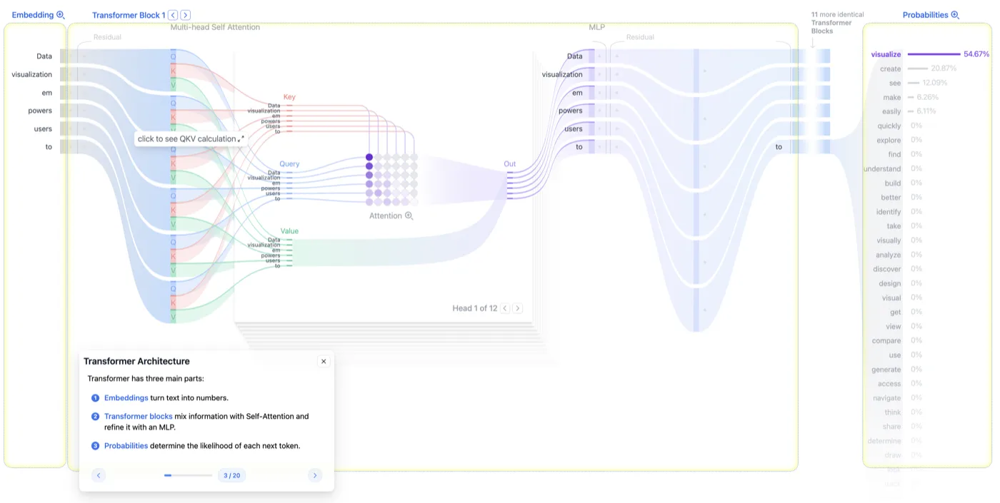
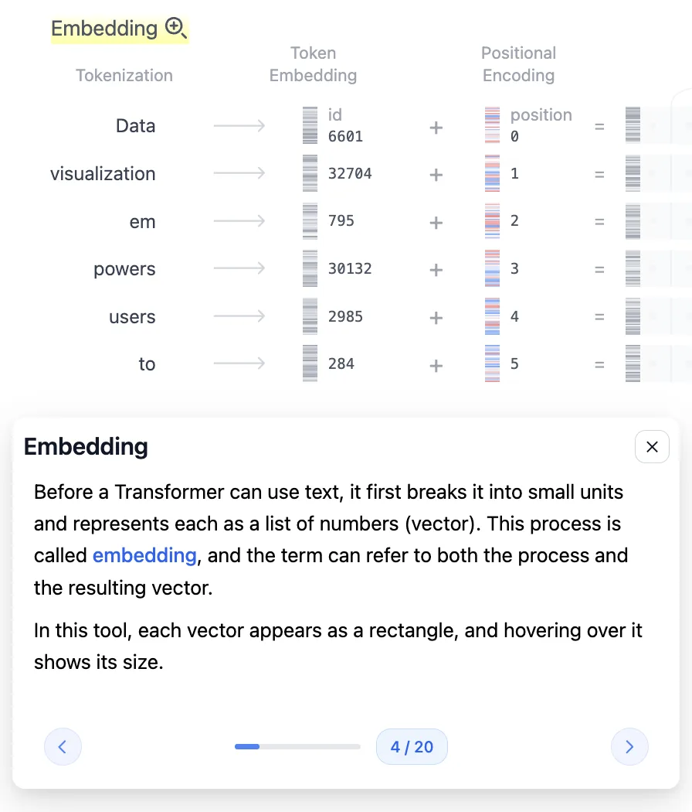
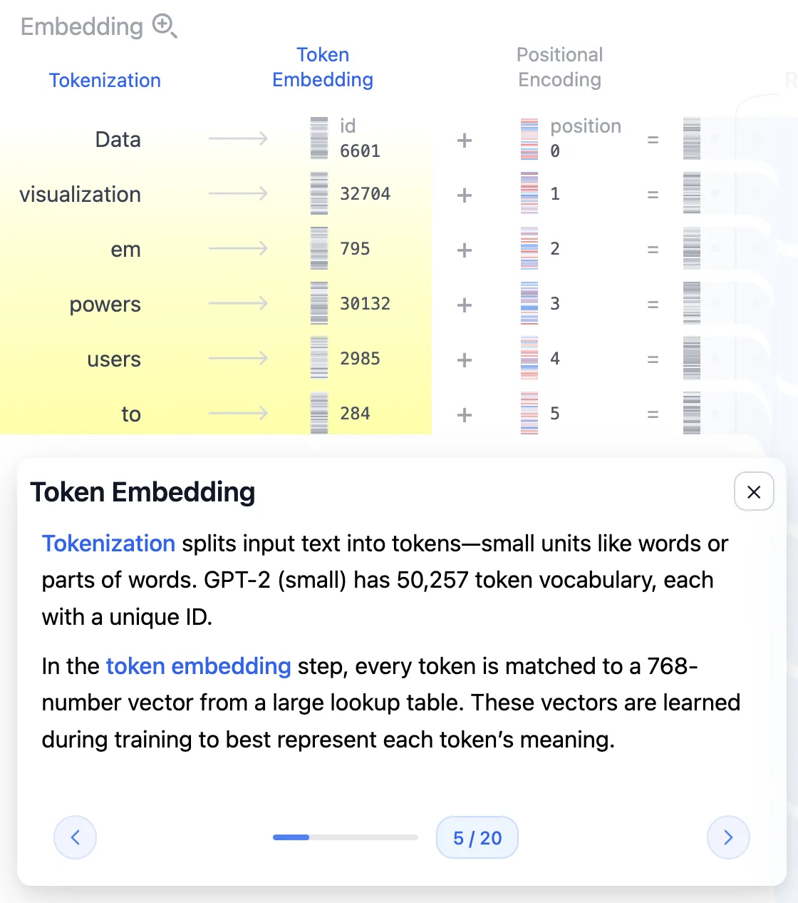
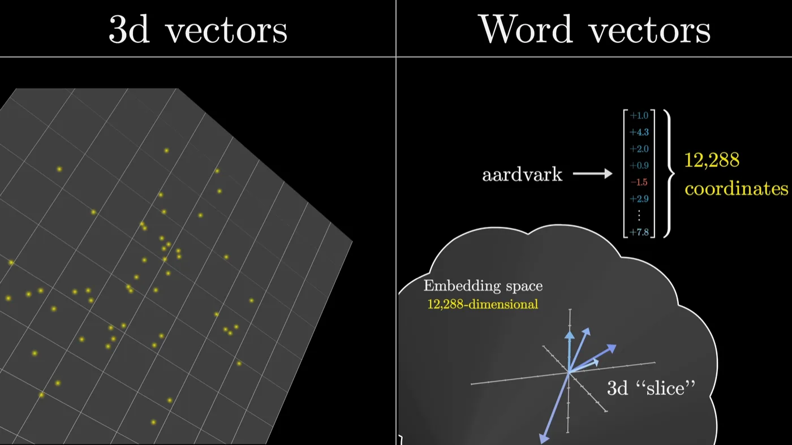
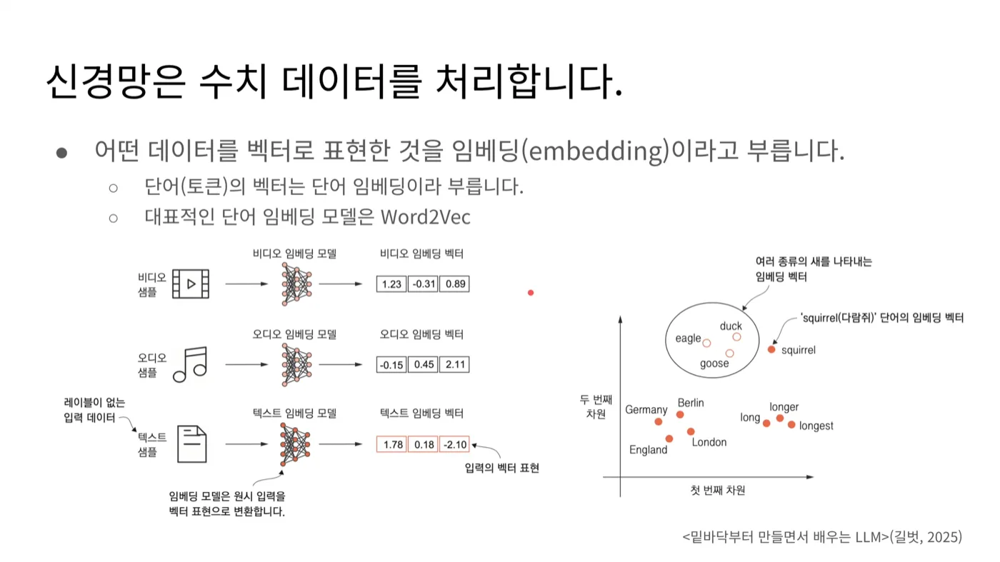
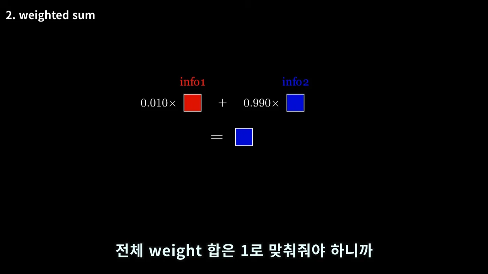
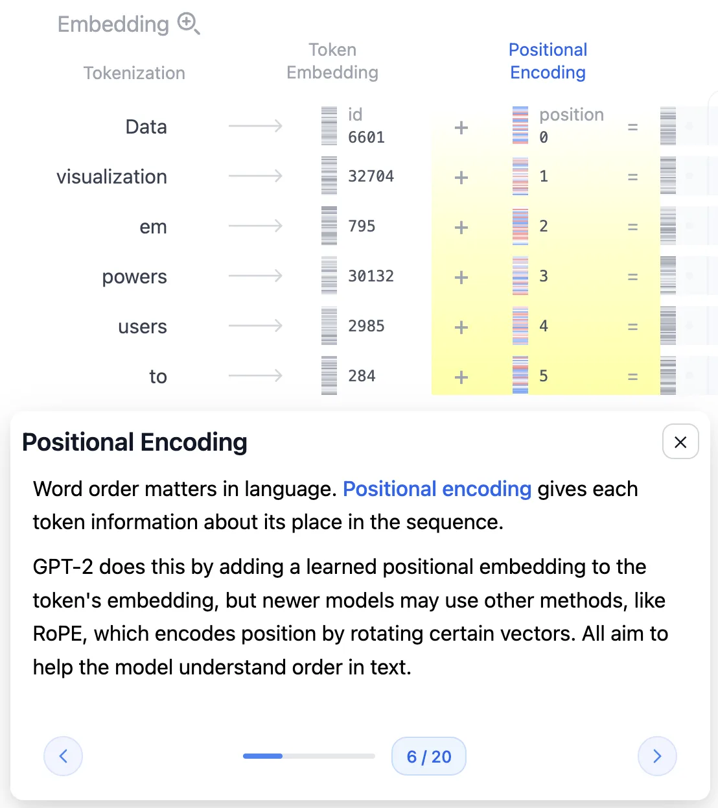
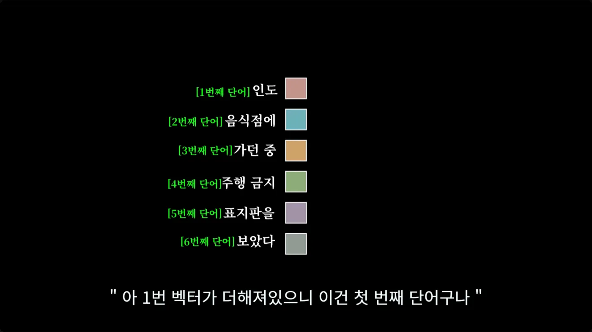

LLM에게 `Data visualization empowers users to`라는 문장을 넣으면 다음 단어를 예측해 줍니다. 그런데 모델 입장에서 이건 글자가 아닙니다. 모델이 보고 다룰 수 있는 일은 행렬곱과 덧셈뿐이고, 그 재료는 숫자여야만 합니다.

이 글은 **문장이 모델이 계산할 수 있는 숫자가 되기까지**를 따라갑니다. 트랜스포머 아키텍처에서 맨 앞 한 칸, `Embedding`이라고 적힌 부분입니다. 별거 아닌 전처리처럼 보이지만, 여기서 정해지는 숫자 몇 개가 뒤에 오는 모든 계산의 모양과 GPU 메모리 사용량까지 결정합니다.

이 시리즈는 [Transformer Explainer](https://poloclub.github.io/transformer-explainer/)를 화면에 띄워놓고 각 단계를 직접 눌러보면서 정리한 내용입니다. 별다른 언급이 없으면 **GPT-2 small** 모델 기준입니다.

---

<nav id="manual-toc" class="manual-toc" aria-label="목차">

### 목차

**[1부. 트랜스포머와 GPT 개요](#section-1)**

- [1.1 트랜스포머가 등장한 이유](#s1-1)
- [1.2 GPT - 디코더 전용 트랜스포머](#s1-2)
- [1.3 이 글의 범위 - Embedding 한 칸](#s1-3)

**[2부. 문장을 조각내기 - 토큰화](#section-2)**

- [2.1 토큰 - 단어가 아닌 최소 단위](#s2-1)
- [2.2 부분단어(BPE)를 쓰는 이유](#s2-2)
- [2.3 vocab과 Token ID - 50,257개](#s2-3)
- [2.4 Context Size - 1,024 토큰](#s2-4)

**[3부. 임베딩 - 조각을 벡터로](#section-3)**

- [3.1 Token ID를 그대로 쓰면 안 되는 이유](#s3-1)
- [3.2 임베딩 행렬](#s3-2)
- [3.3 임베딩 차원 768 - 파라미터 3,860만](#s3-3)
- [3.4 벡터 공간의 구조 - 거리와 방향](#s3-4)
- [3.5 768을 바꿀 수 없는 이유](#s3-5)

**[4부. 텐서의 세 가지 성질](#section-4)**

- [4.1 텐서 성질 1 - 통과해도 정보는 남는다](#s4-1)
- [4.2 텐서 성질 2 - 가중합은 정보를 섞는다](#s4-2)
- [4.3 텐서 성질 3 - 내적은 관련도를 잰다](#s4-3)
- [4.4 세 성질이 만드는 어텐션](#s4-4)

**[5부. Positional Encoding - 순서 심기](#section-5)**

- [5.1 내적은 순서를 보지 못한다](#s5-1)
- [5.2 위치 벡터 더하기 - 포스트잇 비유](#s5-2)
- [5.3 더하기 vs 이어붙이기](#s5-3)
- [5.4 남는 문제 - 맥락](#s5-4)

**[전체 흐름 정리](#section-6)** · **[막혔던 곳](#section-7)** · **[출처](#section-8)**

</nav>

---

## 1부. 트랜스포머와 GPT 개요

<a id="s1-1"></a>

### 1.1 트랜스포머가 등장한 이유

트랜스포머는 2017년 구글이 발표한 [Attention is All You Need](https://arxiv.org/abs/1706.03762) 논문에서 나왔습니다. 원래의 목적은 LLM 등이 아닌 **기계 번역**이었습니다. 그래서 트랜스포머의 아키텍처와 동작방식을 이해할 때, 본질이 **번역**이라는 것을 생각하면 이해를 도울 수 있습니다.

트랜스포머 전까지 번역 모델은 이런 조합이었습니다.

- **RNN(Recurrent Neural Network)** - 단어를 앞에서부터 하나씩 순서대로 읽으며 상태를 갱신
- **어텐션** - 그 위에 얹어서 "어느 단어를 볼지" 고르는 보조 장치

RNN 방식에는 구조적인 약점이 둘 있었습니다.

첫째, **순차 처리라 병렬화가 안 됩니다.** 3번째 단어를 계산하려면 2번째 계산이 끝나야 합니다. GPU는 수천 개 연산을 동시에 굴리는 장비인데, 이 구조에서는 그 능력을 거의 못 씁니다.

둘째, **앞쪽 문맥을 까먹습니다.** RNN은 지금까지 읽은 내용을 하나의 은닉 상태(hidden state)에 눌러 담습니다. 문장이 길어지면 초반 정보가 희석되죠. 어텐션이 나온 이유가 바로 이것으로, 디코더가 마지막 은닉 상태 하나만 보는 대신 **인코더의 모든 은닉 상태를 참조**하게 만든 겁니다. 다만 이러면 모든 상태를 보관해야 해서 메모리를 많이 쓰고, 그래서 입력 길이에 제한이 생깁니다. 그래서 ChatGPT 등에서 컨텍스트 윈도우 (입력 토큰 제한)이 있던 겁니다.

이를 극복하고자, **RNN을 떼어내고 어텐션만 남겼습니다.** 그래서 논문의 이름도 Attention is All You Need 이고요. 순차 의존이 사라지니 입력 토큰을 전부 동시에 처리할 수 있고, 덕분에 **병렬 처리**를 할 수 있었습니다. 오늘날 LLM이 GPU 위에서 굴러가는 근본 이유가 여기 있습니다.

<a id="s1-2"></a>

### 1.2 GPT - 디코더 전용 트랜스포머

원 논문의 트랜스포머는 번역기라서 인코더와 디코더를 둘 다 가지고 있었습니다. 입력 언어를 인코더가 읽고, 디코더가 출력 언어를 만드는 구조죠.

지금의 LLM은 대부분 **디코더만** 씁니다. GPT라는 이름 자체가 그 성격을 담고 있습니다.

- **G**enerative - 생성한다
- **P**re-trained - 미리 학습된
- **T**ransformer - 트랜스포머 구조다

학습은 크게 두 단계입니다.

- **사전 훈련(Pre-training)** : 방대한 텍스트를 받아 **다음 토큰을 예측**하는 훈련을 반복합니다. 정답 레이블을 사람이 붙일 필요가 없어서 데이터를 무한정 밀어 넣을 수 있습니다.
- **지시 미세튜닝(Instruction Fine-tuning)** : 사전 훈련만 마친 모델은 문장을 이어 쓸 뿐 지시를 따르지 않습니다. "요약해줘"에 응답하는 능력은 이 단계에서 생깁니다.

이 글에서 다루는 추론 과정은 두 단계를 모두 마친 모델이 **입력을 받아 다음 토큰 하나를 뱉는** 과정입니다.

<a id="s1-3"></a>

### 1.3 이 글의 범위 - Embedding 한 칸

<figure>
  
  <figcaption>트랜스포머는 크게 세 부분입니다. ① Embedding이 텍스트를 숫자로 바꾸고 ② Transformer Block이 셀프 어텐션과 MLP로 정보를 섞고 ③ Probabilities가 다음 토큰의 확률을 뽑습니다. 이 글은 맨 왼쪽 <strong>Embedding 한 칸</strong>만 다룹니다. (출처: <a href="https://poloclub.github.io/transformer-explainer/">Transformer Explainer</a>)</figcaption>
</figure>

오른쪽 확률 목록을 보면 `visualize`가 54.67%로 1등입니다. 이게 모델이 예측한 다음 단어입니다. 그리고 그 단어를 예측하기 까지, 맨 왼쪽에서 문장이 숫자로 바뀌는 일이 먼저 일어나야 합니다.

Embedding 칸을 확대하면 다시 세 단계로 나뉩니다.

<figure>
  
  <figcaption>Tokenization → Token Embedding → Positional Encoding. 입력 문장이 6개 토큰으로 쪼개지고, 각각 ID를 받고, 벡터가 되고, 마지막에 위치 정보가 더해집니다. (출처: <a href="https://poloclub.github.io/transformer-explainer/">Transformer Explainer</a>)</figcaption>
</figure>

---

## 2부. 문장을 조각내기 - 토큰화

<a id="s2-1"></a>

### 2.1 토큰 - 단어가 아닌 최소 단위

첫 단계는 입력 텍스트를 작은 조각으로 나누는 것입니다. 이 조각 하나하나를 **입력 토큰(Input Token)** 이라고 부릅니다.

여기서 거의 모두가 한 번은 겪는 오해가 있습니다. **토큰은 단어가 아닙니다.** 위 그림이 그 증거입니다. 예문은 5개 단어인데 토큰은 6개입니다.

```
Data | visualization | em | powers | users | to
                       ^^^^^^^^^^^
                   empowers 가 둘로 쪼개짐
```

`empowers`가 `em` + `powers`로 갈라졌습니다. 나누는 기준이 단어 하나가 아니기 때문입니다.

- **나누는 단위** - 단어, 부분단어, 공백, 특수문자를 모두 포함
- **자주 쓰이는 단어** - 통째로 한 토큰
- **드물거나 긴 단어** - 여러 조각으로 쪼개짐

토큰이라는 개념이 텍스트 전용도 아닙니다.

- **이미지** - 이미지의 작은 조각
- **음성** - 음성의 짧은 구간

**"모델이 한 번에 다루는 최소 단위"** 라는 뜻이라고 보면 됩니다.

<a id="s2-2"></a>

### 2.2 부분단어(BPE)를 쓰는 이유

`empowers`를 굳이 둘로 왜 쪼갤까요? 양극의 케이스를 생각해보면 이해가 가능합니다.

**단어 단위로 자른다면** 사전이 끝없이 커집니다. 영어 단어만 수십만 개인데, 여기에 고유명사·오타·신조어까지 들어옵니다. 게다가 사전에 없는 단어(OOV, Out-Of-Vocabulary)를 만나면 모델이 아무것도 못 합니다. `empowers`가 사전에 없으면 그냥 미지의 기호가 됩니다.

**글자 단위로 자른다면** 사전은 아주 작아집니다(알파벳 몇십 개). 대신 시퀀스가 지독하게 길어집니다. 짧은 문장 하나가 토큰 수백 개가 되고, 뒤에서 볼 어텐션 계산량은 토큰 수의 제곱에 비례하니 감당이 안 됩니다.

**부분단어(subword)는 이 두 케이스의 중간 지점입니다.**

- 자주 나오는 단어는 통째로 한 토큰이라 시퀀스가 짧게 유지된다.
- 드문 단어는 아는 조각들의 조합으로 표현되니 **모르는 단어가 원천적으로 없다.**
- 사전 크기를 원하는 수준(GPT-2는 5만 개 남짓)에서 고정할 수 있다.

GPT-2는 이 방식으로 **바이트 수준 BPE(Byte-level Byte Pair Encoding)** 를 씁니다. 자주 붙어 다니는 바이트 쌍을 반복해서 병합해 사전을 만드는 방식입니다. `em`과 `powers`가 각각 자주 등장하는 조각이라 그 둘로 갈라진 거고요.

이 성질은 실무에서도 바로 체감됩니다. 한국어는 영어보다 토큰이 훨씬 잘게 쪼개져서, 같은 의미의 문장이라도 토큰 수가 몇 배로 늘어납니다. API 요금과 컨텍스트 한도가 토큰 단위로 매겨지니, 언어에 따라 실질 비용이 달라지는 셈입니다.

<a id="s2-3"></a>

### 2.3 vocab과 Token ID - 50,257개

나눈 조각들은 아직 문자입니다. 여기에 숫자를 붙여야 하는데, 아무 숫자나 붙이는 게 아니라 **모델이 이미 가지고 있는 단어 사전(vocab, vocabulary)** 을 찾아봅니다.

<figure>
  
  <figcaption>각 토큰에 Token ID가 매겨지고, 그 ID로 768차원 벡터를 찾아옵니다. 위 이미지를 보면 <code>GPT-2 (small) has 50,257 token vocabulary</code>라고 적혀 있습니다. (출처: <a href="https://poloclub.github.io/transformer-explainer/">Transformer Explainer</a>)</figcaption>
</figure>

GPT-2 small의 vocab 크기는 **50,257개**입니다.

vocab은 모델을 학습시키기 **전에** "우리는 이 5만 개 조각만 쓰겠다"고 정해둔 목록이고, 각 조각에는 고유한 번호인 **Token ID**가 매겨져 있습니다.

예문의 토큰들은 이런 번호를 받습니다.

```
Data → 6601      visualization → 32704    em → 795
powers → 30132   users → 2985             to → 284
```

참고로, **이 사전(vocab)은 학습보다 먼저 정해집니다.** 모델이 학습하다가 새 단어를 발견해서 사전에 추가하는 게 아니라, 사전을 확정한 다음 그 안에서만 학습합니다. 그래서 학습이 끝난 모델의 vocab은 바꿀 수 없고, 바꾸려면 처음부터 다시 학습해야 합니다.

<a id="s2-4"></a>

### 2.4 Context Size - 1,024 토큰

토큰을 무한정 넣을 수는 없습니다. 모델이 한 번에 처리할 수 있는 토큰 개수를 **컨텍스트 크기(Context Size)** 라고 합니다.

- GPT-2 small - **1,024 토큰**
- GPT-3 - 2,048 토큰

요즘 모델들이 수십만 토큰을 광고하는 것과 비교하면 초라해 보이지만, 이 숫자가 왜 존재하는지가 중요합니다. 위에사 본 것처럼 어텐션은 **모든 토큰이 모든 토큰을 참조**합니다. 토큰이 n개면 참조 관계는 n²개죠. 토큰 수를 2배로 늘리면 계산량과 메모리는 4배가 됩니다.

컨텍스트 한도는 그래서 "설계상의 상한"이 아니라 **메모리와 계산량이 감당 가능한 선**입니다.

---

## 3부. 임베딩 - 조각을 벡터로

<a id="s3-1"></a>

### 3.1 Token ID를 그대로 쓰면 안 되는 이유

토큰마다 번호가 붙었으니, 그 번호를 그대로 신경망에 넣으면 안 될까요? 안 됩니다. 그리고 이유가 이 글에서 제일 중요한 대목입니다.

**Token ID는 사전에서의 순번일 뿐, 크기에 아무 의미가 없습니다.**

예문에서 `em`은 795번, `to`는 284번입니다. 번호가 500 정도 차이 나는데, 그렇다고 두 토큰의 의미가 500만큼 다른 게 아닙니다. 반대로 번호가 1 차이 나는 두 토큰이 전혀 무관할 수도 있습니다. 사전을 만들 때 정해진 순서일 뿐이니까요.

그런데 신경망은 들어온 숫자를 **크기와 거리가 의미 있는 값**으로 취급합니다. 그대로 넣으면 모델은 "795와 284는 511만큼 떨어져 있다"는 존재하지 않는 관계를 학습하려 듭니다. 완전히 틀린 신호죠.

그래서 각 Token ID를 **의미를 담은 벡터**로 바꿔줍니다. 이 과정이 **임베딩(Embedding)** 입니다. 무의미한 일련번호를, 거리와 방향이 의미를 갖는 좌표로 옮기는 작업이라고 보면 정확합니다.

<a id="s3-2"></a>

### 3.2 임베딩 행렬

변환은 **임베딩 행렬(Embedding Matrix)** 이 담당합니다.

- vocab의 각 단어마다 **열을 하나씩** 가지고 있습니다.
- 그 열이 곧 단어와 매칭되는 벡터 값이다.
- 처음에는 **랜덤한 값**이었다가 학습을 거치면서 값이 정해진다.

동작 자체는 **계산이 아니라 조회(lookup)** 입니다. `em`이 795번이면 임베딩 행렬의 795번째 열을 꺼내오면 끝입니다. 곱셈도 덧셈도 없습니다.

여기서 중요한 사실 하나. 이 행렬은 사람이 설계한 사전이 아닙니다. **학습으로 얻은 결과물**입니다. 처음에는 무작위 숫자였다가, 다음 토큰을 예측하는 훈련을 수없이 반복하는 동안 "이 단어는 이런 좌표에 있어야 예측이 잘 되더라"는 방향으로 값이 조정된 것입니다.

<a id="s3-3"></a>

### 3.3 임베딩 차원 768 - 파라미터 3,860만

GPT-2 small의 임베딩 차원은 **768**입니다. 토큰 하나가 768개의 숫자로 된 벡터가 됩니다.

이 숫자가 얼마나 큰 건지 계산해보면 감이 옵니다.

```
임베딩 행렬 크기 = vocab × 임베딩 차원
                = 50,257 × 768
                = 38,597,376  (약 3,860만 개)
```

GPT-2 small의 전체 파라미터가 약 1억 2,400만 개니, **임베딩 행렬 하나가 모델 전체의 30%쯤을 차지**합니다. "텍스트를 숫자로 바꾸는 전처리" 정도로 생각했던 부분이 실은 모델에서 가장 덩치 큰 부품 중 하나인 셈입니다.

<figure>
  
  <figcaption>차원이 크다는 게 어느 정도인지 감이 안 잡힐 때 도움이 됩니다. 우리가 상상할 수 있는 3차원 공간과 달리, 단어 벡터는 수백~수천 개의 좌표를 가집니다. (이 그림은 GPT-3 기준 12,288차원이고, 이 글의 GPT-2 small은 768차원입니다. 모델마다 다릅니다.) (출처: 3Blue1Brown, <a href="https://www.youtube.com/watch?v=g38aoGttLhI&t=858s">DL5 14:18</a>)</figcaption>
</figure>

차원이 크다는 건 **표현할 수 있는 의미의 종류가 많다**는 뜻입니다. 3차원 공간에서는 점들이 금방 빽빽해지지만, 768차원에서는 수만 개 단어를 서로 구별되게 배치할 공간이 충분합니다.

<a id="s3-4"></a>

### 3.4 벡터 공간의 구조 - 거리와 방향

<figure>
  
  <figcaption>임베딩은 텍스트 전용이 아닙니다. 비디오도 오디오도 벡터가 됩니다. 오른쪽 그래프가 핵심인데, <code>duck·eagle·goose</code>는 한데 뭉치고 <code>squirrel</code>은 떨어져 있습니다. <code>long → longer → longest</code>가 한 방향으로 늘어선 것도 보입니다. (출처: 박해선, <a href="https://www.youtube.com/watch?v=91NxIfuo4is">밑바닥부터 만들면서 배우는 LLM 2.1</a>)</figcaption>
</figure>

그래프에서 두 가지가 동시에 보입니다.

- **의미가 비슷한 단어는 가까이 모인다**
  - `duck`, `eagle`, `goose`가 한 덩어리를 이루고 `squirrel`은 떨어져 있습니다.
  - 새라는 범주가 공간상의 거리로 나타난 겁니다.
- **특정 방향이 특정 의미를 담는다**
  - `long → longer → longest`가 한 방향으로 줄지어 있습니다. 
  - 이 방향이 "비교급·최상급"이라는 문법적 의미를 갖는다고 생각할 수 있습니다
  - `Germany-Berlin`과 `England-London` 쌍이 비슷한 관계로 놓인 것도 같은 현상입니다.

방향에 의미가 실린다는 성질 덕분에 **벡터 뺄셈과 덧셈으로 의미를 조작**할 수 있습니다.
- `왕 - 남자 + 여자 ≈ 여왕`, `수도` 방향 벡터를 나라 벡터에 더하면 그 나라의 수도 근처로 가는 등의 예시가 있습니다.

참고로 데이터를 벡터로 표현한 것 전부가 임베딩이고, 그중 단어를 벡터로 만든 것이 **단어 임베딩**이라 합니다. 대표적인 단어 임베딩 모델로 **word2vec**이 있습니다. 위 그림 왼쪽처럼 비디오나 오디오도 같은 방식으로 벡터가 됩니다.

<a id="s3-5"></a>

### 3.5 768을 바꿀 수 없는 이유

임베딩 차원은 모델을 **개발하는 단계에서 미리 정해두는 값**이고, 학습이 끝난 뒤에는 바꿀 수 없습니다. 이런 값을 **하이퍼파라미터(Hyper-parameter)** 라고 합니다.

바꿀 수 없는 이유는 간단합니다.

- 임베딩 차원이 768이면 **그 뒤에 오는 가중치 행렬들도 전부 768에 맞춰** 만들어져 있다
- 여기만 1024로 바꾸면 뒤쪽 행렬곱의 모양이 전부 어긋난다
- 즉 **모델 구조 전체가 이 숫자 위에 세워져 있다**

이건 서빙 관점에서도 곧바로 의미가 있습니다. 뒤에서 다룰 KV Cache의 크기가 이 숫자에 정비례합니다.

```
KV Cache 크기 ∝ 레이어 수 × 토큰 수 × 임베딩 차원 × 2(K와 V)
```

임베딩 차원이 2배면 캐시도 2배입니다. 그래서 "이 모델을 이 GPU에 몇 명이나 동시에 붙일 수 있나"라는 아주 현실적인 질문이 결국 이 숫자에서부터 시작합니다.

---

## 4부. 텐서의 세 가지 성질

여기까지가 "텍스트 → 벡터"입니다. 마지막 단계로 넘어가기 전에, **벡터(텐서)로 할 수 있는 연산 세 가지**를 짚고 가겠습니다.

<a id="s4-1"></a>

### 4.1 텐서 성질 1 - 통과해도 정보는 남는다

정보를 담은 텐서를 가중치 행렬(Weight Matrix)과 곱해도, 계산 전에 갖고 있던 정보가 사라지지 않습니다.

- 행렬곱은 정보를 **변형**할 뿐 **삭제**하지 않는다
- 그래서 같은 벡터를 블록 12개에 걸쳐 수십 번 통과시킬 수 있다

**왜 중요한가** - 통과할 때마다 정보가 날아간다면 층을 쌓는 것 자체가 불가능합니다. 트랜스포머가 "블록을 여러 개 쌓는다"는 전략을 쓸 수 있는 전제가 이 성질입니다.

<a id="s4-2"></a>

### 4.2 텐서 성질 2 - 가중합은 정보를 섞는다

두 텐서를 **가중합(Weighted Sum)** 하면 두 텐서의 정보가 혼합됩니다. 가중치가 양수이고 전체 합이 1인 경우를 보겠습니다.

<figure>
  
  <figcaption>가중치 합이 1이라, 한쪽이 커지면 다른 쪽은 반드시 작아집니다. <code>0.010 : 0.990</code>으로 섞으면 결과는 거의 파란 정보입니다. (출처: 임커밋, <a href="https://www.youtube.com/watch?v=6s69XY025MU&t=72s">Attention/Transformer 시각화 01:12</a>)</figcaption>
</figure>

- **가중치가 큰 쪽의 정보를 더 많이** 갖게 된다
- 합이 1로 고정이니 한쪽이 커지면 나머지는 자동으로 작아진다
- 텐서 2개가 아니라 3개, 4개, 그 이상이어도 똑같이 성립한다

**왜 중요한가** - 이게 나중에 어텐션의 **출력** 그 자체가 됩니다. "어떤 단어의 정보를 얼마나 가져올지"를 가중치로 조절해서 섞는 거니까요. 그리고 "합이 1"이라는 조건 때문에, 어텐션에서 Softmax가 등장합니다.

<a id="s4-3"></a>

### 4.3 텐서 성질 3 - 내적은 관련도를 잰다

벡터 두 개를 놓고 같은 차원 숫자끼리 곱해서 전부 더하면 **내적(Inner Product)** 이 됩니다.

- 서로 **관련 있는** 벡터끼리 내적하면 값이 **크다**
- 관련 없는 벡터끼리는 값이 작거나 **음수**가 된다

3.4절과 이어서 보면 자연스럽습니다. 의미가 비슷한 단어는 벡터 공간에서 **같은 방향**을 향하고 있고, 같은 방향인 두 벡터를 내적하면 값이 커지니까요. 반대로 방향이 반대면 음수가 됩니다.

**왜 중요한가** - 이게 어텐션에서 **가중치를 구하는 방법**입니다. 두 단어가 얼마나 관련 있는지를 재는 자가 필요한데, 그 자가 내적입니다.

<a id="s4-4"></a>

### 4.4 세 성질이 만드는 어텐션

셋을 이어붙이면 어텐션의 뼈대가 나옵니다.

```
내적으로 단어 간 관련도를 잰다        (성질 3)
        ↓
그 관련도를 가중치 삼아 정보를 섞는다   (성질 2)
        ↓
섞은 뒤에도 원래 정보는 남아 있다      (성질 1)
        ↓
이걸 블록 12개에 걸쳐 반복한다
```

---

## 5부. Positional Encoding - 순서 심기

<a id="s5-1"></a>

### 5.1 내적은 순서를 보지 못한다

여기까지 하면 각 토큰이 768차원 벡터가 됐습니다. 그런데 문제가 하나 남아 있습니다.

**임베딩을 거친 벡터는 "이 토큰이 무슨 뜻인가"만 담고 있고, "문장에서 몇 번째였나"는 담고 있지 않습니다.**

직관적으로는 "개가 사람을 물었다"와 "사람이 개를 물었다"가 토큰 집합은 같은데 뜻이 정반대인 상황을 떠올리면 됩니다. 그런데 진짜 이유는 좀 더 구조적입니다. 바로 앞 4.3절 때문입니다.

`인도 음식점에 가던 중 주행 금지 표지판을 보았다`라는 문장에서 `인도`의 벡터를 다른 단어와 내적한다고 해봅시다. 내적은 **두 벡터의 숫자만 가지고** 계산합니다. 그 계산을 지금 하든 나중에 하든, 첫 번째 단어와 하든 다섯 번째 단어와 하든, 같은 벡터끼리면 값은 똑같습니다.

**"인도가 첫 번째 단어였다"는 정보는 내적 계산에 아예 들어가지 않습니다.**

그리고 어텐션은 이 내적 위에 세워져 있죠. 즉 어텐션은 태생적으로 순서를 인지할 수 없습니다. 순차적으로 읽는 RNN을 버리고 병렬 처리를 얻은 대가이기도 합니다.

순서 정보가 어딘가에 따로 보관되는 게 아니라면, 방법은 하나뿐입니다. **벡터 자체에 위치를 심어 넣는 것.** 이게 **Positional Encoding**입니다.

<a id="s5-2"></a>

### 5.2 위치 벡터 더하기 - 포스트잇 비유

<figure>
  
  <figcaption>각 토큰 벡터에 position 0, 1, 2... 에 해당하는 벡터를 <strong>더합니다.</strong> 툴팁에 최신 모델은 RoPE 같은 다른 방식을 쓰기도 한다고 적혀 있습니다. (출처: <a href="https://poloclub.github.io/transformer-explainer/">Transformer Explainer</a>)</figcaption>
</figure>

동작은 **위치 표시용 포스트잇**이라고 생각하면 쉽습니다.

- 문장의 첫 번째 단어 벡터에는 항상 **1번 포스트잇 벡터**를 더한다
- 두 번째 단어 벡터에는 항상 **2번 포스트잇 벡터**를 더한다
- 위치마다 정해진 벡터를 더한다는 규칙이 전부다

<figure>
  
  <figcaption>1번 벡터가 더해져 있으면 첫 번째 단어, 2번 벡터가 더해져 있으면 두 번째 단어. 이제 벡터만 보고도 위치를 알 수 있습니다. (출처: 임커밋, <a href="https://www.youtube.com/watch?v=6s69XY025MU&t=867s">Attention/Transformer 시각화 14:27</a>)</figcaption>
</figure>

이제 같은 단어라도 문장의 어느 자리에 있느냐에 따라 조금씩 다른 벡터가 됩니다. 내적 결과도 자리에 따라 달라지고요. 이를 활용해서 순서를 알 수 있습니다.

<a id="s5-3"></a>

### 5.3 더하기 vs 이어붙이기

그런데, 위치 정보를 왜 **더할까요?** 뒤에 **이어붙이면**(concatenate) 깔끔한데요.

이어붙이면 벡터 차원이 늘어납니다. 만약 768차원 뒤에 위치 벡터를 붙여 800차원이 되면, 3.5절에서 봤듯 **뒤에 오는 모든 가중치 행렬이 800에 맞춰 커져야** 합니다. 파라미터가 늘고 계산량이 늘죠. 더하기를 쓰면 768을 그대로 유지한 채 정보만 실을 수 있습니다.

"더하면 원래 의미가 오염되지 않나?"라는 의심이 들 수 있는데, 768차원은 생각보다 넓습니다. 모델은 학습 과정에서 의미 정보와 위치 정보가 서로 덜 간섭하도록 자리를 잡는다고 합니다.

GPT-2가 쓰는 방식을 정리하면 이렇습니다.

- 학습된 **위치 임베딩**을 토큰 임베딩에 **더한다**
- 벡터 차원은 **768 그대로**
- 이 덧셈은 트랜스포머 블록에 들어가기 **전, 맨 처음에 한 번**만 이뤄진다

위치 임베딩도 학습 대상이라 별도 행렬을 갖습니다. GPT-2 small은 컨텍스트가 1,024이므로 `1,024 × 768 ≈ 78만 개` 파라미터죠. 임베딩 행렬(3,860만)에 비하면 작습니다.

<a id="s5-4"></a>

### 5.4 남는 문제 - 맥락

위치를 심었으니 이제 순서는 압니다. 하지만 아직 **맥락**은 모릅니다.

아까 그 문장의 `인도`를 봅시다.

- 뒤에 `음식점`이 오면 → 나라 India
- 뒤에 `주행 금지 표지판`이 오면 → 보도블록 인도

같은 단어, 같은 위치인데 뜻이 갈립니다. 그런데 지금까지 만든 벡터는 **문장이 뭐였든 `인도`면 항상 같은 벡터**입니다. 임베딩 행렬에서 조회한 값에 위치 벡터를 더한 것뿐이니까요.

내적과 위치 정보만으로는 이걸 판단할 수 없습니다. 주변 단어를 실제로 들여다보고, 그 정보를 자기 벡터에 반영해야 합니다.

그래서 셀프 어텐션이 필요합니다. 2편의 주제입니다.

---

## 전체 흐름 정리

```
"Data visualization empowers users to"
        ↓ 토큰화 (byte-level BPE)
[Data][visualization][em][powers][users][to]      6개 토큰
        ↓ vocab 조회 (50,257개)
[6601][32704][795][30132][2985][284]
        ↓ 임베딩 행렬 조회 (50,257 × 768)
6개의 768차원 벡터
        ↓ + Positional Encoding (위치 0~5)
6개의 768차원 벡터 (순서 정보 포함)
        ↓
트랜스포머 블록으로 →  (2편에서 계속)
```

한 줄로 줄이면 이렇습니다. **문장을 조각내고, 조각마다 번호를 붙이고, 번호로 의미 좌표를 찾아온 뒤, 거기에 자리표를 더한다.**

기억할 숫자 세 개도 정리해 둡니다.

| 숫자 | 뜻 | 왜 중요한가 |
|---|---|---|
| **50,257** | vocab 크기 | 학습 전에 확정, 이후 변경 불가 |
| **768** | 임베딩 차원 | 뒤의 모든 행렬 모양과 KV Cache 크기를 결정 |
| **1,024** | 컨텍스트 크기 | 어텐션 계산량이 토큰 수의 제곱이라 생기는 한도 |

---

## 막혔던 곳

**위치 정보를 왜 더하지? 이어붙이면 안 되나?** 이어붙이면 벡터 차원이 늘어나고, 그러면 뒤쪽 가중치 행렬 크기가 전부 커집니다. 더하기를 쓰면 768차원을 유지한 채로 위치 정보를 실을 수 있습니다.

---

## 출처

- [Transformer Explainer](https://poloclub.github.io/transformer-explainer/) - Georgia Tech Polo Club. 이 글의 화면 캡처 4장은 이 도구를 직접 조작하며 정리한 것입니다
- 임커밋, [Attention/Transformer 시각화로 설명](https://www.youtube.com/watch?v=6s69XY025MU) - [01:12 가중합](https://www.youtube.com/watch?v=6s69XY025MU&t=72s), [02:22 내적](https://www.youtube.com/watch?v=6s69XY025MU&t=142s), [12:06 어텐션에 순서 반영하기](https://www.youtube.com/watch?v=6s69XY025MU&t=726s), [14:27 위치 벡터 더하기](https://www.youtube.com/watch?v=6s69XY025MU&t=867s)
- 박해선, 밑바닥부터 만들면서 배우는 LLM - [1.4 트랜스포머 구조 소개](https://www.youtube.com/watch?v=JZUm4IAVnK4), [1.6 GPT 구조 자세히 살펴보기](https://www.youtube.com/watch?v=oyUKLkfKKAw), [2.1 단어 임베딩 이해하기](https://www.youtube.com/watch?v=91NxIfuo4is), [2.2 텍스트 토큰화하기](https://www.youtube.com/watch?v=jC4-UVLsWBE)
- 3Blue1Brown, [트랜스포머, ChatGPT가 트랜스포머로 만들어졌죠 (DL5)](https://www.youtube.com/watch?v=g38aoGttLhI) - [14:18 단어 벡터와 임베딩 공간](https://www.youtube.com/watch?v=g38aoGttLhI&t=858s)
- Vaswani et al., [Attention Is All You Need](https://arxiv.org/abs/1706.03762) (2017)

