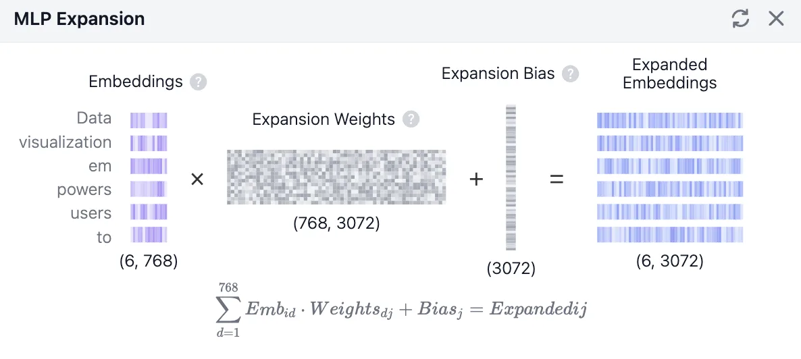
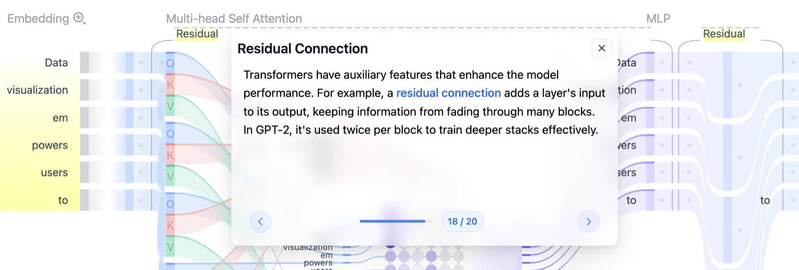
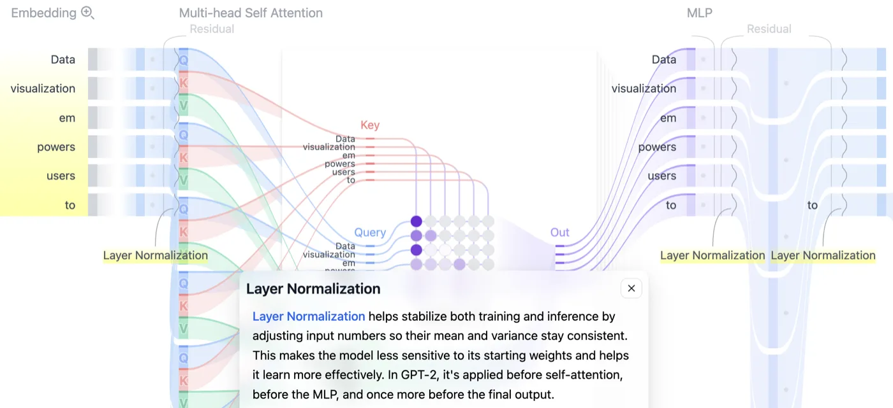
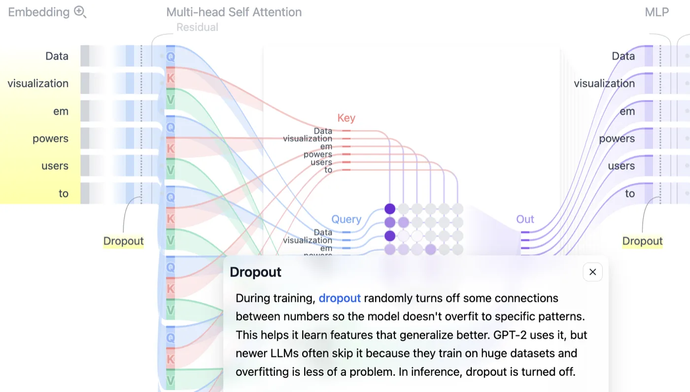
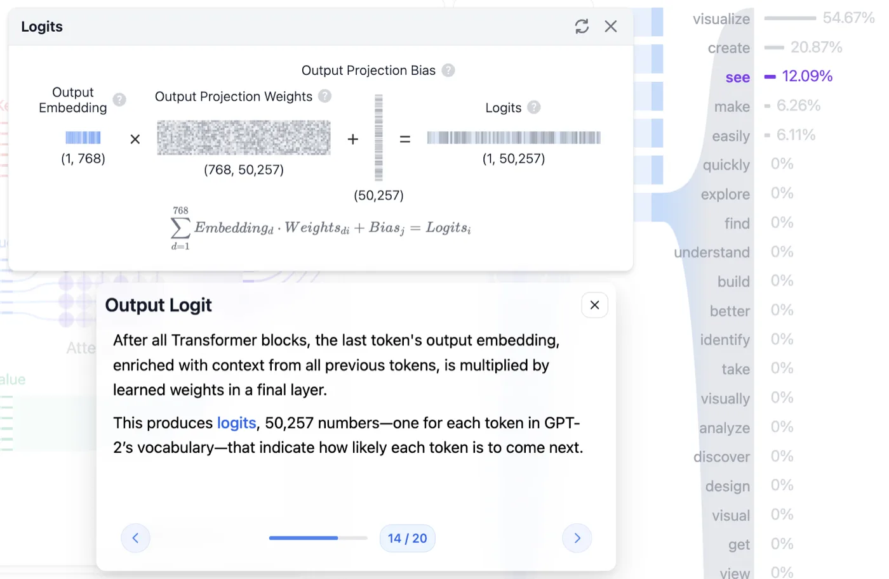
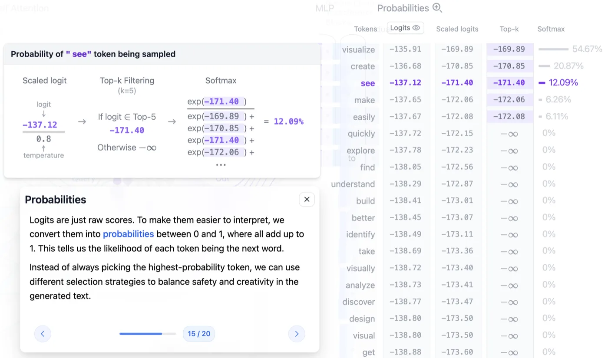

2편에서 6개 토큰은 서로를 들여다보고 문맥 벡터가 됐습니다. `인도`는 같은 문장 안 `음식점`이나 `표지판`의 정보가 섞여 들어간 `인도`가 됐고요. 트랜스포머 블록의 왼쪽 절반, `Multi-head Self Attention`까지입니다.

나머지 절반이 **MLP(Multi-Layer Perceptron)** 입니다. 어텐션이 토큰들끼리 정보를 나누게 했다면, MLP는 그렇게 얻어온 정보를 각 토큰이 혼자 소화하는 자리입니다. 여기에 Residual Connection·Layer Normalization·Dropout 세 장치가 붙어야 블록 하나가 완성되고, 그 블록이 12번 반복됩니다.

블록을 다 빠져나오면 768차원 벡터가 남습니다. 그걸 50,257개 단어 후보와 대조해 점수를 매기고, 온도로 격차를 조절하고, 후보를 추려 확률로 바꾼 뒤, 다음 단어 하나를 뽑습니다. 트랜스포머 아키텍처의 오른쪽 끝 `Probabilities` 칸입니다. 별다른 언급이 없으면 **GPT-2 small** 기준입니다.

---

<nav id="manual-toc" class="manual-toc" aria-label="목차">

### 목차

**[1부. MLP - 토큰을 혼자 다듬는 단계](#section-1)**

- [1.1 어텐션 다음에 오는 것](#s1-1)
- [1.2 확장 - 768에서 3072로](#s1-2)
- [1.3 GELU - 통과량을 정하는 필터](#s1-3)
- [1.4 압축 - 다시 768로](#s1-4)
- [1.5 어텐션과 MLP의 역할 분리](#s1-5)

**[2부. 블록을 지탱하는 세 장치](#section-2)**

- [2.1 Residual Connection](#s2-1)
- [2.2 Layer Normalization](#s2-2)
- [2.3 Dropout - 추론에서는 꺼진다](#s2-3)

**[3부. Logits - 5만 개 단어와 대조하기](#section-3)**

- [3.1 마지막 토큰 하나만 쓰는 이유](#s3-1)
- [3.2 Output Projection - 768에서 50,257로](#s3-2)
- [3.3 Logits는 아직 확률이 아니다](#s3-3)

**[4부. 다음 단어 고르기](#section-4)**

- [4.1 Temperature - 분포의 뾰족함 조절](#s4-1)
- [4.2 Top-k와 Top-p](#s4-2)
- [4.3 Softmax - 최종 확률](#s4-3)

**[전체 흐름 정리](#section-5)** · **[막혔던 곳](#section-6)** · **[출처](#section-7)**

</nav>

---

## 1부. MLP - 토큰을 혼자 다듬는 단계

<a id="s1-1"></a>

### 1.1 어텐션 다음에 오는 것

트랜스포머 블록은 두 파트입니다.

- **Multi-Head Self-Attention** - 2편의 주제. 토큰들끼리 서로를 참조해 맥락을 만듭니다
- **MLP(Multi-Layer Perceptron)** - 각 토큰의 의미를 개별적으로 심화하고 정제(Refine)합니다

어텐션이 내놓은 결과는 768차원 문맥 벡터 6개였습니다. MLP는 이 6개를 한 덩어리로 보지 않습니다. **토큰 하나씩 따로 집어넣습니다.** `Data`를 넣어 결과를 받고, `visualization`을 넣어 결과를 받고, 이런 식으로 6번입니다. 6개가 같은 가중치를 통과하지만, 계산하는 동안 서로를 전혀 참조하지 않습니다.

그래서 MLP 구간에는 토큰 간 정보 이동이 없습니다. 어텐션이 6 × 6 관계 표를 만들었던 것과 정반대입니다.

**왜 중요한가** - 토큰끼리 의존이 없으니 MLP는 **토큰 단위로 완전히 병렬 처리**됩니다. 트랜스포머에서 순서를 지켜야 하는 건 블록과 블록 사이뿐입니다. 블록 12개는 순차적으로 통과해야 하지만, 한 블록 안의 MLP 계산은 토큰이 몇 개든 동시에 굴릴 수 있습니다.

MLP가 하는 일은 세 단계입니다.

```
768차원  →  3072차원  →  (걸러내기)  →  768차원
         확장          GELU           압축
```

<a id="s1-2"></a>

### 1.2 확장 - 768에서 3072로

첫 단계는 **확장(Expansion)** 입니다. 768차원이던 토큰 벡터를 4배인 **3072차원**으로 늘립니다. 첫 번째 Linear Layer가 담당하고, 여기 쓰이는 가중치를 **Expansion Weights**라고 부릅니다. Wq·Wk·Wv와 마찬가지로 학습으로 얻은 값입니다.

<figure>
  
  <figcaption><code>Embeddings (6, 768)</code> × <code>Expansion Weights (768, 3072)</code> + <code>Expansion Bias (3072)</code> = <code>Expanded Embeddings (6, 3072)</code>. 왼쪽 세로줄이 토큰 6개고, 오른쪽에서 각 줄의 길이가 4배로 늘어난 게 보입니다. 2편 2.4절의 QKV 계산과 형태가 똑같습니다. 입력에 가중치를 곱하고 편향을 더하는 것, 그게 Linear Layer의 전부입니다. (출처: <a href="https://poloclub.github.io/transformer-explainer/">Transformer Explainer</a>)</figcaption>
</figure>

늘린다고 정보가 새로 생기지는 않습니다. 그런데도 늘리는 이유는 **자리가 넓어야 담을 수 있는 게 많아지기 때문**입니다. 768칸에 눌러 담겨 있던 정보를 3072칸에 펼치면, 좁은 자리에서는 겹쳐 있던 특징들이 서로 다른 칸으로 갈라집니다. 갈라져야 다음 단계에서 하나씩 골라낼 수 있습니다.

1편 성질 1이 여기서도 그대로입니다. 가중치 행렬을 통과해도 원래 정보는 사라지지 않으니, 확장은 **정보를 바꾸는 게 아니라 펼치는 작업**입니다.

<a id="s1-3"></a>

### 1.3 GELU - 통과량을 정하는 필터

3072차원으로 펼쳐진 값들이 **GELU**라는 함수를 통과합니다. 하는 일은 한 줄입니다. **값마다 얼마나 통과시킬지 정합니다.**

```
값이 크다   →  거의 그대로 통과
값이 작다   →  일부만 통과
```

중요한 정보는 온전히 보내고, 덜 중요한 정보는 조금만 흘려보내는 필터입니다. 완전히 막는 게 아니라 통과량을 조절한다는 게 GELU의 성격입니다.

<aside class="callout">
<p class="eyebrow">(용어) 활성화 함수</p>

신경망에서 행렬곱 사이사이에 끼워 넣는 비선형 함수를 통틀어 부르는 말입니다.

- **ReLU** - 음수를 전부 0으로 잘라내고 양수는 그대로 통과시킵니다
- **GELU** - GPT-2가 쓰는 함수. 자르는 경계가 부드러워서 작은 값도 일부는 통과합니다

</aside>

GELU는 **비선형** 함수입니다. 확장과 압축은 둘 다 행렬곱인데, **행렬곱을 두 번 연달아 하는 것은 행렬 하나를 곱하는 것과 결과가 같습니다.** 두 행렬을 미리 곱해 하나로 합쳐두면 되니까요.

그러면 `768 → 3072 → 768`은 그냥 `768 → 768` 행렬 하나로 대체됩니다. 확장도 압축도 의미가 없어지죠. 사이에 낀 GELU가 이 합침을 막습니다. 값마다 통과량이 달라지는 순간, 앞뒤 두 행렬은 더 이상 하나로 접히지 않습니다.

**왜 중요한가** - 층을 쌓는다는 전략이 성립하는 조건입니다. 활성화 함수가 없으면 블록을 12개 쌓든 120개 쌓든 표현력은 한 층짜리와 같습니다. 확장과 압축이 진짜 일을 하게 만드는 건 그 사이의 GELU입니다.

<a id="s1-4"></a>

### 1.4 압축 - 다시 768로

마지막 단계는 **압축(Compression)** 입니다. 3072차원으로 커졌던 벡터를 두 번째 Linear Layer에 통과시켜 원래 크기인 **768차원**으로 되돌립니다. 이 과정에서 쓸데없는 정보는 버려지고 중요한 의미만 남습니다.

세 단계를 모양까지 붙여 정리하면 이렇습니다.

```
(6, 768)
   ↓ × 확장 가중치 (768, 3072)  + Bias (3072)
(6, 3072)
   ↓ GELU
(6, 3072)                          큰 값은 그대로, 작은 값은 일부만
   ↓ × 압축 가중치 (3072, 768)  + Bias (768)
(6, 768)
```

들어온 모양과 나가는 모양이 같습니다. 이유는 2편 4.3절에서 헤드 출력을 연결해 다시 768로 맞췄던 것과 같습니다. **블록을 12개 쌓으려면 나가는 값이 들어온 값과 같은 모양이어야** 합니다.

가중치 크기를 세어보면 MLP의 덩치가 드러납니다.

```
확장 가중치   768 × 3072 =  2,359,296
압축 가중치   3072 × 768 =  2,359,296
                          ───────────
블록 하나의 MLP            약 472만 개
× 12 블록                  약 5,660만 개
```

GPT-2 small의 전체 파라미터가 약 1억 2,400만 개니 **MLP만으로 모델의 46%쯤**입니다. 1편에서 임베딩 행렬(3,860만, 약 31%)이 가장 덩치 큰 부품이라고 했는데, 이 둘을 합치면 모델의 4분의 3이 넘습니다. 편향은 뺀 숫자입니다.

**왜 중요한가** - 모델을 GPU에 올릴 때 가중치가 차지하는 메모리의 절반 가까이가 MLP입니다. "어텐션이 트랜스포머의 핵심"이라는 설명 때문에 파라미터도 어텐션에 몰려 있을 것 같지만, 실제로 자리를 제일 많이 차지하는 건 그 뒤에 붙은 이 두 장의 행렬입니다.

<a id="s1-5"></a>

### 1.5 어텐션과 MLP의 역할 분리

여기서 의문이 하나 생깁니다. 멀티 헤드 어텐션에서 헤드 12개로 이미 다양한 맥락을 뽑아왔는데, MLP에서 또 맥락을 풍부하게 만든다는 게 이상하게 들립니다.

**둘은 역할이 완전히 분리돼 있습니다.**

| | 어텐션 | MLP |
|---|---|---|
| 토큰 간 정보 이동 | 있다 | 없다 |
| 처리 단위 | 문장 전체 (6 × 6 관계) | 토큰 하나씩 |
| 얻는 것 | 다른 단어와의 맥락 | 그 단어 자체의 정제된 의미 |
| 계산량 | 토큰 수의 제곱에 비례 | 토큰 수에 비례 |

팀 회의로 옮기면 차이가 분명해집니다.

- **어텐션** - 회의실에서 다른 팀원(다른 단어)들의 의견을 듣고 내 노트에 끄적여 놓는 시간
- **MLP** - 회의가 끝나고 자리로 돌아와, 방금 들은 내용을 크고 넓게 펼쳐보고(768 → 3072), 중요한 아이디어만 걸러낸 뒤(GELU), 다시 핵심만 요약하는(3072 → 768) 시간

MLP는 맥락을 **더 가져오지 않습니다.** 이미 가져온 맥락을 재료 삼아, 그 단어 자체가 가진 복잡한 의미(패턴, 문법, 논리)를 한 단계 높게 정제할 뿐입니다. 회의가 끝난 뒤의 정리 시간에는 새 정보가 들어오지 않는 것과 같습니다.

그래서 블록 하나는 **"모아오기 → 소화하기"** 한 세트이고, 12개 블록은 이 세트를 12번 반복합니다. 모으기만 12번 하는 것도, 소화만 12번 하는 것도 아닙니다.

---

## 2부. 블록을 지탱하는 세 장치

어텐션과 MLP가 블록의 본체라면, 남은 세 개는 그 본체를 12층까지 쌓아도 무너지지 않게 잡아주는 보조 장치입니다. Transformer Explainer 화면에서 본체 옆에 회색 글씨로 붙어 있는 `Residual`, `Layer Normalization`, `Dropout`이 그것입니다.

<a id="s2-1"></a>

### 2.1 Residual Connection

**Residual Connection(잔차 연결)** 은 어떤 층을 통과하기 **전의 입력**을, 그 층을 통과한 **후의 출력**에 그대로 더하는 방식입니다.

```
입력 x
  │
  ├──────────────┐
  ↓              │
어텐션 or MLP    (그대로 우회)
  ↓              │
  +  ←───────────┘
  ↓
출력 = x + 층(x)
```

<figure>
  
  <figcaption>툴팁이 두 가지를 알려줍니다. 잔차 연결은 <strong>레이어의 입력을 출력에 더해</strong> 여러 블록을 지나는 동안 정보가 흐려지지 않게 하고, GPT-2에서는 <strong>블록당 두 번</strong> 쓰입니다. 화면 위쪽에도 <code>Residual</code>이 어텐션 옆에 한 번, MLP 옆에 한 번 표시돼 있습니다. (출처: <a href="https://poloclub.github.io/transformer-explainer/">Transformer Explainer</a>)</figcaption>
</figure>

필요한 이유는 층의 개수에 있습니다. 트랜스포머는 의미를 깊게 파악하려고 블록을 12층 쌓는데, 데이터가 그 많은 연산 층을 거치는 동안 **처음에 갖고 있던 원본 정보가 희미해지거나 변질됩니다.** 통과할 때마다 조금씩 변형되고, 그 변형이 열두 번 누적되면 출발점에서 꽤 멀어집니다.

1편 성질 1은 "통과해도 정보는 남는다"였습니다. 남기는 하는데, 12번 지나면 알아보기 어려운 형태로 남습니다. 잔차 연결은 여기에 보험을 겁니다. **원본을 한 벌 따로 들고 와서 결과에 더해버리면**, 층이 아무리 뭉개놓아도 원본은 반드시 살아남습니다.

이 장치에는 가중치가 없습니다. 학습되는 파라미터를 하나도 늘리지 않고, 계산도 덧셈 한 번입니다.

**왜 중요한가** - 층을 깊게 쌓는 전략이 실제로 통하게 만든 장치입니다. 그리고 각 층이 하는 일의 성격이 바뀝니다. 층이 결과 전체를 만들어내는 게 아니라, **원본에 얹을 보정값만 만들어내면 됩니다.** 어텐션과 MLP가 12번이나 반복되면서도 서로를 방해하지 않는 이유입니다.

<a id="s2-2"></a>

### 2.2 Layer Normalization

**Layer Normalization**은 신경망 내부를 흐르는 값들의 **평균과 분산을 일정하게 맞추는** 기법입니다.

층이 깊어지면 통과하는 값들의 분포가 불안정해집니다. 어떤 층을 지나면 값이 전체적으로 커지고, 다른 층을 지나면 아주 작아지는 식입니다. Layer Normalization은 그 흐름의 **품질을 항상 일정하게 유지**하는 역할을 합니다.

동작은 네 단계입니다. 토큰 하나의 768차원 벡터를 기준으로 보겠습니다.

```
1) 768개 값의 평균(mean)을 구한다
2) 768개 값의 분산(variance)을 구한다
3) 평균 0, 분산 1이 되도록 전체 값을 변환한다
4) 모델이 학습한 스케일(scale)과 시프트(shift)를 곱하고 더해 내보낸다
```

여기서 정규화의 기준이 **하나의 샘플, 즉 문장 안의 특정 단어 하나**입니다. 여러 문장을 묶은 배치 전체가 아니라 벡터 하나 안에서 평균과 분산을 계산하죠. 이름에 "Layer"가 붙은 이유입니다.

<figure>
  
  <figcaption>툴팁이 적용 위치까지 알려줍니다. GPT-2는 <strong>셀프 어텐션 전, MLP 전, 그리고 최종 출력 전</strong> 세 곳에서 이 정규화를 겁니다. 화면에서도 노란 <code>Layer Normalization</code> 표시가 어텐션 왼쪽에 하나, MLP 좌우에 두 개 보입니다. (출처: <a href="https://poloclub.github.io/transformer-explainer/">Transformer Explainer</a>)</figcaption>
</figure>

오해하기 쉬운데 이건 정보를 버리는 작업이 아닙니다. **눈금만 다시 매기는 작업**입니다. 768개 값의 상대적인 크기 관계는 그대로 유지되고, 전체가 놓인 위치와 폭만 표준 범위로 옮겨집니다. 어느 차원이 크고 어느 차원이 작은지는 변하지 않습니다.

목적은 2편 3.2절의 스케일링과 같은 계열입니다. 거기서는 내적값이 수십 단위로 커지면 Softmax가 제 역할을 못 해서 `√64`로 나눴습니다. 여기서는 층을 지나는 값 자체가 커지거나 작아지는 걸 막습니다. **값의 폭이 벌어지면 그 뒤 계산이 전부 불안정해진다**는 문제의식이 같습니다.

<a id="s2-3"></a>

### 2.3 Dropout - 추론에서는 꺼진다

**Dropout**은 모델이 학습하는 동안 **네트워크 내부의 일부 연결을 무작위로 임시로 꺼버리는** 기술입니다.

<aside class="callout">
<p class="eyebrow">(용어) 과적합(Overfitting)</p>

학습 데이터에는 잘 맞는데 처음 보는 데이터에는 못 맞추는 상태를 말합니다. 문제 유형을 익힌 게 아니라 답안지를 외운 상태에 가깝습니다.

</aside>

끄는 이유가 둘입니다.

- **과적합 방지**
  - 모든 연결이 항상 켜져 있으면 모델은 학습 데이터의 지엽적인 패턴만 외워버리는 꼼수를 씁니다. 그러면 처음 보는 문장을 만났을 때 융통성 있게 대처하지 못합니다.
- **일반화 능력 향상**
  - 일부 연결을 무작위로 차단하면, 모델은 남아 있는 다른 경로를 어떻게든 활용해 정답을 추론하려 합니다. 결과적으로 특정 경로에만 의존하지 않는 튼튼한 구조가 됩니다.

<figure>
  
  <figcaption>툴팁 마지막 문장이 <strong>추론에서 드롭아웃은 꺼진다</strong>고 못 박습니다. GPT-2는 드롭아웃을 쓰지만, 최신 LLM은 학습 데이터가 워낙 커서 과적합이 덜 문제라 생략하는 경우가 많다는 설명도 붙어 있습니다. (출처: <a href="https://poloclub.github.io/transformer-explainer/">Transformer Explainer</a>)</figcaption>
</figure>

Transformer Explainer가 보여주는 건 학습이 아니라 **추론** 과정입니다. 추론에서는 가진 정보를 전부 동원해 다음 단어를 예측해야 하니, 연결을 무작위로 끊을 이유가 없습니다. 그래서 드롭아웃은 꺼져 있습니다.

**왜 중요한가** - 같은 모델인데 **학습할 때 도는 계산 그래프와 추론할 때 도는 계산 그래프가 다릅니다.** 2편의 마스킹은 학습과 추론에서 똑같이 유지됐지만, 드롭아웃은 추론에서 통째로 빠집니다. 서빙 엔진이 최적화 대상으로 삼는 건 후자, 드롭아웃이 빠진 쪽입니다.

---

## 3부. Logits - 5만 개 단어와 대조하기

블록 12개를 다 통과했습니다. 손에 남은 건 여전히 768차원 벡터들이고, 이걸 다시 단어로 되돌려야 합니다.

<a id="s3-1"></a>

### 3.1 마지막 토큰 하나만 쓰는 이유

블록을 빠져나온 결과는 `(6, 768)`인데, 다음 계산에 들어가는 건 `(1, 768)` 하나입니다. 이걸 **Output Embedding**이라고 부릅니다. 12개 블록을 거치며 맥락을 눌러 담은 최종 결과물이죠.

왜 6이 아니라 1일까요. **문장의 맨 마지막 단어(`to`) 다음에 올 새로운 단어 하나만 예측하면 되기 때문입니다.** 앞선 5개 토큰의 결과물은 버리고, 모든 문맥을 흡수한 마지막 1개 토큰의 768차원 정보만 빼서 씁니다.

2편의 마스킹과 이어보면 왜 하필 마지막 것인지가 분명해집니다. 계단 모양 마스크 때문에 각 토큰이 볼 수 있는 범위가 다릅니다.

```
토큰             본 범위        추론에서의 쓸모
Data             자기 자신      버림
visualization    앞 2개         버림
em               앞 3개         버림
powers           앞 4개         버림
users            앞 5개         버림
to               앞 6개 전부    ← 이것만 씀
```

`Data` 자리의 벡터는 문장의 나머지를 하나도 못 봤습니다. **문장 전체를 다 본 벡터는 마지막 자리 하나뿐**입니다.

그럼 앞의 5개는 왜 계산했을까요. 마지막 토큰이 어텐션에서 그들의 K와 V를 참조해야 하기 때문입니다. 출력 임베딩은 버려도, 중간에 만들어진 K·V는 반드시 있어야 합니다. 이 사실이 4편 KV Cache의 출발점입니다.

여기서 조건이 하나 붙습니다. **마지막 하나만 쓰는 건 추론일 때입니다.** 학습할 때는 6개 자리 전부에 각자의 정답이 있어서(2편 3.2절의 자리별 정답 표) 6개 출력을 모두 씁니다. 한 번의 forward로 6개 위치를 동시에 학습하는 게 트랜스포머가 빠른 이유였으니까요.

<a id="s3-2"></a>

### 3.2 Output Projection - 768에서 50,257로

768차원 벡터 하나를 들고 **50,257개 단어 후보와 일일이 대조**합니다. 담당하는 건 `(768, 50257)` 크기의 **Output Projection Weights**입니다.

`50,257`은 1편 2.3절의 그 숫자, GPT-2의 vocab 크기입니다. 즉 이 행렬곱은 **"지금 이 문맥 뒤에 A라는 단어가 오면 어울릴까? B는? C는?"을 5만 번 계산**하는 것입니다.

1편 성질 3으로 읽으면 계산의 정체가 잡힙니다. 이 거대한 행렬의 각 열은 단어 하나에 대응하는 768차원 벡터이고, 문맥 벡터와 그 열을 곱해 더하는 건 **내적**입니다. 내적은 관련도를 재는 자였습니다. 결국 이 단계는 **문맥 벡터 하나와 5만 개 단어 벡터 사이의 관련도를 한꺼번에 재는 일**입니다.

크기도 눈에 익습니다. 1편에서 Token ID를 벡터로 바꿔주던 임베딩 행렬이 `50,257 × 768`이었고, 여기 쓰이는 행렬은 `768 × 50,257`입니다. 들어올 때 했던 일을 반대 방향으로 되돌리는 자리인 셈입니다.

여기에 **Output Projection Bias** `(50,257)` 를 더합니다. 역할은 단어 자체가 가진 기본 등장 경향의 반영입니다. `the`, `a`, `is` 같은 단어는 어떤 문맥에서든 자주 등장하고, 아주 희귀한 전문 용어는 잘 등장하지 않습니다. 이런 **기본 확률 같은 것을 50,257개 각각에 더해 최종 점수를 미세 조정**합니다.

<figure>
  
  <figcaption><code>Output Embedding (1, 768)</code> × <code>Output Projection Weights (768, 50,257)</code> + <code>Bias (50,257)</code> = <code>Logits (1, 50,257)</code>. 왼쪽 입력이 세로줄 <strong>하나뿐</strong>인 게 3.1절의 이야기입니다. 툴팁도 같은 말을 합니다. 모든 블록을 지난 뒤 <strong>마지막 토큰의 출력 임베딩</strong>에 학습된 가중치를 곱해 vocab 하나당 하나씩, 50,257개의 숫자를 만든다고요. (출처: <a href="https://poloclub.github.io/transformer-explainer/">Transformer Explainer</a>)</figcaption>
</figure>

<a id="s3-3"></a>

### 3.3 Logits는 아직 확률이 아니다

행렬곱과 편향 덧셈을 마치면 **50,257개 숫자 리스트**가 나옵니다. 이걸 **Logits(로짓)** 라고 부릅니다. 5만 개 단어들의 오디션 점수표입니다.

로짓은 로우 데이터입니다. **0과 1 사이가 아니어도 되고, 음수여도 되고, 총합이 1일 필요도 없습니다.** 실제 값을 보면 감이 옵니다.

```
visualize   −135.91
create      −136.68
see         −137.12
make        −137.65
easily      −137.67
```

전부 음수입니다. 그런데도 순위는 멀쩡히 매겨져 있습니다. **로짓은 절댓값이 아니라 서로 간의 차이만 의미가 있기 때문**입니다. `visualize`와 `see`의 차이는 `1.21`. 뒤에서 이 `1.21`이 확률 `54.67%` 대 `12.09%`, 약 4.5배 차이를 만들어냅니다.

이 상태로는 "다음 단어가 나올 확률"이라고 말할 수 없습니다. 확률이라면 0에서 1 사이여야 하고 전부 더해서 1이 돼야 하니까요. 이 로우 데이터를 확률로 바꾸는 정규화 과정을 **Probability**라고 하고, 세 단계로 이뤄집니다.

---

## 4부. 다음 단어 고르기

<figure>
  
  <figcaption>세 단계가 한 화면에 다 있습니다. <code>see</code>의 로짓 <code>−137.12</code>를 온도 <code>0.8</code>로 나눠 <code>−171.40</code>을 얻고, Top-5 안에 들었으니 그 값을 유지하고(못 들었으면 <code>−∞</code>), Softmax 분모에 상위 5개만 넣어 <code>12.09%</code>가 나옵니다. 오른쪽 표의 <code>Top-k</code> 열을 보면 6등 <code>quickly</code>부터는 전부 <code>−∞</code>입니다. (출처: <a href="https://poloclub.github.io/transformer-explainer/">Transformer Explainer</a>)</figcaption>
</figure>

<a id="s4-1"></a>

### 4.1 Temperature - 분포의 뾰족함 조절

첫 단계는 **Scaled Logit**, 흔히 **온도(Temperature) 조절**이라고 부르는 것입니다. 계산은 나눗셈 하나입니다. **모든 로짓을 온도 값으로 나눕니다.**

```
             logit      ÷ 0.8      차이
visualize   −135.91  →  −169.89
see         −137.12  →  −171.40
                ↑            ↑
             1.21         1.51
```

여기서 한 번 걸립니다. `−137.12`를 `0.8`로 나누면 `−171.40`, 더 작아졌습니다. 그런데 왜 격차가 커졌다고 할까요.

나눗셈이 **모든 값에 똑같이** 적용되기 때문입니다. 값들이 전체적으로 어디에 놓였는지는 중요하지 않고, 3.3절에서 봤듯 의미가 있는 건 값들 **사이의 차이**뿐입니다. 그 차이가 `1.21`에서 `1.51`로 벌어졌습니다. 1보다 작은 수로 나눴으니 간격이 늘어난 것입니다.

정리하면 이렇습니다.

- **온도 < 1** - 점수 사이의 격차가 커집니다. 1등 단어가 뽑힐 확률이 높아지고, 예측 가능한 평범한 문장이 나옵니다. (안정성)
- **온도 > 1** - 격차가 줄어듭니다. 확률 분포가 균일해지면서 다양한 단어들이 선택될 기회를 얻습니다. (창의성)

같은 `1.21` 차이를 온도 `2`로 나누면 `0.605`가 됩니다. 절반 이하로 줄어드는 거죠. 온도를 0에 가깝게 두면 반대로 차이가 무한히 벌어져 사실상 1등만 뽑히게 됩니다.

**왜 중요한가** - LLM API의 `temperature` 파라미터가 정확히 이 나눗셈입니다. 모델 가중치는 하나도 바뀌지 않고, 12개 블록을 지나 나온 로짓도 그대로입니다. **맨 마지막의 나눗셈 하나로 모델의 성격이 달라집니다.** 창의적인 답을 원한다고 모델을 바꿀 필요가 없는 이유고요.

<a id="s4-2"></a>

### 4.2 Top-k와 Top-p

두 번째 단계는 **후보 압축**입니다. 5만 개를 전부 후보로 두면 확률이 0.0001%인 엉뚱한 단어도 언젠가는 뽑힙니다. 그래서 아래쪽을 잘라냅니다. 자르는 기준이 둘입니다.

**Top-k**는 **등수로 자릅니다.** `k = 5`면 점수 상위 5개만 후보로 남기고 나머지 50,252개는 탈락입니다.

구현이 2편 3.2절의 마스킹과 똑같습니다. **탈락한 단어의 값을 `−∞`로 덮어씁니다.** 위 그림 `Top-k` 열에서 상위 5개는 스케일된 로짓이 그대로 있고 6등 `quickly`부터 전부 `−∞`인 게 그것입니다. 다음 단계에서 `exp()`를 통과하면 이 값들은 0이 되고, 뽑힐 가능성이 완전히 사라집니다.

**Top-p**는 **누적 확률로 자릅니다.** 고정된 등수가 아니라 확률의 합이 기준입니다.

```
1) 5만 개 단어를 확률 순으로 1등부터 줄 세운다
2) 1등부터 차례로 바구니에 담는다
3) 담은 확률의 합이 p(예: 0.5)를 넘는 순간, 그 아래 등수는 전부 버린다
```

차이는 **후보 개수가 고정이냐 유동이냐**입니다.

```
Top-k (k=5)     항상 5개        분포가 뾰족하든 평평하든 5개
Top-p (p=0.5)   개수가 유동적    1등이 60%면 1개, 다들 고만고만하면 수십 개
```

모델이 확신할 때는 후보를 좁히고, 애매할 때는 넓히는 쪽이 Top-p입니다. 위 화면의 분포처럼 1등이 `54.67%`를 가져가는 경우, `p = 0.5` 기준이라면 첫 단어 하나로 이미 컷라인을 넘습니다.

<a id="s4-3"></a>

### 4.3 Softmax - 최종 확률

마지막은 **Softmax**입니다. 2편 3.3절에서 자세히 본 그 함수 그대로입니다. 각 값에 `exp()`를 취해 전부 양수로 만들고, 총합으로 나눠 합이 1이 되게 합니다.

여기서 새로 볼 건 **적용되는 순서**입니다. Softmax는 온도로 나누고 Top-k로 걸러낸 **다음에** 옵니다. 그림 오른쪽 계산이 그 결과입니다.

```
                    exp(−171.40)
────────────────────────────────────────────────────────  =  12.09%
exp(−169.89) + exp(−170.85) + exp(−171.40) + exp(−172.06) + exp(−172.08)
```

분모에 항이 **5개뿐**입니다. 6등부터는 `−∞`라 `exp()`가 0이 되고, 더해봐야 분모에 아무 기여를 하지 않기 때문입니다.

순서를 뒤집으면 이 깔끔함이 사라집니다. Softmax를 먼저 돌려 5만 개 확률을 만든 뒤 상위 5개만 남기면, 남은 5개의 합이 1이 아닙니다. 다시 정규화하는 단계가 추가로 필요하죠. `−∞`를 먼저 심고 Softmax를 태우면 탈락한 후보가 분모에서 자동으로 빠져 **합이 저절로 1로 맞습니다.** 마스킹이 Softmax와 한 세트로 설계됐던 것과 같은 구조입니다.

이렇게 나온 최종 확률이 1편 1.3절 첫 그림에 있던 그 목록입니다.

```
visualize   54.67%
create      20.87%
see         12.09%
make         6.26%
easily       6.11%
            ───────
합계       100.00%
```

그리고 여기서 1등을 무조건 고르는 것도 아닙니다. **확률에 따라 뽑습니다(샘플링).** `visualize`가 절반이 넘지만, `see`가 나올 여지도 12%만큼 남아 있습니다. 같은 문장을 두 번 넣었을 때 다른 답이 나오는 이유가 이 마지막 한 걸음에 있습니다.

---

## 전체 흐름 정리

```
768차원 문맥 벡터 × 6개 토큰               (2편의 결과물)
        ↓ Layer Normalization
        ↓ × 확장 가중치 (768 × 3072)
(6, 3072)
        ↓ GELU                             큰 값은 그대로, 작은 값은 일부만
        ↓ × 압축 가중치 (3072 × 768)
(6, 768)
        ↓ + 블록 입력 (Residual)
(6, 768)                                   ← 여기까지가 블록 1개
        ↓ × 12 반복
(6, 768)
        ↓ 마지막 토큰 하나만 추출
Output Embedding (1, 768)
        ↓ × Output Projection (768 × 50,257) + Bias
Logits (1, 50,257)                         −135.91 ~  (전부 음수, 차이만 의미)
        ↓ ÷ Temperature (0.8)
Scaled Logits                              1.21 차이 → 1.51 차이
        ↓ Top-k (k=5), 탈락은 −∞
후보 5개
        ↓ Softmax                          분모에 5개 항만
확률                                       visualize 54.67%
        ↓ 샘플링
다음 토큰 하나
```

한 줄로 줄이면 이렇습니다. **각 토큰을 넓게 펼쳤다 걸러 다시 접는 일을 12번 반복하고, 마지막 토큰 하나를 5만 개 단어와 대조해 확률로 바꾼 뒤 하나를 뽑는다.**

기억할 숫자 세 개를 정리해 둡니다.

| 숫자 | 뜻 | 왜 중요한가 |
|---|---|---|
| **3072** | MLP 확장 차원 (768 × 4) | 12블록 합계 약 5,660만 파라미터, 모델 전체의 46% |
| **50,257** | 출력 투영 행렬의 가로 크기 | vocab 크기와 같음, 임베딩을 반대로 되돌리는 자리 |
| **0.8** | 이 화면의 Temperature | 로짓 격차를 1.21에서 1.51로 벌린 나눗셈 하나 |

---

## 막혔던 곳

**멀티 헤드 어텐션에서 맥락을 뽑았는데 MLP에서 또 뽑나?** 역할이 완전히 분리돼 있습니다. 어텐션은 단어들끼리 서로 대화하며 맥락을 파악하는 단계고, MLP에서는 단어들끼리의 교류가 완전히 차단됩니다. 어텐션에서 얻어온 새로운 뉘앙스를 각 단어가 자기 혼자만의 방에서 깊게 소화하는 과정입니다. 팀 회의에서 남의 의견을 듣고 노트에 적는 게 어텐션, 자리로 돌아와 그 노트를 크게 펼쳐보고 중요한 것만 추려 다시 요약하는 게 MLP입니다. MLP는 맥락을 **더 가져오지 않습니다.**

---

## 출처

- [Transformer Explainer](https://poloclub.github.io/transformer-explainer/) - Georgia Tech Polo Club. MLP 칸과 Probabilities 칸, 그리고 Residual·Layer Normalization·Dropout 툴팁을 직접 눌러보며 정리했습니다
- 3Blue1Brown, [트랜스포머, ChatGPT가 트랜스포머로 만들어졌죠 (DL5)](https://www.youtube.com/watch?v=g38aoGttLhI) - [05:24 Multilayer Perceptron과 Feedforward](https://www.youtube.com/watch?v=g38aoGttLhI&t=324s), [23:04 Softmax](https://www.youtube.com/watch?v=g38aoGttLhI&t=1384s), [24:21 Temperature가 클 때](https://www.youtube.com/watch?v=g38aoGttLhI&t=1461s), [24:30 Temperature가 작을 때](https://www.youtube.com/watch?v=g38aoGttLhI&t=1470s)
- 박해선, 밑바닥부터 만들면서 배우는 LLM - [1.4 트랜스포머 구조 소개](https://www.youtube.com/watch?v=JZUm4IAVnK4), [1.6 GPT 구조 자세히 살펴보기](https://www.youtube.com/watch?v=oyUKLkfKKAw)
- Vaswani et al., [Attention Is All You Need](https://arxiv.org/abs/1706.03762) (2017)
